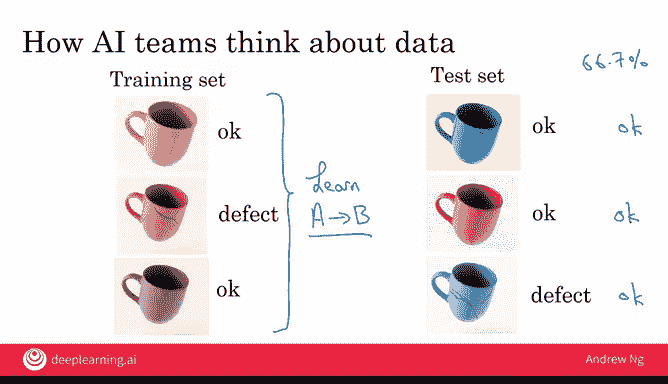
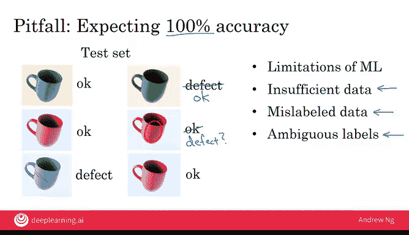

# 016：15_与人工智能团队协作

## 概述 📋

在本节课中，我们将学习如何与人工智能团队协作，以成功执行一个AI项目。我们将了解AI团队如何看待数据，以及你如何通过提供清晰的验收标准和数据来帮助他们。即使你目前没有AI团队，我们也会探讨如何开始尝试。

## 如何与AI团队协作 🤝

假设你找到了一个令人兴奋的项目并希望执行，你如何与AI团队在此项目上协作？本节视频将教你AI团队如何思考数据，从而了解你如何与他们互动以帮助项目成功。

这里有一个前提需要注意：如果你有一个好想法但没有AI团队，或者无法接触到任何AI工程师怎么办？幸运的是，在今天的世界里，如果你自己或者能鼓励一些工程背景的朋友参加一两个关于机器学习或深度学习的在线课程，这通常能赋予他们足够的知识来开始尝试，并对这类项目做出合理的初步努力。

首先，如果你能为项目指定一个验收标准，这将极大地帮助你的AI团队。我在自动化视觉检测领域做过很多工作，因此我将在接下来的几张幻灯片中使用它作为贯穿始终的例子。

假设你的目标是检测咖啡杯的缺陷，准确率至少达到95%。这就可以作为你项目的验收标准。

## 理解准确率与测试集 📊

但是，95%的准确率如何衡量？AI团队需要的东西之一就是一个用于衡量准确率的数据集。数据就是一组像这样的图片，连同标签（即期望的输出B）一起，表明前两个咖啡杯是完好的，第三个是有缺陷的。

作为验收标准规范的一部分，你应该确保AI团队拥有一个可以衡量性能的数据集，这样他们才能知道自己是否达到了95%的准确率。这个数据集的正式术语称为**测试集**。

测试集可能不需要太大，对于这个例子，也许1000张图片就足够了。但如果你咨询AI专家，他们可以给你更好的建议，告诉你测试集需要多大才能评估是否达到了95%的准确率。

AI系统的一个新颖之处在于，其性能通常以统计方式指定。因此，我们通常不要求一个AI系统完美地完成某事，而是希望它达到某个百分比准确率，就像这里的例子一样。因此，在指定验收标准时，请考虑你的标准是否需要以统计方式指定，即平均表现如何，或者它必须在多大比例的时间内给出正确答案。

## 深入理解数据集：训练集与测试集 🧠

让我们更深入地探讨测试集的概念。这是AI团队思考数据的方式：他们将数据分为两个主要数据集。

第一个称为**训练集**，第二个称为**测试集**（我们已经讨论过一些）。训练集就是一组图片及其标签，显示每张图片中的咖啡杯是完好的还是有缺陷的。因此，训练集提供了输入A（咖啡杯的图片）和期望输出B（完好或有缺陷）的示例。

给定这个训练集，机器学习算法要做的事情就是**学习**。换句话说，计算或找出从A到B的某种映射关系，这样你就得到了一个软件，它可以接收输入A，并尝试找出适当的输出B。因此，训练集是机器学习软件的输入，让它能够找出这个A到B的映射关系。

AI团队将使用的第二个数据集是**测试集**。正如你所见，这是另一组与训练集不同的图像，同样附有提供的标签。AI团队评估其学习算法性能的方法是：将测试集中的图像输入AI软件，并查看AI软件的输出。

例如，如果在这三张测试集图像上，AI软件的输出是：这张“完好”，这张“完好”，这张也是“完好”，那么我们会说它在三个例子中答对了两个，因此准确率是66.7%。

在图中，训练集和测试集都只有三张图片。实际上，这两个数据集当然都要大得多。你会发现对于大多数问题，训练集比测试集大得多。你可以与AI工程师交流，了解他们针对特定问题需要多少数据。

最后，由于技术原因，一些AI团队需要的不仅仅是一个，而是两个不同的测试集。如果你听到AI团队谈论开发集、验证集，那就是他们使用的第二个测试集。他们需要两个测试集的原因相当技术性，超出了本课程的范围。但如果AI团队要求你提供两个不同的测试集，尝试提供给他们是相当合理的。

## 避免期望100%准确率的陷阱 ⚠️

在结束本视频之前，我想敦促你避免一个陷阱：期望你的AI软件达到100%的准确率。

我的意思是这样的：假设这是你的测试集，你已经在幻灯片上见过，但让我向这个测试集添加更多示例。

以下是AI软件可能无法达到100%准确率的一些原因：

1.  **技术限制**：尽管今天的机器学习技术非常强大，但仍然存在局限性，它们并非无所不能。你可能正在处理一个即使对当今的机器学习技术来说也非常困难的问题。
2.  **数据不足**：如果你没有足够的数据，特别是没有足够的训练数据供AI软件学习，可能很难达到非常高的准确率。
3.  **数据混乱**：数据有时可能被错误标记。例如，这里的绿色咖啡杯在我看来完全没问题，所以将其标记为“缺陷”看起来是一个不正确的标签，这会损害你的AI软件的性能。
4.  **数据模糊性**：数据也可能具有模糊性。例如，看起来这个咖啡杯上有一个小划痕，而且划痕很小。也许我们会认为它仍然是完好的，但也许这实际上应该算作缺陷，甚至不同的专家可能对这个特定的咖啡杯是否完好、是否应该通过检测步骤存在分歧。

其中一些问题可以得到改善。例如，如果你没有足够的数据，也许可以尝试收集更多数据，更多的数据通常会有所帮助。或者你也可以尝试清理错误标记的数据，或者尝试让你的领域专家就这些模糊的标签达成更好的共识。因此，有办法尝试让情况变得更好。

但是，许多AI系统即使没有达到100%的准确率，也具有巨大的价值。因此，我建议你与AI工程师讨论，尝试实现一个合理的准确率水平，然后找到一个既能通过技术尽职调查，又能通过商业尽职调查的方案，而不必强求100%的准确率。

## 总结 🎉

恭喜你完成本周的所有视频！你现在了解了构建一个AI项目的感觉和所需的条件。希望你已经开始头脑风暴并探索一些想法。

还有一个可选视频，描述了AI团队使用的一些技术工具，如果你愿意可以观看。无论如何，我期待下周见到你，届时你将学习AI项目如何融入更大公司的背景中。期待下周与你相见！

😊

