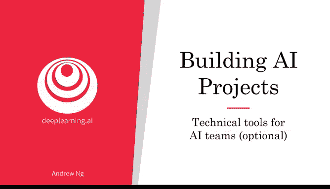
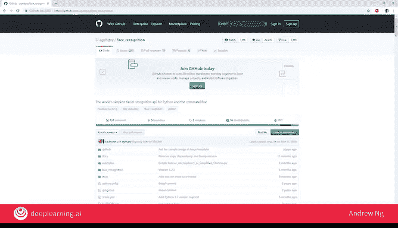
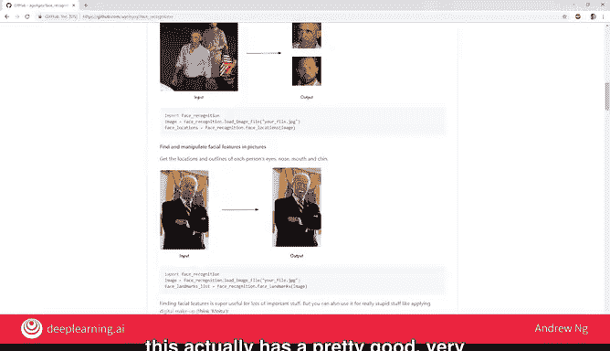
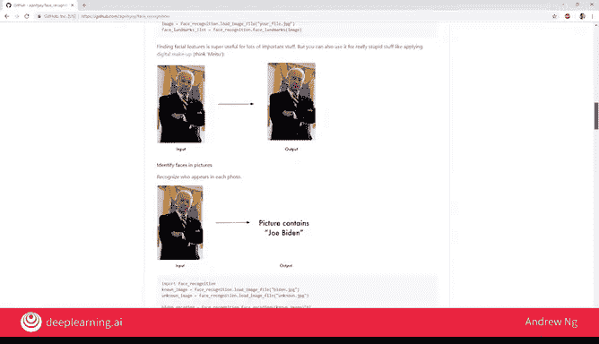
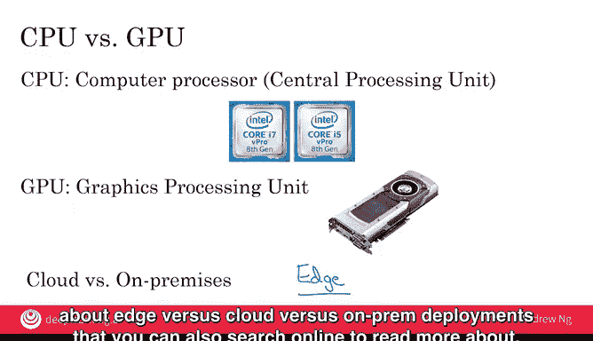

# 017：人工智能团队的技术工具（可选）🔧

## 概述
在本节课程中，我们将了解人工智能团队在构建系统时常用的一些技术工具和术语。掌握这些基础知识，将帮助你更好地理解AI工程师的工作内容，并能在他们讨论技术时跟上节奏。

## 开源工具与框架
上一节我们介绍了AI团队的工作流程，本节中我们来看看他们具体使用的技术工具。当今的AI领域非常开放，许多团队会共享想法和代码。这极大地推动了整个领域的进步。

以下是几个最常用的开源机器学习工具或框架：
*   **PyTorch**：一个广泛使用的深度学习框架，以其灵活性和动态计算图而闻名。
*   **TensorFlow**：由Google开发，是另一个主流的机器学习框架，适用于研究和生产。
*   **Hugging Face**：以其`transformers`库闻名，提供了大量预训练的自然语言处理模型。
*   **PaddlePaddle**：百度开发的深度学习平台。
*   **R**：一种主要用于统计计算和图形的编程语言和环境。

此外，许多重要的AI技术突破会公开发布在 **arXiv.org** 这样的学术预印本网站上，供全球研究者自由获取。

## 代码共享平台：GitHub
除了具体的工具，代码共享也是AI开源生态的关键。**GitHub** 已成为AI乃至整个软件行业开源代码的事实上的存储库。

通过使用适当许可的开源软件，团队可以避免从零开始构建一切，从而大大加快开发速度。例如，如果你在GitHub上搜索人脸识别软件，可能会找到包含详细描述和可用代码的项目页面。当然，在使用任何开源代码前，务必仔细检查其许可证。

虽然GitHub是一个为工程师构建的技术网站，但任何人都可以自由浏览，查看人们在线发布了哪些类型的AI软件。

## 硬件：CPU与GPU
在技术讨论中，你还会经常听到AI工程师谈论CPU和GPU。以下是这些术语的含义：

*   **CPU**：代表**中央处理单元**，是你计算机（无论是台式机、笔记本电脑还是云服务器）中的主要处理器，由英特尔、AMD等公司制造。它负责计算机中的大量通用计算。
*   **GPU**：代表**图形处理单元**。历史上，GPU是为处理图像（如视频游戏图形）而设计的。但人们后来发现，这种为图形处理设计的硬件，对于构建和训练**非常大的神经网络**或深度学习算法异常强大。

随着需要构建越来越大的神经网络系统，AI社区对计算能力的需求永无止境。GPU恰好完美契合了训练大型神经网络所需的高强度并行计算类型。因此，GPU在深度学习的兴起中扮演了重要角色。英伟达是主要的GPU制造商，但高通、谷歌（制造TPU）等公司也越来越多地制造专门用于加速大型神经网络的专用硬件。

## 部署方式：云、本地与边缘
最后，你可能会听到关于部署方式的讨论：云部署、本地部署和边缘部署。

*   **云部署**：指租用云计算服务（如亚马逊AWS、微软Azure、谷歌GCP）来运行你的计算任务。公式可以简单理解为：`你的应用 + 云服务提供商的基础设施`。
*   **本地部署**：指购买自己的计算服务器，并在公司内部本地运行服务。

详细探讨这两种方案的优缺点超出了本节范围，但总体趋势是很多应用正在向云部署迁移。你可以在网上找到许多讨论云与本地部署利弊的文章。

还有一个重要的术语是**边缘部署**。在某些场景下，例如构建自动驾驶汽车时，没有足够的时间将数据发送到云端服务器处理后再将指令传回汽车。因此，计算必须在数据产生的地方即时完成，比如汽车内部的计算机上。这就叫边缘部署——将处理器放在数据收集点，以便快速处理数据并做出决策，无需通过互联网将数据传输到别处处理。

你家中的一些智能音箱也是边缘部署的例子（并非全部任务），部分语音识别任务是由内置在音箱本地的处理器完成的。边缘部署的主要优势是**降低系统响应时间**并**减少需要在网络上传输的数据量**。关于边缘、云和本地部署的更多利弊，你也可以在线搜索了解更多。

## 总结
本节课中，我们一起学习了人工智能团队常用的一些核心技术工具和概念。我们介绍了主流的**开源框架**（如PyTorch、TensorFlow）、代码共享平台**GitHub**、关键硬件**CPU**与**GPU**的区别，以及不同的系统**部署方式**（云、本地、边缘）。希望当你再听到AI工程师提及这些工具时，能对他们所谈论的内容有更清晰的认识。我们下周再见！