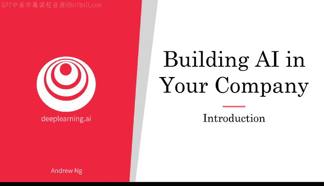
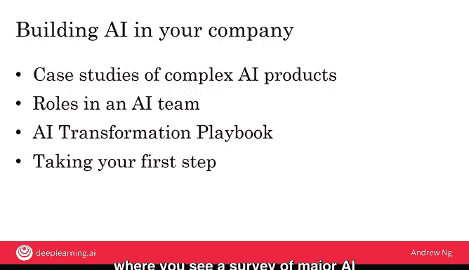

# 018：第3周 课程介绍

欢迎回来。在前两周，我们学习了什么是人工智能以及如何构建一个人工智能项目。本周，我们将审视已经讨论过的项目，并探讨项目如何融入公司的整体背景中——无论是营利性公司、非营利组织，还是政府实体。为了具体起见，我将以公司为例进行讲解，但其中的原则同样适用于任何类型的组织。

如果你觉得本周听到的一些内容听起来像是CEO层面的讨论，请不要感到畏惧。实际上，了解这些对每个人都有用，它能帮助你推动公司或组织利用人工智能进行改进。一个公司要精通人工智能，可能需要两到三年的时间，这不仅仅是完成一个项目，而是要持续开展一系列有价值的人工智能项目，从而变得高效得多。我希望本周能帮助你描绘一个组织在较长时间内可以实现的人工智能愿景，同时在本周结束时，为你提供可以立即采取的具体步骤。

那么，让我们开始吧。以下是本周你将学习的主题：

首先，我们将探讨复杂人工智能产品的案例研究。与上周看到的单一机器学习或数据科学模块不同，本周你将看到多个模块如何协同工作，构建出更复杂的人工智能产品，例如智能音箱或自动驾驶汽车。

其次，你将了解人工智能团队中的主要角色。如果你考虑在公司组建一个可能拥有数十甚至数百人的大型人工智能团队，这些人将负责哪些工作？我们将开始描绘构建人工智能团队的路线图。

第三，你将学习人工智能转型手册，了解如何帮助你的公司精通人工智能。这不仅仅是做一两个有价值的项目，而是要让整个公司都擅长运用人工智能，从而变得更有成效、更有价值。

最后，尽管其中一些步骤可能需要数年时间才能完成，我们将在本周视频结束时，为你提供具体的建议，告诉你如何立即迈出第一步，在公司内启动人工智能建设。

除了这些主要主题，我们最后还会有几个可选视频，带你概览主要的人工智能应用领域和技术。

因此，我希望通过本周的学习，你能对如何帮助公司利用人工智能有一个清晰的愿景，并掌握可以立即采取的第一步行动。让我们进入下一个视频，开始详细学习。