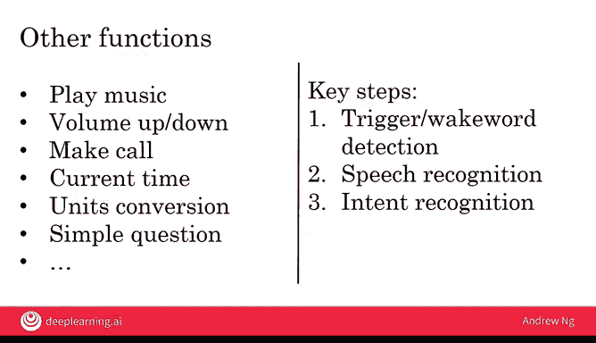

# 019：智能音箱

## 概述
在本节课中，我们将通过一个具体的案例——智能音箱，来学习如何构建一个复杂的AI产品。我们将了解，一个看似简单的语音指令背后，需要多个AI组件协同工作，形成一个处理“流水线”。

---

## 智能音箱的工作原理

上一节我们介绍了复杂AI产品的概念，本节中我们来看看一个具体的例子：智能音箱。当你对智能音箱说“嘿，设备，讲个笑话”时，它需要经过一系列步骤来理解并执行你的命令。

以下是处理该命令所需的四个核心步骤：

1.  **触发词检测**
    智能音箱持续监听环境声音，并使用一个机器学习算法来检测特定的“唤醒词”（例如“嘿，设备”）。这个算法的本质是一个从音频到判断的映射：`输入：音频片段 -> 输出：是否听到唤醒词（是/否）`。一旦检测到唤醒词，系统就会被激活。

2.  **语音识别**
    在听到唤醒词后，系统会立即开始处理接下来的音频。另一个机器学习算法会将“讲个笑话”这段语音转换成对应的文本。这同样是另一个A到B的映射：`输入：唤醒词之后的音频 -> 输出：文本转录（例如“Tell me a joke”）`。

3.  **意图识别**
    得到文本后，系统需要理解用户的真实意图。智能音箱通常支持一组有限的命令，例如“讲笑话”、“报时”、“播放音乐”等。意图识别组件会分析文本，判断用户想要执行哪一类命令。这又是一个A到B的映射：`输入：文本转录 -> 输出：意图类别（例如“讲笑话”）`。一个设计良好的系统应该能理解同一意图的不同表达方式，比如“你知道什么好笑话吗？”或“说点有趣的”。

4.  **命令执行**
    一旦确定用户意图是“讲笑话”，就会触发由软件工程师预先编写好的专门程序。这个程序会从笑话库中随机选择一个笑话，并通过音箱播放出来，从而完成命令的执行。

## 处理更复杂的命令

理解了基本流程后，我们来看一个更复杂的例子：“嘿，设备，设置一个10分钟的计时器”。这个命令的处理流程与之前类似，但增加了一个关键环节。

处理这个命令的步骤如下：

*   **触发词检测**：检测“嘿，设备”。
*   **语音识别**：将“设置一个10分钟的计时器”转换为文本。
*   **意图识别**：识别出用户的意图是“设置计时器”。
*   **参数提取**：这是新增的关键步骤。系统需要从文本中提取出具体的参数——**“10分钟”**这个时长信息。
*   **命令执行**：一个专门的软件组件会接收“设置计时器”的意图和“10分钟”的参数，并启动一个相应时长的计时器。

## 智能音箱的能力与挑战

目前，智能音箱能够执行许多功能，例如播放音乐、调节音量、打电话、查询天气、单位换算等。执行这些命令的关键步骤依然是：触发词检测、语音识别、意图识别，最后调用专门的程序来执行。

然而，构建这样一个产品也面临挑战：

*   **开发工作量**：若要支持20种不同功能，就需要软件工程团队编写20个专门的执行程序。这是一项庞大的工程。
*   **用户认知**：智能音箱能做的事情很多，但并非无所不能。用户很难完全记住所有可用的命令。因此，智能音箱公司需要投入大量资源进行用户教育，明确告知用户产品的功能边界。

尽管如此，通过语音来操控设备，已经为许多人的生活带来了极大的便利。

---

## 总结
本节课中，我们一起学习了构建智能音箱这类复杂AI产品的基本原理。我们了解到，它并非依赖单一的算法，而是由**触发词检测、语音识别、意图识别和命令执行**等多个AI与软件组件构成的“流水线”协同工作。这个过程帮助我们初步理解了在大型公司中，如何通过多个团队分工合作来开发复杂的AI系统。