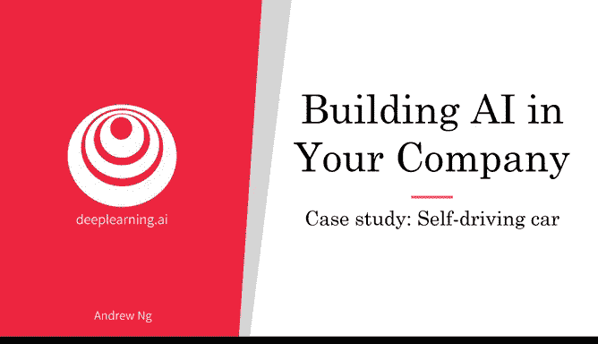
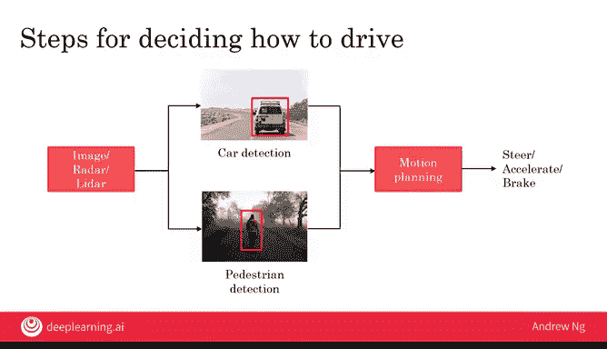
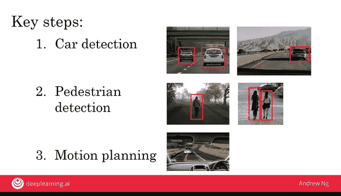
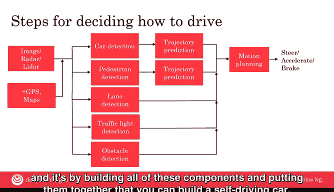

# 020：自动驾驶汽车

在本节课中，我们将要学习自动驾驶汽车的工作原理。这是一个将多个AI组件组合起来构建复杂系统的绝佳案例。我们将通过一个简化的描述，帮助你理解这些组件是如何协同工作的。

---

## 🚗 自动驾驶汽车的关键步骤

自动驾驶汽车通过整合多种传感器和AI算法来决定如何驾驶。以下是其决策过程的关键步骤。

汽车会接收来自各种传感器的输入，例如汽车前方、侧面和后方的图像，以及雷达或激光雷达的读数。

给定这些图像和其他传感器输入后，汽车需要检测其他车辆。它需要识别出其他汽车的位置。

汽车还需要检测行人的位置，因为我们需要避开其他车辆和行人。

车辆检测和行人检测都可以通过机器学习来完成，使用输入-输出映射。算法以图片、雷达和激光雷达传感器数据作为输入，并输出其他汽车和行人的位置。

最后，在知道了其他汽车和行人的位置后，可以将这些信息输入到一个专门的软件模块中，这个模块称为**运动规划软件**。它的职责是规划汽车的运动路径，使汽车能够在避免碰撞的同时向目的地前进。

一旦为汽车规划好了运动路径，就可以将其转化为具体的转向盘角度、油门和刹车指令。这样就能控制汽车以期望的角度和速度移动。

---

## 🔍 深入理解三个关键步骤

上一节我们介绍了自动驾驶的三个核心步骤。本节中，我们来看看车辆检测、行人检测和运动规划这三个步骤的更多细节。

### 车辆检测

车辆检测使用监督学习。你已经见过学习算法如何输入类似下图的图片，并输出检测到的汽车。

对于大多数自动驾驶汽车，不仅使用前置摄像头，也经常使用向左、向右以及向后的摄像头，以便检测汽车周围各个方向的车辆。这通常不仅使用摄像头，还结合其他传感器，如雷达和激光雷达。

### 行人检测

行人检测使用与车辆检测非常相似的传感器类型和技术。自动驾驶汽车可以检测行人。

### 运动规划

我简要提到了运动规划步骤。它具体是什么呢？以下是一个例子。

假设你正在驾驶汽车，前方有一辆浅蓝色的汽车。运动规划软件的工作就是告诉你应该沿着图中红色的路径行驶，以便跟随道路并避免事故。

运动规划软件的工作是输出路径以及你应该驾驶汽车的速度，以便跟随道路。速度的设置应确保你不会撞到其他车辆，同时也能在这条路上以合理的速度行驶。

这是另一个例子。如果有一辆灰色汽车停在道路右侧，你想要超越这辆停着的车。

那么运动规划软件的工作就是规划出一条像这样的路径，让你稍微向左偏转，安全地超越停着的汽车。

---

## 🧩 真实自动驾驶系统的更多细节

到目前为止，我们给出了一个主要由这三个组件组成的、相当简化的自动驾驶描述。现在，让我们更详细地看看一个真实的自动驾驶汽车可能如何工作。

下图展示了我们目前描述的过程：输入图像、雷达和激光雷达传感器读数，进行车辆和行人检测，然后将结果输入运动规划模块，以帮助你选择路径和速度。

在一个真实的自动驾驶汽车中，通常不仅仅使用摄像头、雷达和激光雷达。如今大多数自动驾驶汽车还会使用GPS来感知位置，以及加速度计（有时称为IMU，包含加速度计和陀螺仪），还有地图。

因为我们知道汽车更可能出现在道路上，行人更可能出现在人行道上（尽管他们有时也会在道路上）。所有这些通常都是额外的信息，被输入到检测汽车、行人以及其他物体的模块中。

为了安全驾驶，不仅需要检测汽车和行人，还需要知道这些汽车和行人未来会去哪里。因此，自动驾驶汽车的另一个常见组件是**轨迹预测**。这是另一个AI组件，它不仅告诉你发现了哪些汽车和行人，还预测他们在接下来几秒钟内可能去往哪里，这样即使他们在移动，你也能避开他们。

安全驾驶需要的不仅仅是避开其他汽车和行人。你还需要知道车道在哪里，因此可能需要检测车道标记。如果有交通灯，你还需要识别交通灯的位置以及它显示的是红色、黄色还是绿色信号。有时还有其他障碍物，比如意外的交通锥，或者可能有一群鹅走在你的车前，这些也需要被检测到，以便你的汽车能够避开这些障碍物。

在一个大型的自动驾驶汽车团队中，让一个团队或几个人专门负责上图中用红色框出的每个模块，并不罕见。正是通过构建所有这些组件并将它们组合在一起，才能构建出一辆自动驾驶汽车。

---

## 📝 总结

本节课中我们一起学习了自动驾驶汽车的工作原理。我们从一个简化的三组件模型（车辆检测、行人检测、运动规划）开始，逐步深入到更复杂的真实系统，其中包含了GPS、地图、轨迹预测、车道和交通灯检测等多个模块。这个案例清晰地展示了如何将多个独立的AI组件整合成一个复杂的、能够执行实际任务的系统管道。正如智能音箱的例子一样，构建复杂的AI产品通常需要一个团队来负责各个不同的组件。

在下一个视频中，我们将探讨大型AI团队中的关键角色。如果你目前是个人或小型AI团队，这也没关系。但我希望你能对在遥远的未来构建一个大型AI团队可能是什么样子有一个愿景。