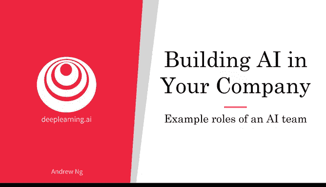
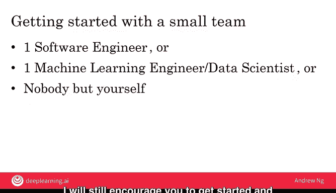

# 021：人工智能团队典型角色解析 🧑‍💻

在本节课中，我们将要学习构建复杂人工智能产品所需的大型AI团队中，各种典型的角色与职责。即使你目前所在的团队规模很小，了解这些分工也能帮助你理解AI项目可能涉及的不同工作类型。

## 概述

在前两节视频中，我们看到一些AI产品可能需要庞大的AI团队来构建，有时甚至超过100名工程师。本节我们将解析这样一个大型AI团队中典型的角色和职责，以便你更好地理解构建复杂AI产品所需的工作类型。

需要说明的是，由于AI领域发展迅速，职位名称和职责尚未完全标准化，不同公司之间可能存在差异。但本节将为你介绍许多公司中常见的职位定义，为你未来组建或理解AI团队打下基础。

## 核心角色解析

以下是构建AI产品时常见的几种核心角色。

### 软件工程师

许多AI团队中都包含软件工程师。例如，为智能音箱编写执行讲笑话、设置定时器或回答天气问题的专用软件，就是传统的软件工程任务。再比如，确保自动驾驶汽车的软件可靠且不会崩溃，也属于软件工程范畴。因此，AI团队中通常有相当大比例（有时超过50%）的成员是软件工程师。

### 机器学习工程师

机器学习工程师负责编写实现A到B映射的软件，或构建产品所需的其他机器学习算法。他们的工作可能包括：收集汽车图片和位置数据、训练神经网络或深度学习算法，并通过迭代优化确保学习算法输出准确的结果。

### 机器学习研究员

机器学习研究员的典型职责是推动机器学习（以及更广泛的AI）领域的技术前沿。由于该领域仍在快速发展，许多公司（无论是营利还是非营利机构）都设有研究员职位，负责拓展技术边界。部分研究员会发表论文，但也有许多公司的研究员更专注于研究本身，而非论文发表。

### 应用机器学习科学家

这是一个介于机器学习工程师和研究员之间的职位。应用机器学习科学家通常负责从学术或研究文献中寻找最先进的技术，并探索如何将这些技术适配到当前面临的问题中。例如，如何将最前沿的唤醒词检测算法应用到智能音箱产品中。

### 数据科学家

目前，行业中有许多数据科学家，但其角色定义尚不明确，且含义仍在演变。我认为，数据科学家的主要职责之一是分析数据、提供洞察，并向管理团队进行汇报，以帮助推动业务决策。如今，也有数据科学家从事更接近前面提到的机器学习工程师的工作，这一职位的含义仍在不断发展。

### 数据工程师

随着大数据的兴起，数据工程师的角色越来越重要。他们的主要职责是帮助组织数据，确保数据以易于访问、安全且经济高效的方式存储。为什么存储数据会成为一项重要工作？在某些公司，数据量已经变得非常庞大，管理这些数据本身就需要大量工作。

为了让你对数据规模有更直观的感受，我们来了解一下计算机科学中的数据单位：
*   **1 MB（兆字节）**：相当于一首典型的MP3歌曲文件大小（约5 MB）。
*   **1 GB（千兆字节）** = 1000 MB：相当于一部在线流媒体的一小时电影大小。
*   **1 TB（太字节）** = 100万 MB。
*   **1 PB（拍字节）** = 10亿 MB。

例如，一辆自动驾驶汽车每分钟运行都可能收集数GB的信息，相当于每分钟生成足以存储多部电影的数据量。因此，保存数天、数周甚至数年的运行数据，就需要专业的数据工程工作。当数据规模达到TB甚至PB级别时，确保数据易于访问、安全且经济高效地存储就变得极具挑战性，这也正是数据工程师日益重要的原因。

### AI产品经理

最后，你还会听到AI产品经理这个职位。他们的工作是帮助决定构建什么产品，即找出既可行又有价值的方向。传统产品经理的职责本就包括决定产品方向，而AI产品经理则需要在AI时代完成这一任务，他们需要掌握新的技能，根据当前AI技术的能力与局限来判断什么是可行且有价值的。

## 从小团队起步

需要再次强调的是，以上角色定义并非一成不变，不同公司的用法可能有所不同。但我希望这能让你对构建复杂AI产品所需的不同工作类型，以及相关职位的演变方向有一个大致的了解。

最后，我想重申，你完全可以从一个小团队开始。你并不需要10个人来完成大多数AI项目。无论是只有一名软件工程师与你合作，还是只有一名机器学习工程师、一名数据科学家，甚至只有你自己——只要你或与你合作的工程师上过一些关于机器学习、深度学习或数据科学的在线课程，这通常就足以让你或你们两人开始着手处理一些较小规模的数据、得出一些结论，或者开始训练一些机器学习模型来启动项目。

因此，尽管本节描绘了一个大型AI团队的愿景，但即使你的AI团队很小，甚至只有你自己，我仍然鼓励你开始行动，探索你能开展的项目。

## 总结

本节课我们一起学习了大型AI团队中各种典型角色的职责，包括**软件工程师**、**机器学习工程师**、**机器学习研究员**、**应用机器学习科学家**、**数据科学家**、**数据工程师**和**AI产品经理**。理解这些分工有助于我们把握构建AI产品所需的完整工作流。同时，我们认识到完全可以从一个小团队甚至个人开始AI项目的探索。

---

本节视频展示了AI团队可能的样子。但在一个更大的公司中，AI团队并非孤立存在。那么，AI团队如何融入更大的公司，并帮助整个公司擅长AI呢？你可能记得在第一周课程中，我们简要提到了“AI转型手册”，它是帮助一家公司（也许是一家大公司）在AI领域变得出色的路线图。现在，你已经了解了什么是AI、如何开展AI项目，甚至AI团队和公司如何完成项目，接下来让我们回到“AI转型手册”，更深入地探讨其中的各个步骤，以便理解如何帮助一家公司在几年内变得擅长AI，并在此过程中变得更有价值和更高效。

让我们在下一个视频中继续学习“AI转型手册”。😊