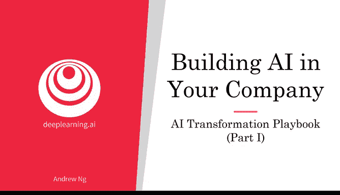
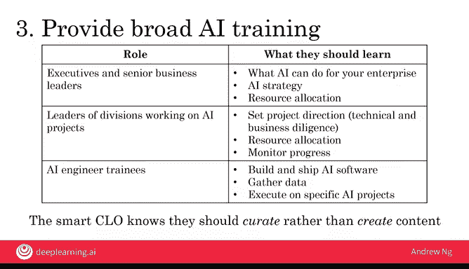

# 022：21_人工智能转型指南 第1部分

在本节课中，我们将学习如何帮助您的公司成为擅长人工智能的公司。课程内容基于我在领导谷歌大脑团队和百度人工智能团队时的经验，这两个团队分别是帮助谷歌和百度在深度学习人工智能领域取得领先地位的核心力量。我将分享一份人工智能转型指南的细节，帮助您理解公司转型所需的关键步骤。

## 概述

人工智能转型是一个系统性的过程。本节课程将重点介绍转型指南的前三个步骤：执行试点项目以获取动力、建立内部人工智能团队以及提供广泛的人工智能培训。理解这些步骤对于公司内的每一位成员都至关重要，因为它有助于您的工作不仅影响个别项目，还可能对公司整体产生更大的影响。

## 第一步：执行试点项目以获取动力 🚀

上一节我们介绍了课程的整体目标，本节中我们来看看如何迈出转型的第一步。如果希望公司能在人工智能领域获得动力，选择初始项目时最重要的考虑因素是确保其成功，而非一定是价值最高的项目。

例如，在我领导谷歌大脑团队时，深度学习仍备受质疑。我的第一个内部客户是谷歌的语音识别团队。虽然语音识别很有用，但对公司利润而言，它不如网络搜索或在线广告重要。然而，通过帮助语音团队取得成功，我们开始获得动力。其他团队看到语音团队的成功后，也开始对人工智能产生信心并希望与我们合作。

以下是选择初始项目时的关键考虑因素：

*   **选择成功概率高的项目**：即使它可能不是最终能为公司带来最大价值的项目，首要目标是获得动力。
*   **展示短期成效**：最好选择能在6到12个月内显示出进展的项目，以便快速启动良性循环。
*   **考虑外包选项**：如果公司内部尚无大型人工智能团队，将最初的一两个试点项目部分或全部外包，可能是获取专业知识和快速建立动力的明智之举。

## 第二步：建立内部人工智能团队 👥

在通过试点项目获得初步动力后，公司需要建立自己的内部团队来长期执行可能多达数十个人工智能项目。许多公司的组织结构是CEO下设多个业务单元。

对于大多数公司，我建议建立一个集中化的人工智能团队。然后，以矩阵组织的形式，将团队中的人才分配到不同的业务单元，以支持它们的工作。

**为什么需要集中化的AI团队？**
以礼品卡业务单元为例。该业务单元的领导者可能非常擅长礼品卡业务，但除非他/她精通人工智能并知道如何组建、保留和管理人工智能团队，否则很难自行招聘和管理人工智能人才。因此，找一个能负责全公司统一招聘和保留标准的人工智能团队领导者，成功率会高得多。

集中化的人工智能团队还有其他职责：

*   **构建公司级平台**：如果有对全公司有用的软件平台、工具或数据基础设施，单个业务单元可能没有资源或动力去构建这些能支持整个公司的平台。集中化的人工智能团队可以帮助构建这些公司级工具或平台。
*   **汇报关系**：这个新的人工智能部门可以隶属于首席技术官、首席信息官、首席数据官、首席数字官，或者一位新的首席人工智能官。首席人工智能官这一角色正变得越来越常见。

最后一项建议是，在起步阶段，公司或CEO应为人工智能部门提供启动资金，而不是要求该部门从业务单元获取资金。在初始投资和起步期之后，人工智能部门需要向业务单元证明其创造的价值，但初期由高层注入资金通常能帮助您更快地获得初始动力。

## 第三步：提供广泛的人工智能培训 📚

上一节我们讨论了团队建设，本节中我们来看看如何提升团队的整体能力。要让公司擅长人工智能，不仅需要工程师懂人工智能，还需要公司多个层级的员工理解人工智能如何与他们的角色互动。

以下是针对不同人群的培训建议：

*   **高管和高级业务领导者**：他们需要学习人工智能能为企业做什么，至少了解人工智能战略的基础知识，并掌握足够的知识以做出资源分配决策。这类培训可能通过大约4小时的内容就能传达很多关键信息（尽管小时数并非衡量学习效果的好指标）。
*   **负责人工智能项目的部门领导者**：他们需要了解如何设定项目方向、进行技术和业务尽职调查、在部门层面做出资源分配决策，以及如何跟踪和监控人工智能项目的进展。这类培训可能需要至少12小时。
*   **现有工程师队伍**：许多公司从外部招聘人工智能人才，但培训现有工程师掌握人工智能技能同样重要且影响深远。让软件工程师成为专业的人工智能工程师需要时间，可能需要计划至少100小时的培训。许多公司提供培训，帮助工程师学习构建和部署人工智能软件、收集和管理数据，并有效地执行具体的人工智能项目。

当今世界人工智能工程师严重短缺，因此内部培训是许多公司构建内部人工智能能力的关键部分。

关于如何完成这些培训，得益于在线数字内容的兴起，包括在线课程、书籍、YouTube视频和博客文章，网上有大量关于这些主题的优秀内容。一个好的CEO应该与专家合作，策划这类内容并激励团队完成学习活动，而不是去创建内容，后者成本要高得多。

## 总结

本节课中，我们一起学习了人工智能转型指南的前三个核心步骤。通过执行试点项目获取动力、建立集中化的内部人工智能团队，以及为不同层级的员工提供广泛的人工智能培训，您的公司将能够开始获得显著的发展势头，从而变得更高效、更有价值。

从更宏观的角度看，人工智能还会影响公司战略以及如何协调投资者、员工、客户等不同利益相关者与公司转型的关系。让我们进入下一个视频，继续探讨人工智能战略。