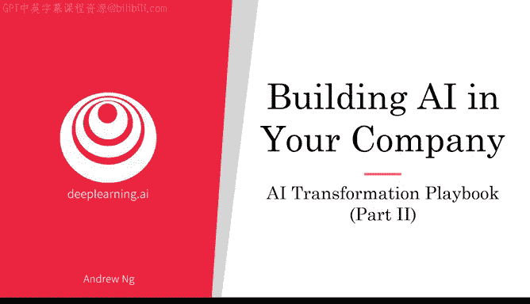
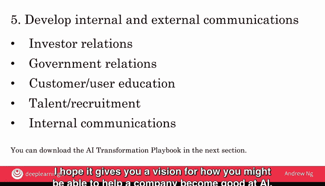

# 023：人工智能转型指南 第2部分

在本节课中，我们将深入学习人工智能转型指南的后两个步骤：制定AI战略以及进行内外部沟通。我们将探讨如何利用AI为你的企业创造长期、可持续的竞争优势。

在上一个视频中，我们学习了如何通过试点项目为内部AI团队积累动能并提供广泛的AI培训。

但如果你希望你的企业不仅能在短期内利用AI获得动力，更能长期成为一个极具价值甚至难以被撼动的业务，你该怎么做？让我们来谈谈AI战略，以及对于某些公司而言同样重要的、与AI相关的内外部沟通。

回顾一下，这是人工智能转型的五步指南。在本视频中，我们将更深入地探讨最后两个步骤。

## 制定AI战略

人工智能转型指南的第四步是制定AI战略。我希望对你而言，这意味着利用AI为你所在的特定行业领域创造优势。

这个指南中一个不同寻常的部分是，制定AI战略是第四步，而非第一步。当我与许多高管分享这一点时，一个常见的请求或反馈是：能否将战略设为第一步？因为他们认为应该先确定公司战略，然后寻找资源，最后执行战略。

但我发现，那些在尝试AI、了解构建AI项目的感觉之前，就试图在第一步定义战略的公司，最终往往会制定出有时非常学术化、有时不切实际的战略。

例如，我曾见过一些CEO将报纸头条复制粘贴到战略中。当他们读到数据很重要时，就说“我的战略是专注于收集大量数据”。但对于你的公司而言，这些数据可能并不有价值，也可能并非你公司的好战略。

因此，我倾向于建议公司先开始其他步骤：执行试点项目、开始组建一个小团队、提供一些培训。只有在理解了AI以及它如何应用于你的业务之后，再制定战略。我认为这比在公司（特别是高管团队）对AI能为你的行业做什么、不能做什么有更深入的了解之前，就试图制定AI战略，效果会好得多。

此外，你可以考虑设计一个与AI的良性循环相一致的策略。让我用一个网络搜索的例子来说明。

网络搜索之所以是一个非常稳固的业务（意味着新进入者很难与现有的、大型的网络搜索引擎竞争），原因之一如下：

如果一个公司有更好的产品（哪怕只是稍好一点），那么这个网络搜索引擎就能获得更多用户。拥有更多用户意味着你可以收集更多数据，因为你可以观察到不同用户在搜索不同术语时点击了什么。这些数据可以被输入到AI引擎中，以生产出更好的产品。

这意味着，拥有稍好产品的公司最终会获得更多用户，进而获得更多数据，并利用现代AI技术创造的这种联系，打造出更好的产品。这使得新进入者很难打破这个自我强化的正向反馈循环，即**AI的良性循环**。

幸运的是，进入新垂直领域的小团队也可以利用这个AI良性循环。我认为，今天很难再打造一个新的网络搜索引擎来与谷歌、百度、必应或雅虎竞争。

但如果你正在进入一个新的垂直领域、一个新的应用领域，那里还没有根深蒂固的现有企业，那么你或许可以制定一个战略，让你成为利用这个良性循环的人。

让我用一个例子来说明。有一家名为Blue River的公司被约翰迪尔以超过3亿美元收购。Blue River利用AI制造农业技术设备。

他们制造的机器可以被拖拉机牵引。在广阔的农田里，这台机器会拍摄作物的照片，分辨哪些是作物，哪些是杂草，并使用精准AI技术只割除杂草，而不伤害作物。

Blue River的创始人在斯坦福大学上我的课时就开始了这个项目。他们最初只是用个人相机，跑到许多农场，在农田里拍摄了大量作物照片。他们开始收集卷心菜及其周围杂草的图片。

一旦他们有了足够的数据（开始时数据量很小），他们就可以训练一个基础产品。坦率地说，第一个产品并不出色，因为它是在少量数据上训练的，但它足以开始说服一些农民（用户）开始使用他们的产品，将这台机器挂在拖拉机后面，开始为农民除草。

一旦这台机器在农场里运行，通过拍摄卷心菜和除草的过程，他们自然就获得了越来越多的数据。在接下来的几年里，他们得以进入这个正向反馈循环：**更多数据 → 更好的产品 → 说服更多农民使用 → 收集更多数据**。

经过几年这样的良性循环，他们能够积累巨大的数据资产，这使得他们的业务相当稳固。事实上，在被收购时，我确信他们拥有的田间卷心菜图片数据资产，甚至比大型科技公司拥有的还要多。这使得他们的业务即使对拥有大量网络搜索数据的大型科技公司来说，也相对稳固，因为这些大公司并没有像这家公司那样多的田间卷心菜图片。

还有一个建议：很多人认为一些大型科技公司在AI方面更强大，我认为这是事实。一些大型科技公司确实非常擅长AI。

但这并不意味着你需要或应该试图在通用AI领域与这些大型科技公司竞争，因为很多AI需要针对你的行业进行专业化或垂直化。因此，对大多数公司而言，最好的选择是构建针对你所在行业的专业化AI，并在你的应用领域做好AI工作，而不是试图或觉得需要在各个领域与大型科技公司在AI上全面竞争，这对大多数公司来说并不现实。

## AI战略的其他要素

我们将生活在一个由AI驱动的世界，正确的战略可以帮助你的公司更有效地应对这些变化。

你还应该考虑制定数据战略。领先的AI公司非常擅长战略性数据获取。例如，一些面向消费者的大型AI公司会推出免费电子邮件服务、免费照片分享服务或许多其他不直接盈利的免费服务，这些服务允许他们以各种方式收集数据，从而更多地了解你，以便为你提供更相关的广告，并以此方式将数据货币化，这与产品的直接货币化方式截然不同。

获取数据的方式因行业垂直领域而异。但我曾参与过一些感觉像是多年棋局的竞争，我和其他公司竞争对手在进行多年的博弈，看谁能获取最具战略意义的数据资产。

你也可以考虑构建统一的数据仓库。如果你有50个不同的数据仓库，分别由50位不同的副总裁控制，那么AI工程师或AI软件几乎不可能整合所有这些数据来发现关联。

例如，如果制造部门的数据仓库与客户投诉的数据仓库完全分开，AI工程师如何整合这些数据，以找出制造过程中可能导致两个月后客户投诉手机故障的原因？因此，许多领先的AI公司投入了大量前期努力，将数据整合到一个单一的数据仓库中，因为这增加了工程师或软件能够发现关联和模式的可能性，例如，今天制造过程中的高温如何导致未来两个月后出现设备故障并引发客户投诉，从而让你可以回头改进制造流程。这在多个行业中有很多例子。

你还可以利用AI在网络效应和平台优势明显的行业中创造赢家通吃的局面，AI可以成为一个巨大的加速器。

例如，以今天的网约车业务为例，像Uber、Lyft、滴滴和Grab这样的公司似乎拥有相对稳固的业务，因为它们是连接司机和乘客的平台，新进入者很难同时积累大量的司机群体和乘客群体。

像Facebook这样的社交媒体平台也非常稳固，因为它们具有强大的网络效应：一个平台上有大量用户会使其对其他用户更具吸引力，因此新进入者很难打入。

如果你所在的业务具有这类赢家通吃或赢家占优的动态，那么如果AI能帮助你更快地增长（例如，加速用户获取），这可能转化为你的公司在该业务垂直领域取得成功的更大机会。

战略因公司、行业和具体情况而异，因此很难给出完全适用于每家公司的战略建议。但我希望这些原则能为你提供一个思考框架，帮助你思考对于你的公司而言，AI战略可能包含哪些关键要素。

现在，AI也可以融入更传统的战略框架。例如，迈克尔·波特多年前曾写过关于低成本和高价值战略的文章。如果你的公司采用低成本战略，那么或许可以利用AI来降低业务成本。如果你的公司采用高价值战略，以更高的成本提供真正非常有价值的产品，那么你可能会利用AI来专注于提高产品的价值。因此，AI能力也可以帮助增强更广泛的企业战略中的现有要素。

最后，在你构建这些有价值且稳固的业务时，我希望你也只构建那些能让人们生活得更好的业务。AI是超能力，是你可以用来打造伟大AI公司的强大工具。因此，我希望无论你做什么，都只以让人类更美好的方式进行。

## 进行内外部沟通

人工智能转型指南的最后一步是进行内外部沟通。AI可以改变一家公司及其产品，与相关利益方进行适当沟通非常重要。

例如，这可能包括投资者关系，以确保你的投资者能够恰当地将你的公司评估为一家AI公司。投资者关系也可能包括政府关系。例如，AI正在进入医疗保健这个高度监管的行业，因为政府有保护患者的正当需求。

因此，为了让AI影响这些高度监管的行业，我认为公司有必要与政府沟通，并通过公私合作伙伴关系与他们协作，以确保AI解决方案能够为人们带来其所能带来的益处，同时确保政府能够保护消费者和患者。这对于医疗保健、自动驾驶汽车、金融以及许多其他AI行业垂直领域都是如此。

如果你的产品发生变化，那么消费者或用户教育将很重要。在当今世界，AI人才非常稀缺，因此，如果你能够展示一些初步的成功，这将真正有助于人才招聘。

最后，内部沟通也很重要。如果你正在对公司进行转型，那么公司内部许多人可能会对AI产生担忧（有些是合理的，有些则不那么理性）。适当的内部沟通可以安抚人心，这只会有所帮助。

通过这五个步骤，我希望你能对如何帮助一家公司擅长AI有一个愿景。我希望你喜欢这两个关于人工智能转型指南的视频。我见过许多公司通过拥抱并擅长AI而变得更有价值、更高效。我希望这些想法能帮助你迈出第一步，帮助你的公司擅长AI。

话虽如此，我也见过许多公司在尝试在整个企业实施AI时遇到的常见陷阱。让我们在下一个视频中看看其中一些常见陷阱，希望你能避免它们。让我们进入下一个视频。

**本节课总结**：在本节课中，我们一起学习了人工智能转型指南的后两个核心步骤。首先，我们探讨了为何应在积累初步AI经验后再制定AI战略，以及如何利用**AI的良性循环**（**更好产品 → 更多用户 → 更多数据 → 更好产品**）构建稳固的业务优势。其次，我们强调了与投资者、政府、用户及内部员工进行有效沟通的重要性，以确保AI转型的顺利实施。