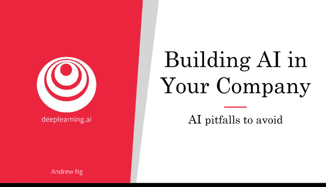
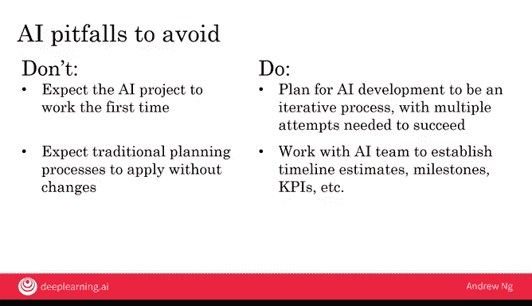

# 024：应避免的人工智能陷阱 🚧

在本节课中，我们将学习在为公司构建人工智能项目时应避免的五个常见陷阱，以及相应的正确做法。理解这些要点能帮助你更有效地启动和管理AI项目，避免走弯路。

上一节我们探讨了AI项目的潜力，本节中我们来看看在实践过程中需要警惕哪些误区。

## 陷阱一：不要期望AI解决所有问题 ❌

你已经知道AI能做很多事情，但AI同样有很多无法做到的事情。正确的做法是，对AI能做什么、不能做什么保持现实的态度，充分考虑技术、数据和工程资源的限制。这就是为什么我认为，除了商业尽职调查，技术尽职调查对于选择可行且有价值的AI项目同样重要。

## 陷阱二：不要只依赖少数机器学习工程师 ❌

不要仅仅雇佣两三个机器学习工程师，并完全指望他们为你的公司想出应用场景。机器学习工程师是稀缺资源。正确的做法是，将工程人才与商业人才配对，跨职能协作来寻找可行且有价值的项目。通常，正是机器学习人才与商业人才的结合，才能选出最有价值和最可行的项目。

## 陷阱三：不要期望AI项目首次尝试就能成功 ❌

正如你已经看到的，AI开发通常是一个迭代过程。因此，你应该为此做好计划，将其视为一个需要多次尝试才能成功的迭代过程。

## 陷阱四：不要期望传统规划流程能直接套用 ❌

不要期望传统的规划流程无需修改就能直接应用。相反，你应该与AI团队合作，建立有意义的**时间线估算**、**里程碑**和**关键绩效指标（KPI）**。与AI项目相关的时间线估算、里程碑和KPI类型，与非AI项目相关的同类事物有所不同。因此，希望与一些了解AI的个人合作，能帮助你找到更好的AI项目规划方法。

## 陷阱五：不要认为必须先有超级明星AI工程师 ❌

最后，不要认为在拥有超级明星AI工程师之前你什么都做不了。相反，要持续建设团队，并利用现有的团队开始行动。要认识到，当今世界上有许多AI工程师，包括许多主要从在线课程学习、也能出色完成工作的工程师。

---

构建有价值且可行的项目。如果你能避免这些AI陷阱，相比许多其他公司，你已经领先一步。最重要的是开始行动。你的第二个AI项目会比第一个更好，第三个会比第二个更好。因此，最重要的是开始行动，并尝试你的第一个AI项目。

在本周的最后一个视频中，我想与你分享一些在AI领域可以采取的具体第一步。让我们进入下一个视频。😊

---

**本节课总结**：我们一起学习了构建公司AI项目时应避免的五个关键陷阱，包括对AI能力的不切实际期望、过度依赖单一角色、忽视迭代开发、套用传统管理流程以及等待“完美”团队。核心在于保持务实、促进协作、接受迭代、定制化管理并立即行动。