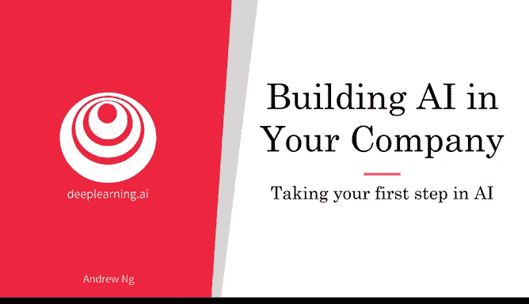
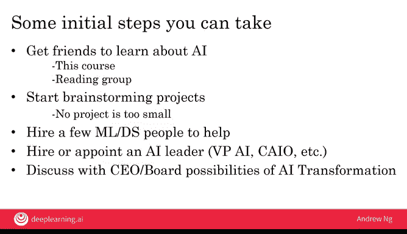

# 025：迈出人工智能实践第一步 🚀

在本节课中，我们将学习如何将人工智能理论知识转化为实际行动。课程将提供具体的步骤建议，帮助个人或公司开启AI之旅。

## 概述

本周，我们了解了构建智能音箱或自动驾驶汽车等复杂AI产品的过程。我们学习了大型AI团队的职责，以及如何组建这样的团队，并看到了帮助优秀公司转型为优秀AI公司的行动指南。这些内容可能看起来有些艰巨，因为其中一些可能需要两到三年的时间来执行。但请记住，更重要的是能够迈出第一步。事实上，通过参加本课程，您已经迈出了出色的第一步。因此，我希望在本课程之后，您能同样出色地迈出第二步。

## 具体行动建议

在本视频中，我想与您分享一些具体的建议，帮助您或您的公司朝着AI方向迈出下一步。

以下是您可以采取的一些初步步骤。

### 寻找学习伙伴

与其独自探索，不如考虑在公司内部或外部寻找朋友一起学习AI。这可以意味着邀请他们与您一起学习本课程，或者在您学完后与他们分享，或者组建一个阅读小组，结合本课程所学，共同阅读一些关于AI的书籍或其他材料。

### 启动小型项目

如果您有工程师朋友，还可以开始进行项目头脑风暴。项目没有大小之分，从小处着手并取得成功，远比目标过大而无法实现要好。许多项目仅靠您自己或与一位朋友合作即可完成。如果您和/或朋友参加了机器学习在线课程，所获得的知识足以让您启动许多潜在非常有价值的AI项目。

### 公司层面的举措

在公司层面，除了提供内部培训以培养内部人才外，您还可以雇佣一些机器学习或数据科学人员来提供帮助。当您准备好扩大规模时，也可以尝试让公司雇佣或任命一位AI领导者，例如AI副总裁或首席AI官。但在雇佣少数机器学习或数据科学人员以更快启动项目之前，您可能不需要非常资深的AI领导者。

### 推动公司转型

最后，我曾与许多公司的CEO和董事会讨论过AI转型。如果您希望您的公司擅长AI，您也可以考虑尝试与您的CEO讨论执行AI转型的可能性。我认为，向您的CEO或董事会提出的关键问题是：如果公司擅长AI，其价值或效率是否会大幅提升？如果您和他们认为答案是肯定的，那么这可能是公司尝试执行AI转型的一个充分理由。

这份清单上的不同项目执行难度各不相同，但我希望您能从力所能及的事情开始，然后在此基础上逐步发展您的AI事业。

## 总结与展望

在本节课中，我们一起学习了如何迈出人工智能实践的第一步。我们探讨了从寻找学习伙伴、启动小型项目，到在公司层面引入人才和推动转型的具体路径。记住，行动胜于空谈，从小处着手并持续积累是关键。

我已经看到许多人，包括技术人员和非技术人员，帮助他们的公司了解并开始有效使用AI。看完这些视频后，您现在也拥有了具体的工具来做同样的事情。因此，我希望您能利用这些工具，帮助您的公司、您自己以及他人。

最后，本周我们还有两个可选视频，内容分别是**主要AI应用领域概览**以及**主要AI技术概览**。如果您曾想知道“计算机视觉”和“自然语言处理”这些术语的含义，或者什么是“强化学习”或“无监督学习”，请观看这些视频，因为我们将在接下来的两个视频中向您介绍这些应用领域和技术。我们将这些视频设为可选，是因为它们的技术性稍强一些，但在观看之后，您将能够更好地与AI工程师沟通。因此，我希望您能看一看。

无论如何，感谢您观看本周的所有视频，期待在下周的课程中与您再见。