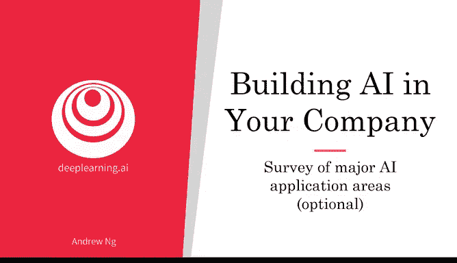
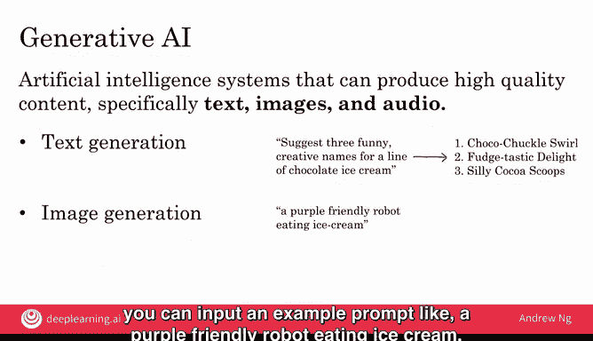
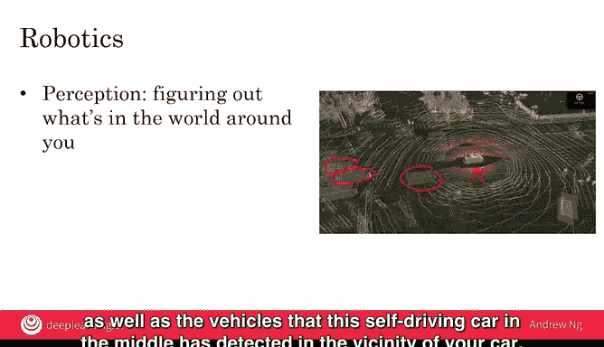
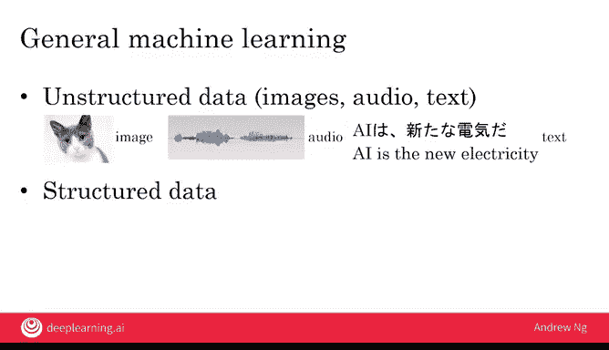

# 026：主要人工智能应用领域概览

## 📖 概述
在本节课中，我们将概览人工智能在当今世界成功应用的几个主要领域。我们将了解AI如何处理图像、视频、语言、语音等多种类型的数据，并探讨这些技术如何可能激发你未来项目的灵感。

---

## 🖼️ 计算机视觉应用
上一节我们介绍了AI应用的广泛性，本节中我们来看看它在计算机视觉领域的具体表现。深度学习的主要成功之一体现在计算机视觉上。

以下是计算机视觉的一些关键应用类型：

*   **图像分类与物体识别**：这项技术接收一张图片作为输入，并告诉我们图片中包含什么。例如，识别出这是一只猫。AI算法不仅能识别猫，还能识别特定类型的花朵或食物。其核心是接收图片输入并将其分类为某种物体类型。该技术正被用于各种应用。
*   **人脸识别**：这是图像分类中一个备受关注的具体类型。当今的人脸识别系统工作原理如下：用户注册一张或多张面部照片，向AI展示自己的样貌。当给定一张新图像时，AI系统会判断这是否为同一人，从而决定是否应解锁门禁、手机或笔记本电脑等设备。当然，我们希望人脸识别仅以尊重个人隐私的方式使用。
*   **物体检测**：与仅对物体进行分类或识别不同，物体检测旨在判断物体是否出现以及出现在何处。例如，在构建自动驾驶汽车时，AI系统可以接收一张图片作为输入，不仅能判断是否有汽车或行人，还能标出它们在图中的具体位置。物体检测算法也可以对一张图片说“否”，即未发现任何汽车或行人。因此，它不是给整张图片贴标签，而是告诉我们图片中不同物体的位置及其类型。
*   **图像分割**：这项技术更进一步。给定一张图片，图像分割算法会输出结果，不仅告诉我们汽车和行人在哪里，还会指明**每一个像素**是属于汽车、行人还是其他部分。它不会仅仅在检测到的物体周围画矩形框，而是精确勾勒出物体的边界。例如，在阅读X光片时，图像分割算法可以观察X光扫描图或人体其他图像，并精确分割出肝脏、心脏或骨骼的位置。
*   **视频与追踪**：计算机视觉也能处理视频，其中一个应用是追踪。在这个例子中，算法不仅检测视频中的跑步者，还会**追踪**他们在随时间推移中的移动轨迹。红色方框下方的小尾巴显示了算法如何在几秒的视频中追踪不同跑步者的移动。追踪视频中人物及其他移动物体的能力，有助于计算机判断物体的运动方向。例如，如果你使用摄像机追踪野生动物（比如飞鸟），追踪算法也能帮助追踪单个鸟类在视频帧间的飞行轨迹。

这些是计算机视觉的一些主要领域，其中某些或许对你的项目有用。

---

## 📝 自然语言处理应用
上一节我们探讨了AI如何“看”世界，本节中我们来看看AI如何“理解”和“生成”人类语言。AI，特别是深度学习，在自然语言处理领域也取得了巨大进展。自然语言处理（NLP）指的是AI理解自然语言，即你我用于交流的语言。

以下是几种主要的NLP应用：

*   **文本分类**：AI的任务是接收一段文本（如电子邮件）作为输入，并告诉我们该文本的类别。例如，判断是垃圾邮件还是非垃圾邮件。也有网站接收产品描述作为输入，例如“我有一部二手手机出售”，然后自动判断产品应列在哪个类别下（如手机或电子产品）。或者，如果你写“我有一件新T恤出售”，它会自动将其列在服装类别下。
*   **情感识别**：这是一种备受关注的文本分类。例如，情感识别算法可以接收一条餐厅评论作为输入，如“食物很好”，并自动尝试判断这条评论可能获得几颗星。“食物很好”是一条相当好的评论，也许是四星（满分五星）。而如果有人写“服务糟透了”，那么情感识别算法应能判断这大概对应一星评价。
*   **信息检索**：网络搜索或许是信息检索最著名的例子，你输入文本查询，希望AI帮你找到相关文档。许多公司也有内部信息检索系统，其界面可帮助你在公司内部文档集中搜索相关内容。
*   **命名实体识别**：这是另一项自然语言处理技术。举例说明，假设你有这样一个句子，你想找出其中所有的人名。那么，“伊丽莎白女王二世”是一个人，“保罗·麦卡特尼爵士”也是一个人。在句子“伊丽莎白女王二世在白金汉宫授予保罗·麦卡特尼爵士音乐服务勋章”中，命名实体识别系统可以找出所有像这样的人名。如果你想找出句子中所有的地点名称，命名实体识别系统也能做到。它还能自动提取公司名称、电话号码、国家名称等。因此，如果你有一个大型文档集，想自动找出所有公司名称、或共同出现的公司名称、或所有人名，命名实体识别系统就是你可以使用的工具。
*   **机器翻译**：这是另一个主要的AI应用领域。例如，如果你看到日语句子“AI あらゆる分野”，机器翻译系统可以接收它并输出翻译“AI for everyone”。

本页幻灯片上的四个项目——文本分类、信息检索、命名实体识别和机器翻译——是NLP的四大类有用应用。

---

## 🔊 语音处理应用
上一节我们了解了AI如何处理文本，本节中我们来看看AI如何处理音频数据，特别是语音。现代AI，特别是深度学习，也彻底改变了软件处理音频数据（如语音）的方式。

语音在计算机中如何表示？这是一位朋友说“machine learning”这个短语的音频波形图。这里的X轴是时间，垂直轴是麦克风记录的内容。这段录音记录的是空气压力的微小、快速变化，你的耳朵和大脑将其解释为声音。这个图表显示了随时间（水平轴）变化，空气压力如何因某人说“machine learning”一词而发生非常快速的变化。

以下是语音处理的主要应用：

*   **语音识别（语音转文本）**：该问题是接收如上图所示的输入，并判断某人说了什么词。语音识别近期的进展主要归功于深度学习。
*   **触发词/唤醒词检测**：这是语音识别的一种特定类型。你在之前的视频中看到过，AI系统检测诸如“Alexa”、“Hey Google”或“Hey Siri”这样的触发词或唤醒词。
*   **说话人识别**：这是一个专门的语音问题，其任务是聆听某人说话并**判断说话者的身份**。正如人脸识别通过拍照来验证你的身份，说话人识别也可以通过听你说话来帮助验证身份。
*   **语音合成（文本转语音）**：这也获得了大量关注。文本转语音是输入一个文本句子并将其转换为音频文件的问题。有趣的是，文本转语音常缩写为TTS，但我不常看到语音转文本缩写为STT。

举一个简单的例子，我们取句子“The quick brown fox jumps over the lazy dog”。这是一个NLP人员常用的有趣句子，因为它包含了从A到Z的每一个字母。如果你将这个句子输入TTS系统，你可能会得到像这样的音频输出。大多数TTS系统的声音正变得越来越自然，越来越像人声。

---

## 🎨 生成式AI应用
课程中我已多次提到生成式AI。生成式AI是一类能够生成高质量媒体内容（特别是文本、图像或音频）的AI系统。

让我们更详细地看看生成式AI的这些应用：

*   **文本生成**：大型语言模型非常擅长文本生成任务，包括从零开始创作内容、撰写摘要、文案编辑（即修改语法、提高清晰度等）以及聊天。例如，你可以给其中一个模型一个指令，如“为一系列巧克力冰淇淋建议有趣且有创意的名字”，模型就会生成一些有创意的听起来不错的名称。请注意，这里的输入文本被称为**提示词**，编写提示词以生成你想要的输出，正成为许多工作中一项有用的技能。我发现，将大型语言模型作为头脑风暴伙伴能提高我的工作效率。如果你能有效地编写提示词，或许你会发现它在工作或个人生活中也是一个有用的工具。事实上，我认为大型语言模型现在已经发展到这样一个阶段：几乎所有的知识工作者都可以通过在日常工作流程中学习和使用它们，至少获得一点生产力提升。
*   **图像生成**：生成式AI也能从零开始创建新图像。像Midjourney、DALL-E、Adobe Firefly和Stable Diffusion这样的软件，通过从互联网上的数百万张图像中学习，已经学会了如何根据文本描述生成图像。因此，使用其中一个图像生成模型，你可以输入一个示例提示词，如“一个紫色友好的机器人正在吃冰淇淋”，模型就会为你生成一张与提示词匹配的高质量图像。
*   **音频生成**：之前，我们看到了语音合成模型如何将文本转换为语音音频。同样存在像Suno、Stable Audio或Meta's AudioCraft这样的软件，它们可以根据文本提示生成音乐和音效。因此，通过编写如“鼓点独奏，140 BPM（每分钟节拍数）”这样的提示词，你可以使用音乐生成模型来创建一段音频。

因此，生成式AI能够创建多种类型的内容。这正在影响许多行业领域，我们将在下周了解更多关于AI（包括生成式AI）对工作的影响。

---

## 🤖 机器人技术应用
AI也应用于机器人技术的许多领域，你已经在自动驾驶汽车中看到了一个例子。

在机器人技术中，术语“感知”指的是根据你拥有的传感器（无论是摄像头、雷达还是激光雷达）来弄清楚周围世界有什么。右侧显示的是一辆自动驾驶汽车的3D激光扫描（或激光雷达扫描），以及这辆位于中间的自动驾驶汽车在其附近检测到的其他车辆。

“运动规划”指的是为你的机器人找到一条要遵循的路径。因此，如果你的汽车想要左转，运动规划器可能会规划一条路径以及汽车沿那条路径左转的速度。

最后，“控制”指的是向电机发送命令，例如你的方向盘电机以及油门和刹车电机，以便让汽车平稳地遵循你想要的路径。

本节课我们主要关注机器人技术的软件和AI方面。当然，为机器人构建硬件也有很多重要的工作，但AI在感知、运动规划和控制方面的大量工作都集中在软件而非机器人硬件上。

---

## 📊 结构化数据上的机器学习
除了这些主要应用领域，机器学习也被非常广泛地使用。你在本视频中看到的例子主要与**非结构化数据**有关，如图像、音频和文本。机器学习至少同样多地应用于**结构化数据**，这意味着这些数据表格，其中一些你在之前的视频中见过。

但是，由于非结构化数据（如图像）对人类来说非常容易理解，当我们谈论一个能识别猫的AI系统时，任何人都能很容易地理解和产生共鸣，因此大众媒体倾向于更多地报道AI在非结构化数据上的进展，而不是在结构化数据上的进展。结构化数据也往往更针对单个公司，因此人们更难撰写或理解相关内容。但是，与AI在非结构化数据上一样，AI在结构化数据上（或机器学习在结构化数据上）今天也在创造巨大的经济价值。

---

## 🎯 总结
我希望这次对AI应用领域的概览，能让你感受到当今AI成功应用的广泛数据类型。也许这甚至会启发你思考，其中一些应用领域如何可能对你自己未来的项目有用。

到目前为止，我们花最多时间讨论的一项AI技术是**监督学习**。这意味着从带有标签的数据中学习输入到输出（或A到B）的映射，你向AI系统提供A和B。但这并不是唯一的AI技术。事实上，“监督学习”这个词几乎引出了一个问题：什么是无监督学习？或者你可能也从新闻媒体的文章中听说过强化学习。那么，这些其他技术是什么？在下一个视频（本周最后一个可选视频）中，我们将概览AI技术，我希望通过那个视频，你或许能看到这些其他AI技术以及监督学习是否可能对你的项目也有用。