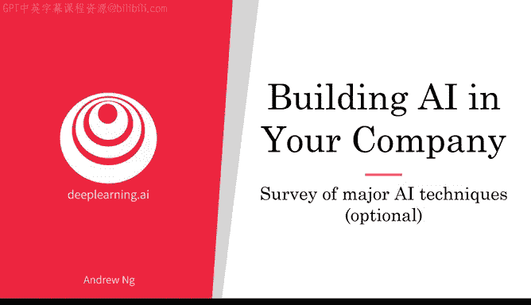
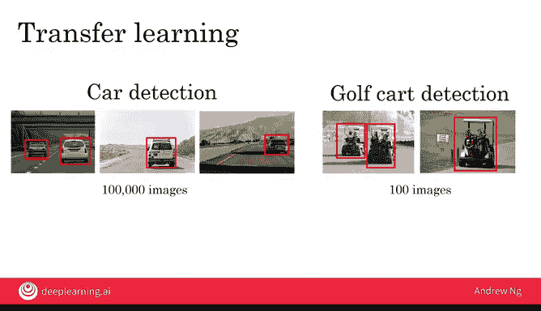
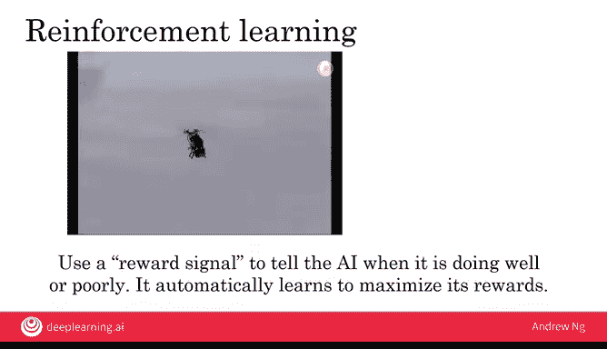
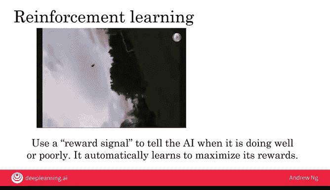
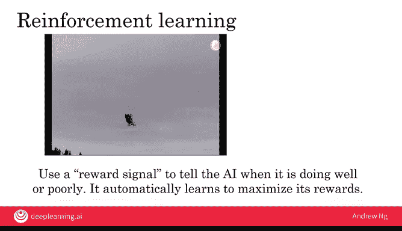
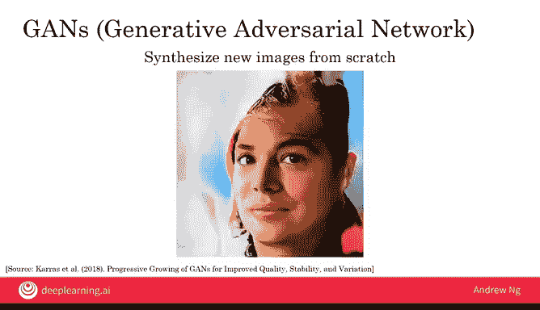
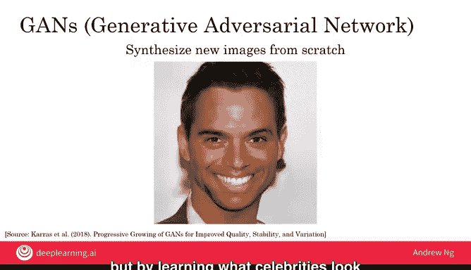
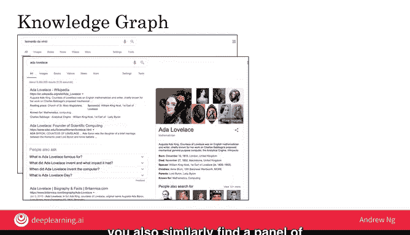

# 027：主要人工智能技术概览

## 概述
在本节课中，我们将学习监督学习之外的其他几种重要人工智能技术。我们将逐一介绍无监督学习、迁移学习、强化学习、生成对抗网络和知识图谱，了解它们的基本概念、工作原理和应用场景。

---

## 无监督学习：发现数据中的模式

上一节我们介绍了监督学习，它是一种从A到B映射的学习方法。本节中我们来看看无监督学习。

目前存在许多人工智能和机器学习技术。虽然监督学习（即学习A到B的映射）是当今最有价值的技术，但还有许多其他技术值得了解。

无监督学习最著名的例子是聚类分析。以下是一个例子。

假设你经营一家专门销售薯片的杂货店，你收集了不同客户的数据，记录了单个客户购买的薯片包数以及他们为每包薯片支付的平均价格。你销售一些低端的便宜薯片，也销售一些高端的价格较贵的薯片包。不同的顾客在一次典型的购物中可能会购买不同数量的薯片包。

给定这样的数据，聚类算法会说你的数据中似乎有两个集群。

你的一些顾客倾向于购买相对便宜的薯片，但购买很多包。例如，如果你的杂货店靠近大学校园，你可能会发现很多大学生购买较便宜的薯片包，但他们购买的数量很多。数据中还有第二个集群，是另一群购物者，他们购买的薯片包较少，但购买的是更贵的包装。聚类算法分析此类数据，并自动将数据分组为两个或更多集群。

它常用于市场细分，并帮助你发现类似这样的情况：如果你有一个购买特定类型薯片的大学生受众，以及一个购买较少薯片但愿意支付更高价格的在职专业人士受众，这可以帮助你对这些细分市场进行不同的营销。

之所以称之为无监督学习，原因如下。

监督学习算法学习A到B的映射，你必须告诉算法你想要的输出B是什么。

无监督学习算法并不确切地告诉AI系统它想要什么。相反，它给AI系统一堆数据，比如这些客户数据，并告诉AI在数据中寻找有趣的东西，寻找数据中有意义的东西。在这种情况下，聚类算法事先并不知道存在大学生群体和在职专业人士群体。相反，它只是试图找出不同的市场细分，而无需事先被告知它们是什么。

因此，无监督学习算法在给定数据时，没有任何特定的设计输出标签，没有目标标签B，可以自动发现数据中有趣的东西。

我参与过的一个无监督学习例子是稍微有点“臭名昭著”的谷歌猫项目。在这个项目中，我和我的团队在一个非常大的YouTube视频集上运行了一个无监督学习算法，我们要求算法告诉我们它在YouTube视频中发现了什么。它在YouTube视频中发现的众多事物之一就是猫，因为有点刻板印象的是，YouTube上显然有很多猫视频。但这是一个了不起的结果，在没有事先告诉它应该找猫的情况下，AI系统，即无监督学习算法，能够自己发现猫的概念，仅仅通过观看大量YouTube视频，并发现“天哪，YouTube视频里有很多猫”。有时很难准确可视化AI算法在想什么，但右边的图片是系统学习到的猫概念的可视化。

尽管监督学习是一种非常有价值和强大的技术，但对它的批评之一是它需要大量标注数据。例如，如果你试图使用监督学习让AI系统识别咖啡杯，那么你可能需要给它1000张或10000张咖啡杯的图片，而这只是需要提供给AI系统的海量咖啡杯图片。

对于为人父母者，我几乎可以保证，这个星球上没有哪位父母，无论多么慈爱和关怀，曾向他们的孩子指出过10000个独特的咖啡杯来试图教孩子什么是咖啡杯。因此，当今的AI系统学习所需的标注数据量远多于人类儿童或大多数动物。这就是为什么AI研究人员对无监督学习寄予厚望，认为它可能是在未来让AI以更人性化、更生物化的方式，用更少的标注数据进行更有效学习的一种途径。目前，我们对生物大脑的工作原理几乎一无所知，因此要实现这一愿景，需要在AI领域取得重大突破，而今天我们所有人都还不知道如何实现。我们许多人对无监督学习的未来寄予厚望。

尽管如此，无监督学习在今天仍然有价值。例如，在自然语言处理的一些特定应用中，无监督学习实际上有助于显著提高网络搜索的质量。但如今无监督学习创造的价值仍然远小于通过监督学习创造的价值。

---

## 迁移学习：知识的传递与复用

了解了无监督学习后，我们来看另一种能有效利用已有知识的技术：迁移学习。

另一个重要的AI技术是迁移学习。让我们看一个例子。

假设你制造了一辆自动驾驶汽车，并且你已经训练了你的AI系统来检测汽车。但随后你将车辆部署到一个新的城市，而这个新城市有很多高尔夫球车在行驶。因此，你还需要建立一个高尔夫球车检测系统。你可能已经用大量图像（比如10万张）训练了你的汽车检测系统，但在你刚刚开始运营的这个新城市，你可能只有数量少得多的高尔夫球车图像。

迁移学习是一种技术，它让你能够从任务A（如汽车检测）中学习，并将知识用于帮助完成不同的任务B（如高尔夫球车检测）。迁移学习真正发挥作用的地方在于，如果已经从任务A（汽车检测）的庞大数据集中学习，那么即使你只有少得多的高尔夫球车数据，你现在也能在高尔夫球车检测上做得相当好，因为它从第一个任务中学到的一些知识（比如车辆的外观、轮子的样子、车辆的运动方式）可能对高尔夫球车检测也有用。

迁移学习没有得到很多媒体报道，但它是当今AI中非常有价值的技术之一。例如，许多计算机视觉系统都是使用迁移学习构建的，这对它们的性能产生了巨大影响。

---

## 强化学习：通过奖励信号学习行为

接下来，我们探讨一种通过试错和反馈来学习的技术：强化学习。

你可能也听说过一种叫做强化学习的技术。那么，什么是强化学习？让我用另一个例子来说明。

这是一张斯坦福自主直升机的图片。它配备了GPS、加速度计和罗盘，所以它总是知道自己的位置。假设你想写一个程序让它自主飞行。很难使用监督学习的输入输出A到B映射，因为很难指定当直升机处于某个给定位置时，最优的、最好的飞行方式是什么。

强化学习提供了不同的解决方案。我认为强化学习类似于你如何训练宠物狗表现良好。我成长的家庭曾养过一只宠物狗。那么，你如何训练宠物狗表现良好呢？我们让狗做它想做的任何事。然后每当它表现良好时，我们就会表扬它，说“哦，好狗”。每当它做坏事时，你就会说“坏狗”。随着时间的推移，它学会了多做“好狗”的事，少做“坏狗”的事。

强化学习采用同样的原则，并将其应用于直升机或其他事物。因此，我们让直升机在模拟器中飞行，这样它可以坠毁而不会伤害任何人。但我们会让AI以任何方式驾驶直升机。每当它驾驶直升机飞得好时，我们就会说“哦，好直升机”。每当它坠毁时，我们就会说“坏直升机”。然后，AI的任务就是学习如何驾驶直升机，以获得更多“好直升机”的奖励，减少“坏直升机”的负面反馈。

更正式地说，强化学习算法使用奖励信号来告诉AI它做得好还是不好。这意味着每当它做得好时，你给它一个大的正数作为大的正奖励；每当它做得非常糟糕时，你发送一个负数作为负奖励。AI的任务是自动学习如何行动，以最大化奖励。因此，“好狗”对应于给予正数，“坏狗”或“坏直升机”对应于你给予负数。然后AI将学会更多地采取那些导致大的正数或大的正奖励的行为。

让我给你看一段我们完成这项工作后斯坦福自主直升机飞行的视频。这是一段直升机在强化学习控制下飞行的视频。那天我是摄像师。当你拉远镜头时，你会看到种在天空中的树。我们实际上给了它一个奖励信号，奖励直升机倒飞。使用强化学习，我们建造了世界上能力最强的自主直升机之一。

除了机器人控制，强化学习在玩游戏方面也取得了很大进展，比如奥赛罗、跳棋、国际象棋或围棋。你可能听说过AlphaGo，它使用强化学习在围棋上表现得非常出色。强化学习在玩电子游戏方面也非常有效。

强化学习算法的一个弱点是它们可能需要海量的数据。所以，如果你在玩电子游戏，强化学习算法基本上可以玩无限多的电子游戏，因为它只是计算机玩电脑游戏，从而获得大量数据来学习如何表现得更好。或者对于玩跳棋或其他游戏，它可以自己玩很多游戏，免费获得大量数据输入强化学习算法。在自主直升机的案例中，我们有一个直升机模拟器。因此，可以在模拟中飞行很长时间，以找出什么对驾驶直升机有效，什么无效。目前正在进行大量激动人心的研究工作，以使强化学习即使在可能没有精确模拟器、难以获得如此大量数据的环境下也能工作。

尽管强化学习受到了媒体的大量关注，但至少在今天，它创造的经济价值明显低于监督学习。但未来的突破可能会改变这一点。AI发展如此迅速，我们当然都希望在我们谈论的这些领域都能取得突破。

---

## 生成对抗网络：创造新内容

除了学习模式，AI还能创造新内容。生成对抗网络是另一种令人兴奋的新AI技术。

GANs或生成对抗网络是另一种令人兴奋的新AI技术。它们是由我的前学生伊恩·古德费洛创建的。

GANs非常擅长从零开始合成新图像。让我给你看一段由英伟达团队生成的视频，他们使用GANs合成名人图片，这些都是从未存在过的人的照片，但通过从名人图像数据库中学习名人的样子，能够合成所有这些全新的图片。

目前，不同的团队正在开展激动人心的工作，将GANs应用于娱乐行业，范围涵盖计算机图形学、电脑游戏、媒体，以及像这样从零开始创造新内容。

---

## 知识图谱：结构化的知识数据库

最后，知识图谱是另一个我认为被严重低估的重要AI技术。

如果你在谷歌上搜索列奥纳多·达·芬奇，你可能会找到这组结果，右边有关于达·芬奇的信息面板。如果你搜索艾达·洛夫莱斯，你同样会在右边找到一个附加信息面板。

这些信息来自知识图谱，它基本上是一个列出人物及其关键信息（如生日、去世日期、传记和其他属性）的数据库。

如今，不同的公司已经构建了许多不同类型事物的知识图谱，不仅仅是人物，还构建了关于电影、名人、酒店、机场、风景名胜等等的数据库。例如，一个包含酒店信息的知识图谱可能有一个庞大的酒店数据库以及关于这些酒店的关键信息，这样当你在地图上查找它们时，可以相对快速地找到正确的信息。

“知识图谱”这个术语最初由谷歌推广，但这个概念已经传播到许多其他公司。有趣的是，尽管知识图谱目前正在为多家大公司创造大量经济价值，但这是在学术界相对较少研究的课题之一。因此，相对于当今实际的经济影响，你看到的关于知识图谱的研究论文数量似乎不成比例地少。

但根据你所处的行业垂直领域，也许构建知识图谱的一些技术对于构建与你公司相关的某类信息的大型数据库也会有用。

---

## 总结
在本节课中，我们一起学习了无监督学习、迁移学习、强化学习、生成对抗网络和知识图谱。内容似乎很多，不是吗？我希望其中一些想法对你的项目也有用，并且了解这些术语将使你更容易与AI工程师进行富有成效的讨论。

本周，我们讨论了很多关于AI如何影响公司，也许你如何使用AI来影响你的公司。AI也正在对社会产生巨大影响。因此，为了理解AI对社会的影响，并确保我们做合乎道德的事情，确保我们只使用AI来帮助人们并使人们生活得更好，在接下来的一周，我们将讨论AI与社会。感谢你坚持学习到这里，我期待在本课程最后一周的视频中见到你。