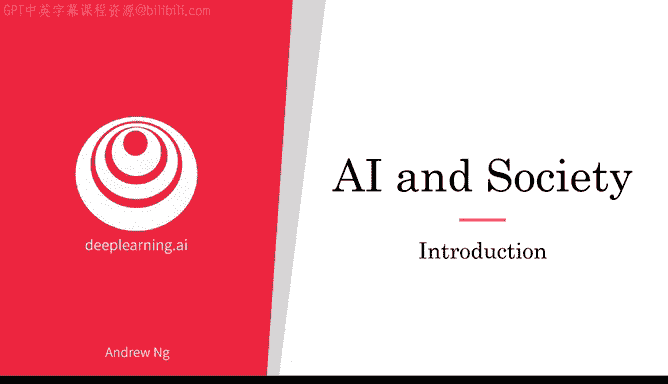
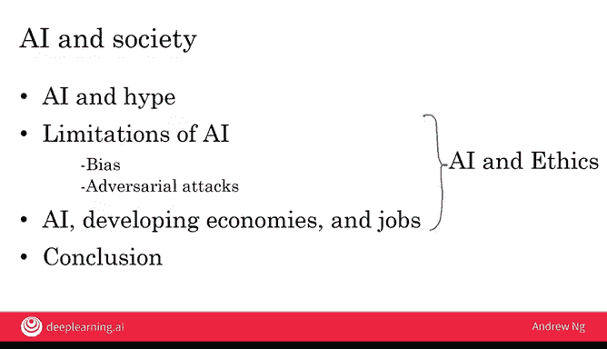

# 028：课程介绍

在本节课中，我们将要学习人工智能的宏观影响、其局限性以及相关的伦理与社会议题。这是本课程的第四周，也是最后一周，我们将一起探讨如何以现实的视角看待人工智能，并理解其在全球范围内的作用。

## 拥有现实的人工智能视角

上一节我们介绍了课程的整体安排，本节中我们来看看为何需要以现实的眼光看待人工智能。人工智能正在改变世界，但同时也存在许多不必要的炒作。对于公民、商业领袖和政府领导者而言，要驾驭人工智能的崛起，我们必须对人工智能有一个现实的认识。

在第一周，你已经了解了人工智能的一些技术局限性。然而，人工智能还存在其他方面的限制。

以下是人工智能的一些关键局限性：

*   **偏见与歧视**：人工智能可能存在偏见，并对少数群体或其他群体进行不公平的歧视。
*   **对抗性攻击**：人工智能技术容易受到对抗性攻击。例如，我们依赖垃圾邮件过滤器来维持电子邮件系统的正常运作，但总有人试图攻击这些过滤器。即使我们开发了新的AI技术，如果人们蓄意欺骗AI，这些新技术也可能面临新型攻击。

## 人工智能的全球影响与伦理

人工智能不仅影响发达经济体，也对发展中经济体和全球就业格局产生重大影响。许多这些问题都与人工智能和伦理领域相关。

为了确保我们在人工智能领域的工作符合伦理，我们需要正视这些复杂的问题。事实上，人工智能与伦理这个话题本身值得开设一个为期四周甚至更长的专门课程。本周，我希望至少能触及一些主要议题，以便你在构建或使用人工智能时，能够理解伴随AI崛起而产生的一些重大问题。

## 课程总结与展望

在本节课中，我们一起学习了以现实视角看待人工智能的重要性，探讨了AI在偏见、安全方面的局限性，并初步了解了其全球影响与伦理挑战。这是确保我们所做的工作能让社会变得更好的关键。

在本周的结尾，我们将完成《人工智能普及课程》的全部内容。我期待在最后这几个视频中与你一同学习。

接下来，让我们进入下一个视频，更深入地探讨超越技术和性能限制的人工智能现实视角。