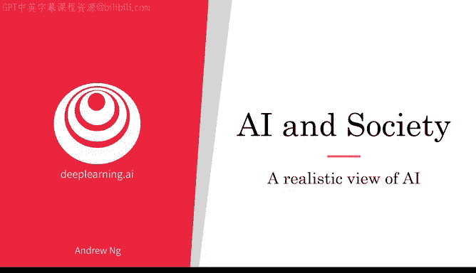
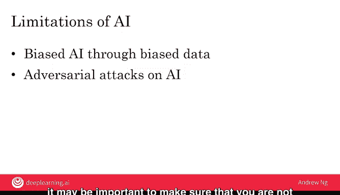

# 029：人工智能的现实视角

在本节课中，我们将学习如何建立对人工智能的现实视角，既不盲目乐观也不过度悲观。我们还将探讨当前AI技术存在的一些主要局限性，例如可解释性、偏见和对抗性攻击。

人工智能对社会和许多人的生活产生了巨大影响。因此，为了让我们所有人做出明智的决策，拥有一个现实的人工智能视角至关重要，既不过于乐观，也不过于悲观。

你小时候读过《金发姑娘和三只熊》的故事吗？故事的一部分是说，一碗粥应该既不太热也不太冷，一张床应该既不太硬也不太软。我认为我们需要一个类似的“金发姑娘法则”来对待AI。重要的是，我们对于AI技术能做什么或不能什么，既不过于乐观，也不过于悲观。

例如，我们不应该对AI技术过于乐观。AI是一项非常强大的技术，但我不指望它能单凭一己之力解决人类所有问题，并引领人类进入某种全球乌托邦。一些过度乐观源于人们认为AI意识、通用人工智能甚至超级智能可能即将到来，并且当我们达到那个阶段时，AI将在医疗保健领域迅速取得巨大突破，让我们长寿健康，同时创造巨额财富。我希望事情能那么简单。

另一方面，一些对AI最悲观的恐惧也与认为超级智能可能即将到来有关，认为AI可能变得有意识并决定……我不知道……征服我们人类。在我看来，这极不可能。尽管AI确实存在风险，例如它可能产生有偏见、不公平或不准确的输出，但失控到AI变成一种优越物种并消灭我们的地步，这确实属于科幻小说的范畴，而非现实场景。人类拥有控制比任何个体都更强大的事物（如公司和民族国家）的丰富经验。虽然AI的输出有时不可预测，但我并不担心我们会“失去对AI的控制”或AI成为我们的竞争物种。

我认为，关于意识、超级智能、通用人工智能的不必要恐惧和过度乐观的希望，分散了人们对真正问题的注意力，也在社会中引起了不必要的AI恐惧。

相比之下，我认为对AI更现实的看法是，它是一个非常非常强大的工具，但也有很多事情是AI做不到的。它存在一些潜在的危害，如偏见、不公平和不准确的输出，但我们可以减轻这些危害。它已经在创造巨大的经济价值，并且我们看到了它在多个行业继续创造更多价值的清晰路径。因此，我和许多其他AI系统构建者一样，有信心在可预见的未来，AI将继续发展并为越来越多的人带来希望。

总而言之，与其过于乐观或过于悲观，金发姑娘故事的启示是，采取一种现实的中间立场才是正确的。当你与朋友谈论AI时，我希望你也能告诉他们这个AI的“金发姑娘法则”，这样他们也能对AI有一个更现实的看法。

AI存在许多局限性。你之前已经看到了一些性能上的限制，但AI还有其他方面的局限。

以下是AI的一些主要局限性：

**可解释性困难**

AI的局限性之一是难以解释。许多高性能的AI系统都是“黑箱”，意味着它工作得很好，但AI不知道如何解释它为什么这样做。

举个例子，假设你有一个AI系统，查看这张X光片来诊断病人是否有问题。在这个真实案例中，AI系统认为病人患有右侧气胸，这意味着右肺塌陷了。但我们怎么知道AI是否正确？你如何知道是否应该信任AI系统的诊断？

为了让AI系统解释自己，人们做了大量工作。在这个例子中，热力图显示了AI为了做出这个诊断，正在关注图像的哪一部分。因为它显然是基于右肺，实际上是右肺的一些关键特征来做出诊断的。看到这张图可能会让我们更有信心，认为AI正在做出合理的诊断。

公平地说，人类也不擅长解释我们自己是如何做决策的。例如，你在上周的视频中已经见过这个咖啡杯。但你怎么知道它是一个咖啡杯？一个人如何看着它并说“那是一个咖啡杯”？你可以指出一些特征，比如有装液体的空间和有一个把手，但我们人类并不擅长解释我们如何看着它并决定它是什么。但由于AI是一个相对较新的事物，缺乏可解释性有时会成为接受的障碍。而且，有时如果AI系统工作不正常，那么它解释自己的能力也将帮助我们找出如何改进AI系统的方法。

因此，可解释性是主要开放研究领域之一，许多研究人员正在努力。在实践中我看到的是，当一个AI团队想要部署某个系统时，他们通常能够提出一个足够好的解释，使系统能够工作并得以部署。所以，可解释性很难，但通常并非不可能。不过，我们确实需要更好的工具来帮助AI系统解释自己。

**偏见与歧视**

AI还有其他一些严重的局限性。作为一个社会，我们不想基于个人的性别或种族进行歧视，我们希望人们得到公平对待。但是，当AI系统被输入不反映这些价值观的数据时，AI就可能变得有偏见，或学会歧视某些人群。AI社区正在努力解决这些问题，并取得了良好进展，但我们还远未完成，还有很多工作要做。你将在下一个视频中了解更多关于AI偏见的知识，以及一些如何确保你使用的AI系统偏见更少的方法。

**对抗性攻击**

最后，许多AI系统正在做出具有重要经济意义的决策，而一些AI系统容易受到对抗性攻击，如果其他人故意试图愚弄你的AI系统。因此，根据你的应用场景，确保你的AI系统不易受到此类攻击可能很重要。

AI与歧视或偏见的问题，以及AI的对抗性攻击问题，无论对你作为AI的潜在构建者和使用者，还是对整个社会都至关重要。在下一个视频中，让我们更深入地探讨AI与偏见的问题。

本节课中，我们一起学习了如何以现实的“金发姑娘法则”视角看待AI，认识到它既是强大的工具，也存在可解释性、偏见和安全性等局限性。建立这种平衡的认识，有助于我们更好地利用AI技术，并推动其朝着负责任的方向发展。