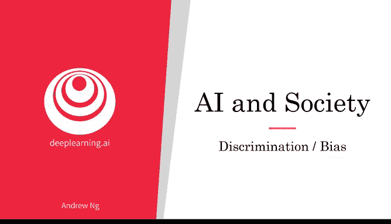
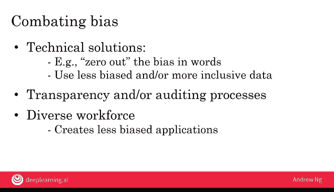

# 030：算法歧视与偏见

## 概述
在本节课中，我们将要学习人工智能系统如何产生偏见并导致歧视，以及我们如何努力在AI系统中减少或消除这种影响。

---

## AI系统如何产生偏见？🤔
AI系统如何变得有偏见，从而歧视某些人群？我们如何尝试在AI系统中减少或消除这种影响？让我们从一个例子开始。

微软的一个研究小组发现了一个显著的结果：当AI从互联网上的文本中学习时，它可能会学习到不健康的刻板印象。值得称赞的是，他们也提出了减少这类AI系统偏见的技术方案。

以下是他们的发现：通过让AI阅读互联网上的文本，它可以学习词汇，并且你可以要求它进行类比推理。现在，你可以这样测试AI系统：“既然你已经阅读了互联网上的所有文本，那么在类比‘男人之于女人，如同父亲之于什么？’中，答案是什么？”

AI会输出“母亲”这个词，这反映了这些词在互联网上的典型使用方式。如果你问它“男人之于女人，如同国王之于什么？”，同一个AI系统会说“如同国王之于王后”。同样，这相对于这些词在互联网上的使用方式似乎是合理的。

然而，研究还发现了以下结果：如果你问它“男人之于程序员，如同女人之于什么？”，同一个AI系统会输出答案“女人之于家庭主妇”。

我认为这个答案非常令人遗憾。一个偏见较少的答案应该是“女人之于程序员”。如果我们希望AI系统理解男人和女人都可以平等地成为程序员，就像男人和女人都可以平等地成为家庭主妇一样，那么我们更希望它输出“男人之于程序员，如同女人之于程序员”，以及“男人之于家庭主妇，如同女人之于家庭主妇”。

AI系统是如何从数据中学习到这种偏见的？让我们更深入地探讨一下技术细节。

---

## 技术细节：AI如何表示词汇？🔢
AI系统存储词汇的方式是使用一组数字。假设“男人”这个词被存储为（或者说“表示”为）两个数字：`[1, 1]`。

AI系统得出这些数字的方式是通过统计“男人”这个词在互联网上的使用情况。计算这些数字的具体过程相当复杂，这里不做深入探讨。但这些数字代表了这些词在实际使用中的典型模式。

实际上，AI可能需要数百或数千个数字来存储一个词，但为了简化示例，这里只使用两个数字。

让我把这些数字绘制在图表上。所以“男人”这个词，我将在右图的`(1, 1)`位置标出。通过观察“程序员”这个短语在互联网上的使用统计数据，AI会得到另一对数字，比如`[3, 2]`，来存储或表示“程序员”这个短语。

同样，通过观察“女人”这个词的使用方式，它会得到另一对数字，比如`[2, 3]`，来存储或表示“女人”这个词。

当你要求AI系统计算上面的类比“男人之于程序员，如同女人之于什么？”时，AI系统会做的是构建一个如下所示的平行四边形，并询问与`(4, 4)`位置相关联的词是什么。因为它会认为这就是这个类比的答案。

从数学角度思考的一种方式是，AI认为“男人”到“程序员”的关系是：从“男人”这个词出发，向右移动两步，向上移动一步。因此，为了找到“女人之于什么？”的相同答案，你也需要向右移动两步，向上移动一步。

不幸的是，当这些数字是从互联网文本中推导出来时，AI系统发现“家庭主妇”这个词在互联网上的使用方式导致它被放置在`(4, 4)`的位置，这就是为什么AI系统得出了这个带有偏见的类比。

---

## 偏见为何重要？⚖️
AI系统已经在做出重要决策，并且未来也将继续如此。因此，偏见问题至关重要。

例如，有一家公司使用AI进行招聘，发现他们的招聘工具歧视女性。这显然是不公平的，因此该公司关闭了他们的工具。

其次，一些人脸识别系统似乎对浅肤色个体的识别比对深肤色个体的识别更准确。如果一个AI系统主要是在浅肤色个体的数据上训练的，那么它对这类个体的识别就会更准确。如果这些系统被用于刑事调查等领域，这可能会对深肤色个体产生非常偏见和不公平的影响。因此，许多人脸识别团队今天都在努力确保系统不表现出这种类型的偏见。

还有一些AI或统计贷款审批系统最终歧视某些少数族裔群体，并给他们报出更高的利率。银行也一直在努力确保在其审批系统中减少或消除这种偏见。

最后，我认为重要的是，AI系统不应助长强化不健康刻板印象的有害影响。例如，如果一个八岁的女孩通过图像搜索引擎搜索“首席执行官”，如果她只看到男性的图片，或者没有看到任何在性别或种族上与自己相似的人，我们不希望她因此气馁，放弃追求未来可能成为大公司首席执行官的职业道路。

---

## 如何减少AI偏见？🛠️
由于这些问题，AI社区已经投入了大量精力来对抗偏见。

以下是几种主要方法：

**1. 技术解决方案**
例如，我们开始为减少AI系统中的偏见提供越来越好的技术解决方案。在本视频开头看到的AI输出偏见类比的例子中，稍微简化一下描述，研究人员发现，当AI系统学习大量不同的数字来表示词汇时，其中少数几个数字与偏见相对应。如果你将这些数字归零（即设置为0），那么偏见就会显著减少。

**2. 使用更少偏见、更具包容性的数据**
例如，如果你正在构建一个人脸识别系统，并确保包含来自多种族和所有性别的数据，那么你的系统偏见会更少，更具包容性。

**3. 提高透明度和审计流程**
许多AI团队正在让他们的系统接受更好的透明度和/或审计流程，以便我们能够持续检查这些AI系统表现出何种类型的偏见（如果有的话）。这样，我们至少可以在问题存在时识别它，然后采取措施解决它。例如，许多人脸识别团队正在系统地检查他们的系统在不同人群子集上的准确性，以检查其对深肤色与浅肤色个体的识别是否更准确或更不准确。拥有透明的系统以及系统的审计流程，增加了我们至少能快速发现问题（如果存在的话）的可能性，以便你能够修复它。

**4. 建立多元化的团队**
最后，我认为拥有多元化的团队也将有助于减少偏见。如果你有一个多元化的团队，那么团队中的成员更有可能发现不同的问题，并且也许他们首先就能帮助使你的数据更加多样化和包容，因为他们在构建AI系统时拥有更多独特的观点。我认为这将帮助我们所有人创建偏见更少的应用程序。

---

## 总结与展望
AI系统今天正在做出非常重要的决策，因此它们的偏见或潜在的偏见是我们必须关注并努力减少的。

让我对此感到乐观的一点是，实际上我们今天在减少AI偏见方面比减少人类偏见方面有更好的想法。因此，虽然我们不应该满足，直到所有AI偏见都消失，并且我们需要付出相当多的努力才能达到这个目标，但我仍然保持乐观。如果我们能够从与人类相似水平（因为它向人类学习）起步的AI系统开始，然后通过技术解决方案或其他方式从那里减少偏见，那么作为社会，我们有望使通过人类或AI做出的决策迅速变得更加公平，偏见更少。

除了偏见问题，AI的另一个局限性是它可能容易受到对抗性攻击。在下一个视频中，你将学习什么是对抗性攻击，以及你可以采取哪些措施来防范它们。让我们继续下一个视频。