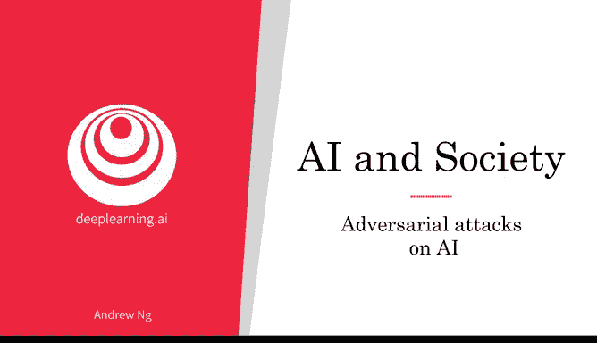
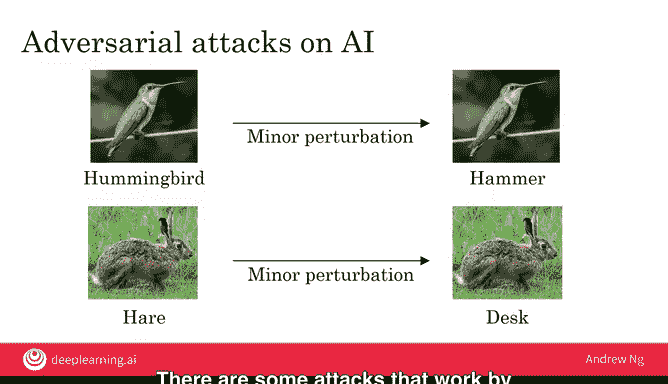
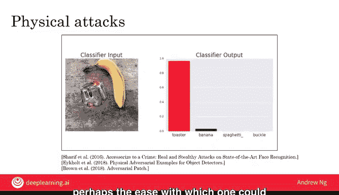
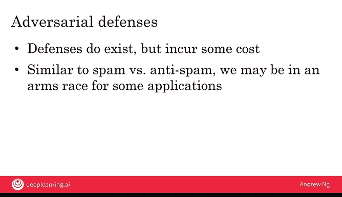

# 031：针对人工智能的对抗性攻击 🛡️

在本节课中，我们将要学习现代人工智能系统的一个关键局限性：对抗性攻击。我们将了解攻击者如何通过微小的、人眼难以察觉的改动，来“欺骗”AI系统，使其做出错误的判断。

## 概述

尽管现代人工智能技术，特别是深度学习，已经非常强大，但它存在一个局限性：有时它会被“愚弄”。具体来说，现代AI系统有时容易受到对抗性攻击，即有人蓄意设计输入来欺骗你的AI系统。让我们来看一看。

## 对抗性攻击的原理

上一节我们提到了AI系统可能被欺骗，本节中我们来看看具体的攻击是如何实现的。

假设你给一个AI系统一张鸟的图片，并要求它分类。AI系统输出这是一只“蜂鸟”。但是，如果我们对这张图片进行微小的扰动——这里“微小扰动”指的是只改变一点点像素值，这种改变对大多数人来说几乎无法察觉——同一个AI系统就会说这是一把“锤子”。

对于人类来说，这似乎不可能。右边的图片看起来几乎和左边一模一样。事实上，这些变化对人眼来说几乎无法察觉。但AI系统“看”世界的方式与你我不同，因此它容易受到攻击。如果一个对手对图片进行了你我都难以察觉的改动，却导致AI误以为图片是完全不同的东西，我们称之为对AI系统的**对抗性攻击**。

在计算机安全领域，对一个安全系统的“攻击”意味着试图让它做出非预期的行为。同样，对AI系统的对抗性攻击也是试图让它做出非预期行为，例如诱使其输出错误的分类。

以下是另一个例子：

*   一张兔子的图片，经过微小的扰动或像素值的小幅改变后，AI反而说这是一张“桌子”。

计算机以不同于人类的方式“看”图片，这既有优势也有劣势。例如，计算机系统在读取条形码和二维码方面比人类强得多。但深度学习系统的工作方式也使其容易受到这种特定形式的攻击，而人类绝不会被这种攻击所欺骗。

## 对抗性攻击的实例

了解了基本原理后，我们来看一些具体的攻击实例。这些例子展示了攻击如何发生在数字图像和物理世界中。

目前，AI正被用于过滤垃圾邮件、试图过滤仇恨言论，而此类攻击会降低这些过滤器的有效性。本幻灯片上的攻击需要能够直接修改图像。例如，垃圾邮件发送者在上传图片到网站或通过电子邮件发送之前，可能会直接修改图像。

**也有一些攻击是通过改变物理世界来实现的。** 以下是几个关键例子：

*   **特制眼镜**：卡内基梅隆大学的一个团队设计了一副奇特的眼镜。当这名男子戴上这副眼镜时，他可以欺骗AI系统，使其认为他是女演员米拉·乔沃维奇。
*   **干扰贴纸**：来自加州大学伯克利分校、密歇根大学等高校的研究人员表明，如果你在停车标志上贴上如图所示的贴纸，你可以欺骗AI系统，使其完全“看不到”停车标志，认为那里是别的东西。这个例子有趣的一点在于，它看起来只是停车标志上被涂鸦了，大多数人仍然能轻易认出这是停车标志。但如果你在自动驾驶汽车中内置了计算机视觉系统，如果汽车因为这些贴纸而“看不到”停车标志，那将是非常不幸的。
*   **香蕉变烤面包机**：最后一个例子来自谷歌的一个研究小组。如果你向AI系统展示这张图片，它会说这是一根“香蕉”。但研究人员设计了一个贴纸，如果你把它放入场景中，AI就会错误分类这根香蕉。当贴纸被放入场景时，AI系统现在几乎完全确定这张图片是一个“烤面包机”。这项工作的一个有趣之处在于，论文作者（幻灯片底部引用了该论文）实际上在他们的论文中发布了他们贴纸的图片。这样，理论上世界上任何人都可以下载他们的论文，打印出贴纸，并把它贴在某个地方，如果他们想欺骗AI系统，让它认为那里有一个不存在的烤面包机。

现在，我不支持任何人攻击AI系统来欺骗它们。但这不幸地显示了，理论上攻击这些AI系统是多么容易。

## 防御措施与挑战

面对这些攻击，我们能做些什么来防御呢？幸运的是，AI界一直在研究新技术，以使系统更难被攻击。

防御措施往往技术性很强，但确实存在修改神经网络和其他AI系统的方法，使它们在一定程度上更难被攻击。一个缺点是，这些防御确实会带来一些成本。例如，AI系统的运行速度可能会慢一些。但这仍然是一个持续研究的领域，我们距离拥有足够好的对抗性防御技术还很远，这些技术需要能应用于所有我们想要使用AI的重要场景。

对于许多AI系统来说，可能没有人有动机去攻击它。例如，如果你在工厂运行一个自动视觉检测系统来检查咖啡杯是否有划痕，可能没有多少人有意愿去欺骗你的系统，让它认为一个有划痕的咖啡杯没有划痕。

但是，也会有一些AI应用会面临攻击。对于那些应用，我认为情况类似于垃圾邮件与反垃圾邮件的斗争：垃圾邮件发送者试图让垃圾邮件通过，而垃圾邮件过滤器试图阻止他们。我认为将会出现一些应用，我们将陷入一场军备竞赛：AI社区在构建防御，而攻击者社区则在试图突破我们的防御。

根据我构建AI系统的经验，少数几次让我感觉在与他人进行“全面战争”的情况之一，就是当我领导反欺诈团队与欺诈行为作斗争时。不幸的是，互联网上存在一定数量的欺诈，人们试图在支付系统中窃取金钱或创建欺诈账户。我从事反欺诈系统工作的那段时间，是少数真正感觉像零和游戏的时刻：我们会建立一道防御，他们会做出反应并发起攻击，我的团队有时必须在几小时内做出反应来保护自己。

因此，我认为在未来几年，即使AI技术不断发展，也会存在像垃圾邮件、欺诈这样的垂直领域，团队将与对手进行一场感觉像是零和游戏的“战争”。话虽如此，我也不想夸大对抗性AI系统可能造成的损害。这对某些应用确实非常重要，但也有许多AI应用不太容易受到对抗性攻击。

## 总结

本节课中，我们一起学习了人工智能中的对抗性攻击。我们了解到，攻击者可以通过对数字图像进行微小扰动，或在物理世界中添加特定图案（如特制眼镜、干扰贴纸），来欺骗深度学习模型，使其产生严重误判。这种攻击揭示了AI系统感知方式与人类的根本差异。虽然存在一些技术性防御手段，但它们往往有性能代价，且该领域仍在持续研究中。对于如反欺诈、内容过滤等可能面临恶意攻击的关键应用，开发者需要意识到这种风险，并准备应对可能出现的“攻防”军备竞赛。