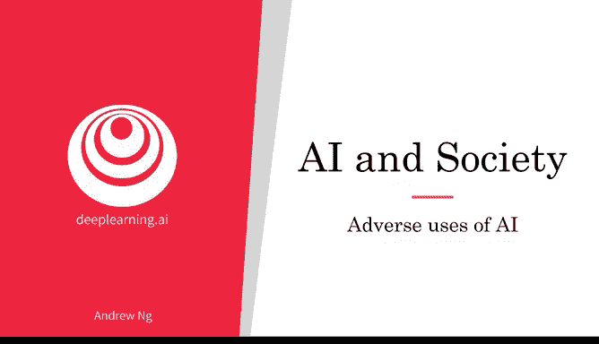
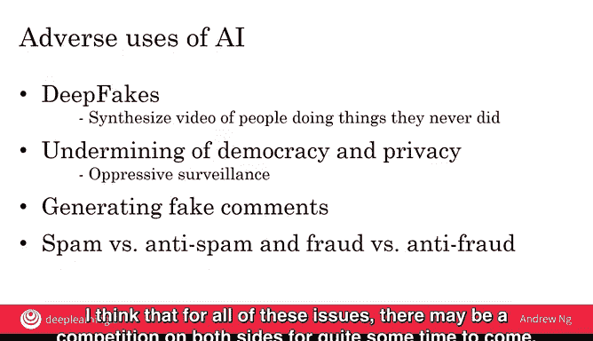

# 032：人工智能的恶意应用 🛡️

在本节课中，我们将探讨人工智能技术可能被滥用的几种方式，包括深度伪造、侵犯隐私与民主以及虚假评论的生成。我们也将讨论社会如何应对这些挑战，并对未来持乐观态度。

---

人工智能技术极其强大，绝大多数使用者都在利用它让个人、公司、国家乃至整个社会变得更好。然而，也存在少数不良使用者。让我们看看其中一些案例，并讨论我们可以采取哪些应对措施。

上一节我们提到了AI的积极影响，本节中我们来看看其潜在的恶意应用。

## 深度伪造技术 🎭

人工智能技术已被用于创建“深度伪造”视频，这意味着可以合成人们从未真正做过的事情的视频。

例如，网站Buzzfeed曾制作了一段美国前总统巴拉克·奥巴马说他从未说过的话的视频。Buzzfeed对此是透明的，他们在发布视频时明确告知所有人这是伪造的。但如果这类技术被用于针对个人，使他人认为该人说过或做过他们从未实际做过的事情，那么这些人就可能受到伤害，并不得不为自己从未做过的事情的虚假视频证据进行辩护。

与垃圾邮件和反垃圾邮件的斗争类似，如今已有AI技术可用于检测视频是否为深度伪造。但在当今的社交媒体世界中，虚假信息的传播速度可能快于真相的澄清速度，因此许多人担心深度伪造可能对个人造成伤害。

## 隐私侵犯与民主威胁 🏛️

人工智能技术也存在被用于破坏民主和隐私的风险。

例如，世界上许多政府都在努力改善公民的生活，我们尊重那些提升公民福祉的政府领导人。但也存在一些压迫性政权，它们没有为其公民做正确的事情，并可能试图利用此类技术对其公民进行压迫性监控。虽然政府有改善公共安全和减少犯罪的合法需求，但使用AI的方式也存在一些感觉上更具压迫性而非提升性的做法。

## 虚假评论的生成 💬

与此密切相关的是AI可以生成的虚假评论的兴起。

利用AI技术，现在可以生成虚假评论，无论是在商业方面（如产品的虚假评论），还是在政治话语中（如关于公共讨论中政治事务的虚假评论），并且生成效率远高于仅靠人工编写。

以下是检测和过滤此类虚假评论的重要性：
*   **维护信任**：检测此类虚假评论并将其过滤掉，对于维持我们对在线评论的信任是一项重要技术。
*   **技术对抗**：这与垃圾邮件对抗反垃圾邮件、欺诈对抗反欺诈的斗争类似。

---

## 应对与展望 🔮

我认为，对于所有这些问题，未来相当长一段时间内，双方可能会持续进行技术对抗。

与垃圾邮件对抗反垃圾邮件、欺诈对抗反欺诈的斗争类似，我对这些斗争的结果持乐观态度。以垃圾邮件过滤器为例，有更多人有动力确保反垃圾邮件技术有效工作，而试图将垃圾邮件塞入你收件箱的垃圾邮件发送者数量则相对较少。正因为如此，反垃圾邮件一方拥有的资源远多于垃圾邮件一方。因为如果反垃圾邮件和反欺诈技术运作良好，社会实际上会运行得更好。

因此，尽管AI社区在防御这些恶意用例方面仍有许多工作要做，但由于如果只有AI的良性使用者社会才会真正变得更好，我乐观地认为，资源的平衡意味着正义的一方终将胜出。但这仍需要AI社区在未来多年付出大量努力。

---

本节课中我们一起学习了人工智能可能被滥用的几种主要形式：深度伪造、对隐私与民主的威胁以及虚假评论的生成。我们认识到，虽然存在挑战，但通过持续的技术开发和社会资源的投入，我们有能力应对这些恶意应用，并引导AI技术向造福社会的方向发展。

接下来，人工智能也对发展中经济体产生了重大影响。让我们在下一个视频中探讨这一点。