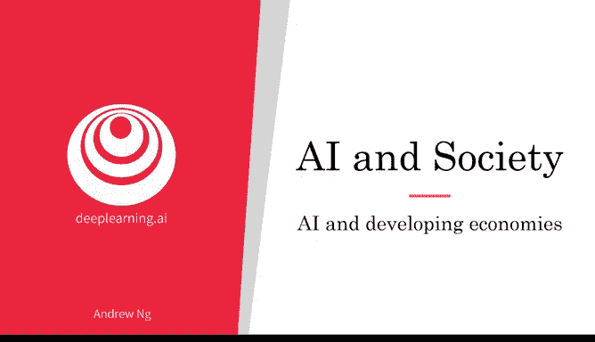
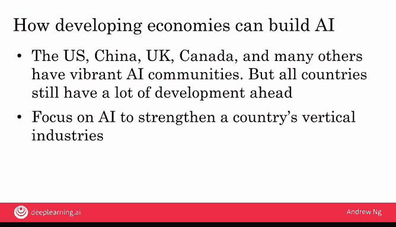

# 033：人工智能与发展中经济体 🌍

在本节课中，我们将探讨人工智能（AI）技术如何影响全球经济发展，特别是对发展中经济体的机遇与挑战。我们将分析AI可能带来的自动化风险，以及发展中经济体如何利用“蛙跳”效应和聚焦垂直行业来抓住AI带来的发展机遇。

---

每次出现重大的技术颠覆，例如人工智能，都为我们提供了重塑世界的机会。人工智能是一项非常先进的技术，同时影响着发达经济体和发展中经济体。那么，我们如何确保在AI创造巨大财富的同时，也能提升所有国家的发展水平？让我们一起来看一看。

许多发展中经济体都成功地执行了一条相当可预测的发展路线图，或者说阶梯，以帮助其公民获得技能并迈向更高水平的财富。

以下是许多国家典型的发展路径：

*   **农业起步**：许多国家从低端农产品开始，出口农作物。
*   **纺织制造**：随后转向低端纺织制造业，例如服装制造。
*   **组件制造**：随着人口开始获得更多财富、健康状况改善，进而转向低端组件制造，例如生产较便宜的塑料零件。
*   **电子与汽车制造**：然后发展到低端电子产品制造、高端电子产品制造，乃至汽车制造等。

通过这种循序渐进的模式，发展中经济体可以帮助其公民获得技能，并逐步发展为发达经济体。

---

上一节我们回顾了传统的发展路径，本节中我们来看看人工智能可能带来的一个问题：这个发展阶梯的许多较低层级特别容易受到人工智能自动化的冲击。

例如，随着工厂或农业变得更加自动化，对这些领域劳动力的需求可能会减少。因此，一些发展中经济体的大量人口可能更难踏上这个经济阶梯的较低层级，而这里原本是他们向上攀登的起点。

所以，如果人工智能通过强大的自动化能力“敲掉”了发展阶梯的一些较低层级，那么我们就有责任探索人工智能是否也能创造一个“蹦床”，帮助一些经济体跳上蹦床，甚至可能更快地弹跳到这个阶梯的更高层级。

---

随着早期技术的兴起，许多经济体已经证明它们可以实现“蛙跳”，跳过发达经济体经历的阶段，直接采用更先进的技术。

例如，在美国，大多数人曾拥有通过电线连接到墙上的固定电话。正因为如此多人拥有固定电话，向无线移动电话的过渡实际上花费了相当长的时间。相比之下，包括印度、中国在内的许多发展中经济体，并没有费力铺设那么多固定电话线，而是直接跳到了**移动电话**。

这是一种蛙跳现象，发展中经济体直接跨越了前一代技术，没有费力为每个家庭铺设实体电缆，而是直接采用了移动电话。

我们在移动支付领域也看到了类似的情况。许多发达经济体拥有成熟的信用卡系统，这实际上减缓了它们采用手机支付的速度。相比之下，一些发展中经济体由于信用卡行业没有根深蒂固的现有体系，反而能更快地拥抱移动支付。

我还看到在线教育在发展中经济体快速普及。在那些尚未建成所需的大量实体学校和大学的国家，许多教育领导者和政府正在寻求更快拥抱在线教育的方式，而一些拥有完善线下教育基础设施的发达经济体，其转变速度可能相对较慢。

当然，发达经济体也在迅速拥抱所有这些技术。发展中经济体的一个优势在于，没有根深蒂固的现有体系，它们在某些领域或许能建设得更快。

---

在人工智能领域，美国目前处于领先地位，紧随其后的是拥有大量AI人才的中国。英国、加拿大、印度、拉丁美洲的许多地方以及其他许多国家也拥有充满活力的人工智能社区。但人工智能仍处于早期发展阶段，因此我认为每个国家仍然拥有大量的机会和增长空间。

我对发展中经济体的建议是：**聚焦人工智能，以加强本国的垂直行业**。

例如，我认为今天大多数国家不应该试图建立自己的网络搜索引擎，因为已经存在非常出色的搜索引擎，那是上一个十年的竞争。相反，如果一个国家在某个垂直行业（比如咖啡豆制造）非常强大，那么这个国家实际上在咖啡制造领域的人工智能应用方面具有独特的优势。为咖啡制造构建人工智能技术，将进一步巩固该国已有的优势。

因此，与其要求每个国家在通用人工智能领域与美国和中国竞争，我建议大多数国家利用人工智能来**加强本国已经擅长并希望在未来发展的领域**。

---

最后，**公私合作伙伴关系**（即政府与企业合作）确实有助于加速垂直行业的人工智能发展。在从医疗保健到自动驾驶汽车等交通运输、再到金融等高度监管的领域，存在我们希望实现的结果和我们不希望出现的结果。

那些深思熟虑、制定正确法规以保护公民，同时又能促进行业采用人工智能解决方案的国家，将看到更快的本地经济增长以及国内更快的技术发展。

此外，发展中经济体应该投资于教育。因为人工智能技术仍然非常不成熟，每个国家都有充足的空间来学习更多关于人工智能的知识，甚至可以建立自己的人工智能人才队伍，并以重要的方式参与到我们正在构建的这个人工智能驱动的世界中。

---

在技术颠覆的时刻，领导力至关重要。在美国，我们曾经信任我们的政府将人类送上月球，并且成功了。随着人工智能的兴起，它创造了一个空间，在某些国家也产生了一种需求，需要政府层面、公司或教育领域的领导者来帮助国家进入人工智能时代，拥抱和采用人工智能，以持续提升其公民的福祉，甚至可能持续提升全球其他地区人们的生活水平。

本节课中，我们一起学习了人工智能与发展中经济体的关系，探讨了自动化风险、蛙跳机遇、垂直行业聚焦以及领导力的重要性。

在本视频中，我们简要触及了人工智能与就业的问题，这是一个当前在许多国家被广泛讨论的重要话题。让我们进入下一个视频，更深入地探讨人工智能与就业。