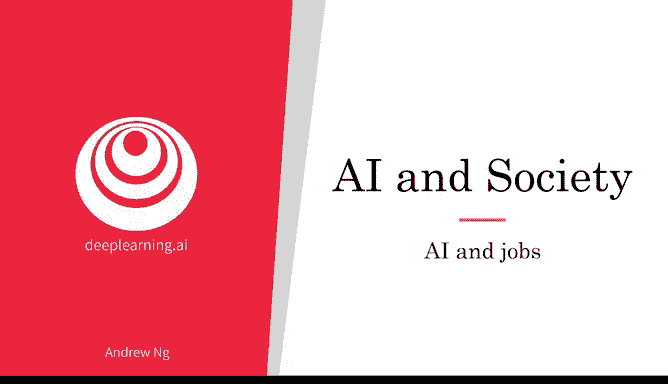
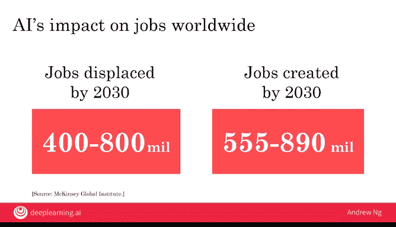
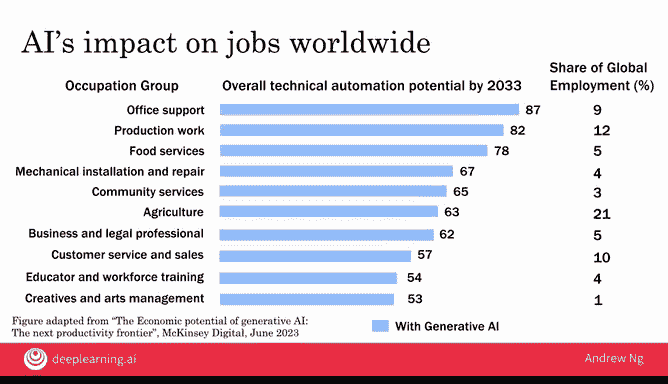
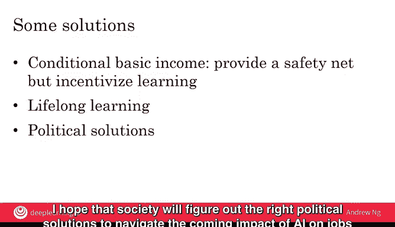

# 034：人工智能与就业市场 📈

在本节课中，我们将探讨人工智能（AI）对就业市场的潜在影响。我们将了解AI如何加速自动化进程，分析相关研究对未来工作岗位变化的预测，并讨论社会和个人可以如何应对这些变化。

---

## AI是自动化的加速器 ⚙️

在当代AI兴起之前，自动化已经对许多工作岗位产生了巨大影响。随着AI的崛起，我们现在能够自动化的任务范围突然比以往大得多，因此这也对就业产生了加速影响。

## 就业岗位的增减预测 📊

有多少工作岗位会被取代？又会创造多少新工作？目前还没有人能给出确切的答案。但我们可以通过一些研究来尝试理解未来的趋势。

麦肯锡全球研究所估计，到2030年，将有**4亿至8亿**个工作岗位因AI自动化而消失。这些数字非常庞大。然而，同一份报告也估计，AI创造的工作岗位数量可能更多。其他研究给出的数字略有不同，例如高盛的一项研究估计，到2033年将有**3亿**个工作岗位消失，低于麦肯锡的估计。

因此，关于AI对就业的影响仍存在相当大的不确定性，尽管大多数人认为其影响将是重大的。但令人鼓舞的是，许多研究估计，未来创造的工作岗位数量很可能超过被取代的数量。这意味着未来人们仍将有大量工作可做，尽管在某些行业，对工人进行再培训的需求可能会非常显著。

我认为，未来的许多工作岗位甚至可能还没有名称，例如无人机交通优化师、3D打印服装设计师，或者在医疗保健领域，可能会出现基于DNA的定制药物设计师。因此，尽管存在对AI取代工作岗位的担忧，但也有对未来创造许多新工作岗位，甚至更多新工作岗位的希望。

## 如何评估岗位被取代的风险？ 🔍

你可能会好奇，我们如何估计有多少工作岗位可能被取代？这些研究通常采用的一种方法是：分析一个工作岗位，思考构成该工作的各项任务。

例如，你可以分析放射科医生执行的任务，或者出租车司机执行的所有任务。然后，针对每项任务，评估其通过AI实现自动化的难易程度。如果一个工作主要由高度可自动化的任务组成，那么该工作被取代的风险就会更高。

大多数AI工程师发现，将AI视为应用于**任务**而非应用于**人的工作**更有用。但这个框架允许我们利用AI自动化任务的能力，来估计可能有多少工作岗位被取代。

## 最可能和最不可能被AI取代的工作 📉

那么，哪些工作最可能或最不可能被AI和自动化取代呢？麦肯锡研究了AI（包括生成式AI工具）对广泛工作岗位的影响。

下图改编自其研究数据，展示了到2033年**自动化潜力最高的10类工作**。每个条形图右侧的数字（如87或82）是对该工作中可能被自动化的任务所占百分比的估计。

这份列表涵盖了麦肯锡所称的多种职业类别，包括办公室工作、机械安装与维修、商业与法律专业工作以及客户服务和销售。

这里值得注意的是，**生成式AI**对当前可由AI自动化的工种类型产生了巨大影响。这些工具能够生成类似人类的文本、撰写富有同理心的电子邮件以及与人类聊天，这使得一些以前不易受自动化影响的新类别工作也暴露在AI自动化的风险之下。

事实上，如果你观察在没有生成式AI工具的情况下这些工作的自动化潜力，会发现涉及写作和沟通风格（如办公室支持和法律工作）的职业，其AI自动化潜力显著增加。

右侧列中的数字显示了每个职业类别在全球劳动力中的就业比例。这前10大职业类别总共雇用了全球**超过70%** 的工人，这是一个巨大的人群。

## 如何应对AI对就业的影响？ 🛡️

我们如何帮助公民和国家应对即将到来的AI对就业的影响？以下是一些可能的解决方案。

上一节我们了解了AI对就业的潜在冲击，本节中我们来看看社会和个人可以采取哪些应对策略。以下是几种可能的途径：

**第一，有条件基本收入。**
你可能听说过**全民基本收入**，即政府无条件向公民支付款项。我认为人们确实需要一个安全网。对于那些失业但有能力学习的人，我认为一个更有效的版本可能是**有条件基本收入**。我们提供安全网，但通过建立一个帮助人们学习的体系，激励他们持续学习并投资于自身发展。这将增加这些人重新进入劳动力市场、为自己、家庭、社会以及为支付这一切的税基做出贡献的几率。

**第二，建设终身学习型社会。**
通过你现在正在学习这门课程，你可能已经成为这个终身学习型社会的一部分。旧的“上大学四年，然后工作四十年”的教育模式在当今快速变化的世界中已经不再适用。通过政府、公司和个人都认识到我们需要持续学习，这增加了每个人都能更好地定位自己的几率，即使工作岗位可能消失，也能利用未来创造的新工作机会。我认为，即使在完成大学学业后，大多数人也应该在整个生命周期中持续学习。

**第三，探索政治解决方案。**
从激励或帮助创造新工作，到立法确保人们受到公平对待，各种方案都在探索中。我希望社会能够找到正确的政治解决方案，以应对即将到来的AI对就业的影响。

## 如果你想从事AI工作，应该怎么做？ 🧑‍💻

有时人们会问：如果你想从事AI工作，应该怎么做？最近，一位处于职业生涯初期的放射科住院医师问我：“Andrew，我听到很多关于AI即将对放射学产生影响的消息。我应该放弃我的专业，去学习AI并转而从事AI工作吗？”

我对他的回答是：“不，你可以那样做。你确实可以放弃你正在做的事情，从头开始学习AI。这完全有可能，很多人已经做到了。但是，你可以考虑另一种选择。”

我对这位放射科住院医师说：“考虑从事 **‘AI + 放射学’** 领域的工作。凭借你对放射学的了解，如果你再学习一些AI知识，你将比大多数人更有能力在放射学与AI的交叉领域开展工作。”

因此，如果你想在AI领域做更多工作，在当今世界，完全可以通过在线课程和其他资源从头学习AI。但是，如果你结合自己已有的专业知识，学习一些AI，从事 **‘你的领域 + AI’** 的工作，那么通过将AI应用到你已经是专家的领域，你可能会具备更独特的资格，从事非常有价值的工作。

---

## 总结 📝

本节课中，我们一起学习了AI作为自动化加速器对就业市场的深远影响。我们分析了不同研究对未来工作岗位数量变化的预测，认识到尽管存在不确定性，但创造新岗位的潜力同样巨大。我们探讨了评估岗位被取代风险的方法，并了解了最易受自动化影响的职业类别。最后，我们讨论了社会层面的应对策略（如有条件基本收入、终身学习）以及个人职业发展建议（结合自身专业与AI），以更好地应对AI时代带来的挑战与机遇。