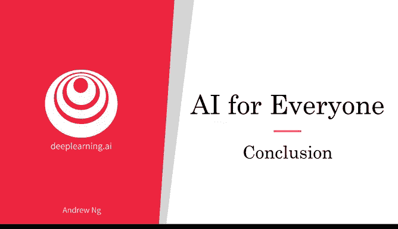
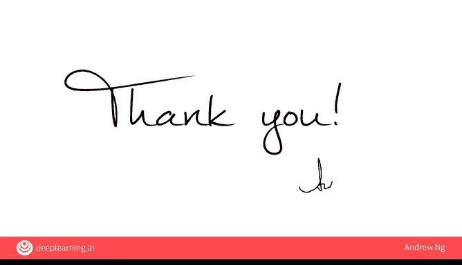
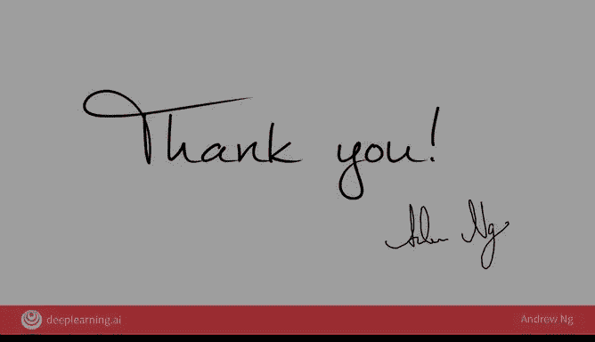

# 035：课程总结 🎓

在本节课中，我们将对《AI for Everyone》课程的全部内容进行总结，回顾过去四周所学的核心知识，并展望未来的学习方向。

恭喜你完成本课程的最后一个视频。人工智能是一项超能力，理解它能让你做到世界上只有极少数人才能做到的事情。

让我们来总结一下你在本课程中学到的内容。

## 第一周：人工智能技术基础

在第一周，你学习了人工智能技术的基础知识。你了解了什么是人工智能，什么是机器学习。核心概念是**监督学习**，即学习从输入到输出（A到B）的映射关系。你还了解了什么是数据科学，以及数据如何为所有这些技术提供支持。重要的是，你也看到了人工智能能做什么和不能做什么的具体例子。

## 第二周：构建人工智能项目

在上一节我们介绍了人工智能的技术基础，本节中我们来看看如何构建一个人工智能项目。在第二周，你学习了构建人工智能项目的实际流程。你看到了机器学习项目的工作流，包括收集数据、构建系统和部署系统。你也了解了数据科学项目的工作流。此外，你还学习了如何进行技术尽职调查以确保项目的可行性，以及在承诺开展具体的人工智能项目之前，如何进行商业尽职调查以确保项目的价值。

## 第三周：人工智能与公司战略

了解了单个项目的构建后，我们需要将其置于更广阔的背景下。在第三周，你学习了如何将此类人工智能项目融入你公司的整体战略中。你看到了复杂人工智能产品的例子，例如智能音箱和自动驾驶汽车。你还了解了大型人工智能团队中的角色与职责。并且，你学习了人工智能转型手册，这是一个帮助公司成为优秀人工智能公司的五步行动指南。我希望前三周的材料能帮助你构思人工智能项目，或思考如何在你的公司或组织中应用人工智能。

## 第四周：人工智能与社会

在最后一周，你将视野从组织内部扩展到了整个社会。在第四周，你学习了人工智能与社会的关系。你看到了人工智能除技术限制外的一些局限性，也了解了人工智能如何影响发展中的经济体和全球就业。

## 持续学习与未来展望

在这四周里，你学到了很多。但人工智能是一个复杂的主题，因此我希望你能继续学习，无论是通过Coursera或DeepLearning.AI的额外在线课程、书籍、博客，还是仅仅通过与朋友交流。如果你想尝试构建人工智能技术，现在比以往任何时候都更容易学习编程并通过这些资源学习如何实现人工智能技术。如果你想持续接收关于人工智能的信息，你也可以访问DeepLearning.AI网站并注册邮件列表，我将偶尔通过该邮件列表向你发送有关人工智能的有用信息。

## 总结与致谢

恭喜你完成本课程！现在，你对人工智能的理解和为人工智能崛起做规划的能力，已经显著领先于许多大公司的首席执行官。因此，我希望你也能为其他试图应对这些问题的人提供领导力。😊

最后，我想对你说，非常感谢你选修这门课程。我知道你忙于自己的工作、学业、朋友和家人，我非常感激你花费这么多时间与我一起学习这些涉及人工智能技术及其影响的复杂问题。非常感谢你为本课程付出的时间和努力。😊

---

本节课中我们一起回顾了《AI for Everyone》课程的核心内容，从技术基础、项目实践、公司战略到社会影响，构建了对人工智能的全面认知。希望这门课程能成为你探索AI世界的坚实起点。