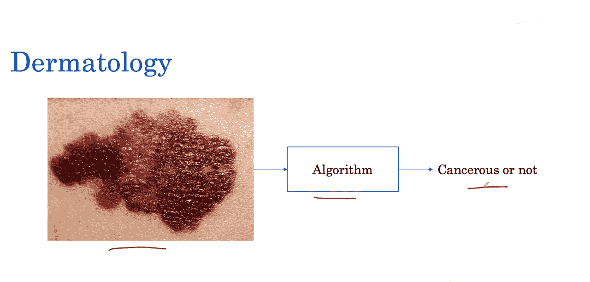
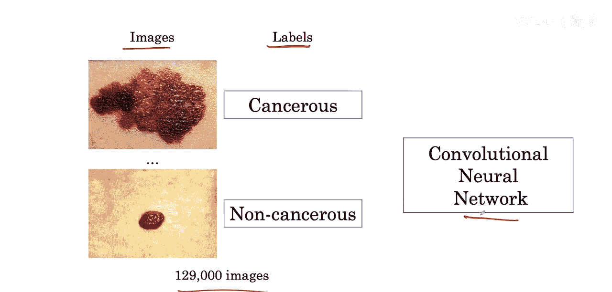
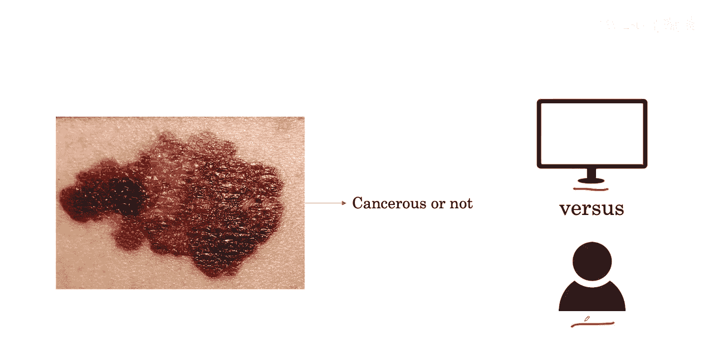
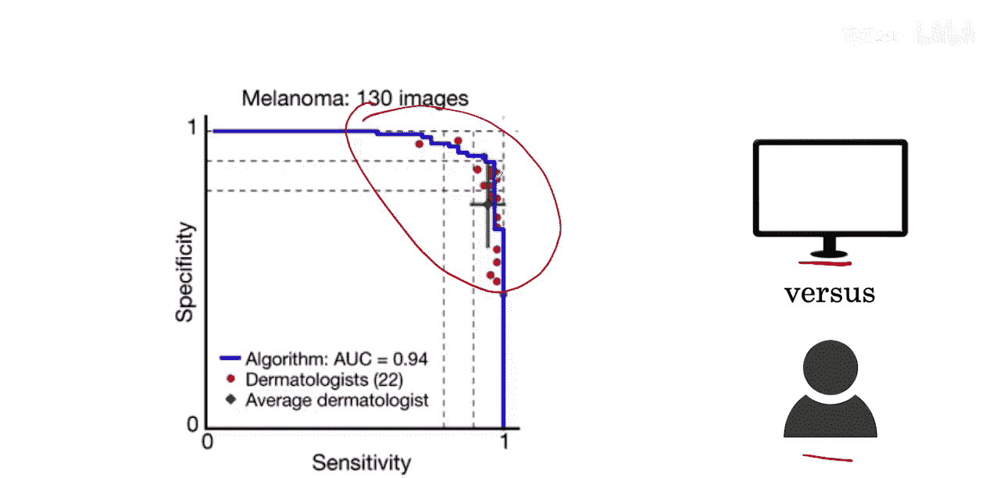

#  004：医学影像诊断 🏥

在本节课中，我们将直接深入探讨如何构建一个用于胸部X光分类的深度学习模型。通过这个例子，你将学到的许多概念广泛适用于各种医学影像任务。

## 概述 📋

本周，我们将首先了解三个医学诊断任务的例子，在这些领域，深度学习已经取得了令人瞩目的成就。接着，我们将深入探讨构建医学影像AI模型的训练流程。最后，我们将学习在真实数据上评估这些模型性能的测试流程。

## 医学影像诊断实例

上一节我们介绍了本周的学习目标，本节中我们来看看深度学习在医学影像领域的具体应用实例。

### 实例一：皮肤病学 🩺

皮肤病学是处理皮肤相关问题的医学分支。皮肤科医生的一项任务是观察皮肤的可疑区域，以判断一颗痣是否是皮肤癌。早期检测可能对皮肤癌的治疗结果产生巨大影响。例如，一种皮肤癌如果在晚期才被发现，其五年生存率会显著下降。

在这项研究中，一个算法被训练用于判断皮肤组织区域是否癌变。

以下是该算法的训练与评估过程：

*   **训练过程**：使用数十万张带有标签的图像作为输入，可以训练一个卷积神经网络来完成此任务。我们将在课程中详细探讨此类算法的训练。
    
*   **评估过程**：算法训练完成后，可以在新的一组图像上，将其预测结果与人类皮肤科医生的预测结果进行比较评估。
    

研究发现，该算法的表现与皮肤科医生相当。目前无需过多解读下图，在后续课程中，我们将学习如何使用此类曲线进行评估。你现在可以从该图表得出的主要结论是：算法的预测准确性与人类皮肤科医生的预测具有可比性。

## 总结 🎯

本节课我们一起学习了医学影像诊断的概述，并通过皮肤病学诊断的例子，初步了解了深度学习模型从训练到评估的基本流程。在接下来的课程中，我们将继续深入探讨其他医学影像任务以及模型构建的具体细节。