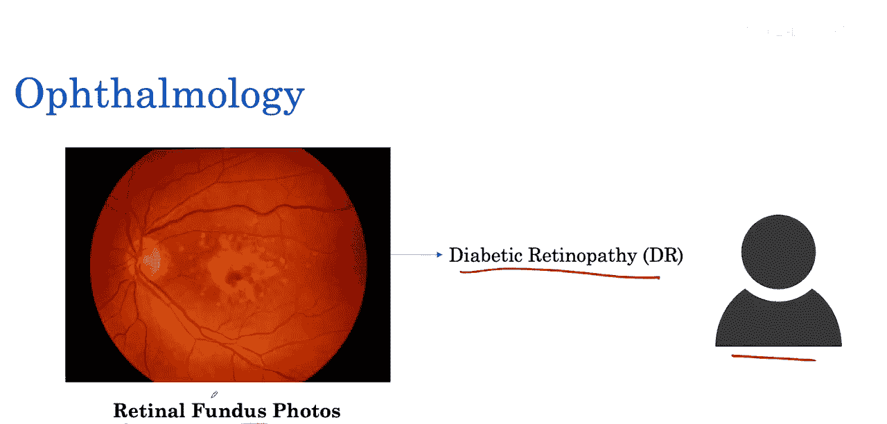
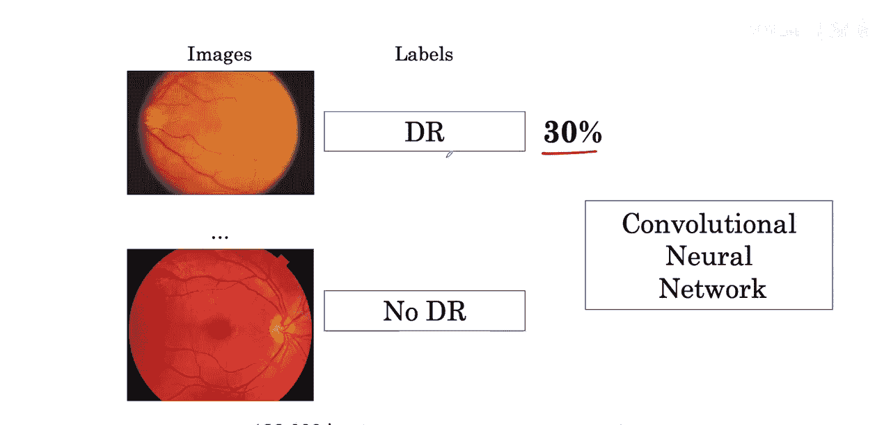
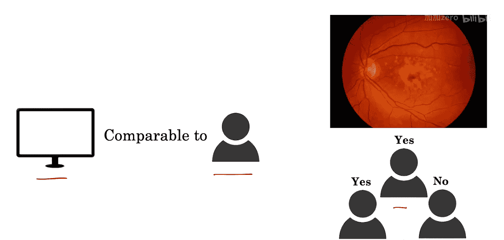
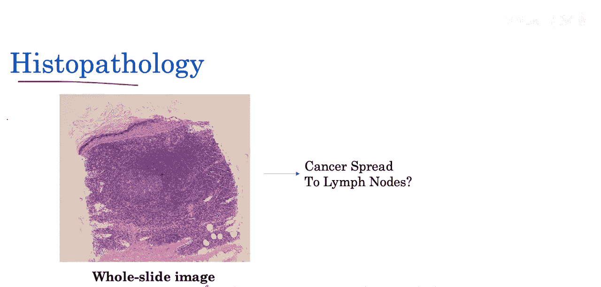

#  005：眼部疾病与癌症诊断 👁️🔬

在本节课中，我们将学习人工智能在眼科和病理学诊断中的具体应用案例。我们将探讨如何利用深度学习算法分析视网膜图像以诊断糖尿病视网膜病变，以及如何分析组织病理学图像来辅助癌症诊断。这些案例展示了AI如何应对医学数据中的常见挑战，如数据不平衡问题。

## 眼科诊断案例 👁️

上一节我们介绍了AI在医学影像分析中的潜力，本节中我们来看看一个具体的眼科应用实例。

我们的第二个例子是眼科学领域，它涉及眼部疾病的诊断与治疗。2016年一项著名的研究关注了视网膜眼底图像。这些图像拍摄的是眼睛的后部。这里要关注的一种疾病或病理是糖尿病视网膜病变。它是由糖尿病引起的视网膜损伤，是导致失明的主要原因。目前，检测糖尿病视网膜病变是一个耗时且需要人工操作的过程，需要训练有素的临床医生检查这些照片。

在这项研究中，研究人员开发了一种算法，通过观察此类照片来判断患者是否患有糖尿病视网膜病变。

这项研究使用了超过128,000张图像，其中只有30%的图像显示有糖尿病视网膜病变。我们将探讨这种数据不平衡问题，该问题在医学和许多其他领域的真实世界数据中非常突出，并且我们将了解一些应对这一挑战的方法。

与之前的研究类似，这项研究表明，最终算法的性能与眼科医生相当。在该研究中，使用了多位眼科医生的多数投票来设定参考标准或金标准。金标准是一组专家对正确答案的最佳猜测。在本周晚些时候的课程中，我们将探讨在此类医学AI研究中如何设定金标准。

## 组织病理学诊断案例 🔬

在了解了AI在眼科的应用后，我们接下来看看它在另一个关键医学领域——病理学中的作用。

我们的第三个例子是组织病理学领域，这是一个涉及在显微镜下检查组织的医学专业。病理学家的一项任务是观察称为全切片图像的组织扫描显微图像。

以下是病理学家在全切片图像中执行的一些关键任务：
*   **检测**：识别图像中是否存在癌细胞。
*   **分割**：勾勒出癌变区域的精确边界。
*   **分类**：确定癌症的类型或亚型。

## 总结 📝

本节课中我们一起学习了AI在诊断眼部疾病（如糖尿病视网膜病变）和组织病理学图像分析中的实际应用。我们看到了深度学习算法如何利用大量图像数据达到与专家相当的性能水平，同时也认识了医学AI开发中需要解决的数据不平衡等现实挑战。这些案例清晰地展示了人工智能作为强大工具，在辅助医生进行更高效、准确诊断方面的巨大潜力。