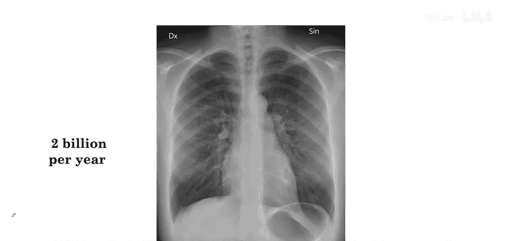
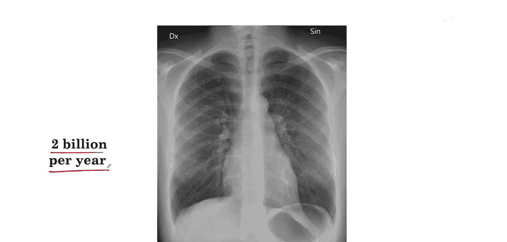
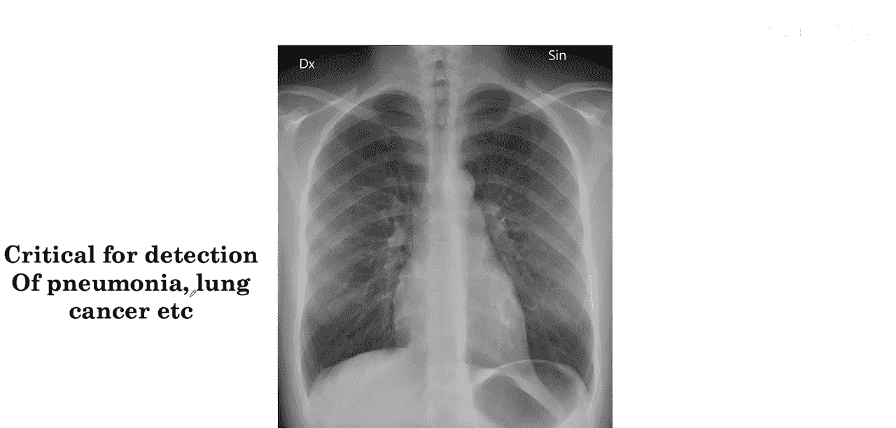
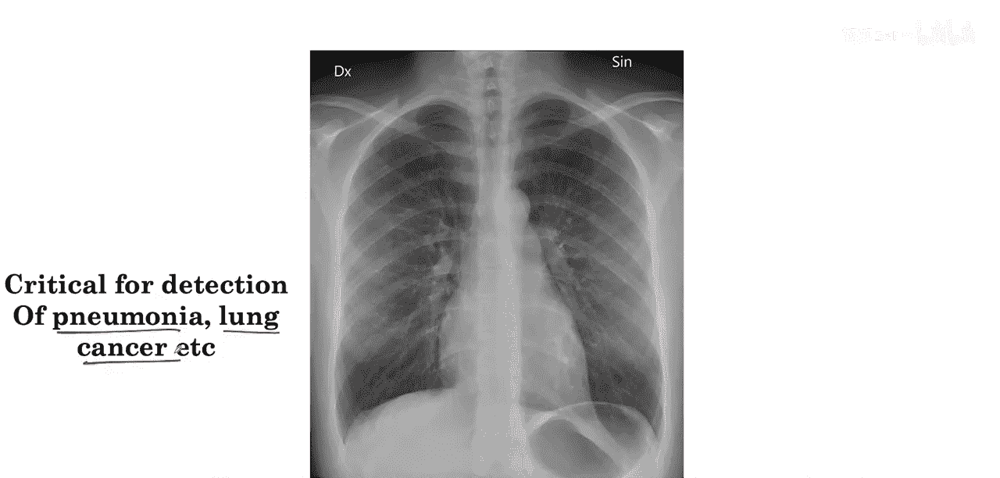
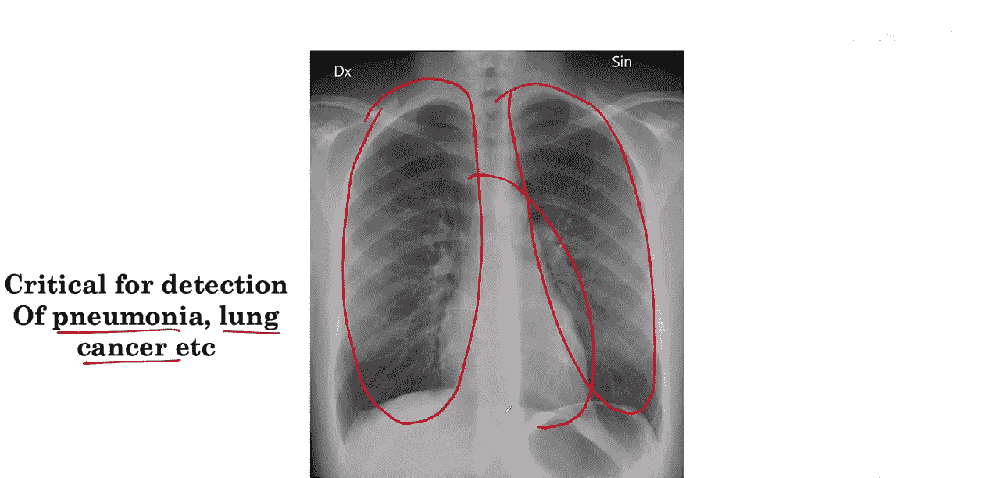
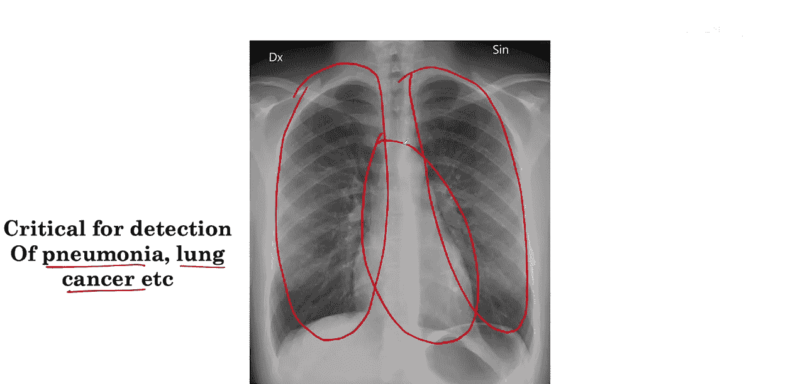

#  006：构建并训练医学诊断模型 🏥

在本节课中，我们将学习如何构建一个用于医学影像分析的深度学习模型。具体来说，我们将探讨如何利用胸部X光片，通过单一模型来检测多种疾病。我们将逐步讲解训练胸部X光片解读模型的过程，并分析在此过程中可能遇到的关键挑战及其应对策略。

## 胸部X光片解读任务

上一节我们了解了深度学习在医学影像分类中的前沿应用。本节中，我们来看看具体的胸部X光片解读任务。

胸部X光片是医学中最常见的诊断成像程序之一，全球每年大约进行20亿次胸部X光检查。

胸部X光片解读对于检测多种疾病至关重要，包括每年影响全球数百万人的肺炎和肺癌。

一位经过培训的放射科医生在解读胸部X光片时，会观察肺部、心脏以及其他区域，寻找可能提示患者患有肺炎、肺癌或其他病症的线索。

## 识别异常：以肿块为例

为了理解算法如何学习，我们先来看一种具体的异常情况：肿块。我们不先定义肿块是什么，而是直接观察图像。

以下是三张包含肿块的胸部X光片和三张正常的胸部X光片。

现在，展示一张新的胸部X光片，请你判断其中是否存在肿块。

你或许能正确识别出这张X光片包含肿块。图中所示的肿块，其外观可能与你之前看到的异常图像相似，而与正常图像不同。

你刚才的学习方式，与我们接下来要教算法检测肿块的方式非常相似。

作为参考，肿块的定义是：在胸部X光片上可见的、直径大于三厘米的病变或组织损伤。

接下来，我们将探讨如何训练我们的算法来识别肿块。