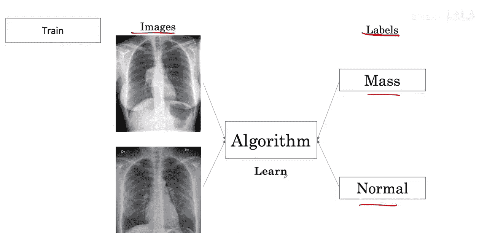
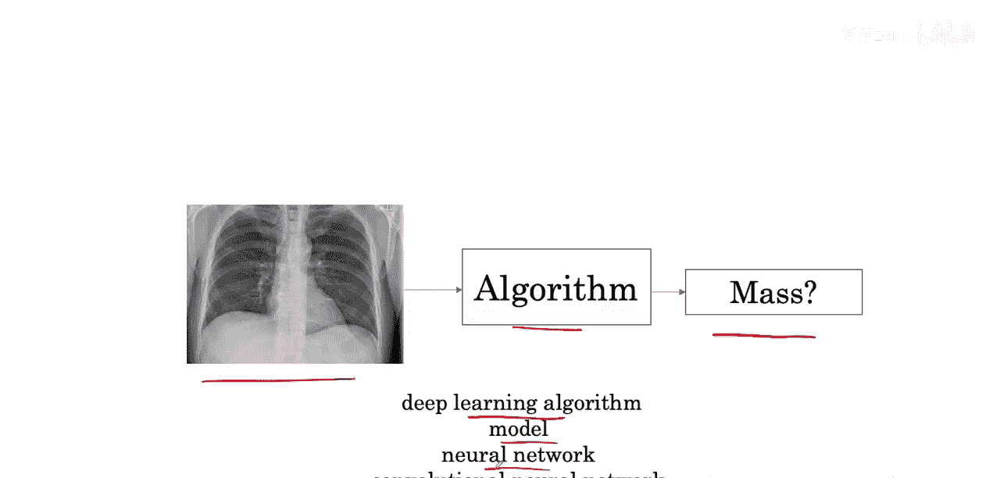
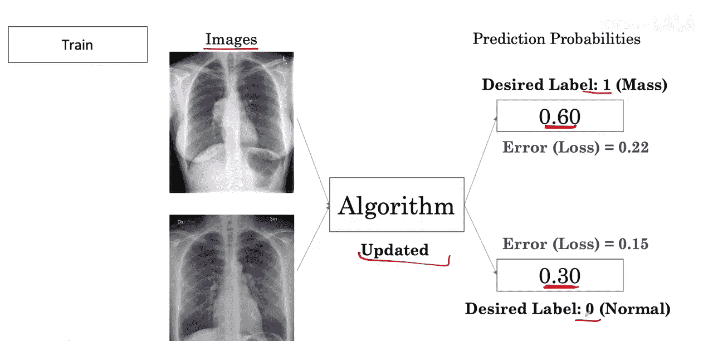

#  007：训练、预测与损失

在本节课中，我们将学习人工智能算法在医学影像诊断中的核心工作流程：如何通过训练学习，如何对新图像进行预测，以及如何通过损失函数来衡量和修正预测的误差。

## 训练过程

上一节我们了解了数据标注的重要性。本节中，我们来看看算法如何利用这些标注数据进行学习。

在训练过程中，算法会观察大量带有标签的胸部X光片。这些标签指明了图像中是否包含肿块。

算法通过学习这些图像及其对应的标签来获取知识。

最终，算法学会从输入的X光图像，生成一个关于图像是否包含肿块的输出。

这个算法可以有多种不同的名称。你可能听说过深度学习算法、模型、神经网络或卷积神经网络等术语。

## 预测与输出

算法以“分数”的形式产生输出。这些分数是图像包含肿块的预测概率。

例如，算法可能输出某张图像包含肿块的概率为 **0.48**，而另一张图像的概率为 **0.51**。

在训练刚开始时，这些概率输出与期望的标签并不匹配。

假设“有肿块”的期望标签是 **1**，“正常”的期望标签是 **0**。可以看到，0.48 与 1 相差甚远，0.51 也与期望的标签 0 相差甚远。

## 损失函数

我们可以通过计算一个损失函数来衡量这种误差。

损失函数用于度量我们的输出概率与期望标签之间的误差。我们很快就会看到这个损失是如何计算的。

随后，一组新的图像和期望标签会呈现给算法。随着时间推移，算法学习产生更接近期望标签的分数。

注意观察，这个输出概率如何逐渐接近 1，而另一个输出概率如何逐渐接近 0。

## 核心概念总结

以下是本课涉及的核心概念：

*   **训练**：算法通过观察带标签的 `(图像, 标签)` 对来学习模式。
*   **预测/输出**：对于新图像，算法输出一个概率分数，公式可表示为 `P(肿块|图像)`。
*   **损失函数**：这是一个衡量预测输出 `y_pred` 与真实标签 `y_true` 之间差异的函数，例如二元交叉熵损失：`Loss = -[y_true * log(y_pred) + (1 - y_true) * log(1 - y_pred)]`。

## 课程总结

本节课中，我们一起学习了AI医学诊断模型的基本训练流程。我们了解到，算法通过反复查看标注数据来学习，其输出是表示可能性的概率分数。在训练初期，这些预测往往不准确，而损失函数则像一把尺子，量化了预测的错误程度，并指导算法在后续的学习中不断调整，使预测结果越来越接近真实情况。