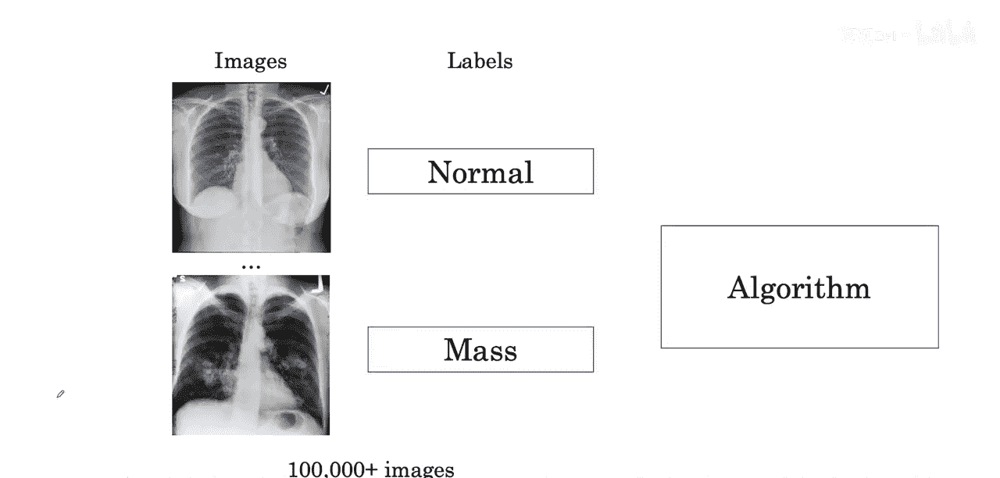
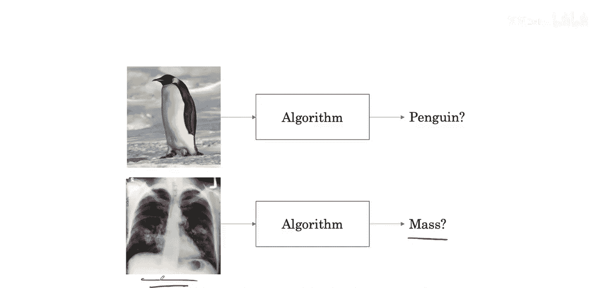
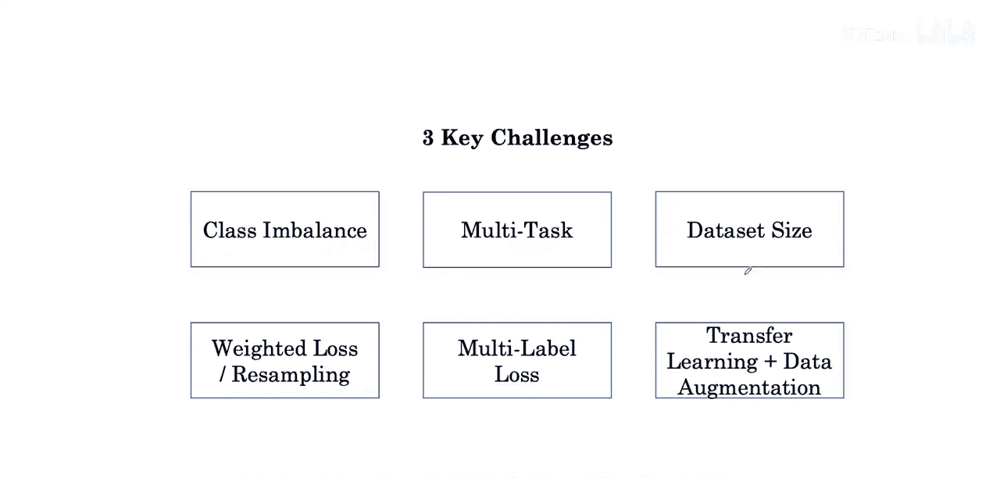
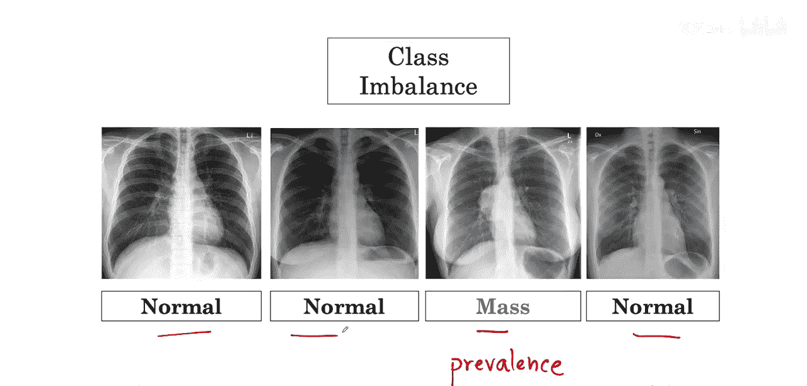

AI 医学诊断：P8：图像分类与类别不平衡

在本节课中，我们将学习医学图像分类任务，并探讨训练此类算法时面临的核心挑战之一：类别不平衡。我们将了解其成因，并学习应对此挑战的关键技术。

---

在之前的视频中，我们看到的医学AI示例通常涉及向算法展示数十万张图像。

这是图像分类的典型设置。图像分类是计算机视觉领域的核心任务，其流程是：输入一张自然图像，图像分类算法会输出图像中包含的物体是什么。你可能见过能够完成此任务的深度学习算法。

我们的胸部X光分类示例在许多方面与这种图像分类设置相似。

然而，存在一些额外的挑战，使得训练医学图像分类算法更具难度。我们接下来将介绍这些挑战。

我们将讨论在医学图像上训练算法面临的三个关键挑战：类别不平衡挑战、多任务挑战和数据集规模挑战。

针对每个挑战，我们将介绍一到两种应对技术。

---

上一节我们概述了医学图像分类面临的三大挑战。本节中，我们首先深入探讨类别不平衡挑战。

以下是类别不平衡挑战的具体描述。

在医学数据集中，非疾病（正常）样本和疾病样本的数量并不相等。这反映了疾病在现实世界中的患病率或频率。

在现实中，尤其是在对健康人群进行X光检查时，正常样本的数量远多于肿块样本。

在医学数据集中，你可能会看到正常样本的数量是肿块样本的**一百倍**之多。

---

本节课中，我们一起学习了医学图像分类的基本框架，并重点探讨了类别不平衡这一核心挑战。我们了解到，由于疾病在真实世界中的低患病率，医学数据集中正常样本的数量可能远多于疾病样本，这给模型训练带来了困难。在后续课程中，我们将继续学习应对多任务挑战和数据集规模挑战的方法。