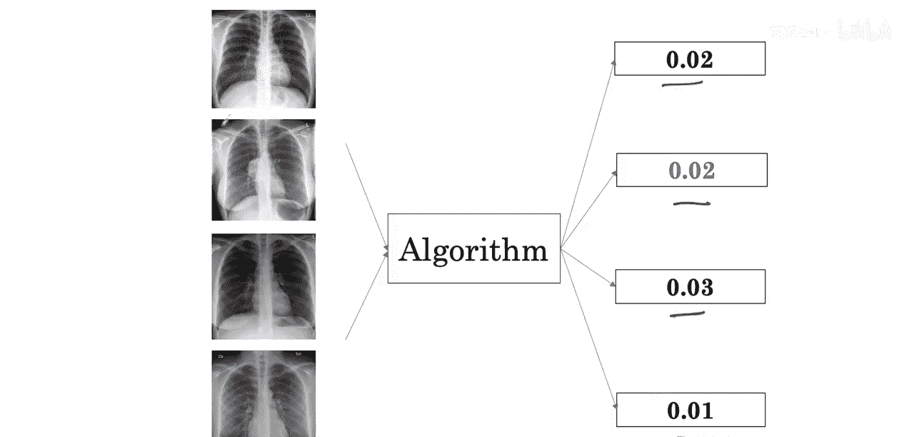
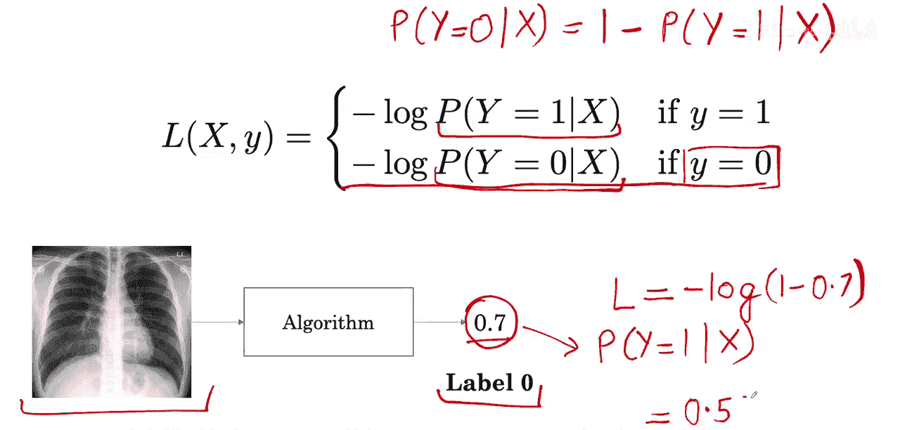

#  009：二元交叉熵损失函数

在本节课中，我们将要学习二元交叉熵损失函数，并探讨其在处理类别不平衡数据时可能遇到的问题及其解决方案。

## 问题引入：类别不平衡的影响

上一节我们介绍了医学诊断中常见的类别不平衡问题。当训练数据中大多数样本都是正常（阴性）时，这会为学习算法带来一个难题。

这会导致模型开始为所有样本预测一个非常低的患病概率，从而无法有效识别出真正患病的样本。

## 损失函数分析

让我们看看如何将这个问题追溯到我们用于训练算法的损失函数。我们也将了解在存在不平衡数据时，如何修改这个损失函数。

### 二元交叉熵损失函数

这个损失函数被称为**二元交叉熵损失**。它用于衡量一个输出值在0到1之间的分类模型的性能。

以下是其数学公式：

**公式：**
`L = -[y * log(p) + (1 - y) * log(1 - p)]`
其中：
*   `y` 是真实标签（0或1）。
*   `p` 是模型预测该样本属于类别1的概率。

### 损失计算示例

让我们通过例子来看看这个损失函数是如何计算的。

**示例一：患病样本（阳性）**

假设我们有一个胸部X光片，其中包含肿块，因此其标签 `y = 1`。算法预测其患病的概率 `p = 0.2`。

以下是计算过程：
*   由于标签 `y = 1`，我们使用公式中的第一项 `-log(p)`。
*   损失 `L = -log(0.2) ≈ 0.70`。

因此，算法在这个特定样本上获得的损失约为0.70。

**示例二：健康样本（阴性）**

现在看一个非肿块的样本，其标签 `y = 0`。算法预测其患病的概率 `p = 0.7`。

以下是计算过程：
*   由于标签 `y = 0`，我们使用公式中的第二项 `-log(1-p)`。
*   首先计算 `1 - p = 1 - 0.7 = 0.3`。
*   损失 `L = -log(0.3) ≈ 0.52`。

因此，算法在这个健康样本上获得的损失约为0.52。

## 总结

本节课中我们一起学习了二元交叉熵损失函数。我们了解了其数学定义，并通过具体示例演示了如何为阳性和阴性样本计算损失。在下一节中，我们将基于此理解，探讨如何针对类别不平衡问题调整损失函数，以帮助模型更好地学习识别少数类（患病）样本。