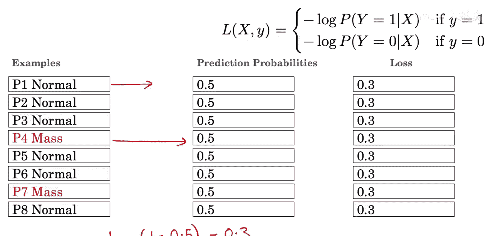
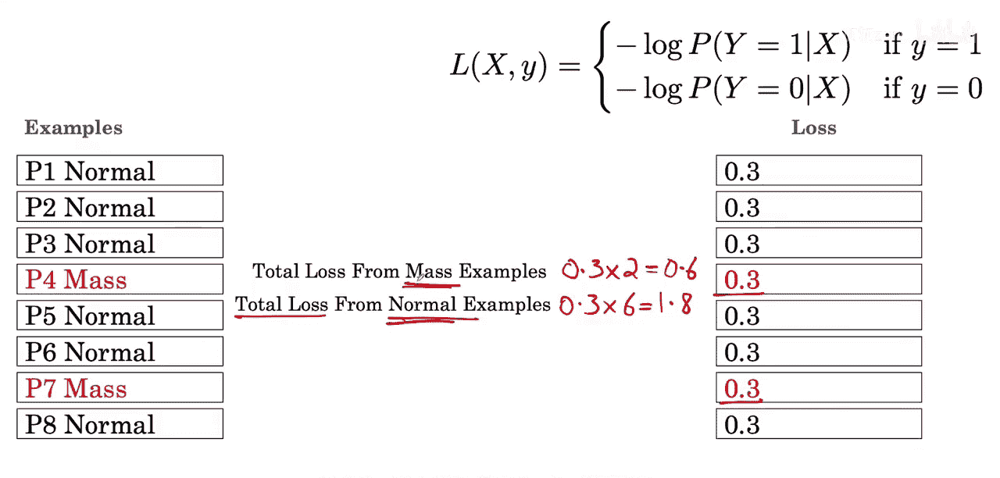
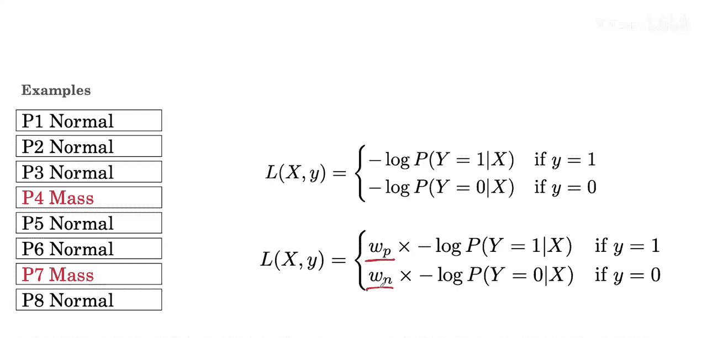
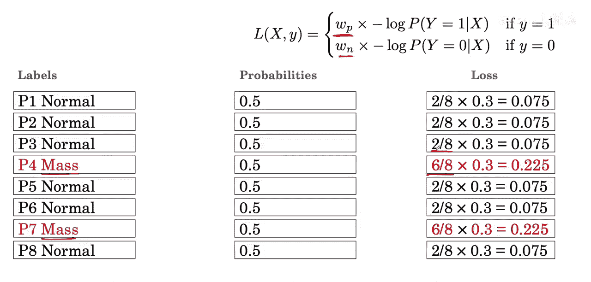
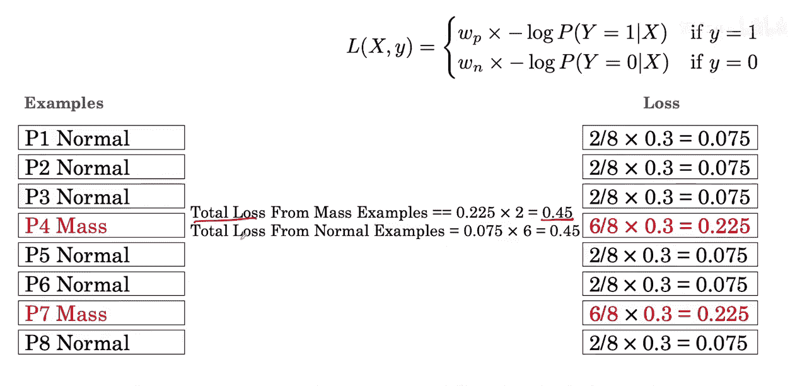
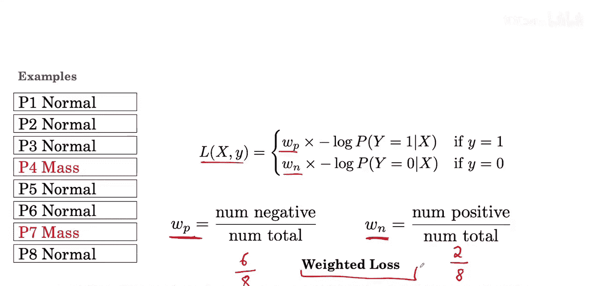

#  010：类别不平衡对损失计算的影响 📊

在本节课中，我们将要学习类别不平衡问题如何影响模型训练中的损失计算，并探讨一种名为“加权损失”的解决方案。

我们已经了解了损失如何应用于单个样本。本节中我们来看看它如何应用于一批样本。这里我们有六个正常样本和两个肿块样本。

请注意，这里的P2、P3、P4是患者ID。在训练尚未开始时，假设算法为所有样本输出的概率均为0.5。

随后可以计算每个样本的损失。对于一个正常样本，我们将使用 `-log(1 - 0.5)`，计算结果为0.3。对于一个肿块样本，我们将使用 `-log(0.5)`，计算结果同样为0.3。

肿块样本对总损失的贡献为 `0.3 * 2 = 0.6`。而正常样本对总损失的贡献为 `0.3 * 6 = 1.8`。因此可以注意到，损失的主要贡献来自于正常样本，而非肿块样本。

所以，算法在优化更新时，会侧重于正确分类正常样本，而相对较少地关注肿块样本。在实践中，这无法产生一个性能良好的分类器。这就是类别不平衡问题。

解决类别不平衡问题的方法是修改损失函数，为正常类和肿块类分配不同的权重。`W_P` 是我们分配给阳性（肿块）样本的权重，`W_N` 是分配给阴性（正常）样本的权重。

接下来，我们看看当赋予阳性样本更高权重时会发生什么。我们希望更重视肿块样本，使它们对总损失的贡献能与正常样本相当。

以下是权重的选择方法：
*   我们选择 `6/8` 作为肿块样本的权重。
*   我们选择 `2/8` 作为正常样本的权重。

😊

然后你可以看到，如果汇总肿块样本的总损失，我们得到0.45，这等于此处正常样本的总损失。

在一般情况下，分配给阳性类的权重将是 **阴性样本数量 / 总样本数量**。在我们的案例中，即 `6个正常样本 / 8个总样本`。

分配给阴性类的权重将是 **阳性样本数量 / 总样本数量**，即 `2 / 8`。

通过这样设置 `W_P` 和 `W_N`，我们可以使所有样本中，来自阳性类和阴性类的损失贡献相同。这就是使用权重修改损失的核心思想，这种方法被称为 **加权损失**，用于解决类别不平衡问题。

---

本节课中我们一起学习了类别不平衡如何导致模型在训练时忽略少数类，并通过引入**加权损失**的方法，调整不同类别样本在损失计算中的权重，从而让模型能够平等地学习所有类别。核心公式是：**阳性类权重 = 阴性样本数 / 总样本数**，**阴性类权重 = 阳性样本数 / 总样本数**。