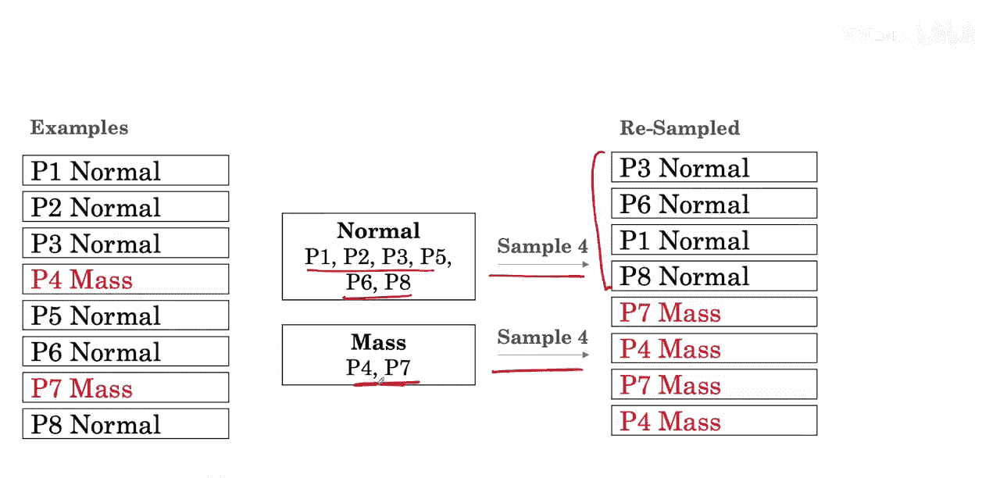
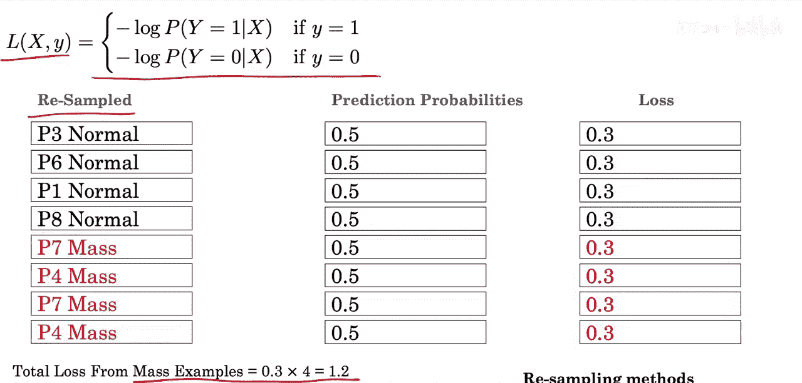

AI 医学诊断：P11：重采样实现类别平衡 🧬

在本节课中，我们将学习另一种处理类别不平衡问题的方法：**重采样**。我们将探讨其基本思想、具体实现步骤，并了解其如何影响模型训练。

---

上一节我们介绍了通过加权损失函数来处理类别不平衡。本节中，我们来看看另一种直观的方法——重采样。

重采样的核心思想是：通过调整训练数据集的构成，使得**正常**（阴性）样本和**肿块**（阳性）样本的数量在训练时达到平衡。

以下是重采样的具体实现步骤：

首先，我们将数据集中的样本按类别分组。假设正常组有6个样本，肿块组有2个样本。

接着，我们从这两个组中进行采样，目标是构建一个包含等量正负样本的新数据集。具体做法是：从肿块（阳性）类中抽取一半样本，从正常（阴性）类中也抽取一半样本。

这意味着，在新的数据集中：
*   我们可能无法包含所有的正常类样本。
*   我们可能会对肿块类样本进行**重复采样**，即同一个样本可能出现多次。

使用这个重采样后的平衡数据集，如果我们像之前一样计算损失函数（标准的二元交叉熵损失），可以看到，即使不使用任何权重，肿块样本和正常样本对总损失的贡献也是相等的。

---

重采样方法有多种变体，例如对多数类（正常类）进行**欠采样**，或对少数类（肿块类）进行**过采样**。这些方法都属于**重采样技术**的范畴，是解决数据不平衡问题的有效工具。

---

本节课中，我们一起学习了**重采样**技术。我们了解到，通过从原始不平衡数据中构建一个类别平衡的训练集，可以让模型在训练时平等地看待不同类别的样本，从而有效应对类别不平衡带来的挑战。