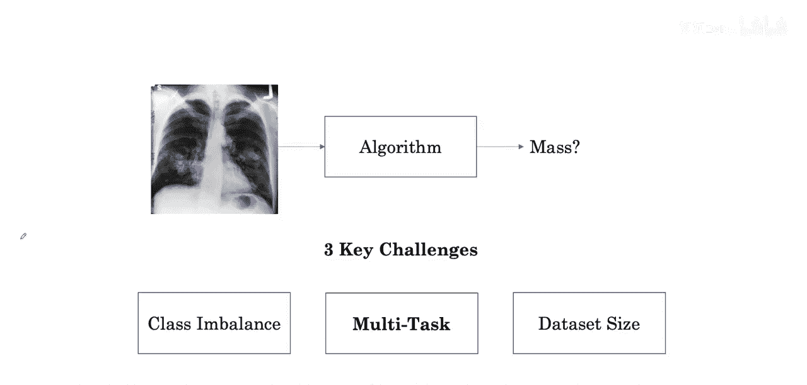
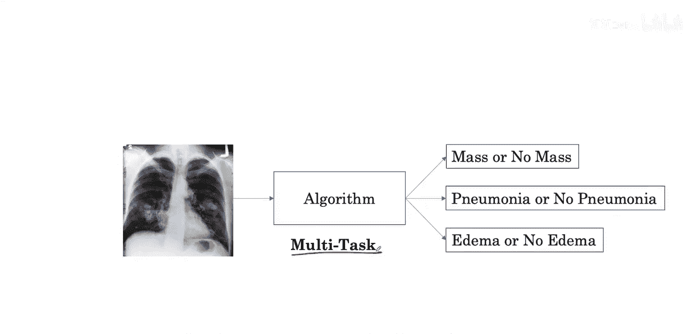
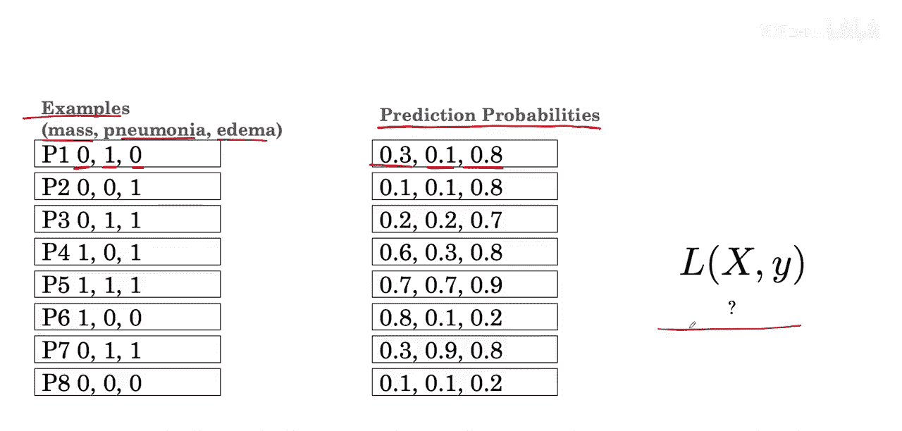

#  012：多任务学习 🧠

在本节课中，我们将探讨医学图像分类中的另一个挑战：多任务学习。我们将了解如何让一个模型同时学习识别多种疾病，以及这背后的原理和实现方法。

---

## 多任务学习的挑战与动机

上一节我们介绍了二分类任务，即判断图像中是否存在肿块。然而，在现实世界中，我们通常需要同时关注多种疾病的诊断。

例如，一张胸部X光片可能需要同时评估是否存在**肿块**、**肺炎**和**肺水肿**。一种简单的方法是针对每种疾病训练一个独立的模型。但或许我们可以让一个模型学会所有这些任务。

这样做的一个优势是，模型可以学习到对识别多种疾病都有用的**共同特征**，从而更高效地利用现有数据。这种设置被称为**多任务学习**。

接下来，我们看看如何训练一个算法来同时学习所有这些任务。

---

## 数据与模型架构的调整

为了实现多任务学习，我们需要对数据和模型架构进行调整。

### 数据标签的调整

在二分类中，每个样本只有一个标签（例如，0表示无肿块，1表示有肿块）。在多任务学习中，每个样本将拥有**多个标签**，每个标签对应一种疾病。

以下是标签格式的示例：
*   **0** 表示该疾病不存在。
*   **1** 表示该疾病存在。

例如，一个样本的标签可能是 `[0, 1, 0]`，这表示：
*   第一个标签 `0`：**无肿块**。
*   第二个标签 `1`：**有肺炎**。
*   第三个标签 `0`：**无肺水肿**（肺水肿指肺部积液过多）。

### 模型输出的调整

相应地，模型的输出层也需要改变。它不再只输出一个概率值，而是为每种疾病输出一个独立的概率。

例如，一个三任务模型的输出可能是三个概率值：
*   `P(mass)`
*   `P(pneumonia)`
*   `P(edema)`

---

## 损失函数的修改

要训练这样的多任务模型，我们还需要将损失函数从二分类设置修改为多任务设置。

在二分类中，我们通常使用**二元交叉熵损失**。对于一个任务，其公式为：

`Loss = -[y * log(p) + (1 - y) * log(1 - p)]`

其中：
*   `y` 是真实标签（0或1）。
*   `p` 是模型预测该类别为1的概率。

在多任务学习中，我们需要计算所有任务的损失总和。假设我们有 `K` 个任务，总损失是每个任务二元交叉熵损失的平均值或总和。

以下是多任务损失函数的通用公式：

`Total Loss = (1/K) * Σ_{i=1}^{K} [-y_i * log(p_i) - (1 - y_i) * log(1 - p_i)]`

其中：
*   `K` 是任务总数。
*   `y_i` 是第 `i` 个任务的真实标签。
*   `p_i` 是模型预测第 `i` 个任务为正类的概率。

通过最小化这个总损失，模型可以同时学习优化所有疾病的诊断性能。

---

## 总结

本节课中，我们一起学习了医学图像诊断中的**多任务学习**。

我们首先了解了其动机：让一个模型共享特征，以同时诊断多种疾病，从而提高数据利用效率。接着，我们探讨了如何调整数据标签和模型输出层以适应多任务。最后，我们学习了如何修改损失函数，将多个二分类任务的损失结合起来，以指导模型的训练。

多任务学习是构建高效、全面医学AI诊断系统的重要技术之一。