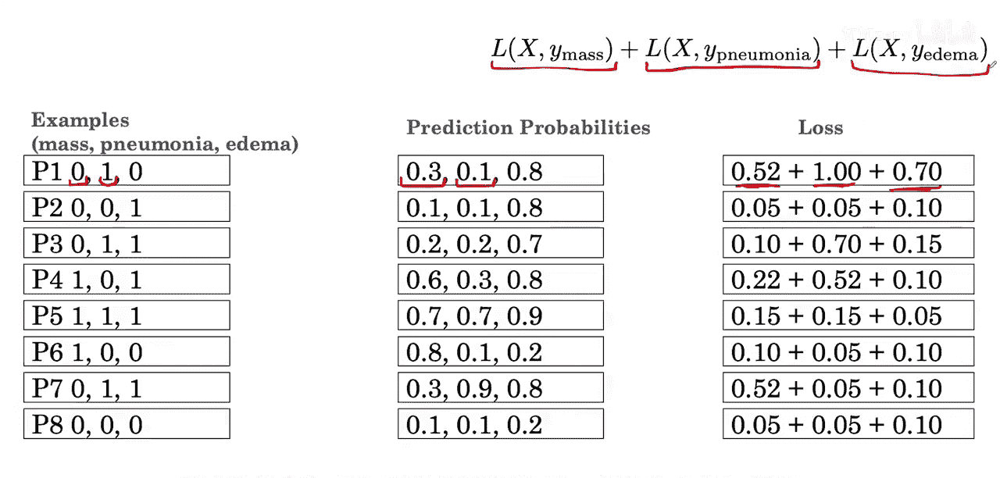
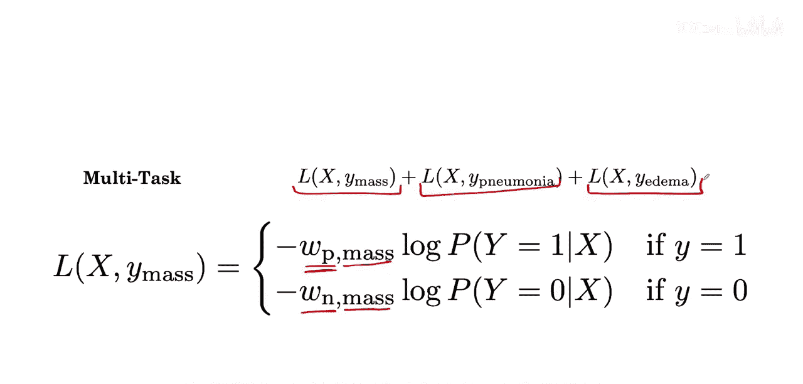
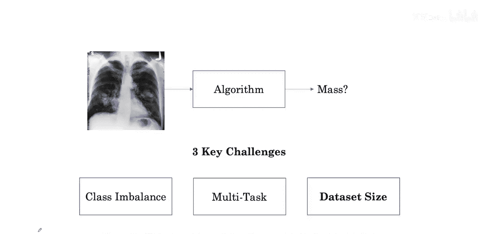
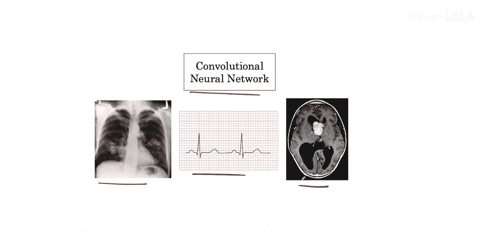
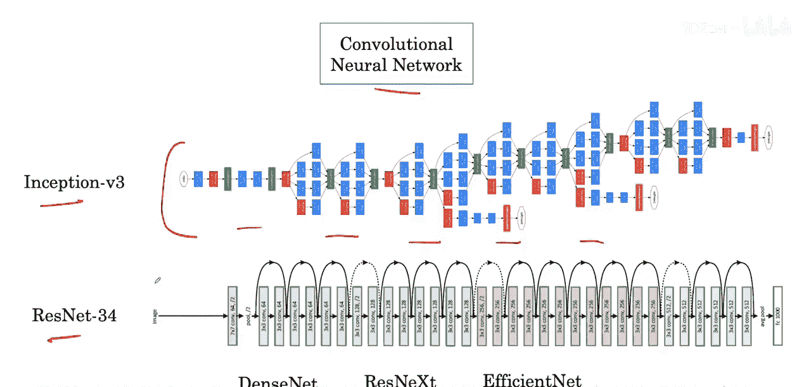

#  013：多任务损失、数据集规模与CNN架构

在本节课中，我们将学习如何为多任务学习设计损失函数，探讨数据集规模带来的挑战，并了解适用于医学影像分析的卷积神经网络架构。

## 多任务损失函数

上一节我们介绍了多任务学习的基本概念。本节中，我们来看看如何为多任务学习设计损失函数。

我们修改损失函数，使其能够分别计算与每种疾病相关的误差。新的损失可以表示为多个疾病损失的总和。这被称为多标签损失或多任务损失。

以下是针对八个示例计算出的损失。第一项表示使用此预测概率和此标签计算出的与肿块类别相关的损失。类似地，这里是与肺炎类别相关的损失，由模型输出和此标签计算得出。我们将各个损失函数组件给出的三个损失相加。

## 处理类别不平衡

在多任务设置中，我们同样需要考虑如何处理类别不平衡问题。

我们可以再次应用之前介绍过的加权损失。但这次，我们不仅有为正负标签分配的权重，而且权重是针对特定类别的正标签和特定任务（疾病）的负标签分配的。这意味着，对于肿块、肺炎或水肿，其正类别的权重可能各不相同。

这解决了多任务学习中的第二个挑战。

## 数据集规模的挑战

接下来，我们看看第三个挑战，即数据集规模问题。

## 卷积神经网络架构

对于许多医学影像问题，首选的架构是卷积神经网络，也称为ConvNet或CNN。这些网络专为处理X光片等2D图像而设计，但其变体也适用于医学信号处理或CT扫描等3D医学影像。

以下是几种广泛流行的卷积神经网络架构：

*   Inception
*   ResNet
*   DenseNet
*   ResNeXt
*   EfficientNet

这些架构由各种构建模块组成。在医学问题中，标准做法是在目标任务上尝试多种模型，以找出效果最佳的架构。

## 总结

本节课中，我们一起学习了多任务学习的损失函数设计，了解了如何通过加权损失处理多任务中的类别不平衡问题，并认识了数据集规模带来的挑战。最后，我们介绍了适用于医学影像分析的几种主流卷积神经网络架构，为后续的模型选择奠定了基础。