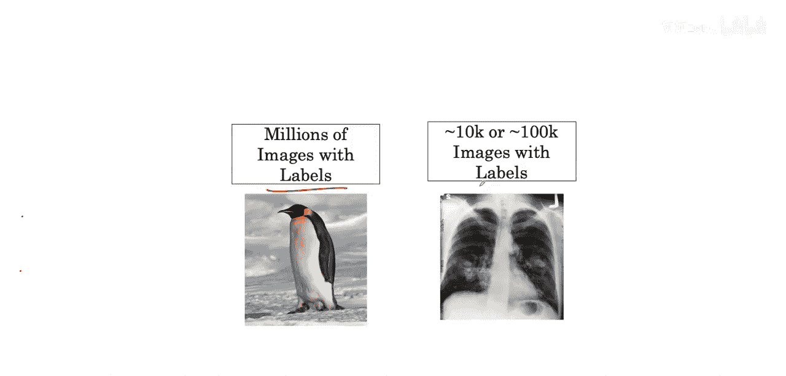
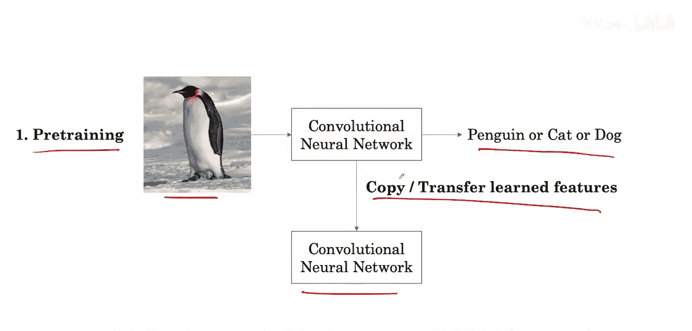
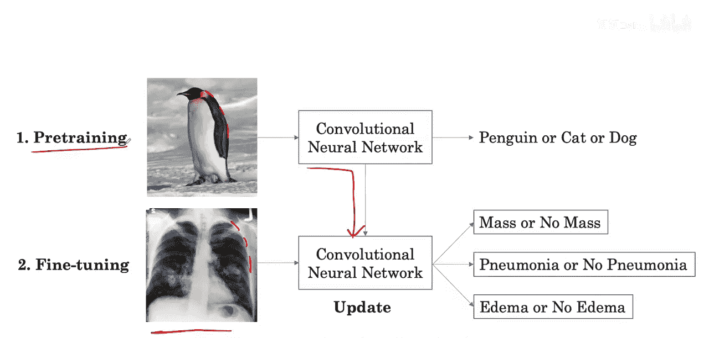
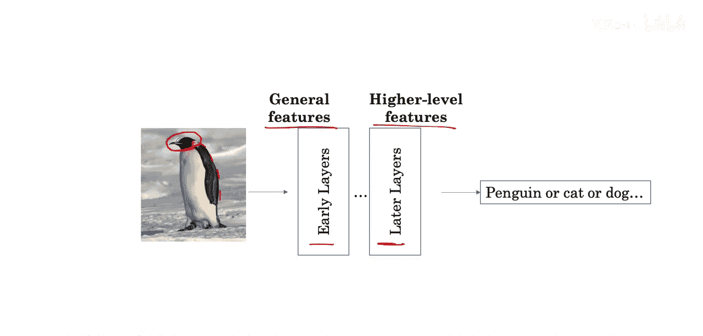
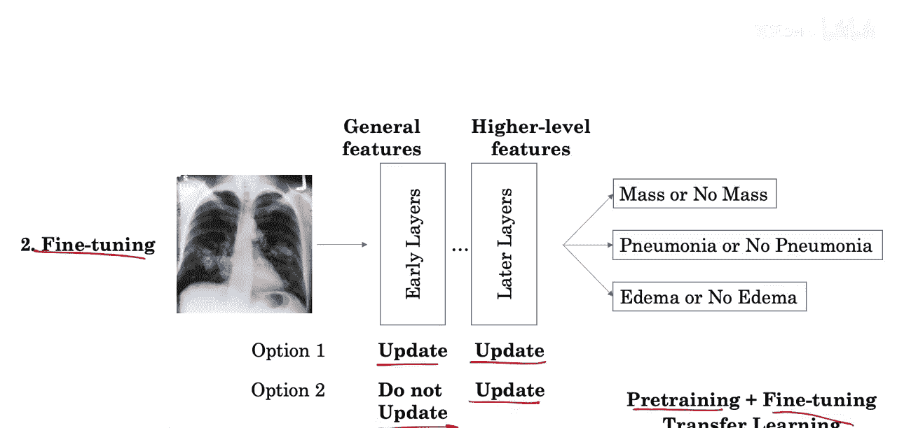

#  014：小规模训练集下的工作方法 🏥

在本节课中，我们将探讨一个在医学影像分析中常见的挑战：当数据量有限时，如何应用需要大量数据训练的深度学习模型。我们将重点介绍一种名为“迁移学习”的有效策略。

## 挑战：数据饥渴的模型



上一节我们介绍了各种深度学习架构。这些架构的共同挑战是它们都是“数据饥渴型”的，通常需要像图像分类数据集那样数百万的示例才能达到最佳性能。

在医学问题中，我们通常无法获得数百万的示例。那么，我们如何在这种情况下仍然应用这些强大的技术呢？



## 解决方案：预训练与微调

一种解决方案是**预训练**网络。其核心思想是分两步走。

### 第一步：预训练

首先，让网络观察自然图像（例如包含企鹅、猫或狗的图片），并学习识别这些物体。这个过程旨在让网络学习通用的图像特征。

### 第二步：微调

然后，将这个已训练网络作为起点，用于学习医学影像任务。具体做法是复制其已学习的特征。网络可以在此基础上，进一步训练以观察胸部X光片，并识别疾病的存在与否。

这个过程的原理在于，当网络学习第一个任务（识别猫狗）时，它会学到一些通用的特征，这些特征将有助于它在医学任务上的学习。例如，识别企鹅边缘的特征，可能同样有助于识别肺部的边缘，而这对于诊断某些疾病是有帮助的。



当我们把这些特征迁移到新网络后，网络就拥有了一个更好的起点来学习胸部X光判读这个新任务。第一步称为**预训练**，第二步称为**微调**。

## 网络层级的理解

通常认为，网络的**早期层**捕获的是低层次的、可广泛泛化的图像特征（如物体的边缘）。而**后期层**捕获的则是更高层次或更特定于某个任务的细节。

例如，早期层可能学习物体的边缘，这对后续的胸部X光判读可能有用。但后期层可能学习如何识别企鹅的头部，这部分知识对胸部X光判读可能就没有直接用处了。

## 微调策略



因此，当我们在胸部X光数据上微调网络时，我们不必微调所有迁移过来的特征。我们可以**冻结**浅层学习到的特征，只**微调**更深层的网络权重。

在实践中，有两种最常见的设计选择：
1.  微调所有层。
2.  只微调后期层或最后一层，而不微调早期层。

以下是两种策略的简单示意：
```python
# 策略1：微调所有层
for param in model.parameters():
    param.requires_grad = True  # 所有参数均可更新

# 策略2：仅微调最后一层（示例）
for param in model.parameters():
    param.requires_grad = False  # 先冻结所有参数
for param in model.fc.parameters():  # 假设最后一层是全连接层 ‘fc’
    param.requires_grad = True  # 仅解冻最后一层
```

## 总结



本节课中，我们一起学习了应对医学影像小规模数据集的挑战。我们介绍了**预训练与微调**的方法，这种方法也被称为**迁移学习**。其核心是先在大型自然图像数据集上训练模型，学习通用特征，然后将这些特征作为起点，在较小的医学数据集上进行针对性调整。通过理解网络不同层级的功能，我们可以选择冻结部分层、只微调特定层，从而更高效地利用有限的数据，提升模型在医学诊断任务上的性能。