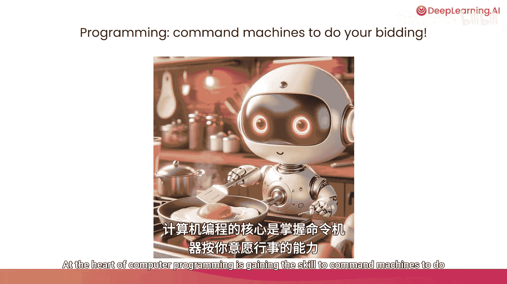
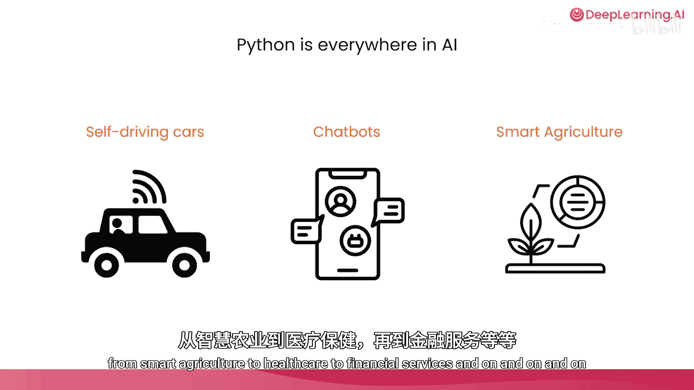
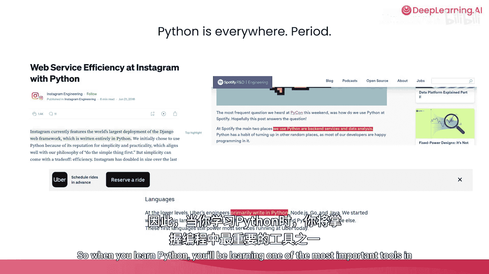

# 002：什么是计算机编程？💻

在本节课中，我们将要学习计算机编程的核心概念，了解它如何成为人与机器沟通的桥梁，并探讨Python语言在当今世界，尤其是在人工智能领域中的重要性。

## 概述

计算机编程是一门艺术与科学，旨在编写非常精确的指令，告诉计算机你希望它为你做什么。事实证明，当你编写出优秀的指令时，计算机能够完成大量工作。

## 编程的力量与影响

上一节我们介绍了编程的基本定义，本节中我们来看看编程在实际生活中产生的广泛影响。

编程在更广泛的层面上，以多种方式推动了人类社会的进步，所有这些都源于人们编写的代码。例如，帮助我们解开宇宙奥秘的哈勃太空望远镜图像，正是通过科学家编写的计算机程序进行处理和分析的。发现希格斯玻色子的粒子加速器之所以成为可能，是因为开发人员编写了软件来分析他们收集的数据，从而推动了我们对物理学的理解。

我们日常使用的互联网，也完全依赖于人们编写的计算机程序。当你拿起手机向他人发送信息时，你正在使用别人编写的计算机程序。如果你使用GPS导航，或者你或你爱的人使用语音识别、眼动追踪等辅助技术，这些都是改变了无数残障人士生活的技术，所有这些都是由某人编写的程序。

## 编程的核心与类比

计算机编程的核心在于掌握命令机器为你服务的技能。计算机程序是一组精确的指令，告诉计算机如何执行任务。

正如烹饪食谱指导你完成一系列步骤以稳定地做出美味佳肴一样，计算机程序为计算机执行特定任务提供了指令。掌握编程能力将使你在所能完成的事情上占据优势。

## 编程的实用价值：自动化与洞察

我看到许多人利用编程来自动化重复性任务，例如反复处理PDF文档并将相关数据提取到电子表格中。

😊，除了分析你或你的公司可能已经拥有的数据之外，编程还能帮助你获得全新的见解。我看到许多团队，包括商业分析师，越来越多地使用像ChatGPT这样的AI工具来自动浏览网页、下载一系列网页并综合生成报告，以帮助他们获取市场洞察，更深入地了解世界某个地区正在发生的事情。

当你学会编码后，你自己就能更好地识别并利用AI自动化越来越多此类任务。事实证明，通过编程，你只需编写几行代码，就能命令你的计算机使用ChatGPT或其他AI语言模型等工具。现在，不仅是你可以，你的计算机也能去使用ChatGPT来帮助它完成任务。本课程编写代码的一个核心部分，就是让你的计算机通过Python使用AI工具，从而为你做更多的事情。

## 为什么选择Python？

大多数像我一样的AI开发者一直在使用Python，而事实证明，Python是目前最流行的编程语言。Python拥有一个非常支持性的开发者社区。如果你有问题，全世界有如此多的Python开发者，因此你通常可以找到人来帮助你，或者发现有人曾遇到过同样的问题。而且事实证明，像ChatGPT、Anthropic的Claude和Google的Gemini这样的聊天机器人也相当了解Python，因此如果你在解决问题时遇到困难，它们可以帮助你。

所以，当你在编程中遇到问题时，我鼓励你尝试询问聊天机器人来帮助你找到解决方案，正如我将在本课程中向你展示的那样。

如今，Python正在为海量的AI应用提供动力。Python代码运行在许多自动驾驶汽车中，是驱动聊天机器人的软件的一部分，并应用于从智能农业到医疗保健、金融服务等众多其他AI应用中，其用途不胜枚举。

而且Python的使用范围远不止于此。许多网站、智能手机应用程序、视频游戏等都使用Python运行。因此，当你学习Python时，无论你的目标是什么，你都在学习编程中最重要的工具之一。

## 总结与展望

我希望这门“人工智能初学者Python入门”课程只是你的第一步，它将为你奠定基础，让你能够持续迈出更多、更远的步伐，在Python乃至整个编程领域做越来越多的事情，这样你也能通过代码帮助推动人类进步。

那么，让我们进入下一个视频，开始看看聊天机器人如何与Python交互。