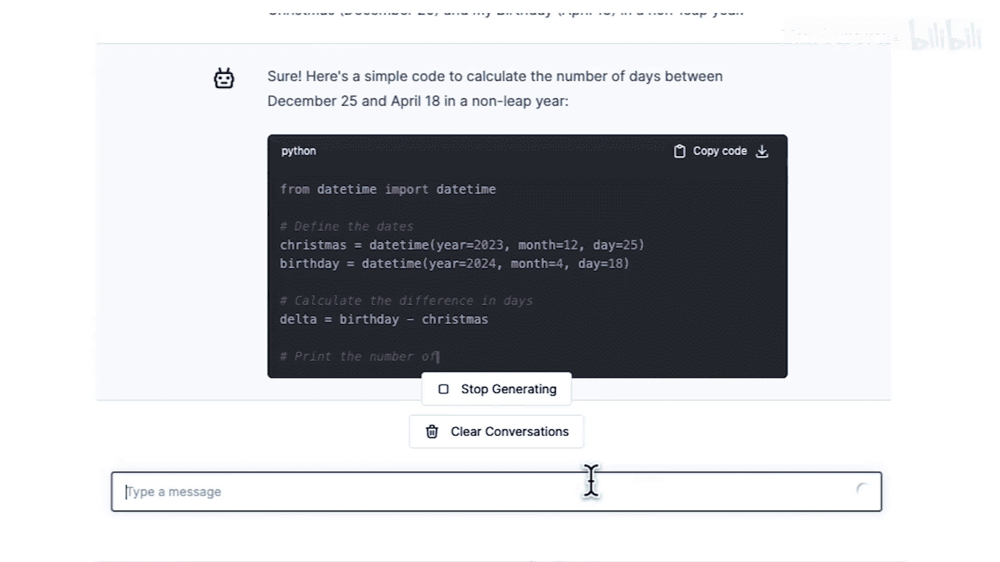
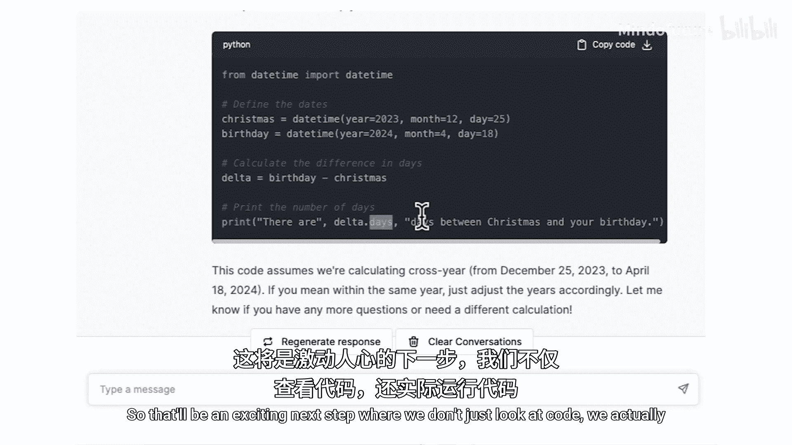

# 003：使用聊天机器人编写代码 🤖

在本节课中，我们将要学习如何利用AI聊天机器人来辅助编程。聊天机器人已成为程序员日常工作中提高效率的重要工具，它能帮助我们快速解答疑问、生成代码片段，甚至修改现有代码。我们将通过具体示例，演示如何与聊天机器人交互，让它为我们编写简单的Python程序。

## 与聊天机器人交互

上一节我们了解了编程的基本概念，本节中我们来看看如何与AI聊天机器人进行有效对话。程序员在日常工作中经常使用聊天机器人，这显著提升了我们的工作效率。过去，如果遇到编程难题或不知下一步该做什么，可能需要花费时间寻找专家并确认其是否有空。现在，有了AI聊天机器人，你可以随时提问并立即获得答案。

在本课程中，我们提供了一个可以直接使用的聊天机器人界面。你可以将问题（也称为“提示”）输入其中。例如，如果你想知道“什么是编程”，可以输入这个问题，它会生成一个相当合理的答案。

尽管本课程提供了内置的聊天机器人，你也可以使用第三方聊天机器人，如ChatGPT、Microsoft Copilot、Claude、Anthropic Cloud、Google Gemini或目前众多的其他选择。

## 理解提示与响应

让我们尝试另一个问题。首先，清空当前对话，点击垃圾桶图标并确认。现在，让我提问：“什么是Python？”

我刚才输入的文本被称为“提示”。输入提示“什么是Python”并按下回车后，聊天机器人会生成一个响应。由于历史原因，计算机程序员有时将这个响应称为“完成”。但如果你听到“完成”这个词，它仅仅意味着聊天机器人对提示“什么是Python”的回应。

以下是聊天机器人可能给出的回答示例：
> Python是一种高级编程语言，以其简单易读的语法而闻名，是初学者的绝佳选择。

如果你对某个部分感到好奇，例如“Python以其简单的语法而闻名”中的“语法”是什么意思，你可以继续提问。聊天机器人会给出答案。你可以选择阅读，也可以忽略。这实际上是我自己常用的工作流程：使用聊天机器人获取答案，如果对其中部分内容不完全理解，就继续提出后续问题。对于入门级的编程问题，这类聊天机器人通常能给出非常好的答案。

## 编写你的第一个程序

现在，有一个程序传统上是由全新的程序员编写的。许多程序员，包括那些今天拥有辉煌职业生涯的人，都是从编写这个特定的程序开始的。让我们来了解一下它是什么。

以下是向聊天机器人提出的问题示例：
> 传统上，新手程序员编写的第一个程序是什么？

聊天机器人可能会这样回答：
> 新手程序员传统上编写的第一个程序是“Hello World”程序。这是一个简单的程序，在屏幕上打印“Hello, World!”。

你可能会想看看如何编写这个程序。那么，你可以继续提问：“是的，请展示如何编写。”

于是，我们刚刚让聊天机器人为我们编写了一段代码。它可能会生成类似下面的代码：
```python
print("Hello, World!")
```
这段代码会告诉计算机打印出“Hello, World!”这条消息。

在下一个视频中，我们将学习如何实际运行这个计算机程序。但这里有一个伟大的传统：当你开始编程时，你让计算机说的第一句话就是“Hello, World!”。这就像是你的程序第一次醒来时说：“你好，世界，我来了！”这就是为什么我们让计算机打印“Hello, World!”。

**请注意**：如果你尝试向ChatGPT、Claude或Gemini等外部聊天机器人提出类似的提示，可能需要明确告诉它你想使用Python编程语言。就像人类有多种语言一样，编程语言也有很多种。如果你不指定使用Python，它有可能告诉你怎么用Python以外的其他语言来打印“Hello, World!”。

## 修改生成的代码

事实证明，如果你想修改代码，例如，你想让它对我说“你好”，而不是对“世界”说，你也可以使用聊天机器人。

以下是修改代码的提示示例：
> 修改你刚才写的代码，让它对我说“你好，Andrew”，而不是对“世界”说。

聊天机器人可能会将代码修改为：
```python
print("Hello, Andrew!")
```


## 编写更复杂的代码

聊天机器人也能编写更复杂的代码。这里有一个例子。

以下是向聊天机器人提出的复杂请求示例：
> 编写一些代码来计算圣诞节（12月25日）和我的生日（4月18日）之间有多少天。假设是在一个非闰年。



我完全不知道圣诞节和我的生日之间有多少天。如果你需要编写这样的程序，聊天机器人可以帮你。它生成的程序看起来是正确的。你可以用你自己的生日来尝试。实际上，为了好玩，你可以选择一个节日和你的生日，然后提示聊天机器人计算从你最喜欢的节日到你的生日之间的天数。

聊天机器人为此生成的代码可能涉及日期计算，例如使用Python的`datetime`模块。

事实证明，因为AI可以编写简单的程序，它们在编写非常复杂的程序方面可能不那么出色，但在编写简单的代码片段方面相当不错。

这正是AI的使用正在改变我们许多人编码方式的原因。严肃地说，我希望你能亲自尝试，如果对代码的某些具体方面想深入了解，可以继续提出后续问题。

## 总结



本节课中我们一起学习了如何利用AI聊天机器人辅助编程。我们了解了如何通过“提示”与机器人交互，让它生成和解释代码，例如经典的“Hello, World!”程序。我们还看到了如何通过后续提示来修改生成的代码，以及如何让它处理更复杂的任务，如日期计算。聊天机器人是学习编程和解决简单编码问题的强大工具。当你准备好后，让我们进入下一个视频，在那里我们将继续使用聊天机器人，但不仅仅是让它为我们编写代码，还要实际执行或运行这些代码，让计算机遵循代码中的指令。这将是一个激动人心的步骤，因为我们不只是看代码，还要运行代码。下个视频见。