# 004：导航学习平台 🧭

在本节课中，我们将要学习本课程所使用的编程环境——Jupyter Notebook。我们将了解其界面布局、核心功能以及如何运行你的第一行代码。

上一节我们介绍了如何使用聊天机器人获取代码，本节中我们来看看实际运行代码的编程环境。

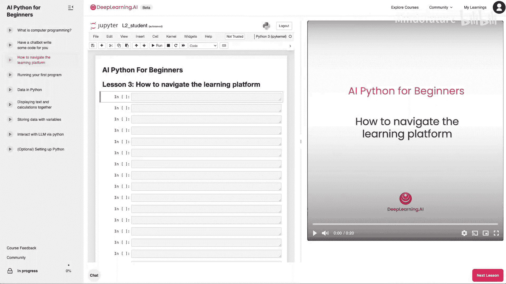

## 学习平台界面概览

在接下来的课程中，你将看到一个类似这样的环境。界面主要分为三个部分：

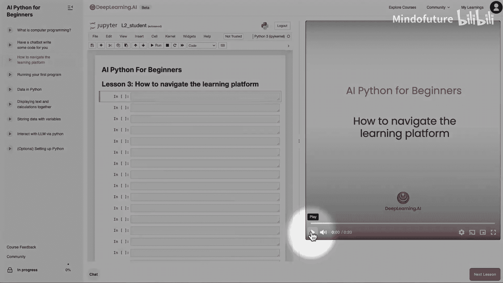

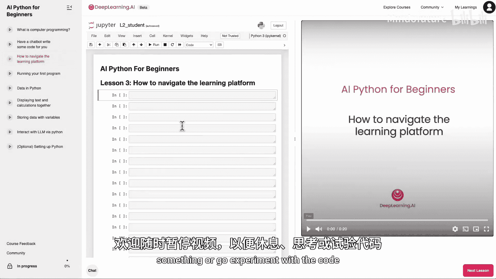

*   **左侧**是导航窗格，可以像这样关闭或重新打开。
*   **中间区域**是你编写和运行代码的地方。
*   **右侧**是视频播放器。

以下是该学习平台的几个实用功能，你可以随时暂停视频进行休息、思考或尝试代码。

## 视频播放控制

你可以通过设置控制视频的播放速度。如果你觉得我说话太慢，可以加快速度。

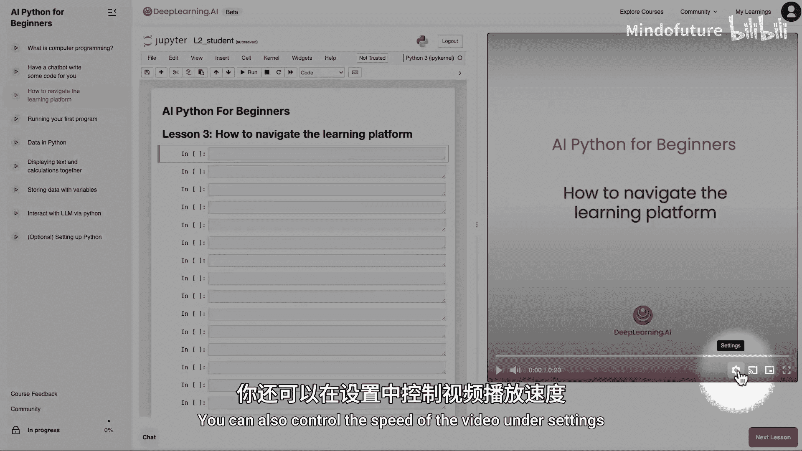

你还可以将视频切换到画中画模式。中间的这个选项卡也允许你调整代码区域与视频播放器的大小比例。

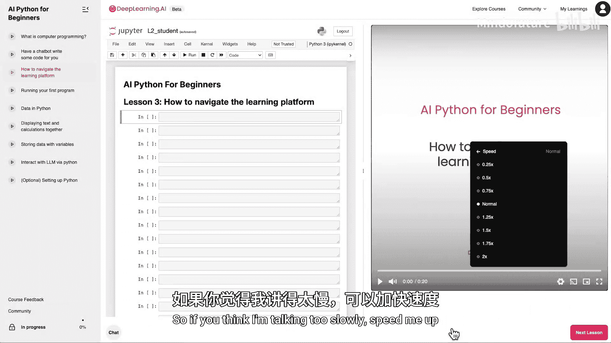

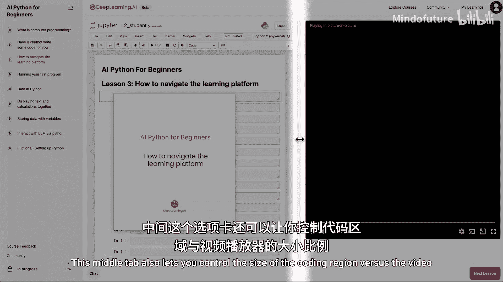

让我关闭画中画模式。这个小箭头是另一种触发画中画的方式。点击后视频会弹出为画中画，再次点击那个小箭头可以将视频带回主界面。

现在，让我关闭左侧导航窗格，让我们专注于中间的编程环境。

## 认识Jupyter Notebook

这个编程环境被称为 **Jupyter Notebook**。它是许多专业程序员和数据科学家日常使用的完全相同的工具。但别担心，我们将一步步学习如何使用这些工具。

你可能还记得，在上节课中我们使用了聊天机器人。点击这个聊天按钮可以将其弹出。

聊天机器人提供了代码。现在我将点击这个按钮来复制代码，然后关闭聊天窗口。

如果我想运行代码，我会来到这个编程环境，将光标点击在这里，然后按下 `Command + V`（Mac）或 `Ctrl + V`（Windows/Linux）来粘贴我刚从聊天机器人复制的代码。

## 运行你的第一行代码

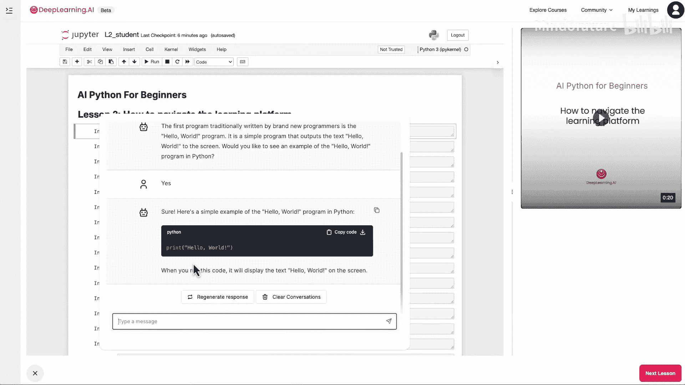

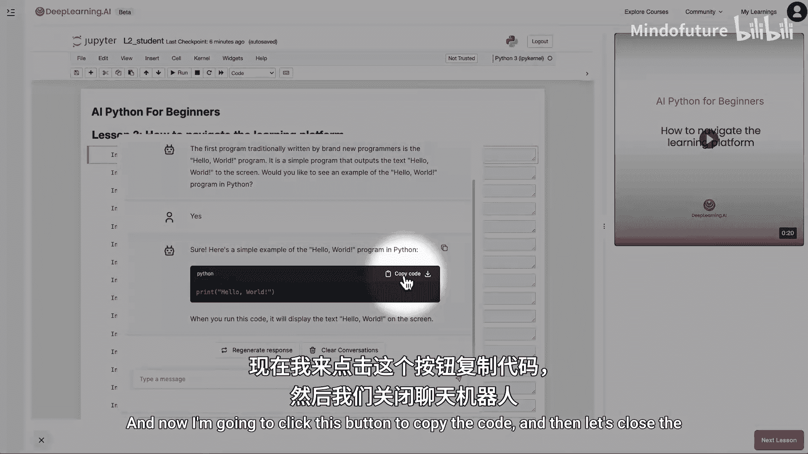

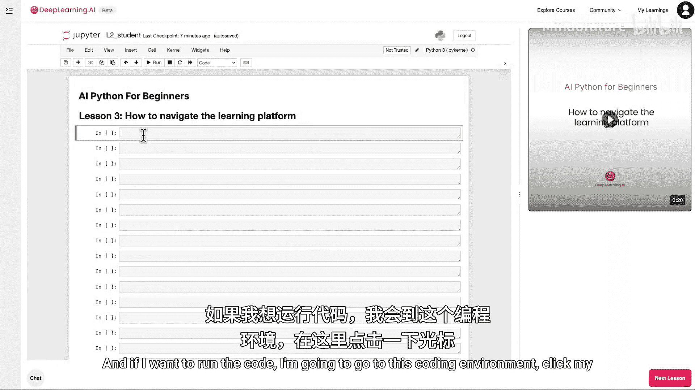

现在，我要介绍Jupyter Notebook中可能是最重要的一个命令：**Shift + Enter**。

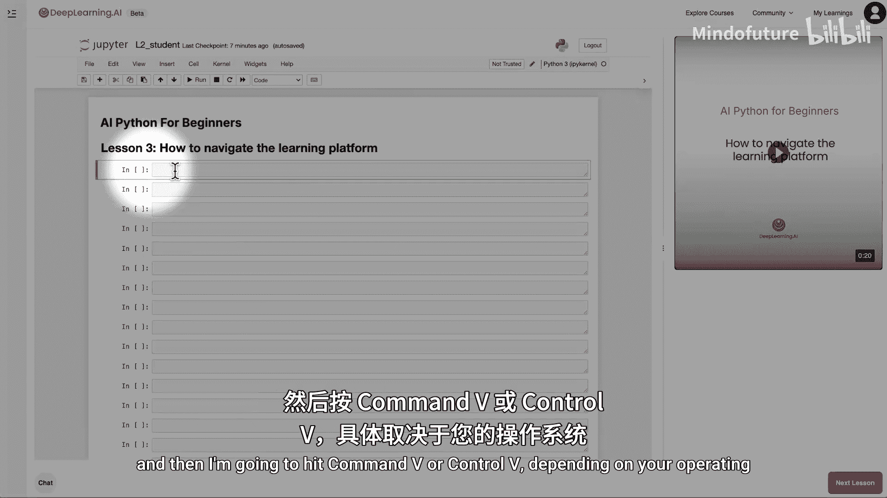

按住 `Shift` 键，然后按下 `Enter` 键，它就会运行这行代码。于是它输出了“hello world”。

在下一课中，我们将进行更多练习，学习如何像你刚才看到的那样运行代码，并邀请你亲自尝试复制粘贴一些代码，然后自己运行 `Shift + Enter`。

## 重要注意事项与课程进度

这里有一点需要注意：**本平台只会保存你两个小时的工作**。因此，如果你在一节课结束前停止，并在超过两小时后回来完成它，笔记本将被重置，你需要从头开始并再次运行所有代码单元。不过这也没关系。

这个短期课程包含一系列不同的视频或课程，它们显示在左侧的导航栏中。我建议你按顺序逐一学习这些课程。

当你完整观看完每个视频后，相应的课程旁边会出现一个绿色的对勾。当所有这些都变成对勾，或者进度变为100%时，就表示你完成了本课程。

我也非常希望获得你对本课程的任何反馈，你可以点击左下角的“课程反馈”链接与我们分享。

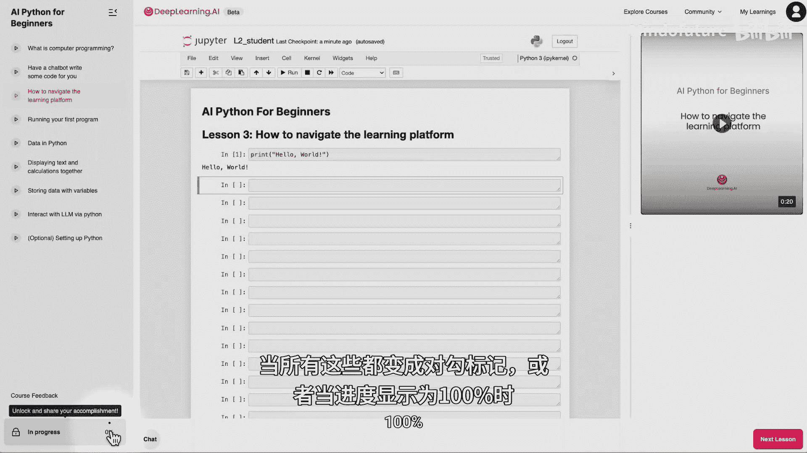

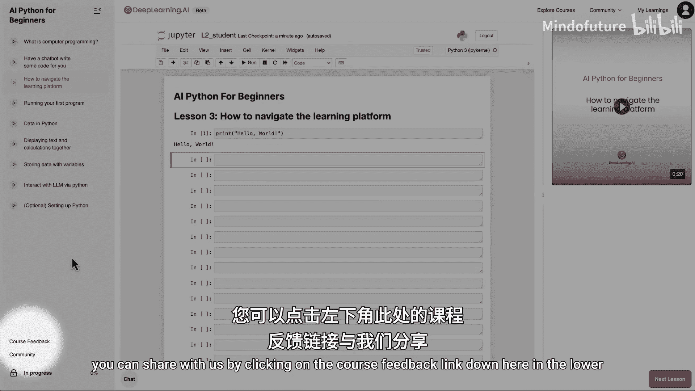

## 总结

本节课中我们一起学习了本课程编程环境的基本操作。我们了解了Jupyter Notebook的界面布局，掌握了复制代码、粘贴代码以及使用 **`Shift + Enter`** 运行代码的核心操作。同时，也请注意平台自动保存的时间限制。记住最重要的命令 `Shift + Enter`，让我们进入下一课，开始运行你自己的计算机程序。