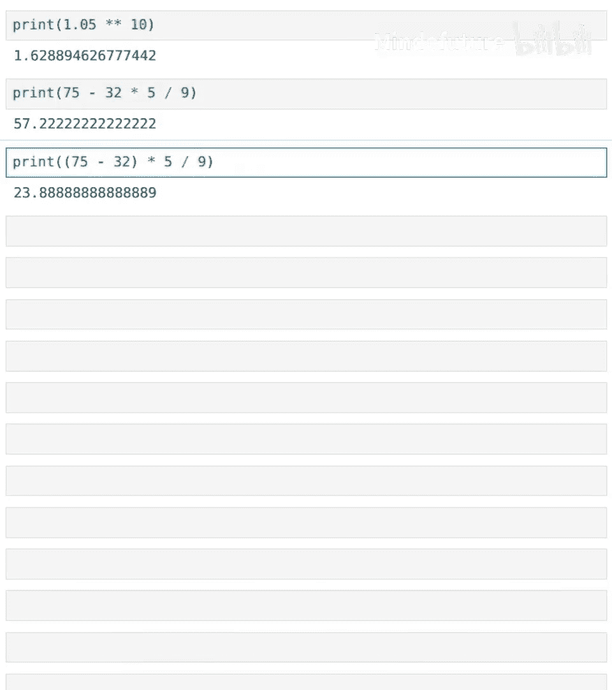
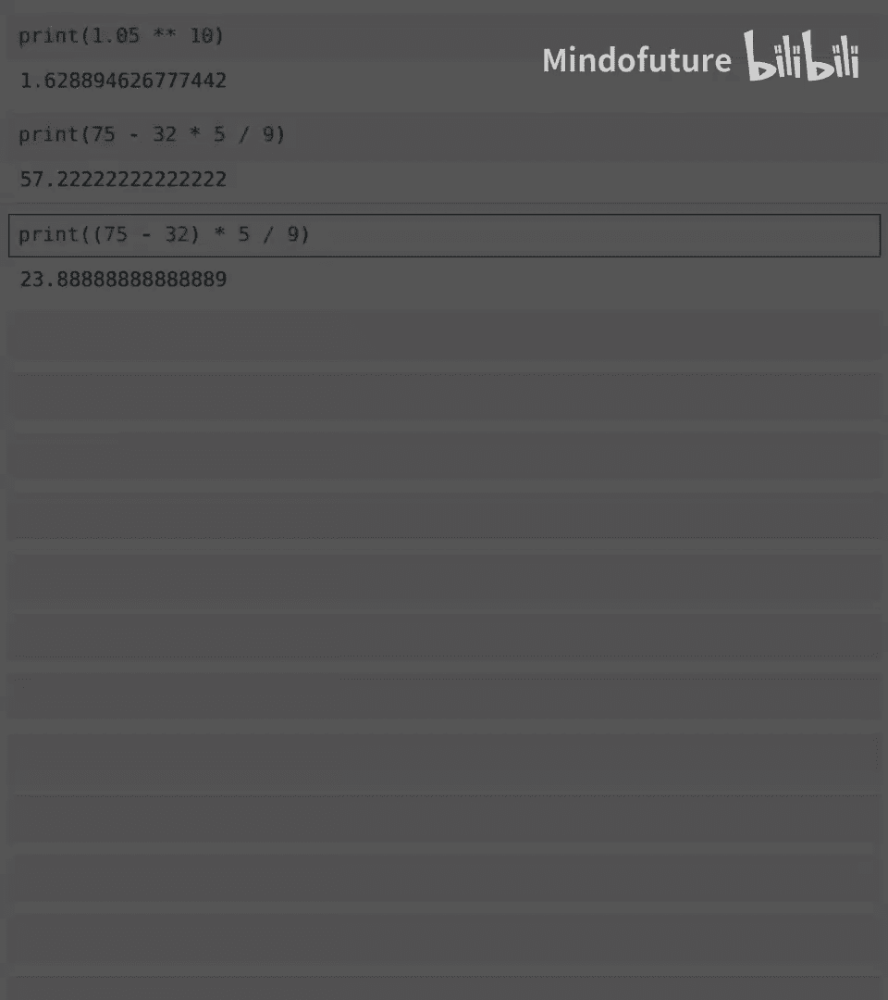

# 007：Python中的数据 🐍

在本节课中，我们将要学习Python编程中一个核心概念：数据。我们将了解什么是数据，探索Python中处理的主要数据类型，并学习如何使用Python进行基本的数学运算。

## 什么是数据？ 📊

你可能听说过数据对计算机编程和人工智能非常重要，但数据究竟是什么呢？让我们来看一看。

以下是你在日常生活中可能遇到的几个数据例子：如果你在网上搜索你国家的人口密度地图，那就是显示特定地区人口居住情况的数据。或者，如果你查看城市的每周天气状况，显示每日温度的数字就是数据。再或者，你查找股票价格的高低点，那些数字也是数据。

## Python中的数据类型

Python以及所有计算机程序都可以处理特定类型的数据。其中一种数据类型是文本数据。例如，“a”是一段文本，“egg”这个词是一段文本，“我最喜欢的活动是徒步旅行”也是一段文本。Python可以打印文本，并且正如我们稍后将看到的，它还可以对文本进行其他操作。

程序管理器也可以处理和操作数字，比如圆周率π（3.14）或其他数字。你可能听说过的计算机处理的其他数据类型包括表格数据（如电子表格）、图片（也是数据的一种形式）以及音频。

计算机中几乎所有的数据最终都会转化为文本或数字。事实证明，图像是由像素组成的，计算机存储图像的方式是存储大量数字，这些数字可能表示每个像素显示多少红色、绿色或蓝色（三原色）。声音在计算机中也是作为大量数字存储的。声音是由气压的快速变化产生的，计算机通过将这些不同的气压测量值存储为一堆数字来存储声音。

因此，我们将要处理的两种最重要的数据类型是文本和数字。

## 文本数据：字符串

“Hello world”是Python中一段文本片段的例子，这被称为**字符串**。字符串这个词来源于将“Hello world”视为一串字母的想法。

要在Python中指定一个字符串，以下是关键组成部分：我们使用双引号来标记字符串的开始和结束，然后文本位于这些引号之间。

从技术上讲，Python中的字符串是任何由文本、数字或符号字符组成的组合，并用双引号括起来。在这个字符串中，引号之间的所有内容都是字符串的一部分，包括空格。

以下是一些你可以在Python中存储的字符串示例：
*   `"Hello world"`
*   `"my favorite drink is a greatty"`
*   `"a funny character like that"`
*   `"here's 2.99"`（存储为字符串）

我稍后会分享，将2.99存储为字符串与存储为数字有什么区别。

现在，事实证明在Python中还有另一种存储字符串的方法。如果你使用**三引号**，那么你可以存储一个**多行字符串**，即包含换行符的字符串。

以下是一个多行字符串的例子。我使用三引号，并在这里插入一个换行。如果我运行这段代码，你会看到所有这些空格实际上都是那个多行字符串的一部分。所以，如果你不想要所有这些空格，你必须像这样运行它。

相比之下，如果你尝试用单引号写这个，将会产生错误信息。让我现在展示给你看，因为这里有一个换行，所以Python认为这是两行代码，它试图运行第一行，因此出现了错误。而相反，如果你使用三引号，那么Python就知道你正在尝试编写一个多行字符串，这不会产生错误。

## 检查数据类型

现在，事实证明Python允许你检查特定数据片段的类型。你已经见过这段代码`print("Hello world")`。`print`是一个函数或命令。你可以告诉Python执行它。我想向你展示一个不同的函数，即`type`函数。

如果你告诉Python `type("Hello world")`，那么你会输出`STR`，这告诉你这是一个字符串。所以，`"Andrew"`的类型是字符串`STR`，因为这里的`"Andrew"`是一个字符串。

如果你对一个多行字符串这样做，这也是一个字符串，与字符串`"Andrew"`的类型完全相同，只是这个字符串包含不同的文本片段。现在，如果我询问`"2.99"`（在引号内）的类型，这是一个字符串。

现在让我做一些不同的事情。我要说`type(100)`。事实证明，`100`的类型是一个数字，具体来说是一种称为**整数**的数字类型，意思是没有小数部分的数字。相比之下，如果我执行`type(2.99)`，那么这是一个**浮点数**。浮点数是Python存储或表示数字的另一种方式，但是带有小数点的数字。

因此，Python有两种主要的方式来存储/表示数字，即**整数**和**浮点数**。
*   **整数**表示没有小数点的数字，如`42`、`100`、`-9`、`0`。
*   **浮点数**在小数点后有数字，如`3.14`、`2.99`、`-0.03`等。

## 使用Python作为计算器 🧮

我经常使用Python的一种方式是作为计算器。如果你想做加法，比如2加6等于多少，你实际上可以写一个Python命令来说`print(2 + 6)`，或者`print(57 - 40)`，或者乘法和除法。

我在Python中这样做的原因是，如果我试图将所有数字相加并犯了一个错误，我可以返回去编辑其中一个数字，并让Python重新进行那个计算。例如，如果我经营一个销售柠檬水的生意，我想汇总过去12个月的销售额，我可能会输入这样的内容并让它打印出总和。

但是，如果我发现实际上打错了字，我可以返回去说：“哦，是的，在三月份，我们不是卖了43个单位，实际上是卖了45个单位。”然后只需编辑一下，就能得到一个像这样的更新答案。因此，我发现使用Python比使用我个人手持计算器更方便，因为可以返回去编辑这些计算。

到目前为止，我们只做了算术运算。事实证明，如果你有其他想做的事情，比如你在银行账户里有存款，年利率为5%，你想知道10年后你有多少钱，你需要计算`1.05`的`10`次方。但如果你不知道怎么做，你可以去聊天机器人那里问它如何计算`1.05`的`10`次方。如果你这样做，它会显示这个答案，即使用双星号`**`运算符。`1.05 ** 10`的结果大约是`1.62`。所以，你每有1美元，10年后最终会得到1.62美元。

## 运算顺序

最后，在Python中操作数字时，需要注意的一点是**运算顺序**。

如果你要将温度从华氏度转换为摄氏度，那么你必须先从华氏温度中减去32，然后乘以5/9。

所以，如果是75华氏度，你想把它转换成摄氏度，如果你写这段代码`75 - 32 * 5 / 9`，那么Python会先执行乘法，这将导致错误的答案。因此，像这样使用括号`(75 - 32) * 5 / 9`告诉Python你希望以什么顺序执行这些操作。运算顺序与普通数学中的相同，即乘法和除法在加法和减法之前进行。

这就是为什么在代码中，`75 - 32 * 5 / 9`会产生从华氏度到摄氏度的错误转换，而`(75 - 32) * 5 / 9`会产生正确的转换，其中75华氏度等于23.889摄氏度。

## 总结

本节课中我们一起学习了Python中的数据类型，以及如何将Python用作计算器。这本身就是一个非常强大的工具。在进入下一个视频之前，我鼓励你尝试笔记本末尾的练习，以巩固所学内容。请始终记住，在学习编码时，你可以在任何时间点向聊天机器人寻求帮助，养成向聊天机器人提问的习惯是非常有用的。

在下一个视频中，我们将学习Python中一种关键的打印技术，称为**F字符串**，这将允许你一起打印字符串和数字。所以，请尝试这些练习，我将在下一个视频中与你再见。