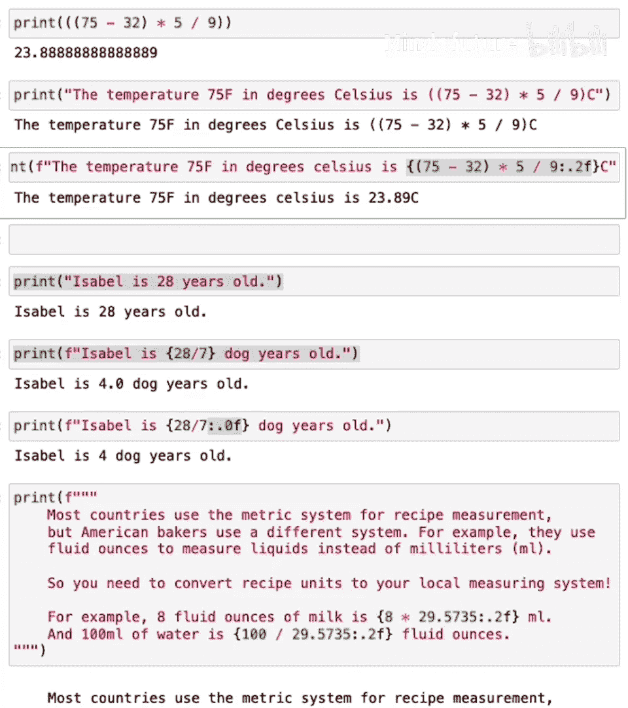

人工智能初学者Python入门：P08：结合文本和计算

在本节课中，我们将要学习如何将文本数据（字符串）与数值计算的结果结合起来显示。你将掌握一个名为 **F-string** 的强大工具，它能够让你轻松地将计算结果嵌入到文本中，这是AI开发和其他编程工作中常用的技巧。

---

### 回顾：字符串与数值

上一节我们介绍了字符串用于存储文本，而整数和浮点数用于表示数字。你可以使用 `print` 命令显示数据，也可以将Python当作计算器使用，例如进行温度单位转换。

例如，将75华氏度转换为摄氏度的公式是：
```python
(75 - 32) * 5/9
```
但如果我们想打印出“75华氏度等于XX摄氏度”这样的完整句子，直接组合字符串和公式会出问题。

### 引入F-string

为了解决上述问题，Python提供了**格式化字符串**，简称 **F-string**。它的核心思想是：在字符串前加上字母 `f`，并将需要计算或插入的表达式放在**花括号 `{}`** 中。

以下是使用F-string重写的温度转换示例：
```python
print(f"The temperature 75F in degrees Celsius is {(75 - 32) * 5/9}")
```
运行这段代码，它会正确输出计算结果：“The temperature 75F in degrees Celsius is 23.8889”。

### F-string的工作原理

为了更好地理解，让我们一步步拆解Python如何处理F-string。

1.  **普通字符串**：`print` 命令找到括号内的字符串，然后原样显示每一个字符。
2.  **F-string**：`print` 命令同样找到字符串。但开头的 `f` 告诉Python这是一个格式化字符串。接着，Python会寻找字符串中的花括号 `{}`，执行其中的计算（例如 `20 / 7`），并将计算结果替换回字符串的对应位置，最后输出完整的句子。

### 更多F-string示例

以下是另一个例子，计算一个人的“狗年龄”（假设为人类年龄的七分之一）：
```python
print(f"Isabel is {20 / 7} dog years old.")
```
运行后会输出：“Isabel is 2.857 dog years old.”

#### 控制输出格式

你可能希望结果只显示整数，不显示小数位。这时可以求助AI助手（如ChatGPT）来优化代码。例如，通过添加格式说明符 `:.0f` 可以实现四舍五入到整数：
```python
print(f"Isabel is {20 / 7:.0f} dog years old.")
```
现在输出变为：“Isabel is 3 dog years old.”

你还可以控制小数位数：
*   `:.1f` 保留一位小数。
*   `:.2f` 保留两位小数。
*   关键在于，当你不知道如何实现某个细节时，向AI助手提问是一个高效的方法。

### 多行F-string

F-string也适用于多行字符串（使用三引号定义）。这在需要嵌入多个计算时非常有用。

以下是一个将公制单位转换为英制单位的例子：
```python
print(f"""
A fluid ounce of milk is {29.5735:.2f} ml.
100 ml of water is {100 / 29.5735:.2f} fluid ounces.
""")
```
这段代码会清晰地输出两行换算结果。

### 本节总结与展望

本节课我们一起学习了 **F-string** 的使用。你学会了如何通过 `f”…{表达式}…”` 的格式，将数值计算的结果无缝嵌入到文本字符串中进行输出，并且了解了如何通过格式说明符（如 `:.2f`）来控制数字的显示方式。

虽然F-string功能强大，但你可能已经注意到，当公式比较复杂时，直接写在花括号里会让代码难以阅读。在下一节课中，我们将介绍编程中的一个核心概念——**变量**。使用变量可以让你的代码更清晰、更易读，也更容易与他人协作。




希望你能完成本节Jupyter Notebook底部的练习，尝试使用F-string来格式化输出各种数学计算的结果。我们下节课再见！