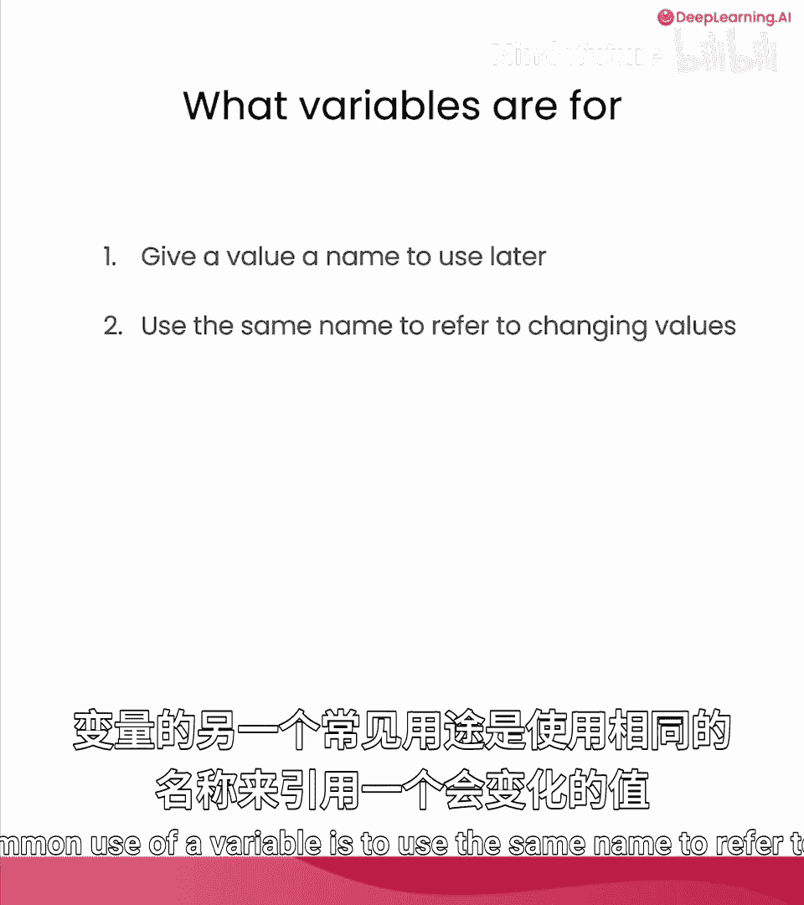
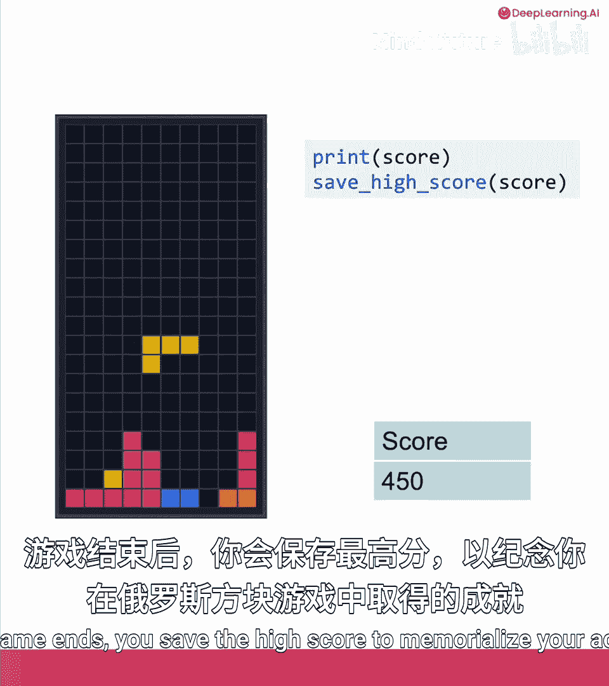
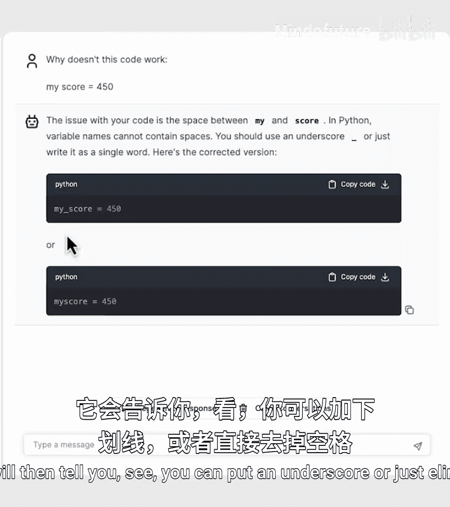
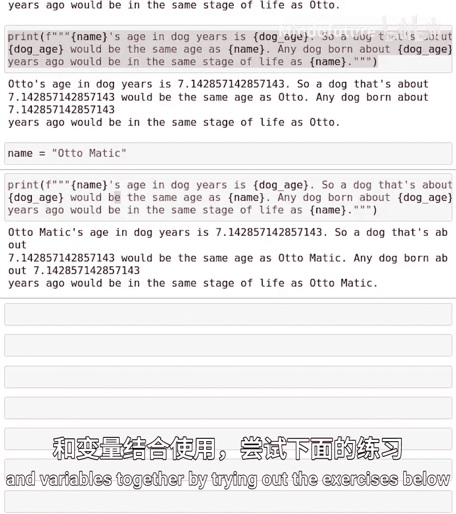

# 009：变量 🧠

在本节课中，我们将要学习计算机编程中的一个核心概念——变量。变量是存储和处理数据的基础，理解它对于编写任何程序都至关重要。

## 概述

变量可以被想象成一个贴有标签的盒子，用于存放数据。通过给数据命名，我们可以在程序的不同地方方便地引用和修改它。本节我们将学习如何创建、使用和修改变量，并了解它与F字符串结合使用的强大功能。

## 变量的创建与赋值

上一节我们介绍了变量的基本概念，本节中我们来看看如何在Python中具体创建和使用变量。

在Python中，使用等号 `=` 可以为变量赋值。这行代码会创建一个变量（如果它不存在），并将等号右侧的值存储进去。

```python
age = 28
```

执行这行代码后，Python会创建一个名为 `age` 的“盒子”，并将数字 `28` 放入其中。现在，如果我们打印 `age`，Python会从“盒子”中取出值 `28` 并显示出来。

```python
print(age)  # 输出：28
```

## 变量的重新赋值

变量的值并非一成不变。我们可以随时为同一个变量赋予新的值，新值会覆盖旧值。

```python
age = 28
print(age)  # 输出：28

age = 5     # 将 age 的值改为 5
print(age)  # 输出：5
```

上面的代码首先将 `28` 存入 `age`，然后又将 `5` 存入 `age`。最终，`age` 这个“盒子”里存放的是最新的值 `5`。

## 存储不同类型的数据



变量不仅可以存储数字，还可以存储文本（字符串）等其他类型的数据。

以下是不同类型变量赋值的例子：

```python
name = “Otto”
no_height = 12.7
```



我们可以使用F字符串来打印这些变量的值。F字符串允许我们将变量直接嵌入到字符串中。

```python
print(f“Age: {age}”)               # 输出：Age: 5
print(f“Name: {name}”)             # 输出：Name: Otto
print(f“No Height: {no_height}”)   # 输出：No Height: 12.7
```

## 变量命名规则

在定义变量时，使用完全一致的名称至关重要。Python对大小写敏感，且变量名中不能包含空格。

*   **正确**：`no_height`
*   **错误**：`No_Height` （大小写不一致）
*   **错误**：`no height` （包含空格）

如果变量名中包含空格，Python会报错。此时，可以用下划线 `_` 连接单词。

## 变量的常见用途：存储变化的值


变量一个常见的用途是引用一个会变化的值，例如游戏中的分数。



想象一个俄罗斯方块游戏：
1.  游戏开始时，分数 `score` 为 `0`。
2.  获得50分后，我们执行 `score = score + 50`。这行代码的意思是：取出 `score` 的旧值（0），加上50，然后将结果（50）存回 `score`。
3.  再获得100分后，执行 `score = score + 100`。此时 `score` 的旧值是50，加上100后变为150。
4.  以此类推，分数会随着游戏进程不断更新。

```python
score = 0
score = score + 50   # score 现在是 50
score = score + 100  # score 现在是 150
score = score + 300  # score 现在是 450
print(score)         # 输出：450
```

## 实践案例：计算狗狗年龄

让我们通过一个有趣的例子来巩固所学知识。假设我们的朋友Otto今年49岁，计算他的“狗狗年龄”（通常按人类年龄除以7计算）。

没有变量时，我们需要重复计算：

```python
print(f“Otto‘s age in dog years is {49 / 7}.”)
print(f“That means Otto is {49 / 7} in dog years.”)
print(f“Otto， you are {49 / 7} in dog years!”)
```

这种方式效率低下。如果Otto过了一年变成50岁，我们必须在代码中修改多处 `49 / 7`。

使用变量则高效得多：

```python
human_age = 49
dog_age = human_age / 7  # 计算一次并存储结果

print(f“Otto‘s age in dog years is {dog_age}.”)
print(f“That means Otto is {dog_age} in dog years.”)
print(f“Otto， you are {dog_age} in dog years!”)
```

现在，如果Otto年龄变为50岁，我们只需修改一处：

```python
human_age = 50
dog_age = human_age / 7
# ... 打印语句无需修改，会自动使用新的 dog_age 值
```

## F字符串与变量的工作机制

当Python在F字符串中遇到花括号 `{dog_age}` 时，它会查找名为 `dog_age` 的变量“盒子”，取出其中的值（例如 `7.0`），并用这个值替换掉花括号部分，最终生成完整的字符串进行输出。

这种“文本 + 嵌入变量”的F字符串模式非常强大，它是在Python程序中构建个性化提示词（Prompts）并传递给大型语言模型（如AI聊天机器人）的常用方法。

## 总结

本节课中我们一起学习了：
1.  **变量的本质**：一个存储数据的命名“盒子”。
2.  **变量的创建与赋值**：使用 `=` 运算符，如 `age = 28`。
3.  **变量的重新赋值**：赋予新值会覆盖旧值。
4.  **变量命名规则**：需保持一致，区分大小写，用下划线代替空格。
5.  **变量的核心用途**：为数据命名以便复用；存储和更新会变化的值。
6.  **F字符串与变量的结合**：使用 `f“...{variable}...”` 格式将变量值嵌入字符串，这是构建动态文本和AI提示词的基础。



请务必完成下方的练习，尝试使用变量和F字符串。如果遇到问题，可以随时向课程助手提问。当你准备好后，我们将在下一个视频中深入探讨如何使用F字符串为大型语言模型构建提示词。