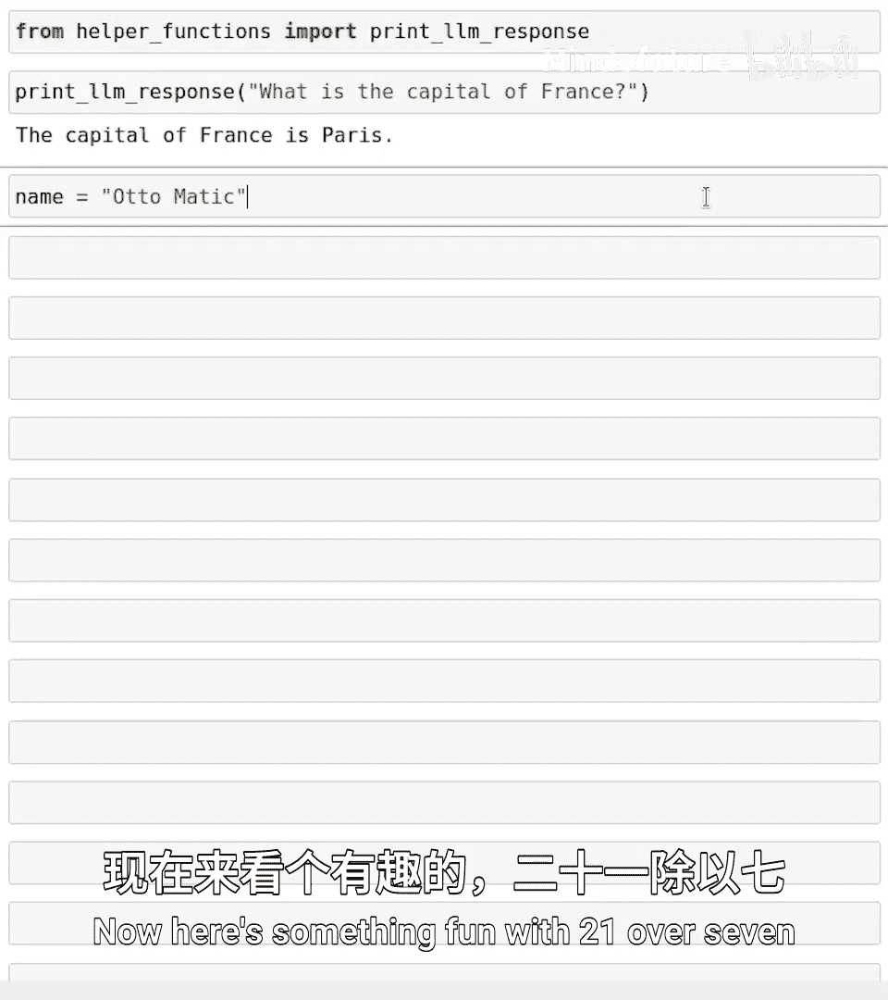
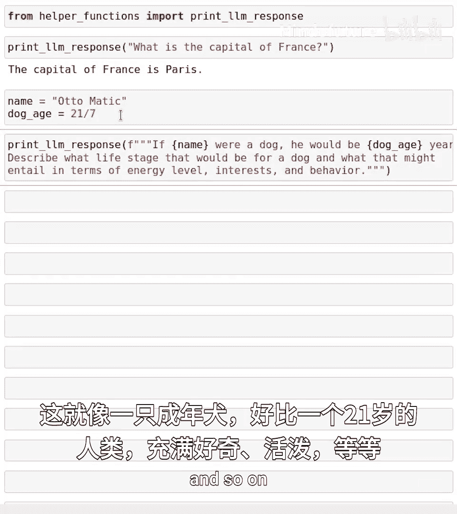
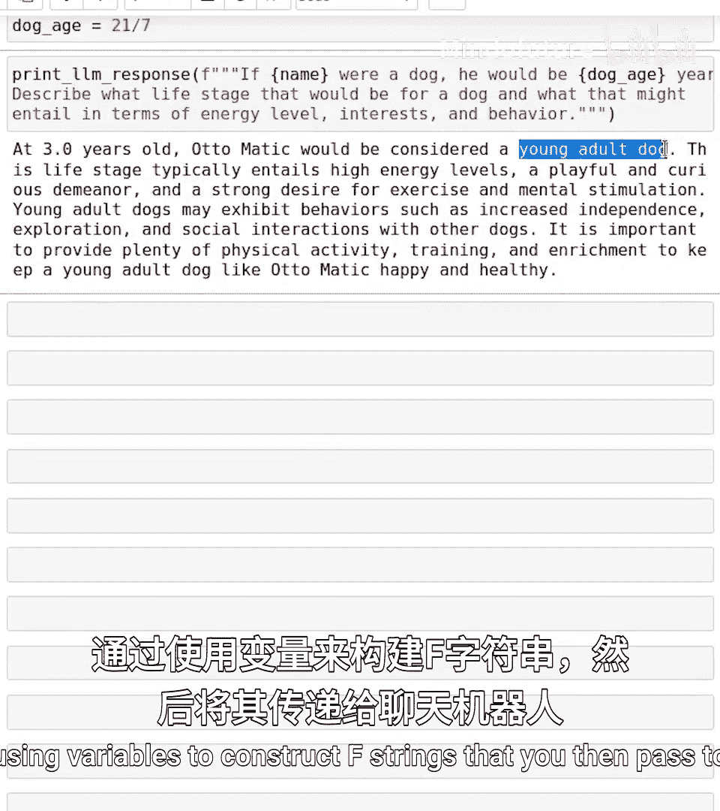
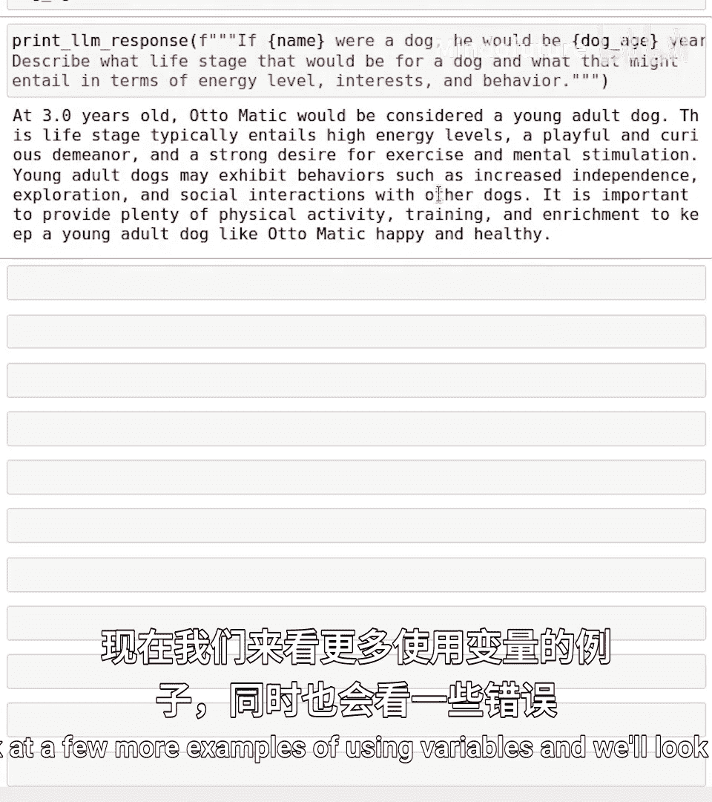
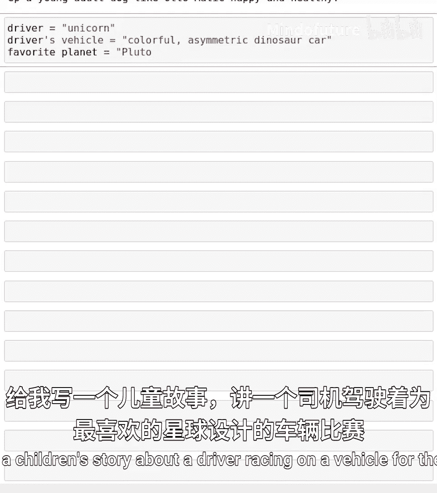
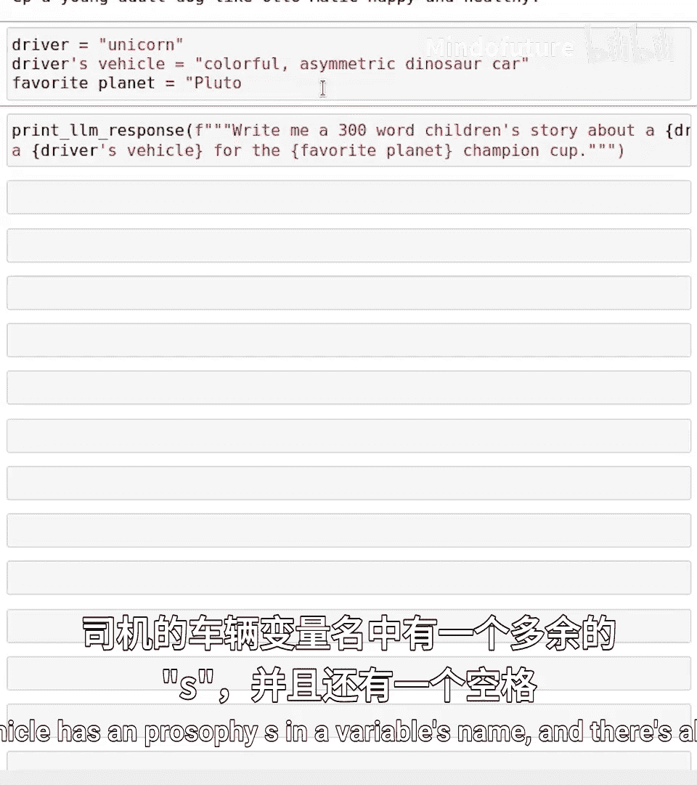
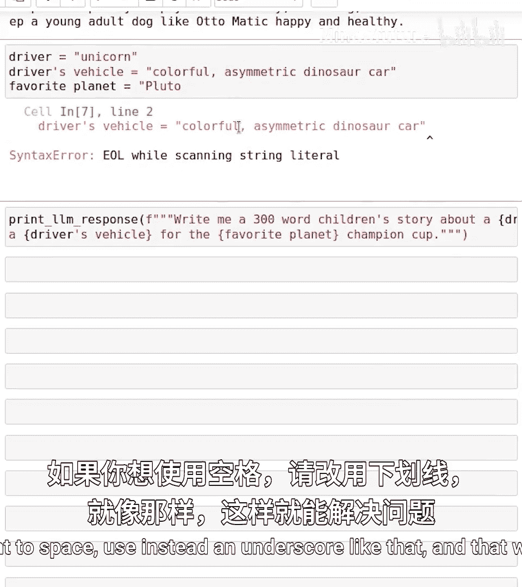
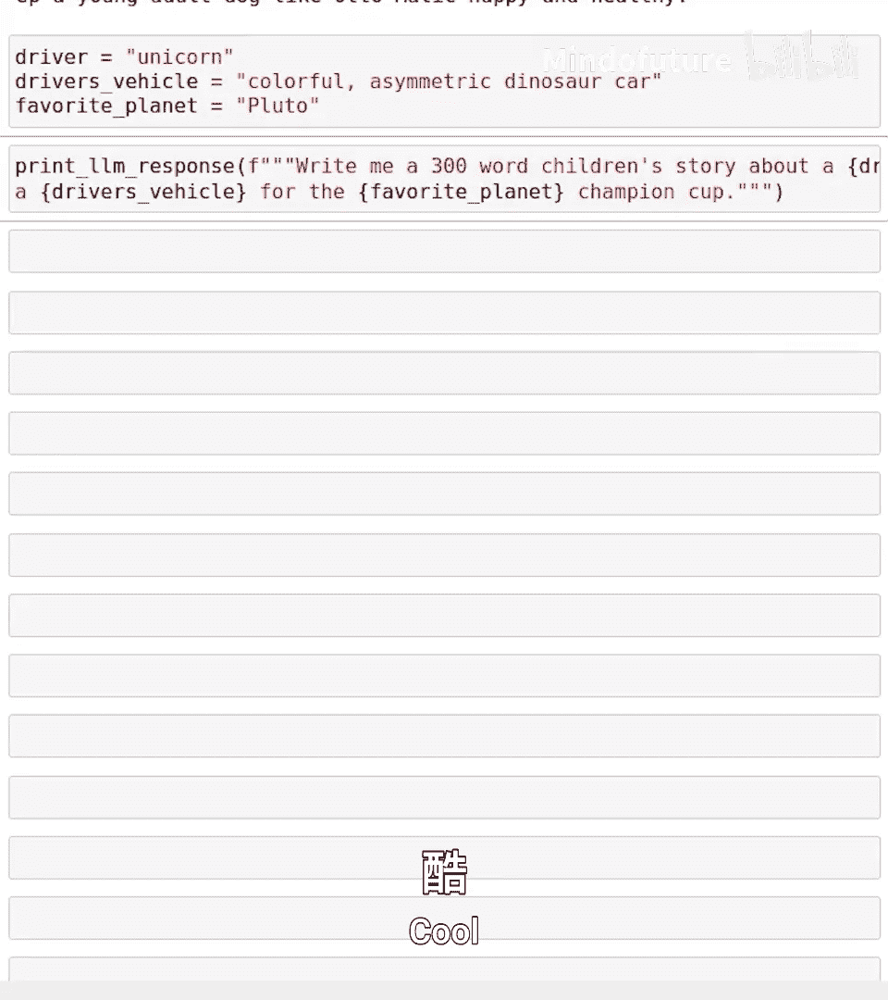

# 010：使用变量构建LLM提示 🧠

在本节课中，我们将要学习如何利用Python中的变量和F字符串，来动态构建用于与大语言模型（LLM）交互的提示词。我们将看到如何通过编程方式与AI模型对话，并学习在构建提示词时如何避免常见的错误。

## 概述

上一节我们介绍了如何组合变量和F字符串来定制字符串。本节中，我们来看看如何将这一模式扩展到创建提示词，从而在Python程序中与AI模型进行交互。

## 加载辅助函数

首先，我们需要运行以下代码来加载一个辅助函数：

```python
from helper_functions import print_llm_response
```

不必过于担心这行代码的具体细节。请记住，运行代码单元格时，请务必按照从第一个到最后一个（即从上到下）的顺序执行。

这行代码的作用是加载一个函数，该函数允许你通过Python代码直接与大语言模型交互。

## 调用大语言模型

要使用这个函数，你可以输入 `print_llm_response`，然后在括号内输入提示词字符串。例如：



```python
print_llm_response("What is the capital of France?")
```

这段代码实际上会调用ChatGPT，并返回答案：“The capital of France is Paris.”

括号内的字符串就是**提示词**，它与你在ChatGPT等聊天机器人的网页界面中直接输入的文本是同一类型。

现在，你可以运用目前所学的所有Python编程知识，来构建包含变量的复杂提示词，然后通过这段代码将其传递给大语言模型。





## 使用变量构建动态提示词



以下是一个有趣的例子。我们使用变量和F字符串来动态生成提示词：

```python
age = 21 / 7
print_llm_response(f"Write a short bio for a {age} year old human.")
```



运行后，模型可能会生成类似这样的回答：“Okay, this would be an adult... playful and so on.”

通过使用变量构建F字符串，然后将其传递给聊天机器人，你可以获得非常有趣且富有深度的回答。

## 识别并修复代码错误

现在，让我们看几个使用变量的例子，并学习如何发现和修复其中的错误。





假设我们想写一个儿童故事，其中包含驾驶员、车辆和星球等变量。以下是初始代码，但其中存在一些错误：

```python
driver = "unicorn"
drivers vehicle = "colorful asymmetric diesel car"
planet = "Pluto
prompt = f"Write a children's story where the {driver} drives a {drivers vehicle} on the planet {planet}."
print_llm_response(prompt)
```

这段代码有几处问题。我鼓励你暂停视频，看看是否能发现错误所在。

让我们自己运行一下这段代码。实际上错误不少：
1.  `drivers vehicle` 这个变量名中有一个撇号和一个空格。在Python中，变量名不能包含空格。如果想表示“驾驶员的车辆”，应使用下划线，例如 `drivers_vehicle`。
2.  变量 `planet` 的字符串赋值缺少了闭合引号。
3.  在F字符串的 `{}` 中，如果引用变量名，不能包含空格。



以下是修复后的正确代码：

```python
driver = "unicorn"
drivers_vehicle = "colorful asymmetric diesel car"
planet = "Pluto"
prompt = f"Write a children's story where the {driver} drives a {drivers_vehicle} on the planet {planet}."
print_llm_response(prompt)
```

运行修复后的代码，语言模型就能为我们生成一个约300字的儿童故事了。

我鼓励你尝试插入不同的驾驶员、车辆和星球，运行代码，获得属于你自己的儿童故事。

## 练习与回顾

本节课即将结束。请务必查看Jupyter笔记本末尾的练习题，以练习你的代码编写和调试技能。和之前一样，如果你遇到困难，记得可以使用聊天机器人来帮助你完成这些练习。

在本节课中，我们看到了几个函数，如 `print` 和本节课引入的 `print_llm_response`。在之前的视频中，我们还看到了 `type` 函数。在下一个视频中，我们将更深入地探讨函数：它们是什么以及如何使用。下节课见！