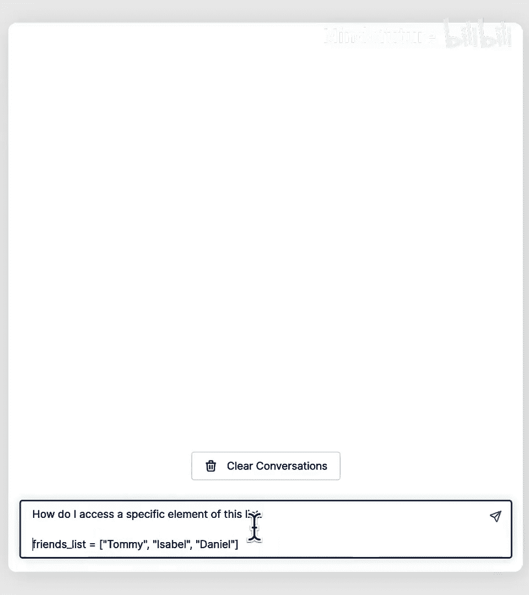
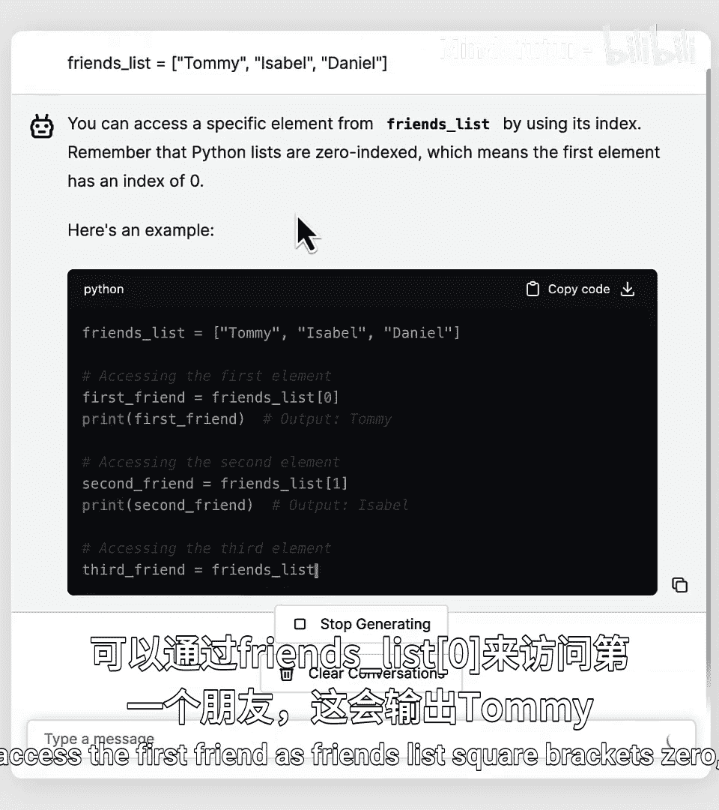
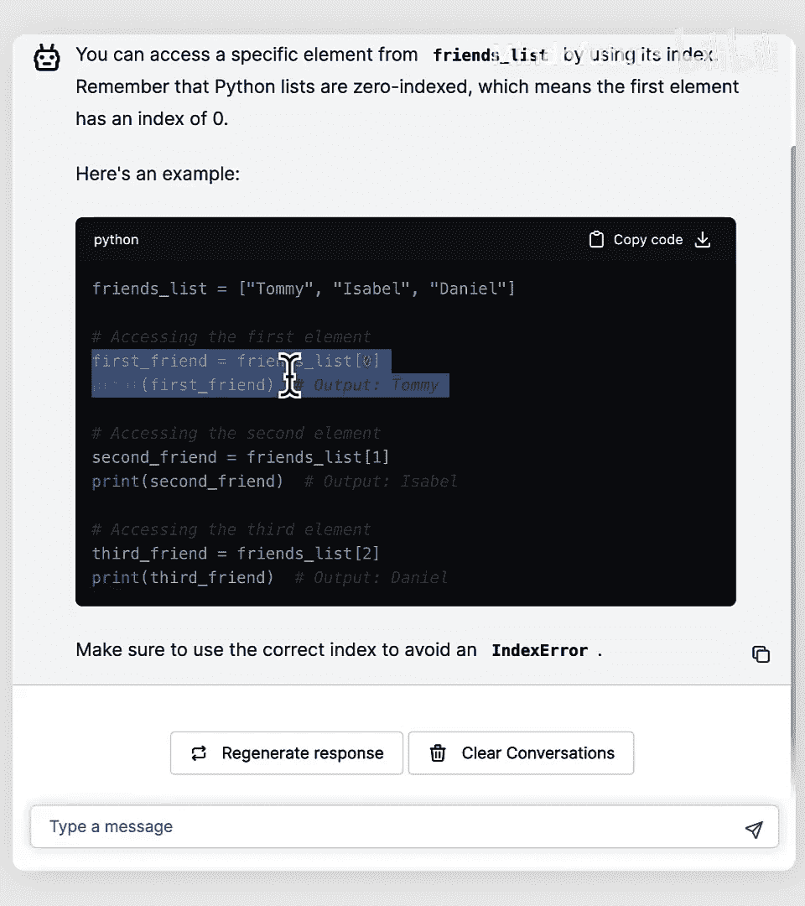
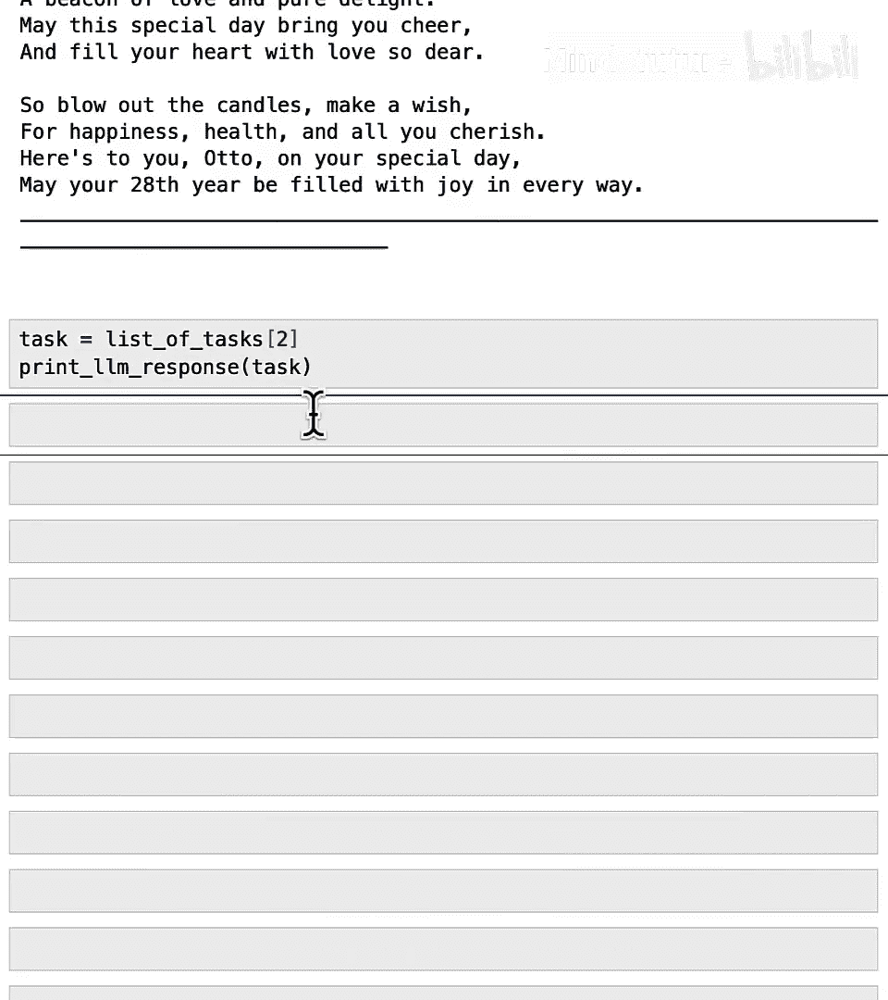

# 013：利用AI完成任务列表 🧾

在本节课中，我们将学习如何使用Python中的**列表**来存储多个数据项，并利用AI自动处理列表中的任务。你将学会如何创建、访问和修改列表，为后续学习更高效的循环操作打下基础。

## 概述 📋

在前面的课程中，我们处理的数据通常是单个项目，例如一个名字或一个年龄。Python提供了一种称为**列表**的功能，可以同时存储多个数据项。这将使你能更轻松地指示Python为你执行重复性任务。

## 创建你的第一个列表

让我们从导入本课程将使用的一些函数开始。

```python
# 导入所需函数
```

现在，假设我想为我的三位朋友写一首诗。我们可以使用大型语言模型来完成这个任务。首先，我将变量`name`设置为我的第一位朋友的名字“Tommy”。

```python
name = "Tommy"
```

接下来，使用你在上一课程中学到的f-string来构建提示词。

```python
prompt = f"写一首完整的生日诗给我的朋友{name}。这首诗的灵感应来自我朋友名字的首字母。"
print(prompt)
```

运行后，AI生成了一首很棒的诗。😊

现在，我想为另外两位朋友Isabel和Daniel也写诗。按照之前的做法，我需要重复三次：修改变量`name`的值，然后运行提示词并打印响应。这个过程有些重复。

使用Python的列表，你可以同时存储所有三位朋友的名字，从而找到一种更高效的方法来生成这三首诗。

## 理解列表的工作原理

以下是创建第一个列表的方法。

```python
friends_list = ["Tommy", "Isabel", "Daniel"]
```

这段代码创建了一个名为`friends_list`的新变量，它存储了三个数据项：“Tommy”、“Isabel”和“Daniel”。如果你告诉Python打印`friends_list`，它会输出这个列表。

你可以将列表想象成一组小盒子或卡片，每个盒子可以存放一个数据项。`friends_list`就像一辆将这些小盒子组装在一起的拖拉机。

每个小盒子还有一个与之关联的编号，分别是0、1和2。需要注意的是，在Python编程语言中，计数是从0开始的，而不是从1开始。因此，第一个盒子（“Tommy”）的编号是0，第二个（“Isabel”）是1，第三个（“Daniel”）是2。这些编号在我们想要引用列表中的特定项目（有时称为元素）时非常重要。

## 列表的创建与基本操作

让我们回顾一下创建列表所需的确切代码。

*   **变量名与赋值**：`friends_list`是列表的名称，等号表示将`friends_list`设置为右侧的列表值。
*   **方括号**：方括号`[]`表示列表的开始和结束。
*   **元素与分隔符**：中间是列表的元素或项目，由逗号`,`分隔。

你可以使用`type()`函数来检查`friends_list`的类型，会发现它是`list`类型。同样，你可以使用`len()`函数来获取列表的长度。

```python
print(type(friends_list))  # 输出：<class 'list'>
print(len(friends_list))   # 输出：3
```

现在，你创建了一个同时存储所有三位朋友名字的列表。我可以创建一个像这样的提示词：

```python
prompt = f"为我的朋友{朋友列表}写一首完整的生日诗。"
print(prompt)
```

这会生成一个包含列表的提示词。虽然提示词中直接显示方括号可能不是最佳写法，但大型语言模型足够智能，能够理解并生成三首诗。

## 访问列表中的特定元素

既然`friends_list`包含了“Tommy”、“Isabel”和“Daniel”，我们如何访问其中一个名字呢？我们可以询问AI聊天机器人。





根据聊天机器人的回答，你可以通过**索引**来访问列表中的特定元素。索引就是每个元素对应的编号（从0开始）。



```python
# 访问第一个朋友（索引0）
print(friends_list[0])  # 输出：Tommy
# 访问第二个朋友（索引1）
print(friends_list[1])  # 输出：Isabel
# 访问第三个朋友（索引2）
print(friends_list[2])  # 输出：Daniel
```

请注意，这里使用的是**方括号**`[]`，而不是圆括号`()`。如果使用圆括号，代码将无法工作并会报错。遇到错误是编码过程中的正常部分，你可以尝试使用圆括号来观察错误信息。

如果你尝试打印一个不存在的索引（例如`friends_list[3]`），Python会报错“list index out of range”（列表索引超出范围），因为列表中只有索引0、1和2。如果你想更易懂地解释错误信息，可以将其复制到聊天机器人中询问。

## 修改列表：添加与删除元素

Python还提供了修改列表中元素的便捷工具，你可以添加、删除或编辑项目。

**添加元素**：你可以使用`.append()`方法在列表末尾添加一个新元素。

```python
friends_list.append("Aldo")
print(friends_list)  # 输出：['Tommy', 'Isabel', 'Daniel', 'Aldo']
```

**删除元素**：你可以使用`.remove()`方法从列表中删除一个特定的元素。

```python
friends_list.remove("Tommy")
print(friends_list)  # 输出：['Isabel', 'Daniel', 'Aldo']
```

这就像在追踪需要发送生日贺卡的朋友列表，当已经给Tommy寄出贺卡后，就可以将他从列表中移除。

## 列表可以存储各种类型的数据

到目前为止，我们一直使用列表来存储字符串（人名）。实际上，列表可以存储其他类型的数据。

例如，如果你想存储朋友的年龄，可以创建一个包含三个数字（整数）的列表。

```python
ages_list = [25, 30, 28]
print(ages_list)  # 输出：[25, 30, 28]
```

## 实践：使用列表管理任务

在本课程后面，我们将使用Python来帮助优先处理待办任务。以下是一段较长的代码，创建了一个任务列表。

```python
list_of_tasks = [
    "给老板写一封简短的电子邮件，解释我明天开会会迟到。😊",
    "为Aldo读生日诗",
    "写一篇关于电影《降临》的评论"
]
```

在Python中，你可以将列表分布在多行代码上，这比将所有内容放在一行中更容易输入和阅读。列表中的每个字符串都是一项可以由大型语言模型处理的任务。

我们可以通过索引逐一处理这些任务：

```python
task = list_of_tasks[0]
# ... 使用AI处理任务0（写邮件）
task = list_of_tasks[1]
# ... 使用AI处理任务1（读诗）
task = list_of_tasks[2]
# ... 使用AI处理任务2（写影评）
```

通过编写这三段代码，我们分别处理了待办事项列表中的不同元素。但这仍然有些重复，我们必须手动输入并运行这段代码三次来分别处理列表的每个元素。



实际上，如果你的待办事项列表有10个或20个项目，手动输入和运行代码20次会相当繁琐和重复。

## 总结 🎯

在本节课中，我们一起学习了：
1.  **列表的创建**：使用方括号`[]`和逗号`,`来存储多个数据项。
2.  **列表的访问**：通过**索引**（从0开始）来获取列表中的特定元素，例如`list_name[0]`。
3.  **列表的修改**：使用`.append()`方法添加元素，使用`.remove()`方法删除元素。
4.  **列表的多样性**：列表可以存储字符串、整数等多种类型的数据。
5.  **列表的应用**：将任务存储在列表中，为自动化处理奠定了基础。

然而，逐个处理列表项的方法效率不高。在下一个视频中，你将学习一种更佳的方法——**for循环**。这是一种指示Python为你反复执行任务的方式。让我们进入下一个视频，看看它的实际应用。