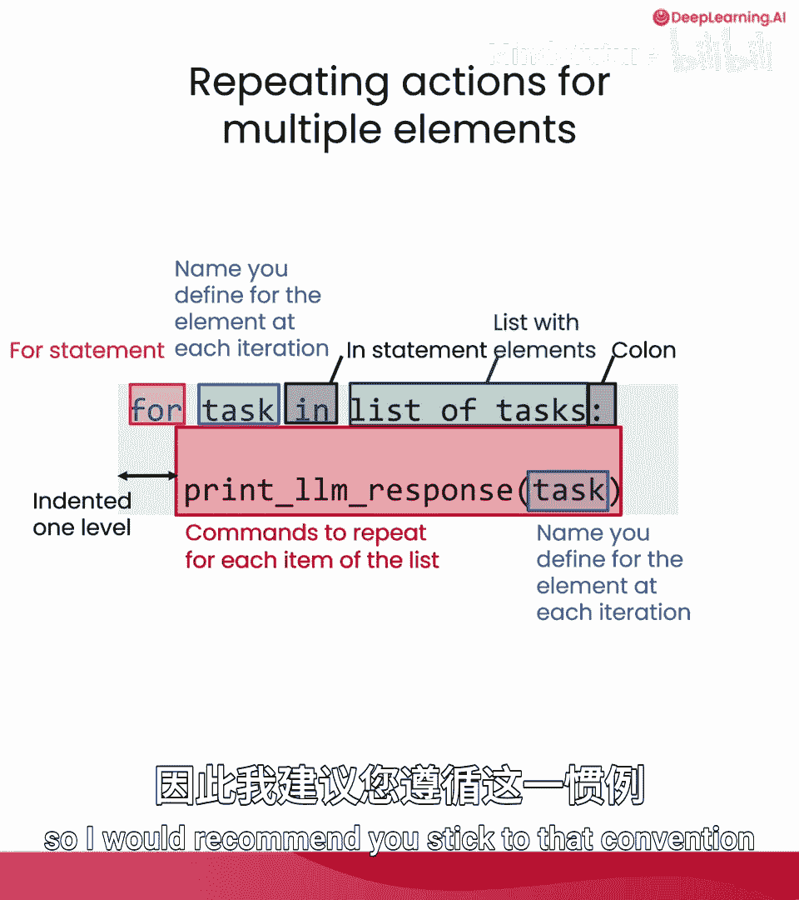
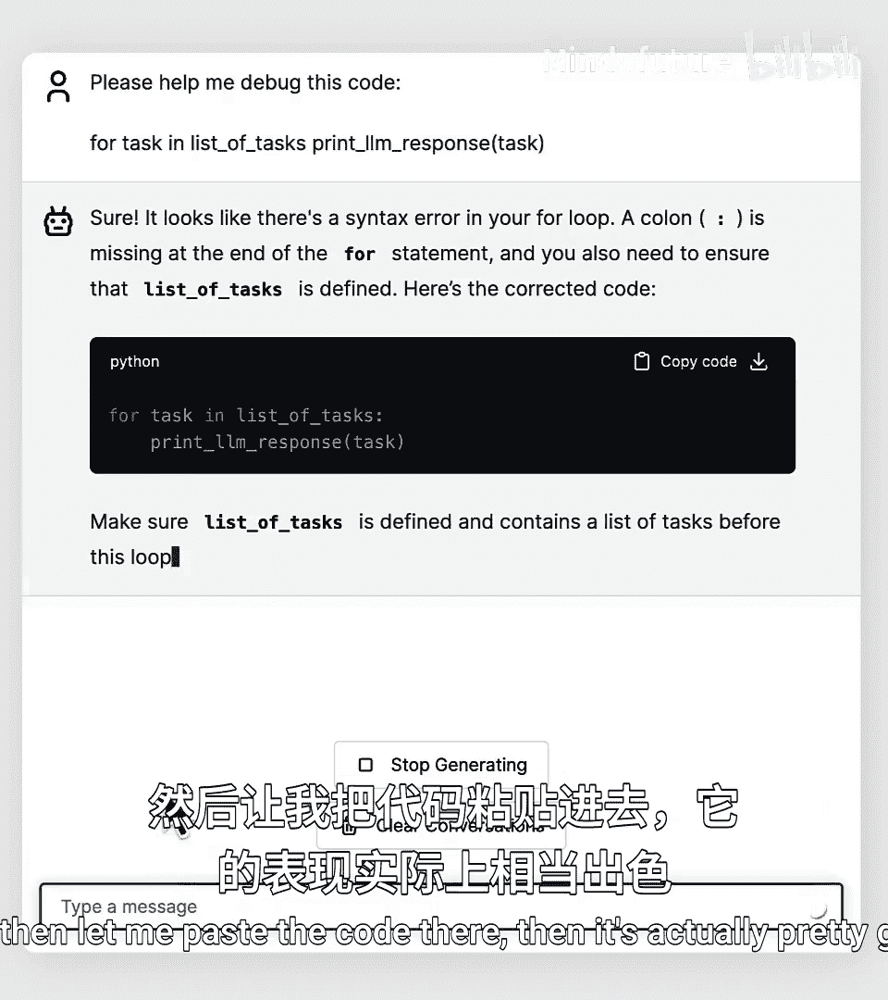
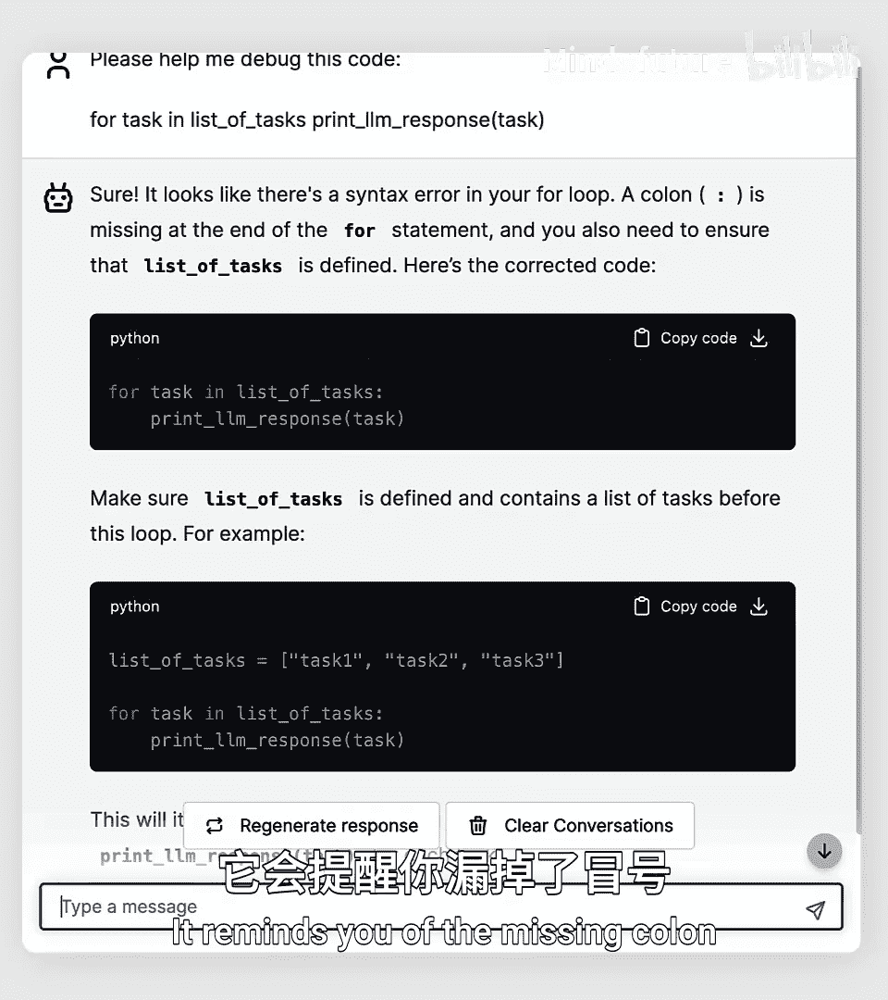
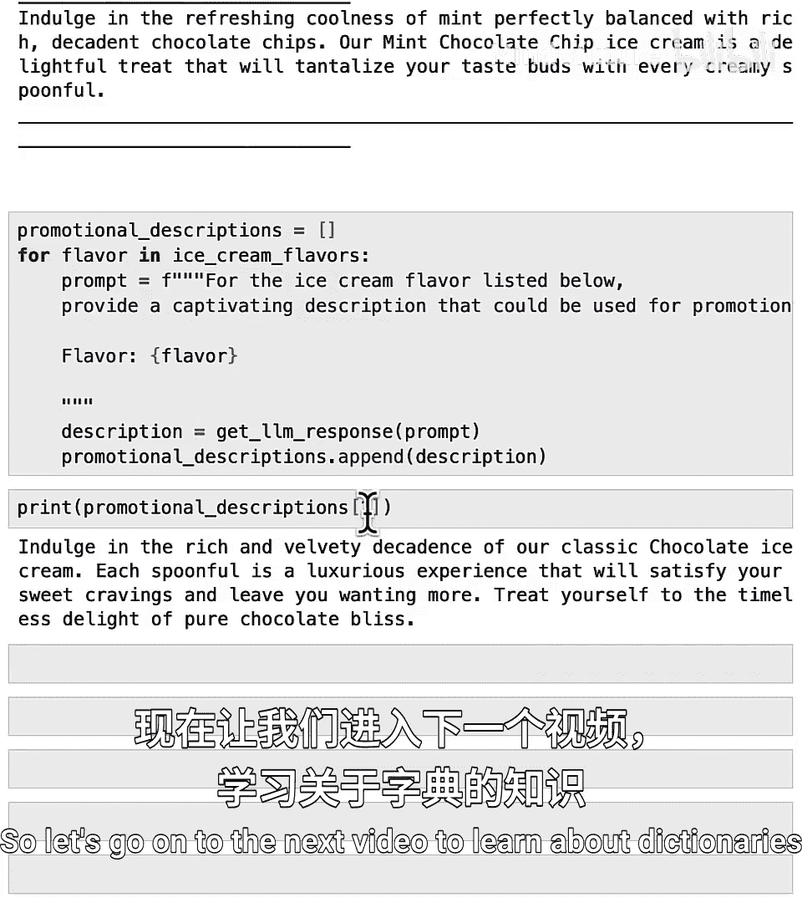

# 014：使用for循环重复任务 🚀

在本节课中，我们将学习编程中一个非常重要的概念：**for循环**。这是一种在许多编程语言中都存在的特殊代码模式或命令，它允许你告诉计算机以自动化的方式对列表中的所有项目重复执行操作，而无需一遍又一遍地重写代码。

## 什么是for循环？ 🔄

上一节我们介绍了列表的基本操作。本节中我们来看看如何高效地处理列表中的多个项目。

for循环允许你为列表中的每个元素重复执行一组命令。如果你有一个包含许多数据项的列表，for循环可以让你告诉计算机对第0项、第1项、第2项等所有项目执行相同的操作。

以下是for循环的基本代码结构：
```python
for task in list_of_tasks:
    print(get_response(task))
```
这段代码在普通英语中的意思是：对于`list_of_tasks`中的每个`task`，打印出对该任务的响应。

这段被称为for循环的代码，等同于编写以下所有不同的代码行：
```python
print(get_response(list_of_tasks[0]))
print(get_response(list_of_tasks[1]))
...
```
对于列表中有多少个元素，就需要写多少行。

## for循环的组成部分详解 🧩



让我们详细解析这段代码的每个部分：
*   `for`：这是一个for命令或for语句。
*   `task`：这是你为变量定义的名称，它将依次取`list_of_tasks[0]`、`list_of_tasks[1]`、`list_of_tasks[2]`等值。因此，`task`将轮流取列表`list_of_tasks`中不同元素的值。
*   `in`：这是另一个特殊的Python关键字。
*   `list_of_tasks`：这是我们想要遍历的、包含元素的列表。
*   `:`：我们使用冒号来告诉Python，我们想要对列表中每个项目运行的命令从哪里开始。

这段代码的一个特殊部分是这里有四个空格。在编码中，我们称之为**缩进**，这只是意味着`print(get_response(task))`被缩进或向右移动了四个空格。按照惯例，Python程序员使用四个空格，因此建议你遵守这个惯例。

## for循环实战演示 💻

让我们看看这段代码的实际运行。我们已经将`list_of_tasks`设置为等于上面的列表。所以我要输入：
```python
for task in list_of_tasks:
    print(task)
```
因为我写了一个冒号，当我按回车时，Python已经知道我想要缩进这四个空格，所以它把我的光标移到了那里。然后我输入`print(task)`。这段代码的作用是：对于这个包含三个任务的列表中的每个任务，打印出该任务。如果我运行它，你会看到`task`每次都被列表`list_of_tasks`中的一个项目替换。

现在，让我们运行一个更完整的例子：
```python
for task in list_of_tasks:
    print(get_response(task))
```
运行需要一点时间。这是第一个任务的响应，这是第二个任务（生日祝福）的响应，这是第三个任务（评论）的响应。





## 常见错误与调试 🐛

为了展示使用for循环时的一些常见错误，如果我没有在这里使用四个空格缩进，而是不缩进就运行它，这会产生错误。但如果你在那里缩进四个空格（四个空格是惯例），那么这就会正常工作。

另一个使用for循环的常见错误是忘记这里的冒号。如果你看到类似“语法错误：期望冒号”的错误，但不确定具体该怎么做，你可以向你的AI聊天机器人伙伴求助。例如，你可以说：“请帮我调试这段代码。”很多时候，我们只是漏掉了代码中的一个冒号或一个字符。自从AI聊天机器人广泛可用以来，我们能够将代码复制粘贴到聊天机器人中，让它帮助我们找出可能的问题，这已经帮助许多程序员更高效地发现和修复错误。

## 应用实例：生成冰淇淋口味描述 🍦

以下是另一个例子，我们将使用大型语言模型来自动化一项写作任务，特别是创建冰淇淋口味描述。

这里有一些冰淇淋口味。如果你想获得每种冰淇淋口味的描述，也许是因为你正在为网站撰写营销文案，你可以这样做：
```python
ice_cream_flavors = [“香草”, “巧克力”, “草莓”, “薄荷巧克力片”]
for flavor in ice_cream_flavors:
    prompt = f”对于下面列出的冰淇淋口味，提供一个用于促销目的的吸引人描述。\n\n口味：{flavor}”
    print(get_response(prompt))
```
运行这段代码，你会得到香草冰淇淋的描述、巧克力冰淇淋的描述（实际上是我的最爱）、草莓冰淇淋的描述以及薄荷巧克力片冰淇淋的描述。

需要指出的是，这整个代码块都是缩进的。这意味着所有这些代码都向右移动了四个空格，Python通过查看哪些代码被缩进来判断哪些代码是你想要为每个冰淇淋口味运行四次的代码。

相比之下，如果你这样写，代码将无法工作，因为这会导致Python运行`prompt = ...`四次（分别是香草、巧克力等），但从不调用`print(get_response(prompt))`，只有在运行完这段高亮代码四次后，才尝试打印`get_response`。因此，只有通过缩进所有这些代码，它才会运行所有这些代码四次，这才是你想要的。

当你运行这个代码块四次时，每次运行它，这个`flavor`变量都会取不同的值：先是“香草”，然后是“巧克力”、“草莓”、“薄荷巧克力片”。每次运行这段代码时，`prompt`变量都被设置为不同的值，因此`print(get_response(prompt))`会基于不同的提示词打印出响应。

## 构建结果列表 📝

现在，在我们结束这个视频之前，让我们看最后一个例子。我们有一个包含四种冰淇淋口味的列表。如果你想获取大型语言模型生成的描述，并将这些描述保存到它们自己的列表中，让我展示一下你可以怎么做。

我将创建一个新列表：
```python
promotional_descriptions = []
```
然后，我将创建一个空列表。所以输入左方括号，然后不往列表里放任何东西，我马上关闭右方括号。这就像一个后面没有拖任何车厢的拖拉机，这是一个空列表。

然后，这是我们要使用的代码：
```python
for flavor in ice_cream_flavors:
    prompt = f”对于下面列出的冰淇淋口味，提供一个用于促销目的的吸引人描述。\n\n口味：{flavor}”
    description = get_response(prompt)
    promotional_descriptions.append(description)
```
像往常一样记住冒号，然后所有这些代码都是缩进的，所以它将多次运行所有这些代码。

我们设置`prompt`为：“对于下面列出的冰淇淋口味，提供一个用于促销目的的吸引人描述。”然后我们将`description`变量设置为`get_response(prompt)`的返回值。所以`description`就是这些冰淇淋口味的美味描述之一。然后，我们将获取`promotional_descriptions`（它开始时是一个空列表），并将我们刚刚得到的`description`附加到它的末尾。

在目前看到的例子中，我们基本上都是用你需要的所有项目来初始化列表的，无论是朋友的名字列表、任务列表还是冰淇淋口味列表。但实际上，在Python中，从一个空列表开始，然后反复向该列表的末尾添加或附加项目，从而构建该列表，是一种非常常见的编码模式。

让我们运行这段代码。运行需要几秒钟，因为它现在要调用大型语言模型四次来生成这些描述。现在，如果我们打印`promotional_descriptions`，那么这就是所有四个描述的列表。以这种格式阅读有点困难，但如果我想打印出，比如说，巧克力冰淇淋（我的最爱）的描述，那么你可以打印`promotional_descriptions[1]`，因为它是我们列表中的第二个冰淇淋口味。

## 总结与展望 🎯

本节课中我们一起学习了for循环的强大功能。正如你所见，for循环和列表的结合非常强大，可以让你在Python中做很多事情。在这些例子中，我们使用的列表都很短，可能只有三四个项目，但想象一下能够遍历列表中的数百或数千个项目，那么你就可以让你的计算机为你重复执行数百或数千次操作。

现在，这种方法的一个限制是，如果你不知道项目在哪里，访问它们可能会很棘手。我碰巧记得巧克力冰淇淋是第1项，我可以在这里输入1，但如果你有几十种冰淇淋口味，并且不记得你喜欢的口味的确切编号，那么要弄清楚如何访问你想要的那个描述可能会更困难。



在下一课中，你将学习一种与列表有相似之处，但在查找和处理特定数据项方面可能更容易的新数据类型。这种数据被称为**字典**。在Python中，列表和字典是存储多个数据项集合的两种最重要的方式。