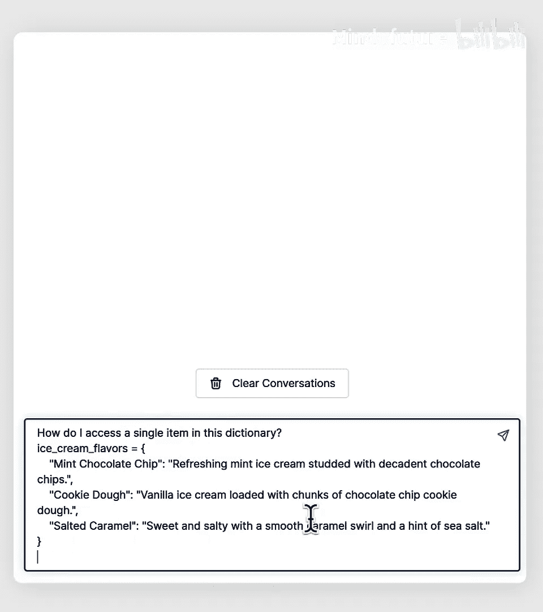
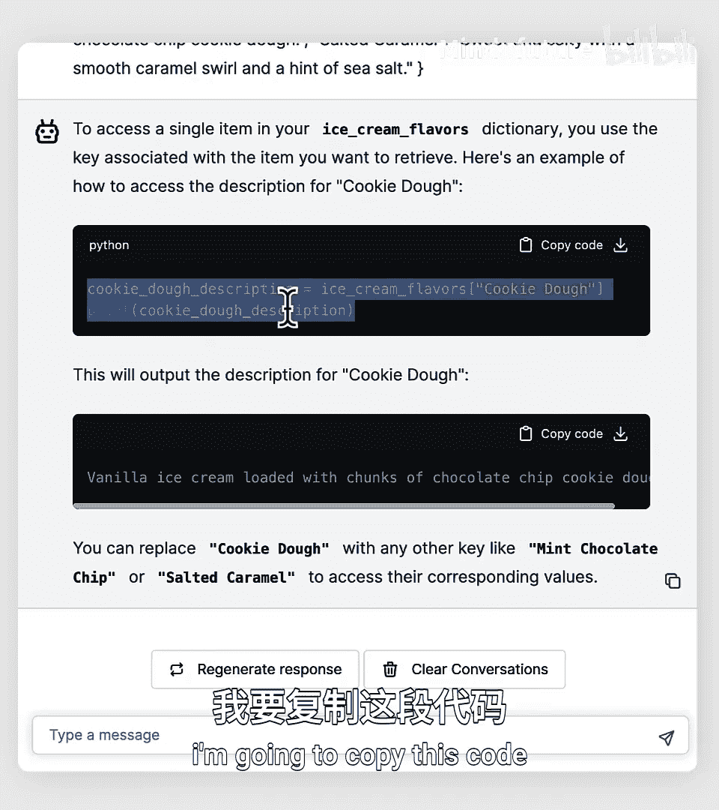
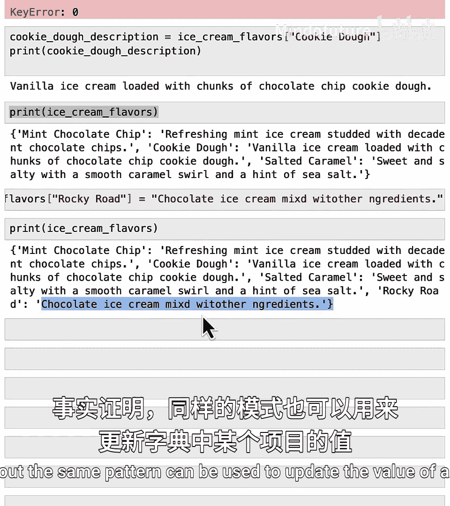
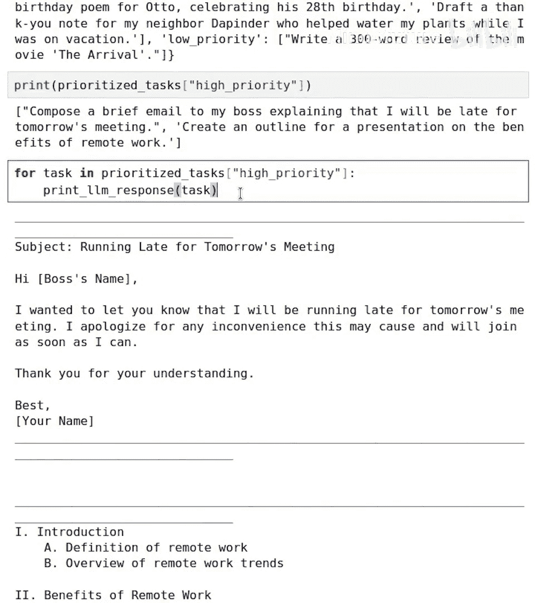

# 015：使用字典和AI对任务进行优先级排序 🗂️

在本节课中，我们将要学习Python中一种强大的数据结构——字典。我们将了解字典与列表的区别，学习如何创建、访问和修改字典中的数据。最后，我们将通过一个有趣的例子，学习如何使用字典来组织不同优先级的任务，并利用AI（大语言模型）来协助我们完成高优先级任务。

## 概述

列表是存储大量数据的好方法。如果你有一个长列表，并且想使用`for`循环对列表中的每个元素进行操作，这没有问题。但是，如果你想在列表中查找一个特定的元素或项目，却不知道该项目对应的编号或索引，那么访问这个项目就会变得困难。

Python中有另一种组织数据集合的方式，叫做**字典**。字典使得从数据集合中提取特定项目变得容易得多。我们将在本课中学习字典，并看到一个使用字典来为待办事项划分优先级（例如高、中、低）的有趣例子。

让我们深入了解字典的工作原理。

## 字典的基本概念

让我们像往常一样，先加载一些辅助函数。我将以冰淇淋口味及其描述为例。

这里有一个较长的冰淇淋口味及其描述的列表。使用这样的列表的问题是，如果你想查找特定冰淇淋口味（比如芒果冰淇淋）的描述，却不记得它对应的编号或索引，那么提取芒果冰淇淋的描述会相当困难。

Python中的字典灵感来源于人们用来查询单词含义的真实世界字典。在纸质字典中，你可能有像“Avocado”这样的单词，然后是它的定义；另一个单词如“Apple”，然后是它的描述或定义。

在Python中，有类似的从单词到定义的映射，只不过我们称之为**键**和**值**。例如，你可能有一个键，代表“薄荷巧克力片冰淇淋”这个概念，它映射到该口味的描述。另一个不同的键“曲奇面团”则映射到曲奇面团的描述。

以下是用于定义字典的Python代码片段。这里我们将`ice_cream_flavors`设置为一个字典，其中“薄荷巧克力片”映射到这个描述，“曲奇面团”映射到那个描述。让我们详细分析这段代码的所有组成部分。

## 创建字典

我在这里用蓝色高亮显示的是字典的**键**，用橙色高亮显示的是**值**。在字典中，不同的键（冰淇淋口味）映射到不同的值（在本例中是描述）。注意，键和值之间用冒号分隔。这里，`ice_cream_flavors`是我们正在定义的字典的名称，等号是通常的赋值运算符。

要定义字典，你需要使用花括号来开始和结束字典内容的定义。同时，我们用逗号分隔字典中不同的键值对，这就是为什么那里有一个逗号。

让我们来定义这个字典。我将输入：
```python
ice_cream_flavors = {
    "mint chocolate chip": "description of mint chocolate chip",
    "cookie dough": "description of cookie dough",
    "salted caramel": "description of salted caramel"
}
```
现在我已经将`ice_cream_flavors`定义为一个包含三个键和值的字典。再次指出字典和列表之间的一些关键区别。首先，如你所见，我们使用花括号而不是方括号。其次，每行有两个项目（两个字符串），而不是每行一个字符串。这两个字符串分别是键（第一个字符串）和值（第二个字符串），它们之间用冒号分隔。

因为字典有键和值，我们有时会说Python中的字典存储了一组**键值对**，其中每一行都是一个键值对。



如果你想查看键，我可以打印`ice_cream_flavors.keys()`，这会打印出预期的三个名称。如果你想打印值，那么我们可以运行`ice_cream_flavors.values()`，这会打印出字典的值。



## 访问字典中的项目

字典可能看起来有点像列表，但它们的行为不同。如果你试图通过`print(ice_cream_flavors[0])`来访问这个字典中的第一个项目，这将不起作用，因为没有“第零个元素”这样的概念。这只会生成一个错误消息。

那么如何访问字典中的单个项目呢？让我们尝试询问一个聊天机器人。我将询问“如何访问字典中的特定项目”。它说：`cookie_dough_description = ice_cream_flavors["cookie dough"]` 和 `print(cookie_dough_description)`。让我们试一试。

我将在我的Jupyter笔记本中粘贴这段代码并运行它。它打印出了曲奇面团冰淇淋的描述。所以，访问字典中特定项目的代码是：字典名称`ice_cream_flavors`，然后是方括号。我知道这可能有点令人困惑：定义字典时使用花括号，而不是方括号；但在创建字典后，如果要访问字典中的特定项目，则使用方括号，方括号内是其中一个键。字典会查找是否存在名为“cookie dough”的键，如果存在，则返回或传递回与该键关联的值（描述），并将其存储在变量`cookie_dough_description`中。因此，当它打印出来时，就得到了曲奇面团口味冰淇淋的描述。

## 修改和添加字典项目

如果我打印`ice_cream_flavors`，会得到薄荷巧克力片、曲奇面团、咸焦糖。如果我想添加“Rocky Road”的描述，我会输入：
```python
ice_cream_flavors["rocky road"] = "chocolate ice cream mixed with other ingredients"
```
如果我现在再次打印所有内容，`ice_cream_flavors`字典现在已经扩展，将“rocky road”作为一个新键，映射到描述“chocolate ice cream mixed with other ingredients”。但是，我们这里有一些拼写错误。事实证明，相同的模式也可以用来更新字典中某个项目的值。如果我重新运行这段代码来修复错误，然后打印`ice_cream_flavors`，就会得到一个更新后的、错误已修复的描述。

## 字典可以存储多种数据类型

事实证明，字典可以保存各种数据。在我们使用的例子中，我们将冰淇淋口味映射到冰淇淋口味的描述，但字典也可以映射到数字，而不仅仅是字符串。例如，如果我想创建一个关于Isabel的字典，包含年龄28和最喜欢的颜色红色，那么我可以像这样构建字典：记住用花括号来构建字典，这里键“age”映射到数字28，键“favorite_color”映射到另一个字符串“red”。



如果我打印`isabel_facts`，最终会得到这个字典，其中一个值是整数，另一个值是字符串。所以字典可以将键映射到不同类型的数据，在本例中是字符串或数字。

现在，如果Isabel有三只猫，并且想存储所有猫的名字，我可能会创建一个列表。这里我创建了一个列表`[‘Charlie‘, ‘Biscuit‘, ‘Spooky Tabby‘]`，这是三只猫的名字。但是我如何存储这些猫的名字呢？我可以做的一件事是创建一个额外的键：
```python
isabel_facts["cat_names"] = ["Charlie", "Biscuit", "Spooky Tabby"]
```
在这个例子中，我获取`isabel_facts`字典，创建一个新键`cat_names`。与`cat_names`映射到单个字符串（如“red”）或单个数字（如28）不同，这个键`cat_names`现在映射到一个值，而这个值本身是一个包含所有三只猫名字的列表。

让我这样做，然后现在打印`isabel_facts`。你会看到这是一个字典，其中“age”映射到28，“favorite_color”映射到“red”，“cat_names”映射到一个列表。

这是另一个例子，我可以将Isabel最喜欢的零食设置为“pineapple cake”和“candy”。如果我在那之后打印`isabel_facts`，那么它就会有最喜欢的零食“pineapple cake”和“candy”。

## 实践：使用字典管理任务优先级

在结束本视频之前，我想通过一个有趣的例子，展示如何使用字典来帮助你跟踪和完成高优先级任务。

你之前看到了一个使用列表来跟踪一组任务的例子，那是一种不错的方式。但让我们提升我们的个人组织水平，将这些任务存储在三个列表中，按优先级组织我们的任务。

所以，`high_priority_tasks`是一个存储了这两个项目列表的变量。`medium_priority_tasks`是一个存储了这两个项目列表的变量。同样，`low_priority_tasks`是一个只包含一个项目的列表。

现在，让我们创建一个字典，将这三个列表放入字典中。我将输入：
```python
prioritized_tasks = {
    "high priority": high_priority_tasks,
    "medium priority": medium_priority_tasks,
    "low priority": low_priority_tasks
}
```
我们刚刚所做的是创建一个键为字符串“high priority”，该键映射到的值是`high_priority_tasks`，这是我们上面定义的变量。类似地，我创建了两个新键：“medium priority”是一个键，映射到我们上面定义的`medium_priority_tasks`列表；键“low priority”也是如此。

现在让我打印出`prioritized_tasks`。现在你会看到这是一个字典，其中“high priority”是一个字符串，映射到这两个项目的列表；“medium priority”是一个作为键的字符串，映射到这两个项目列表的值；同样适用于“low priority”。

现在，假设你想使用一个大语言模型来处理高优先级任务。我可以通过查找`prioritized_tasks["high priority"]`来查找高优先级任务。我实际上可以把它打印出来。这会打印出两个任务：“compose a brief email”和“create an outline for a presentation”。

所以，`prioritized_tasks`中键为“high priority”的值是一个包含两个项目的列表。还记得我们在上一课中用`for`循环看到的内容吗？让我们看看并弄清楚这可能会做什么。我将输入：
```python
for task in prioritized_tasks["high priority"]:
    print(llm_response(task))
```
运行这个，它会“compose a brief email”，然后“create an outline for a presentation on remote work”。如果你愿意，可以随意编辑此代码，让它也为你处理中优先级任务或低优先级任务。

## 总结

本节课中我们一起学习了关于字典的许多知识。你了解了字典与列表的区别，学习了如何创建字典、访问和修改其中的键值对，以及字典如何存储不同类型的数据（如字符串、数字和列表）。最后，我们通过一个实际例子，看到了如何使用字典来组织不同优先级的任务，并利用循环和AI来高效处理高优先级事项。



在下一课中，我们将进一步学习字典，特别是利用字典的键值对（尤其是值）来为大语言模型创建定制化的提示。我们将通过一个有趣的例子，使用大语言模型为我们编写定制的食物食谱。让我们在下一个视频中一起探索。