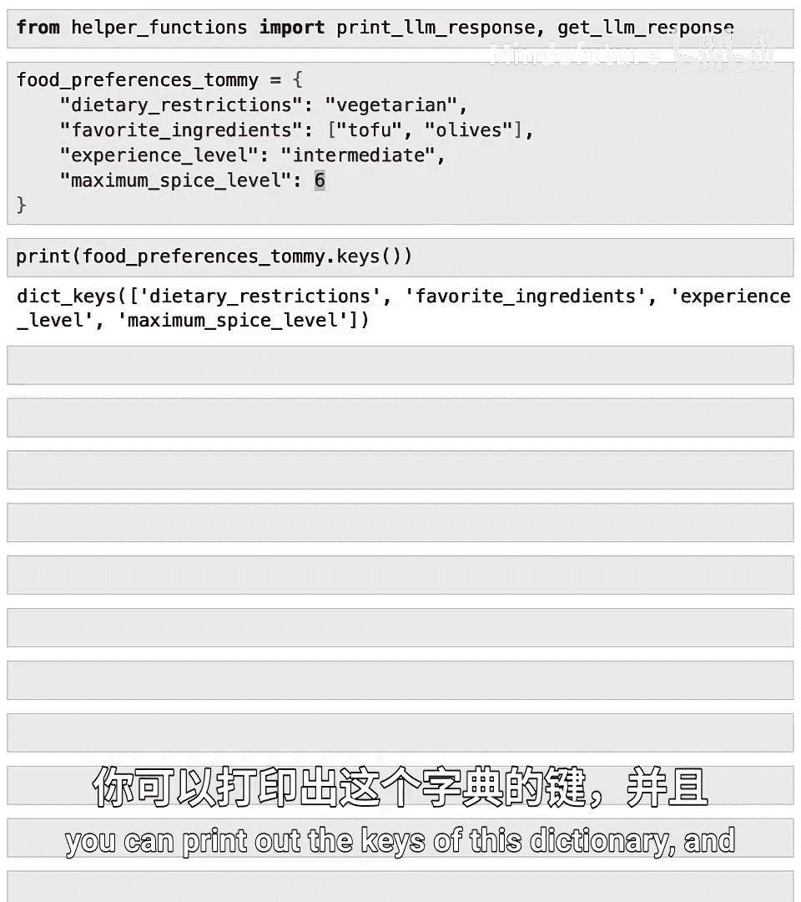
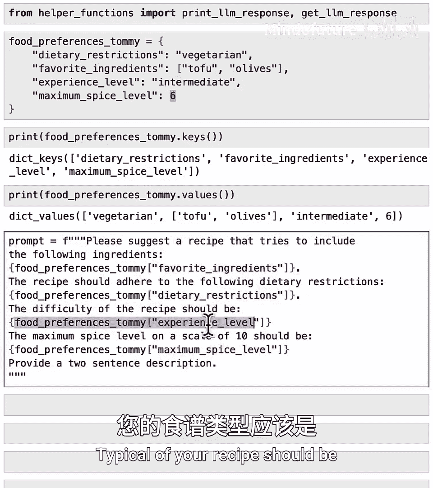
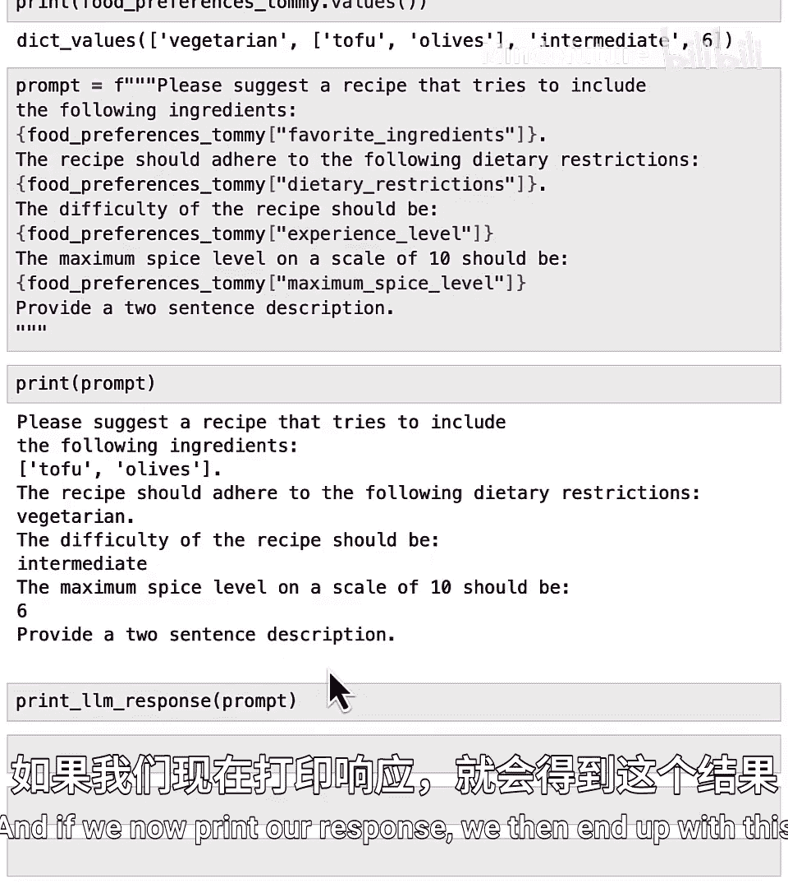
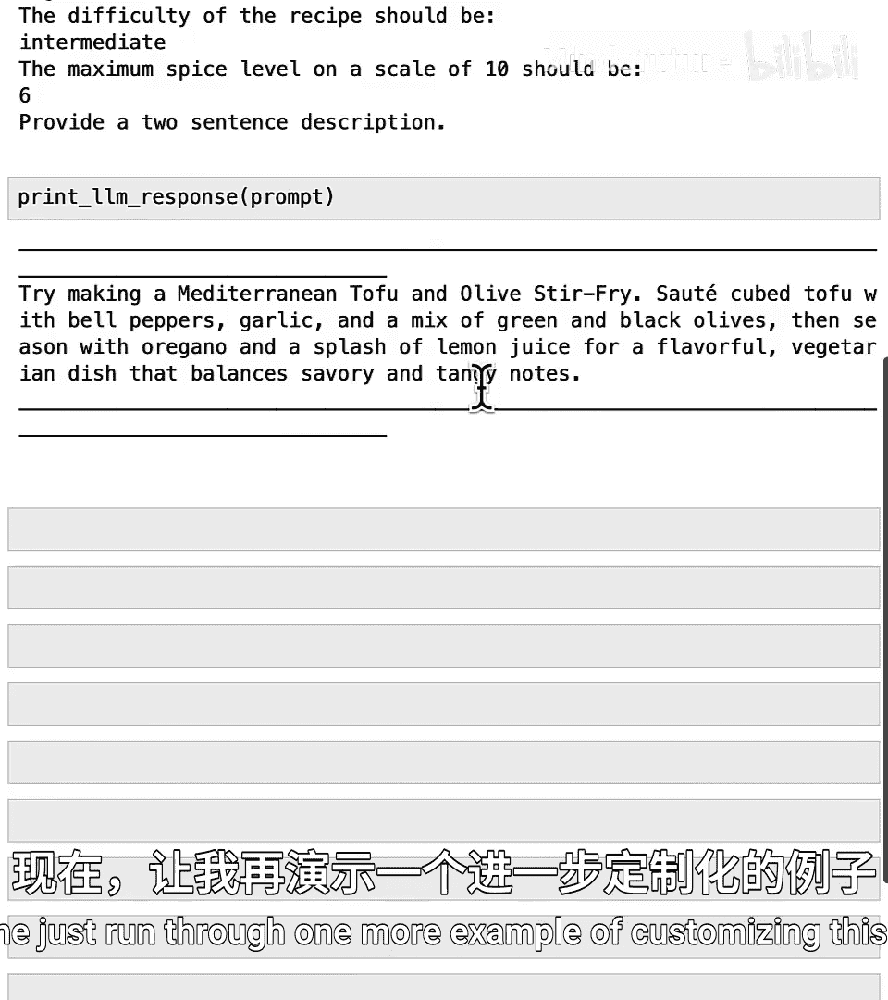
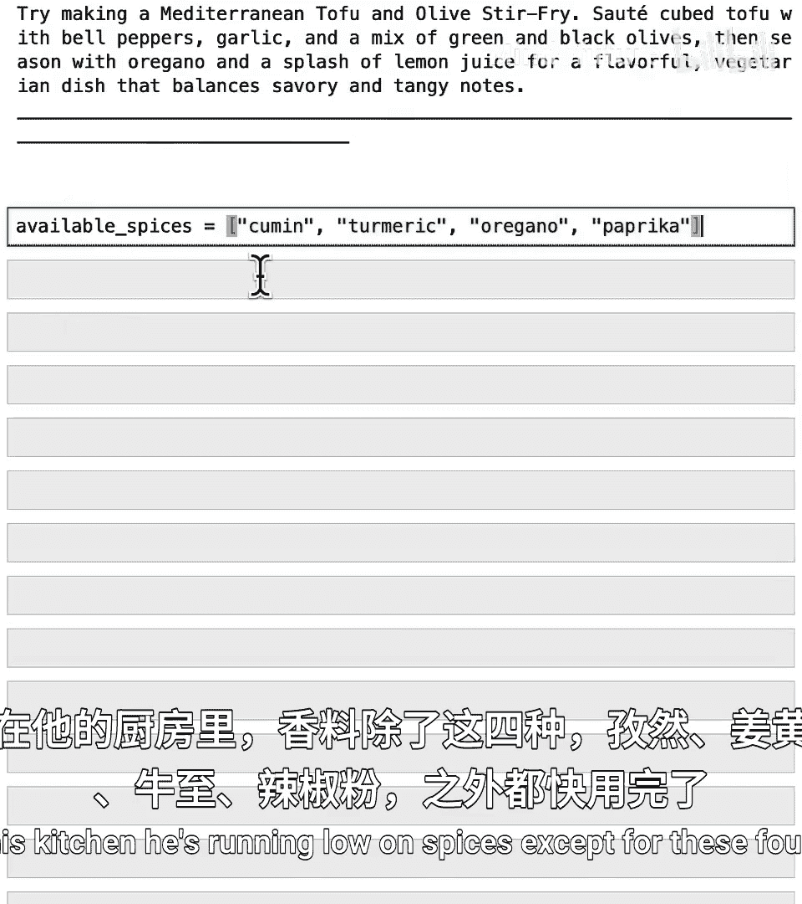
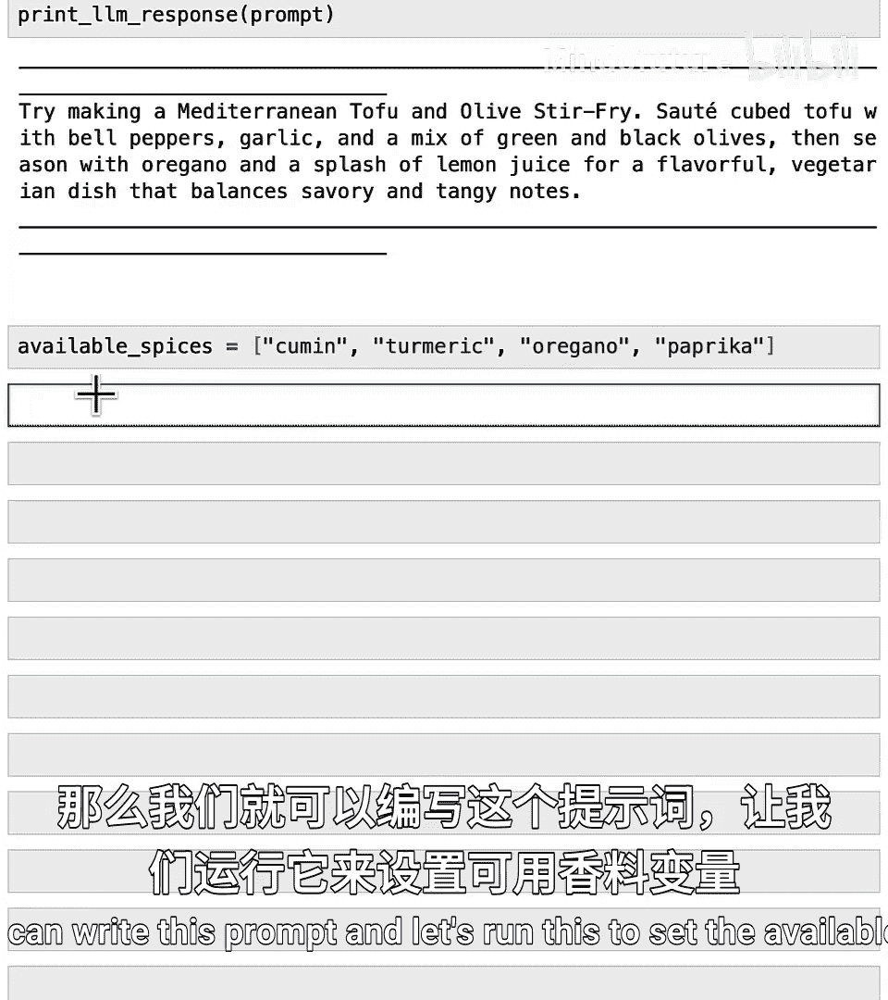
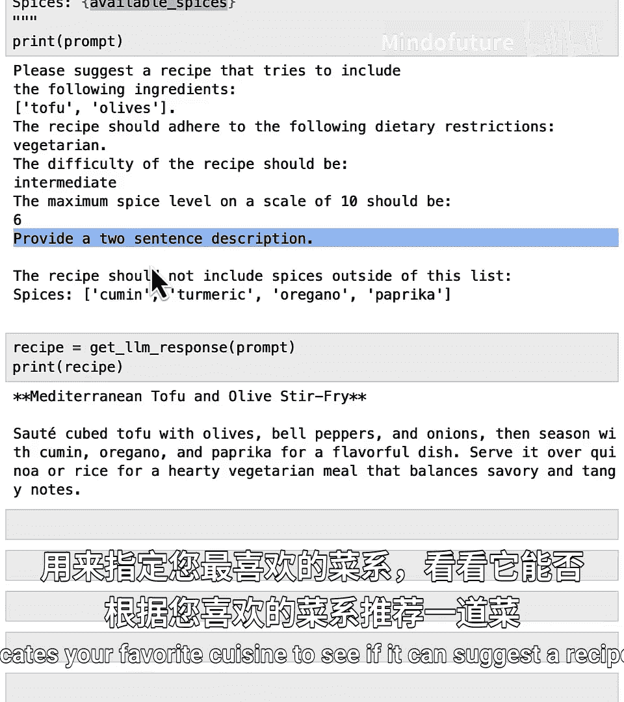
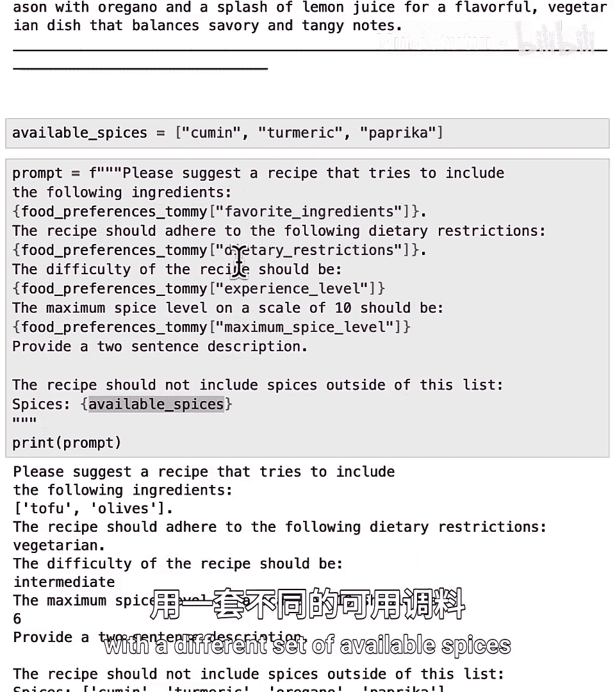
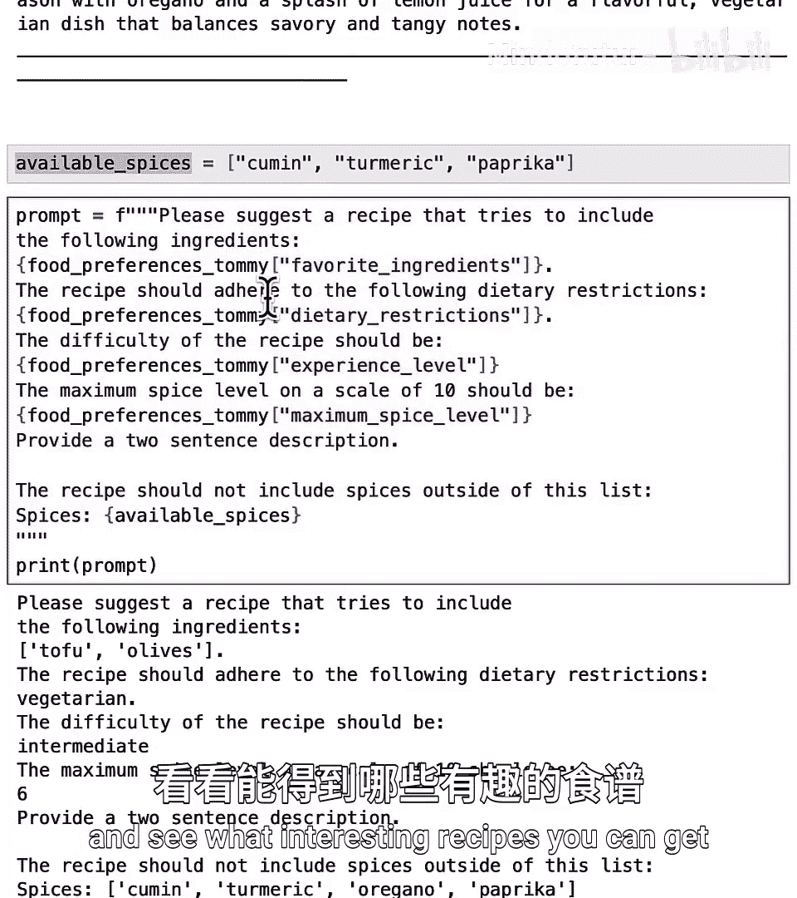
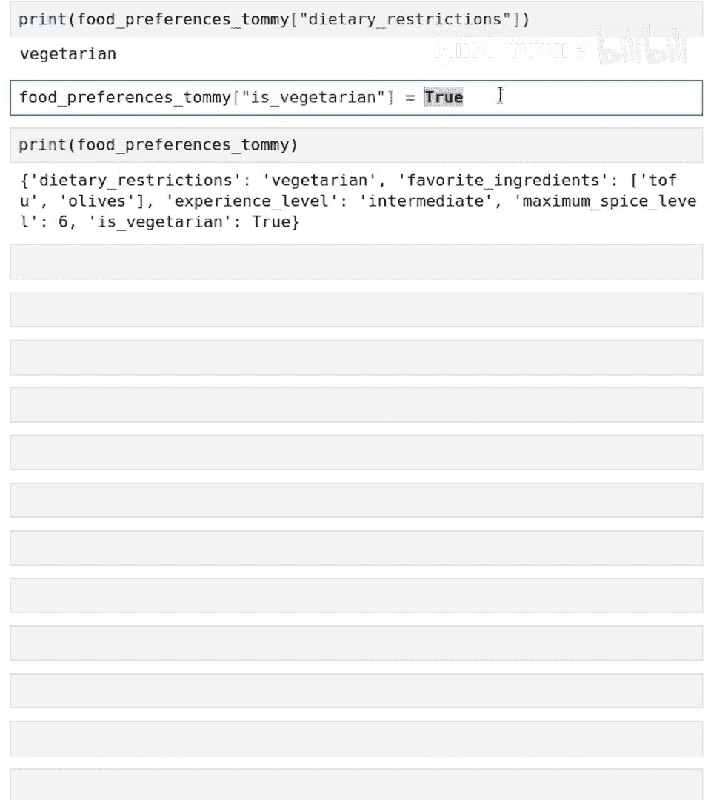

# 016：使用列表、字典和AI定制菜谱 🍳

在本节课中，我们将学习如何结合使用列表和字典来组织数据，并利用这些数据为大型语言模型定制提示词，从而为朋友生成个性化的菜谱建议。我们将通过一个有趣的例子，展示如何存储朋友的饮食偏好，并利用这些信息来获得定制化的烹饪建议。

## 概述

正如您所见，字典和列表都是组织数据的有用方式。本节将通过一个有趣的例子，展示如何将朋友的饮食偏好存储在列表或字典（或两者的组合）中，并以此作为数据来定制提示词，让AI为您的朋友推荐菜谱。这为我们提供了一种更复杂的数据存储方式，并利用这些数据来定制输入给大语言模型的提示词，从而生成一些非常有趣且（希望是）美味的输出。

## 存储饮食偏好

首先，我们定义一个字典来存储朋友Tommy的饮食偏好。我们使用花括号 `{}` 来创建字典。

```python
food_preferences_tommy = {
    "dietary_restrictions": "vegetarian",
    "favorite_ingredients": ["tofu", "olives"],
    "experience_level": "intermediate",
    "max_spice_level": 6
}
```



这个字典包含四个键值对：
*   `"dietary_restrictions"` 对应字符串 `"vegetarian"`。
*   `"favorite_ingredients"` 对应一个包含两个字符串 `"tofu"` 和 `"olives"` 的列表。
*   `"experience_level"` 对应字符串 `"intermediate"`。
*   `"max_spice_level"` 对应数字 `6`。

运行这段代码后，字典就创建好了。您可以通过以下方式查看字典的键和值：

```python
print(food_preferences_tommy.keys())
print(food_preferences_tommy.values())
```

## 生成基础菜谱提示词



现在，如果我们想为Tommy推荐一个菜谱，可以使用一个提示词。我们将使用f-string来动态插入字典中的值。

```python
prompt = f"""
Please suggest a recipe to try for the following ingredients: {food_preferences_tommy['favorite_ingredients']}.
The recipe should adhere to the dietary restriction: {food_preferences_tommy['dietary_restrictions']}.
The difficulty of the recipe should be suitable for an {food_preferences_tommy['experience_level']} experience level.
The maximum spice level on a scale of 10 is {food_preferences_tommy['max_spice_level']}.
Please provide a two-sentence description.
"""
```



在这个f-string中，我们使用方括号 `[]` 来查找字典中特定键对应的值。运行这段代码后，`prompt` 变量中的花括号内容会被替换为字典中相应的数据。

如果我们打印这个提示词并发送给AI模型，可能会得到类似以下的响应：

> 尝试制作地中海风味豆腐橄榄炒菜。将豆腐切块，与彩椒一起翻炒。这是一道素食，并且包含了豆腐和橄榄这两种他最喜欢的食材。😊

您可以暂停视频，尝试输入您自己喜欢的食材、饮食限制等，看看是否能得到您喜欢的结果。



## 进一步定制提示词

上一节我们介绍了如何利用字典中的基本信息生成菜谱。本节中，我们来看看如何结合更多数据来进一步定制提示词。



例如，Tommy告诉我们他的厨房香料快用完了，目前只有这四种：cumin（孜然）、turmeric（姜黄）、oregano（牛至）、paprika（红椒粉）。我们可以创建一个列表来存储这些可用的香料。



```python
available_spices = ["cumin", "turmeric", "oregano", "paprika"]
```

然后，我们可以生成一个更具体的提示词：

```python
prompt = f"""
Please suggest a recipe to try for the following ingredients: {food_preferences_tommy['favorite_ingredients']}.
The recipe should adhere to the dietary restriction: {food_preferences_tommy['dietary_restrictions']}.
The difficulty of the recipe should be suitable for an {food_preferences_tommy['experience_level']} experience level.
The maximum spice level on a scale of 10 is {food_preferences_tommy['max_spice_level']}.
Please only use the following available spices: {available_spices}.
Please provide a two-sentence description.
"""
```

运行这段代码后，新的提示词会包含可用香料列表。AI可能会生成一个使用孜然、牛至和红椒粉的地中海风味豆腐橄榄炒菜，并且不会使用Tommy厨房里没有的香料。

这种代码的优点是，如果Tommy用完了某种香料（比如牛至），您只需从 `available_spices` 列表中删除 `"oregano"`，然后重新运行代码，就能生成基于新香料组合的菜谱。



我鼓励您尝试不同的变化，例如在提示词中要求提供分步烹饪说明，或者在字典中添加一个 `"favorite_cuisine"`（最喜欢的菜系）键值对，看看能否推荐符合您口味菜系的食谱。

## 使用布尔值优化数据存储



到目前为止，我们学习了如何用字典和列表存储数据并定制提示词。作为下一节课的预览，我们来看一种优化数据存储的方式。



之前，我们将 `"dietary_restrictions"` 的值存储为字符串 `"vegetarian"`。其实还有另一种存储方式，即使用布尔值（True/False）。

```python
food_preferences_tommy["is_vegetarian"] = True
```

现在，`food_preferences_tommy` 字典就有了五个键。对于非素食者，我们可以将值设为 `False`。计算机同样知道如何处理这种布尔值。

显式地使用 `True`/`False` 存储某些值有一些好处，例如当您需要确切跟踪某人是否为素食者，以便为他们提供合适的食物选项时。要了解所有这些内容以及如何比较数据（这将为我们让AI帮助决策奠定基础），让我们进入下一个视频。

## 总结

本节课中，我们一起学习了：
1.  如何使用字典和列表来组织复杂的用户数据（如饮食偏好）。
2.  如何利用f-string和字典键值访问，动态构建定制化的AI提示词。
3.  如何通过引入额外的变量（如 `available_spices` 列表）来进一步细化提示词，使AI的输出更贴合实际约束。
4.  了解了使用布尔值（True/False）作为字典值来明确表示某种状态（如是否为素食者）的概念，为后续学习数据比较和决策逻辑打下基础。



通过将数据结构与AI提示相结合，您可以创建灵活、个性化的应用程序，例如菜谱推荐器、旅行计划生成器等。