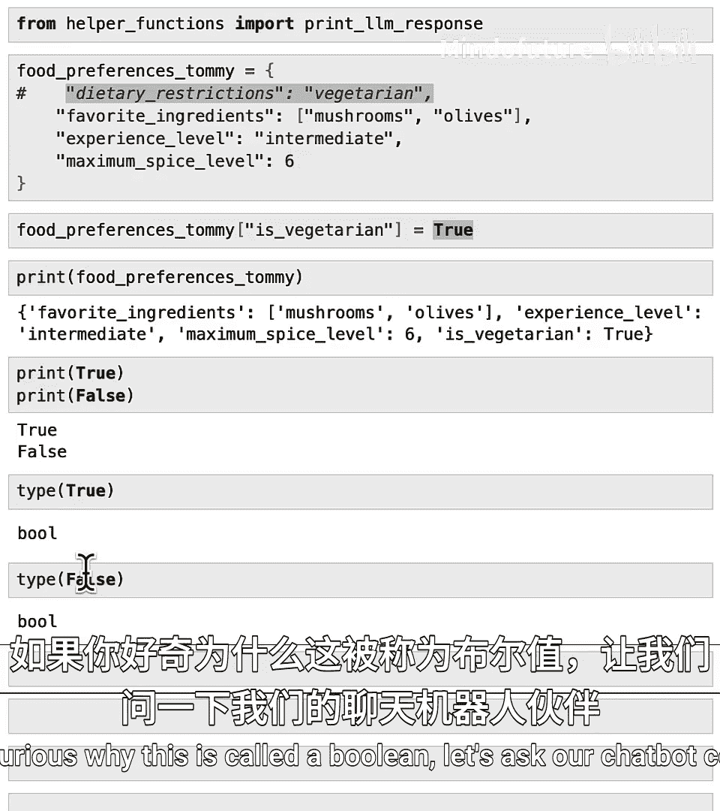
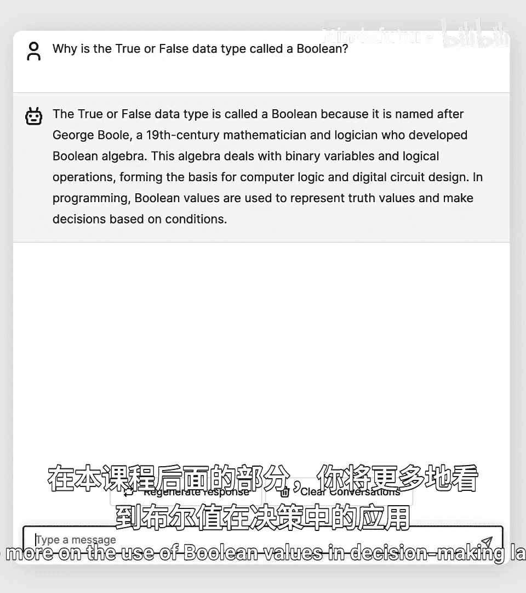
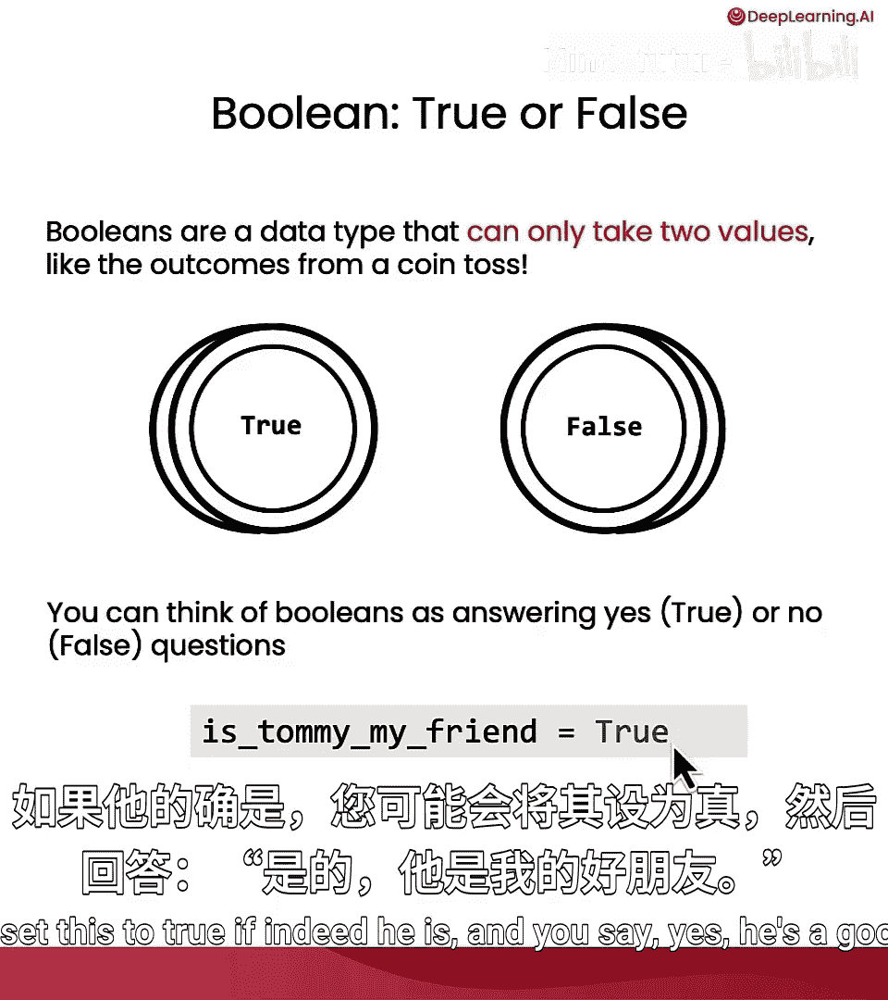
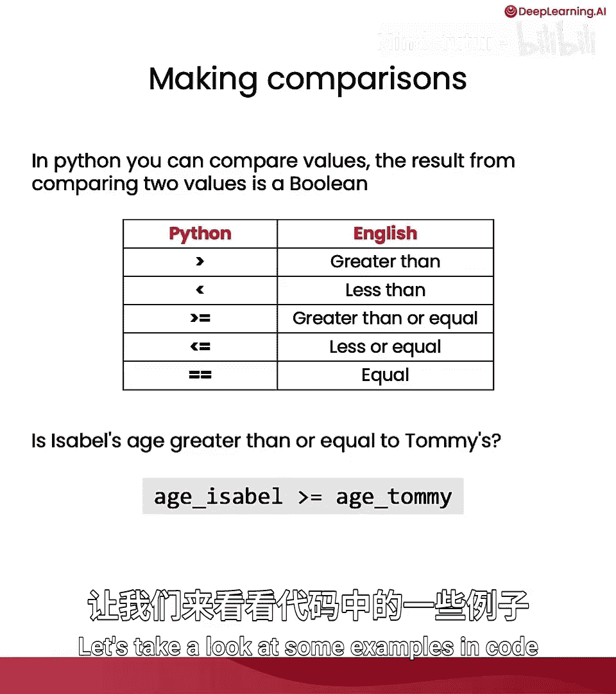
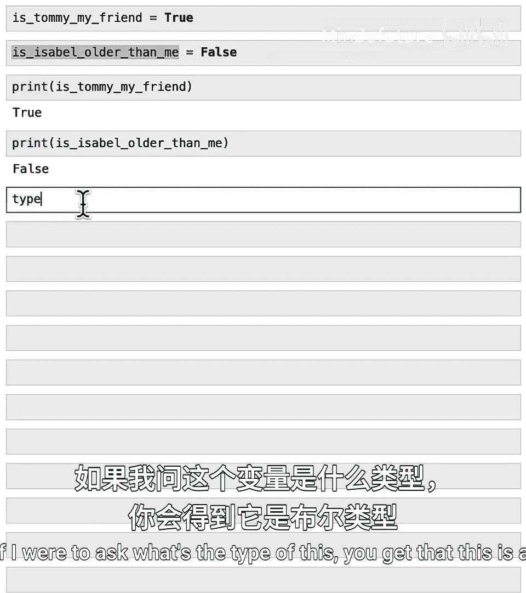
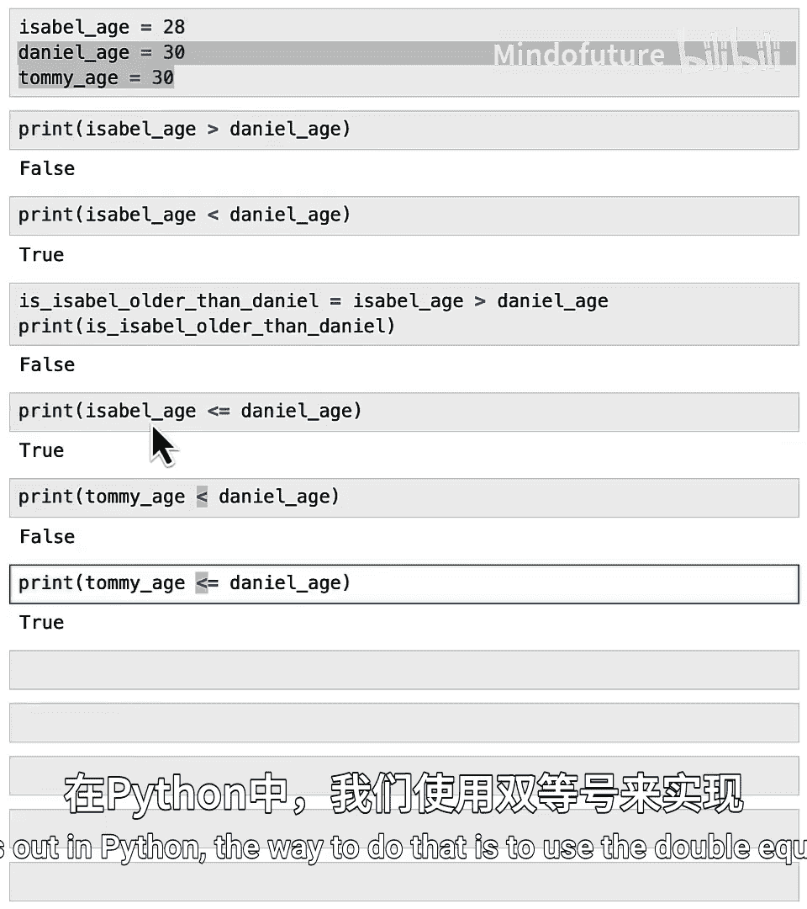
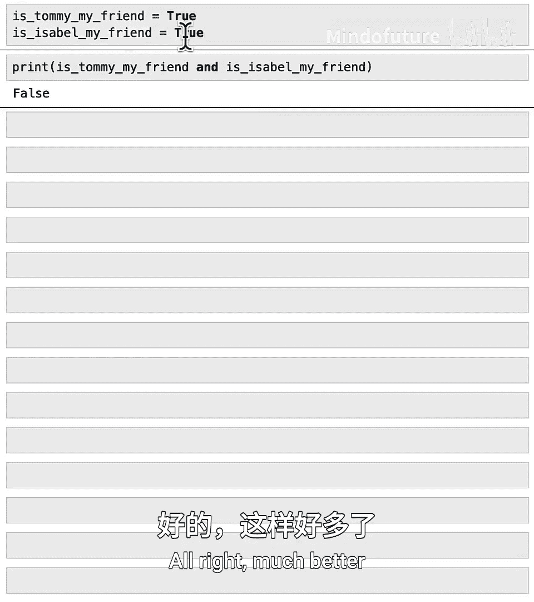
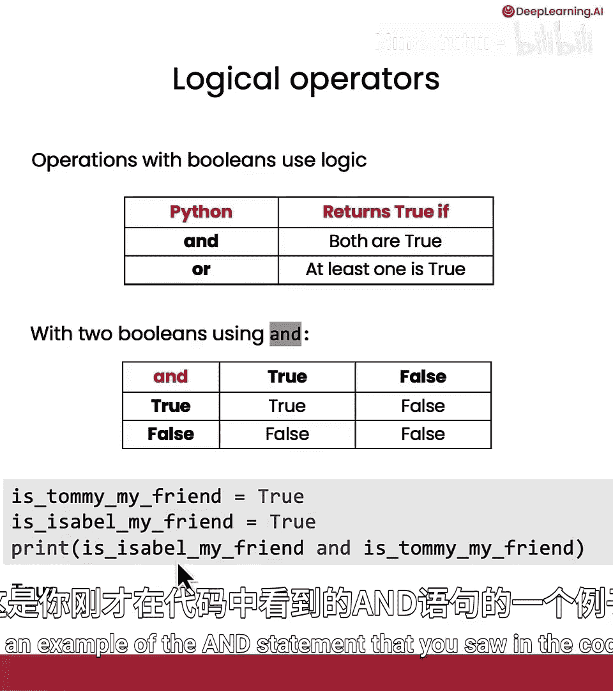
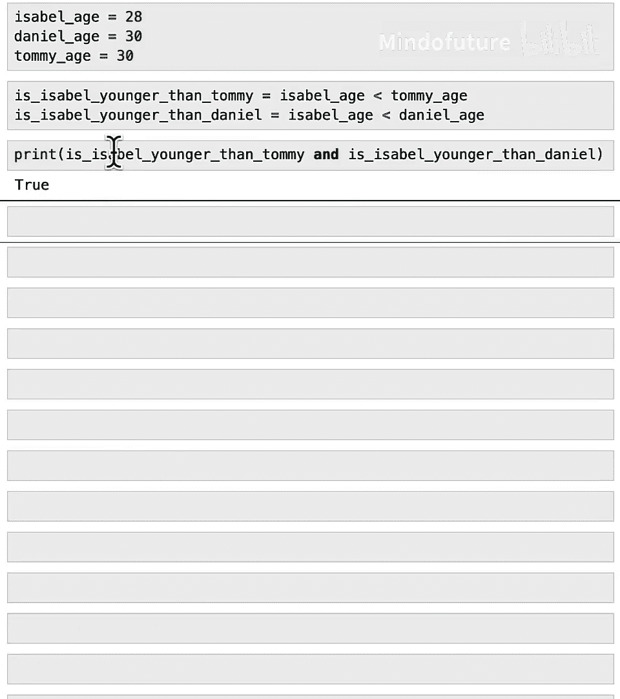

# 017：在Python中比较数据

## 概述
在本节课中，我们将学习Python中的布尔（Boolean）数据类型，它用于表示真（True）或假（False）值。我们将了解如何创建布尔变量，如何使用比较运算符（如大于、小于、等于）来比较数据，以及如何使用逻辑运算符（如`and`、`or`）来组合多个布尔值。这些概念是编程中决策和逻辑判断的基础。

---

## 布尔变量简介
在上节课的最后，我们提到了一个表示真值的变量，即`Tommy is vegetarian is True`。本节我们将详细探讨这些真/假值变量，在计算机科学中我们称之为布尔变量。我们将学习如何在Python中使用这些变量来比较数据，例如判断哪个数字更大，并利用这些比较来回答关于数据的问题。

在之前的视频中，我们使用了一个字典来存储Tommy的饮食偏好。现在，我们希望使用一个布尔变量来存储他是否是素食者。我们可以注释掉原来的行，并运行以下代码：

```python
# 注释掉原来的字典行
# dietary_restrictions = {"vegetarian": True}

# 使用布尔变量
is_vegetarian = True
```



如果我们现在打印`is_vegetarian`，会显示`True`。这样，我们就不再需要在`dietary_restrictions`键下存储Tommy的素食信息了。

`True`和`False`是Python中的特殊值。如果我们输入`print(True)`和`print(False)`，你可能会认为这会引发错误，因为我们没有用引号将它们括起来。但运行后，你会发现这是有效的。这是因为`True`和`False`是布尔类型的字面量。



检查`True`的类型，`type(True)`的结果是`bool`，代表布尔类型。同样，`type(False)`也是`bool`。你已经见过整数、浮点数、字符串和字典，现在这是一种新的数据类型，称为布尔变量或简称为`bool`。

就像整数只允许特定的值（如-1, 0, 1, 2, 3，但不包括1.5）一样，布尔类型也只允许特定的值，即`True`或`False`。



布尔类型以数学家乔治·布尔（George Boole）命名，他发展了布尔代数。布尔代数对于计算机逻辑和数字电路设计非常重要。我们将在后续课程中看到，布尔值常用于计算机编程中，帮助计算机决定是否执行某个动作（是或否）。

**总结**：布尔是一种数据类型，只能取两个值：`True`或`False`。就像抛硬币的结果只能是正面或反面。你可以将布尔值视为对“是/否”或“真/假”问题的回答。例如，如果问“Tommy是我的朋友吗？”，如果答案是肯定的，你可以将其设置为`True`。

---

## 比较运算符
在Python中，我们经常需要比较不同的数据。当你比较两个值时，比较的结果是一个布尔值。



以下是Python中用于比较的一些运算符：
*   **大于**：`>`
*   **小于**：`<`
*   **大于或等于**：`>=`
*   **小于或等于**：`<=`
*   **等于**：`==`（注意：这是双等号）


例如，如果你想检查Isabel的年龄是否大于或等于Tommy的年龄，你可以这样写：`age_isabel >= age_tommy`。这个表达式会评估为`True`或`False`，即一个布尔值，具体取决于`age_isabel`是否大于或等于`age_tommy`。



让我们看一些代码示例：

```python
# 定义年龄
age_isabel = 28
age_daniel = 30
age_tommy = 30

# 比较年龄
print(age_isabel > age_daniel)  # 输出：False，因为28不大于30
print(age_isabel < age_daniel)  # 输出：True，因为28小于30

# 将比较结果赋值给变量
is_isabel_older = age_isabel > age_daniel
print(is_isabel_older)  # 输出：False

# 使用小于等于和大于等于
print(age_isabel <= age_daniel)  # 输出：True
print(age_tommy < age_daniel)    # 输出：False
print(age_tommy <= age_daniel)   # 输出：True，因为两者都等于30
```

除了测试小于、小于等于、大于、大于等于，我们还可以测试相等性。在Python中，测试两个事物是否相等使用双等号`==`。

```python
# 测试相等性
print(age_tommy == age_daniel)  # 输出：True，因为都是30
print(age_isabel == age_daniel) # 输出：False

# 注意：单等号`=`用于赋值，双等号`==`用于比较。
# 一个常见的错误是误用单等号，这会导致赋值操作，可能引发意外结果。
# age_tommy = age_daniel  # 这是赋值，会将 age_daniel 的值赋给 age_tommy

# 字符串也可以使用`==`进行比较
print("vegetarian" == "vegan")   # 输出：False
print("vegan" == "vegan")        # 输出：True
```



测试两个字符串是否相等是计算机检查你输入的密码是否正确的重要步骤之一。当然，构建高安全性的密码检查器还需要其他步骤，但比较字符串是否相等确实是当今密码检查器使用的步骤之一。

---

## 逻辑运算符
现在，假设我和Tommy、Isabel两个人在一起。我保存了两个变量：`is_tommy_my_friend = True` 和 `is_isabel_my_friend = True`。我想计算是否Tommy和Isabel都是我的朋友。如何做到这一点？

Python有一个称为`and`的逻辑运算符。我们可以这样问：`is_tommy_my_friend and is_isabel_my_friend`。这个表达式的结果是`True`。如果出于某种原因，Isabel不想再做我的朋友了（即`is_isabel_my_friend = False`），那么整个表达式就会变成`False`，因为不再满足“Tommy和Isabel都是我的朋友”这个条件。

以下是Python中最常用的逻辑运算符：
*   **`and`**：如果两个输入都为`True`，则结果为`True`。
*   **`or`**：如果至少一个输入为`True`，则结果为`True`。

```python
# 逻辑运算符示例
is_tommy_my_friend = True
is_isabel_my_friend = True

print(is_tommy_my_friend and is_isabel_my_friend)  # 输出：True

# 如果Isabel不是朋友
is_isabel_my_friend = False
print(is_tommy_my_friend and is_isabel_my_friend)  # 输出：False
print(is_tommy_my_friend or is_isabel_my_friend)   # 输出：True，因为至少Tommy还是朋友
```

为了说明其他例子：`is_tommy_my_friend or is_isabel_my_friend` 的结果是`True`。同样，如果Isabel不喜欢我了，那么“是否两人都是我的朋友”是`False`，但“是否至少一人是我的朋友”仍然为`True`。

如果你对这部分逻辑还不完全理解，我鼓励你暂停视频，尝试用不同的真/假值组合进行测试，看看会得到什么结果。你也可以随时向AI聊天伙伴提问，请它解释这些结果。



---



## 综合示例
让我们用一个综合示例来结束。假设Isabel、Daniel和Tommy在玩游戏，我们之前定义了他们的年龄。我们可以设置布尔值来判断Isabel是否比Tommy年轻，以及是否比Daniel年轻。然后，要判断Isabel是否是最年轻的（从而获得优先权），我们可以说：`is_isabel_younger_than_tommy and is_isabel_younger_than_daniel`。如果这个表达式为`True`，那么她就是三人中最年轻的。

```python
# 定义年龄
age_isabel = 28
age_daniel = 30
age_tommy = 30

# 比较
is_isabel_younger_than_tommy = age_isabel < age_tommy  # True
is_isabel_younger_than_daniel = age_isabel < age_daniel # True

# 判断是否是最年轻的
is_isabel_the_youngest = is_isabel_younger_than_tommy and is_isabel_younger_than_daniel
print(is_isabel_the_youngest)  # 输出：True，她确实是最年轻的，可以优先行动
```

---

## 总结
在本节课中，我们一起学习了Python中的布尔数据类型。我们了解了布尔变量只能取`True`或`False`值，并学习了如何使用比较运算符（`>`, `<`, `>=`, `<=`, `==`）来生成布尔值。我们还探讨了如何使用逻辑运算符（`and`, `or`）来组合多个布尔条件，从而进行更复杂的逻辑判断。



掌握了布尔值之后，在下一个视频中，你将能够使用布尔值来帮助AI做出决策。AI将能够计算某个条件是真还是假，然后根据这个值决定采取什么行动。让我们在下一个视频中看看如何实现这一点。