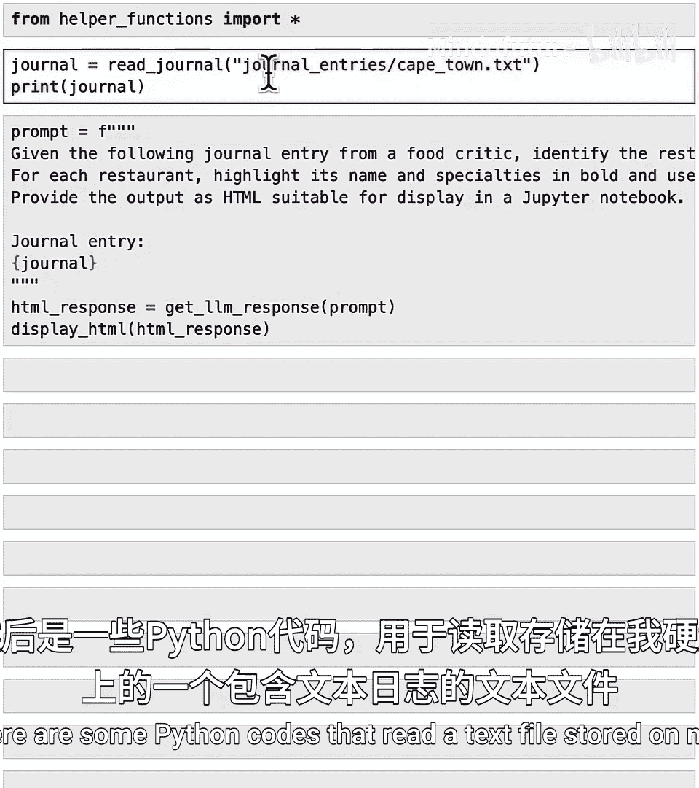
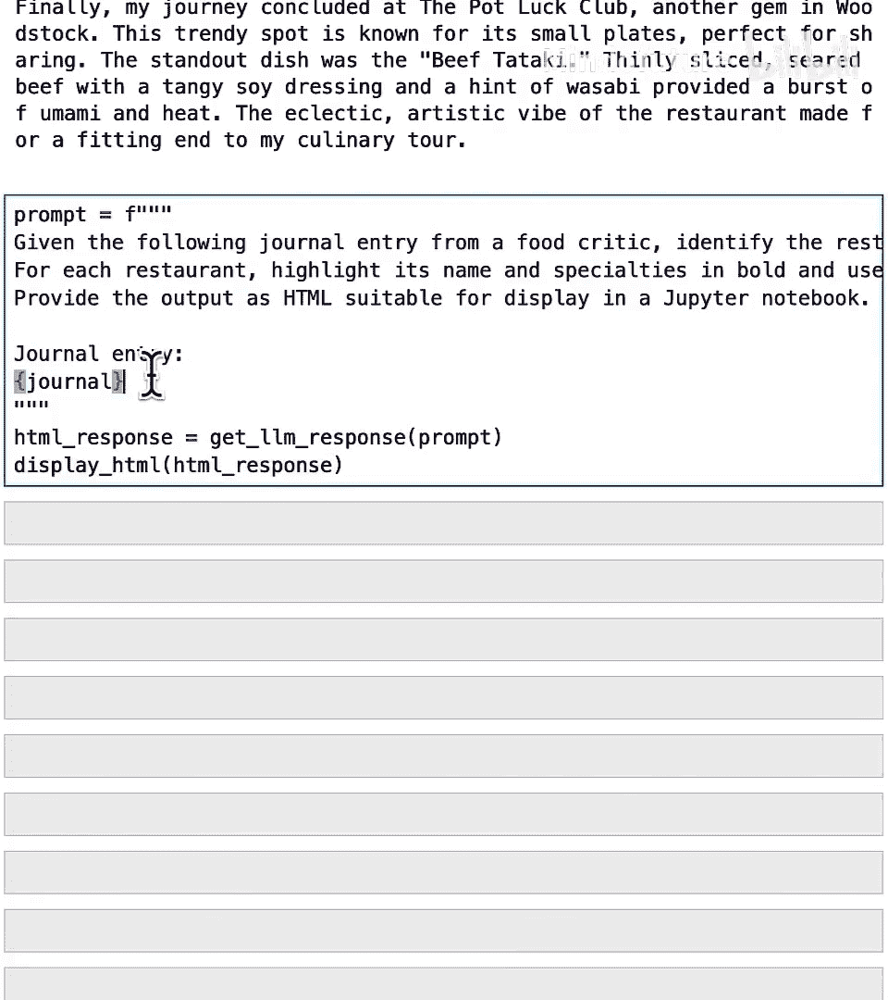
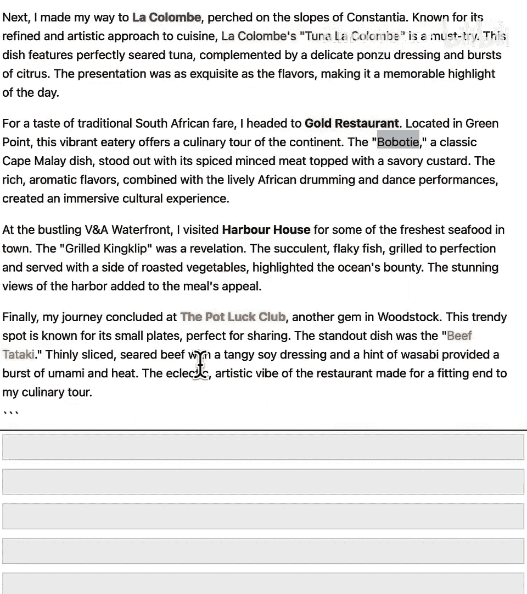

# 019：下一课程预告 - 使用文件 📄

在本节课中，我们将对已学知识进行回顾，并预览下一门课程的核心内容：如何让Python和AI处理你自己的文件数据。

## 概述

到目前为止，你已经掌握了许多处理数据的工具，包括变量、列表、`for`循环、字典和条件语句。我知道课程内容推进得很快，如果你没有记住所有内容，这很正常。你可以随时复习材料，或者更好地，向你的AI聊天伙伴询问任何你想回顾的概念。专业程序员也无法记住所有内容，他们也经常向聊天机器人寻求帮助。

在下一门课程中，你将基于已学的所有知识，学习如何让Python和AI处理你自己的数据。

## 你的个人数据

你可能认为自己没有数据，但我想说你肯定有。让我展示一个例子。

你很可能拥有存储在自己文件中的数据，例如你自己的文档、待办事项列表、电子邮件或电子表格等。为了接下来要展示的例子，我们假设你是一位美食评论家，并保存了一份记录不同城市旅行的日记。你的日记包含了对餐厅和特色菜的描述。


假设你想分析你的日记条目，并高亮显示其中的餐厅和菜肴名称。


在本视频中，你将简要了解如何将自己的日记文本加载到Python中，并使用AI在你的数据中高亮显示这些餐厅和菜肴。

## 代码示例预览

为了本视频的目的，你不必担心所看到的代码的具体工作原理，你将在下一门课程中学习所有细节。

以下是加载一些辅助函数的代码。

```python
# 加载辅助函数
```

然后，这里有一些Python代码，用于读取存储在我硬盘上的一个包含文本日记的文本文件。

```python
# 读取并打印日记文件
```



让我加载它并打印出来。这就是我的日记：“开启一场开普敦的美食之旅，这座城市……”等等。


接下来，我将编写一个提示词，内容是：“给定以下来自美食评论家的日记条目，识别其中的餐厅和每家餐厅的特色菜。用粗体高亮其名称和特色菜，并为每家餐厅使用不同的颜色。以HTML格式提供输出。”

我们将使用一个f-string来插入日记内容。

```python
prompt = f"""
给定以下日记条目：
{journal_text}
请识别餐厅和特色菜，并以HTML格式高亮显示。
"""
```



然后，获取响应。我们将得到一个HTML格式的响应。网页是用HTML格式化的，我们将让AI返回一个HTML响应。

最后，我们可以显示这个HTML。

```python
# 获取并显示AI的HTML响应
```

如果我运行这段代码（这需要几秒钟），最终会得到以下结果。


在这个结果中，它高亮显示了餐厅名称，例如“The Test Kitchen”、“La Colombe”，并用粗体显示，不同的菜肴也对应着不同的颜色。



我不知道你是否也有美食评论的计划，但我希望这个例子能向你说明，如果你有存储在硬盘上的文本文件，你可以通过几行代码，让AI帮助你标记自己的文本。

## 下一课程展望

在下一门课程中，我将使用这个方法来尝试规划一个很棒的假期，这个假期需要拜访许多餐厅并品尝大量美味食物。


## 总结

恭喜你完成了这门课程！你已经学习了专业开发人员日常工作中使用的非常重要的概念和编程模式。

以下是本课程的核心知识点回顾：

*   **数据结构**：你学习了用于存储数据集合的**列表**和**字典**。
*   **循环控制**：你学习了**`for`循环**，它允许你通过告诉Python对列表中的所有项目执行相同操作来自动化重复性任务。
*   **条件逻辑**：你学习了**布尔变量**（其值只能是`True`或`False`），以及如何在**`if`语句**中使用它们，以帮助计算机程序根据看到的数据做出决策。

你涵盖了很多内容，我希望你现在已经拥有了编程工具，或许可以开始使用AI构建一些东西了。当然，还有更多知识需要学习。我期待在下一门课程中见到你，在那里你将让Python和AI处理你自己的数据。