# 022：加载和使用你自己的数据 📂

在本节课中，我们将学习如何在Python中加载和使用你自己的文本文件。上一节我们介绍了如何打开和读取文件，本节中我们来看看如何告诉Python文件的确切位置，并上传你自己的数据进行处理。

## 概述

计算机中的文件通常被组织在不同的文件夹中。开发者倾向于使用“目录”这个词来代替“文件夹”。当你要求Python读取一个文件时，你必须精确地告诉它文件的位置。Python首先查找文件的文件夹被称为“工作目录”。

## 理解工作目录

以下是关于工作目录的核心概念：

*   **工作目录**：Python默认首先在其中查找文件的文件夹。
*   **文件扩展名**：文件名中“.”之后的部分，用于标识文件类型。例如，`.ipynb` 是Jupyter Notebook文件的扩展名，`.py` 是Python脚本文件的扩展名。

## 实践：列出和读取文件

让我们通过代码来查看当前工作目录中的文件，并读取其中的内容。

首先，我们从辅助函数中加载必要的功能。

```python
from helper_functions import upload_text_file, files_in_directory, print_response
```

现在，列出当前工作目录中的所有文件。

```python
files_in_directory()
```

执行上述代码后，你将看到类似 `email.txt` 和 `recipe.txt` 这样的文件列表。这些文件位于当前工作目录中，因此可以直接读取。

接下来，我们打开并读取 `email.txt` 文件。

```python
with open('email.txt', 'r') as file:
    email = file.read()
print(email)
```

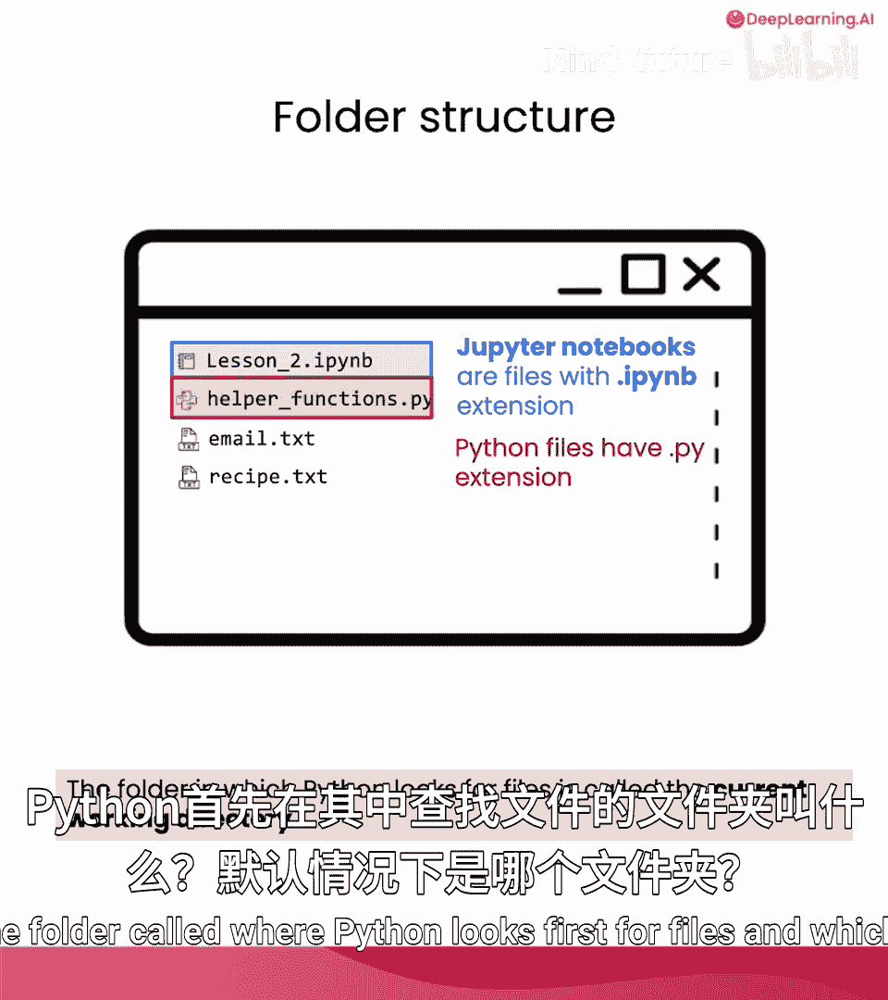

同样地，我们可以读取 `recipe.txt` 文件。

```python
with open('recipe.txt', 'r') as file:
    recipe = file.read()
print(recipe)
```

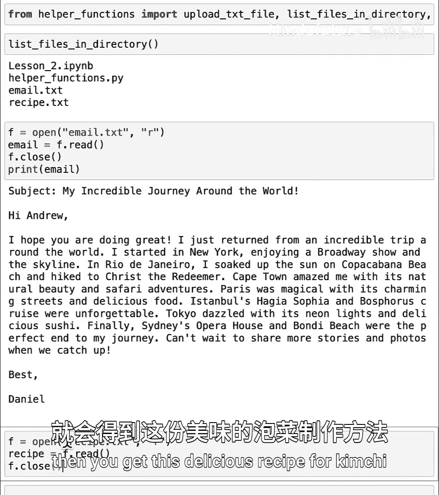

## 上传你自己的文件

为了处理你自己的数据，你需要将文件上传到当前工作目录。以下是操作步骤：

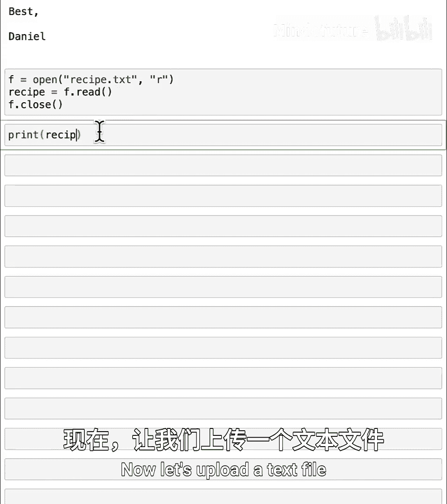

1.  运行 `upload_text_file()` 函数，它会创建一个上传按钮。
2.  点击按钮，从你的电脑中选择一个文本文件（例如，一个 `.txt` 文件）。
3.  文件上传后，它会出现在当前工作目录中。

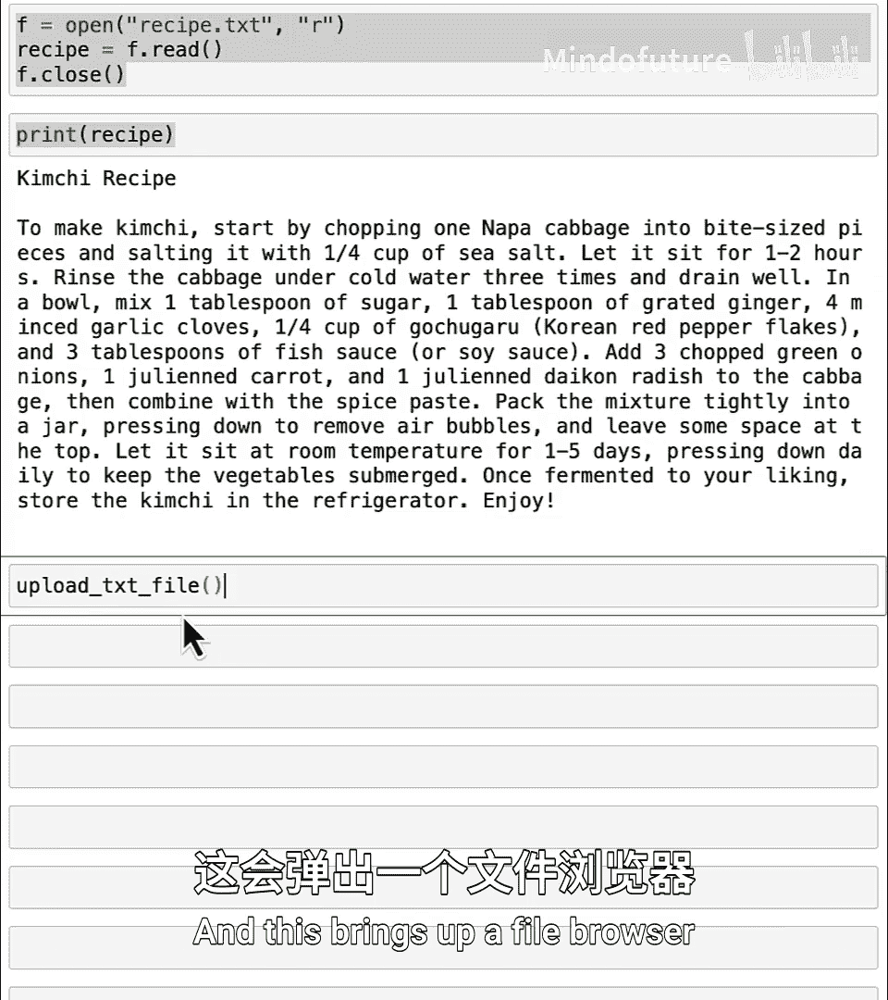

```python
upload_text_file()
```

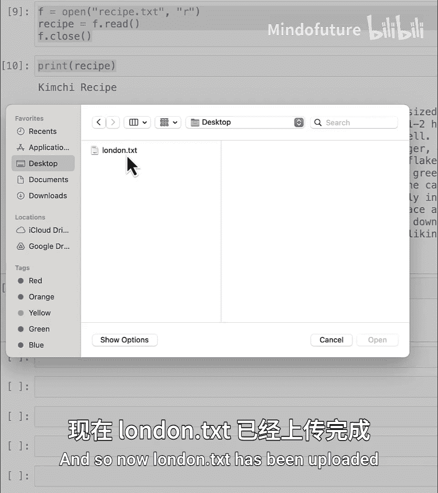

上传完成后，再次列出目录中的文件，确认你的新文件（例如 `london.txt`）已出现。

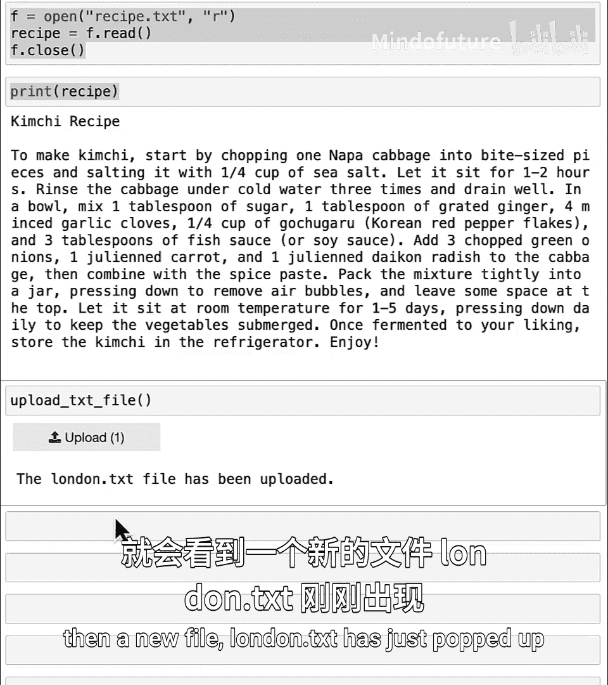

```python
files_in_directory()
```

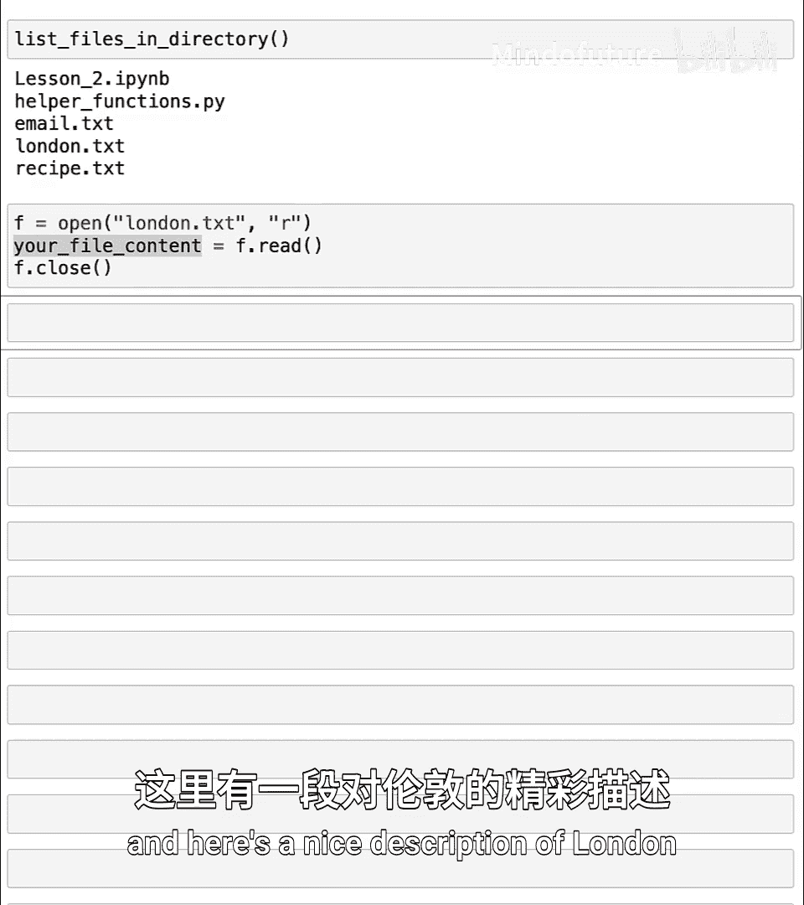

现在，你可以像之前一样打开并读取这个新文件。

```python
with open(‘london.txt’， ‘r’) as file:
    your_file_content = file.read()
print(your_file_content)
```

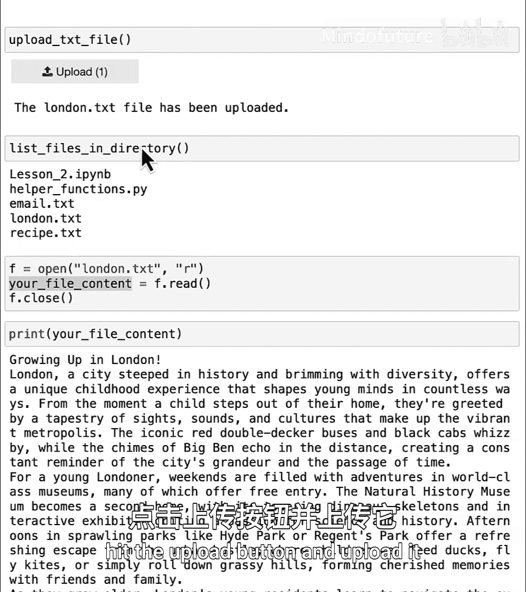

## 使用AI处理你的文本数据

读取文件内容后，你可以利用大型语言模型（AI）对其进行处理。例如，你可以创建一个提示来总结文本。

```python
prompt = f”””请用两句话总结以下文本内容：

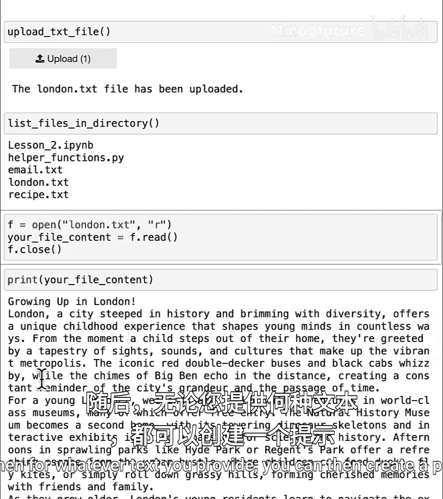

{your_file_content}
“””
print_response(prompt)
```

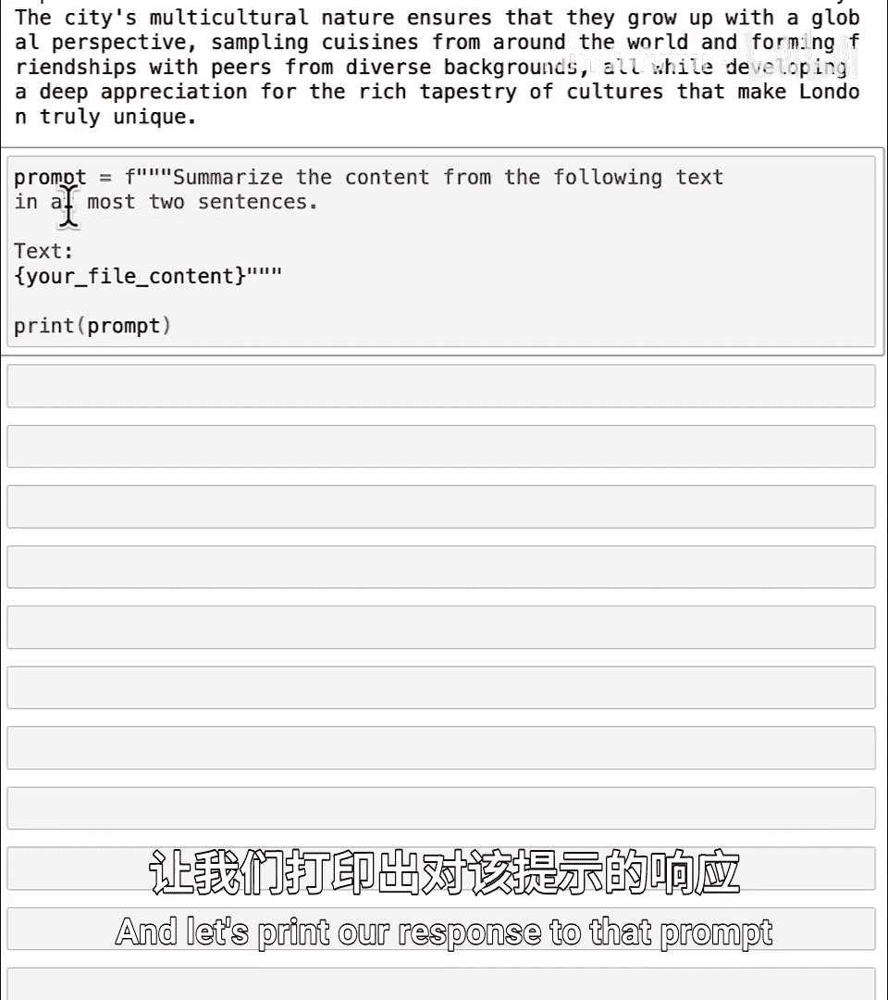

除了总结，你还可以尝试其他任务，例如提取关键要点或基于内容进行头脑风暴。

## 创建你自己的文本文件

为了练习，请创建一个包含几段文字的文本文件。你可以使用任何文本编辑器（如Windows的记事本、Mac的文本编辑或Google Docs）。如果使用Google Docs，请通过“文件”>“下载”>“纯文本(.txt)”来保存文件。**请注意，不要上传任何机密或敏感信息。**

## 总结

本节课中我们一起学习了文件路径和目录的概念，特别是“工作目录”。我们实践了如何列出目录中的文件、读取现有文件，以及如何将你自己的文本文件上传到Jupyter Notebook环境中。最后，我们探索了如何将上传的文本内容与AI提示结合，以执行总结等任务。掌握这些技能后，你就能开始使用AI来处理你自己的文本数据了。

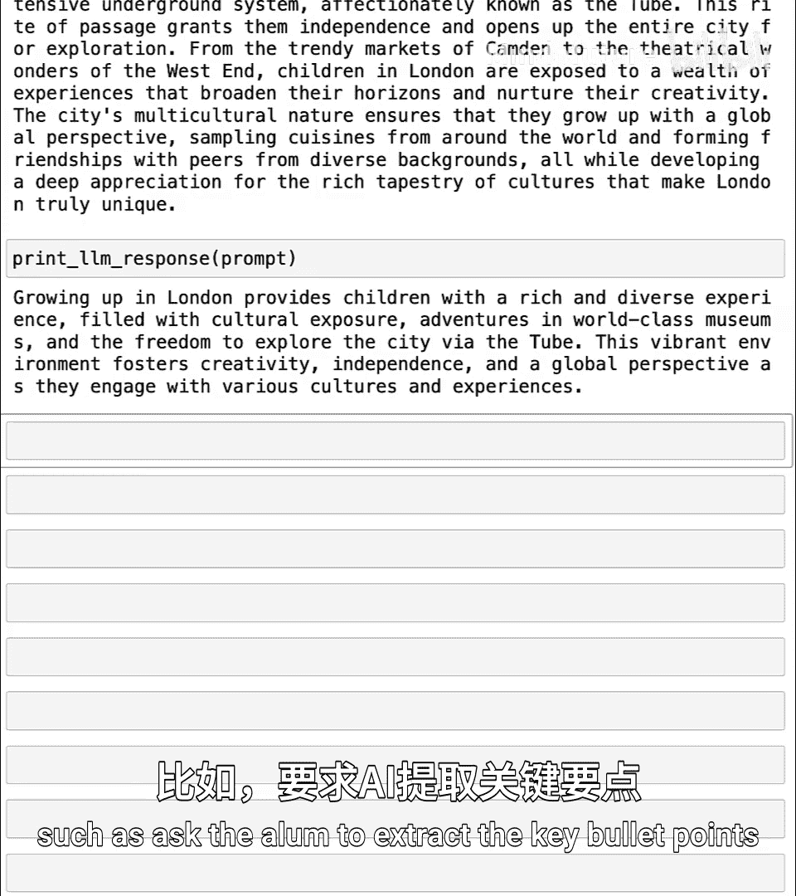

在下一课中，我们将继续探索以更复杂的方式处理文本数据，特别是学习如何读取多段文本内容，并利用AI来判断它们是否与规划梦想假期相关。