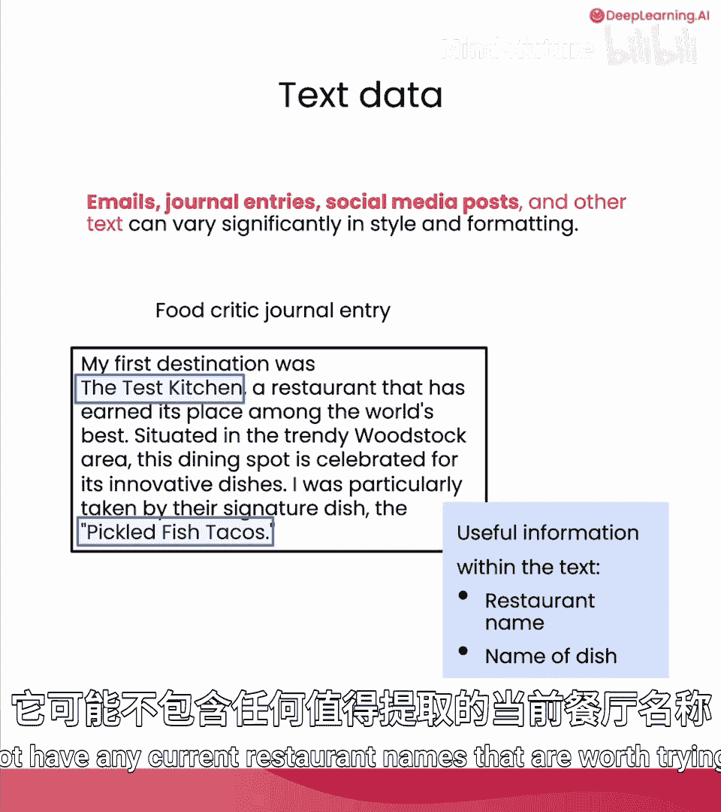
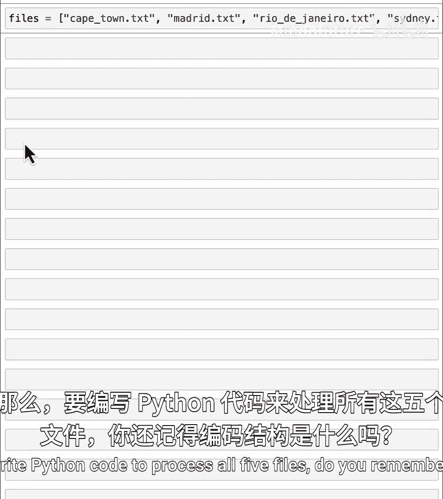
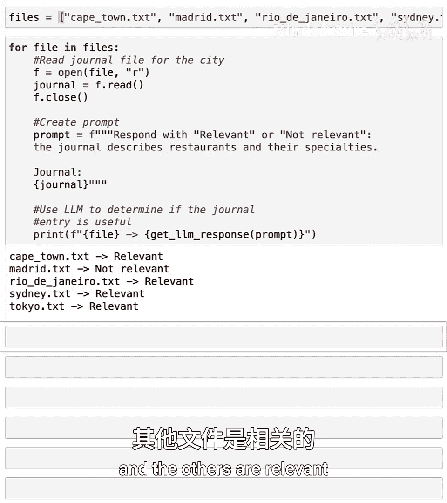
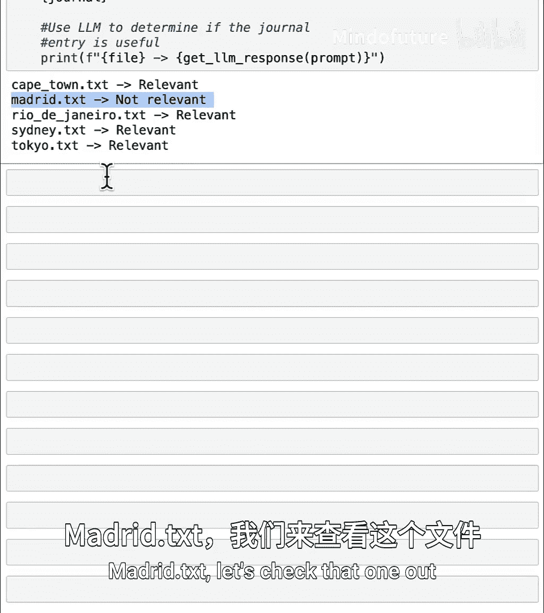
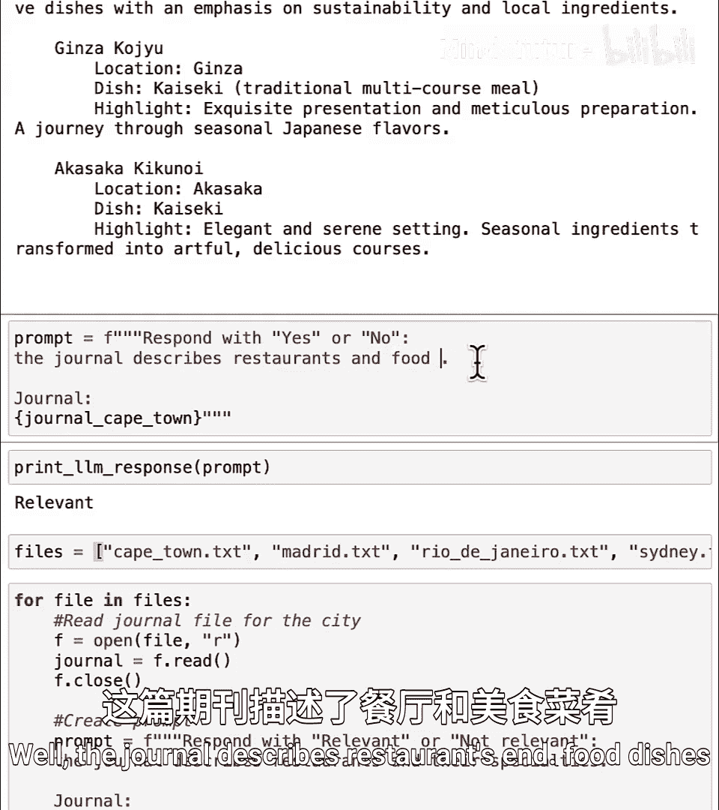
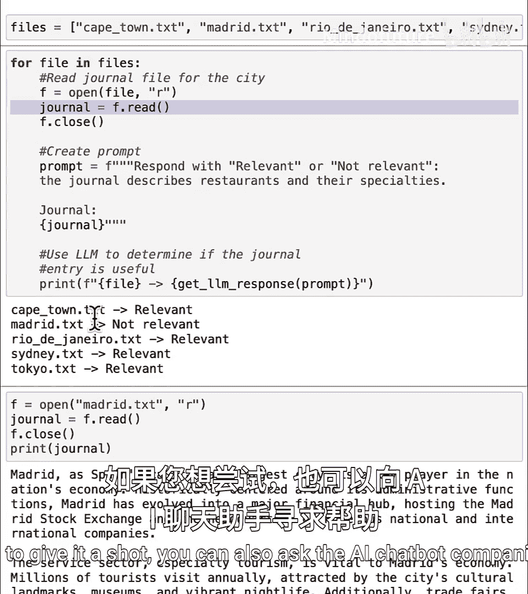
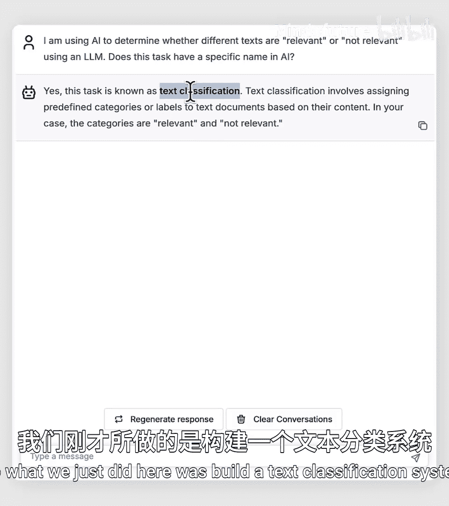
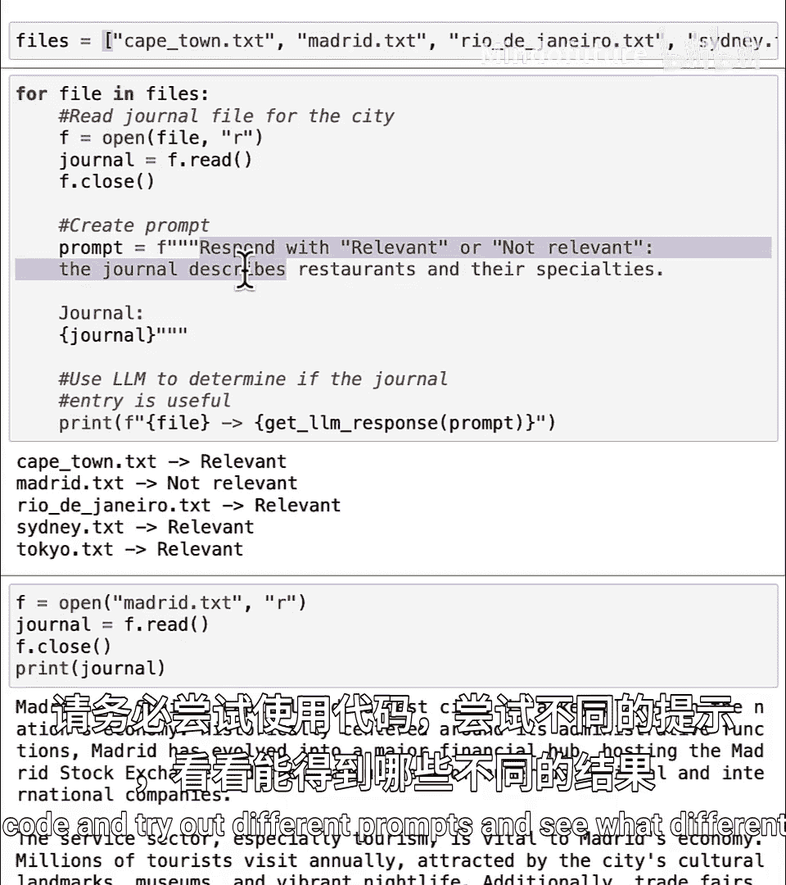
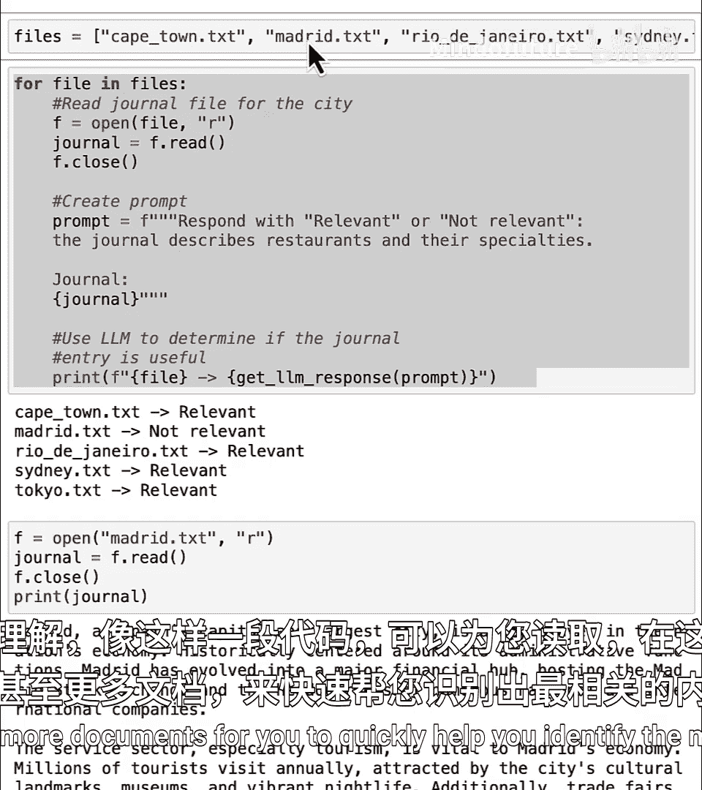
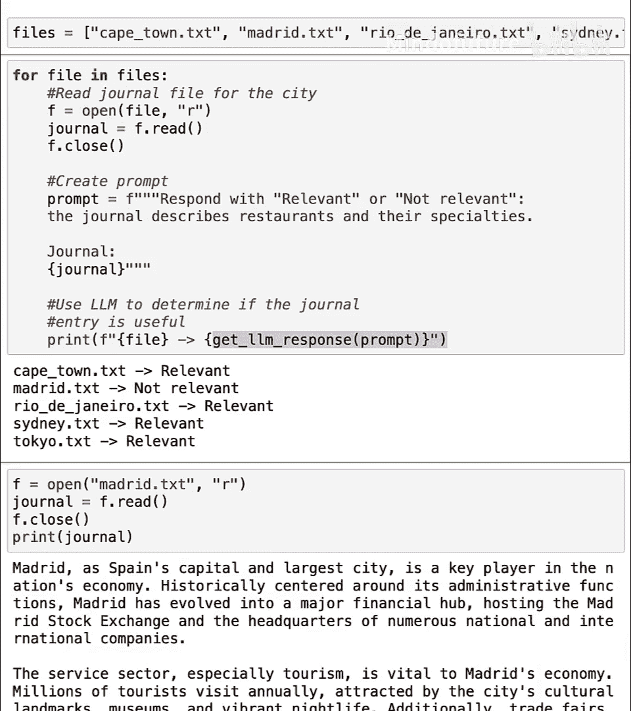

# 023：阅读美食评论家的日记 🍽️

在本节课中，我们将学习如何使用Python和大语言模型来处理和分析大量的文本数据。具体来说，我们将从一个包含多篇美食评论家日记的文件夹中，自动筛选出与餐厅和特色菜肴相关的文章，并了解文本分类的基本概念。

---

许多人每天需要处理大量文本数据，例如阅读成千上万的电子邮件、文章或个人笔记。根据任务的不同，你可能希望借助人工智能来帮助你阅读和处理这些海量文本。

例如，假设你正在规划一次梦想中的假期，需要决定去哪些餐厅以及在不同城市品尝什么美食。你可能已经为此保存了许多关于不同目的地的长篇博客文章，其中一些可能介绍了各个城市的餐厅和菜肴。

在本视频的示例中，我们将学习如何将这些信息整合到你即将到来的旅行美食行程中。但是，在这个庞大的文件、文章和博客集合中，也可能包含许多与餐厅、美食或就餐地点无关的文档。如果你时间有限，不想逐一打开并阅读每个文件来判断其是否与美食相关，那么最好使用人工智能来查看所有这些文本并帮助你处理。

让我们看看如何在Python中实现这一目标。

我们将使用美食评论家的日记条目，这些条目包含了推荐的餐厅和菜肴，并学习如何使用大语言模型来处理这些数据。像电子邮件、日记条目和社交媒体帖子这样的文本数据，在风格和格式上可能有很大差异。有些人使用项目符号列表，而另一些人则写长段落。在本课中，你将使用Python和大语言模型从这些文本文件中提取相关信息，例如提取餐厅名称和你可能想尝试的特色菜肴名称。

不过，在提取餐厅和菜肴名称之前，你可能需要先确认这个文本文档是否相关。例如，如果你有一篇关于城市历史的文章，它可能没有任何值得提取的当前餐厅名称。让我们看看如何使用Python代码来完成所有这些工作。

## 加载并查看文本文件

首先，请记住运行代码单元。我们将定义一些函数，然后类似于上一课的操作，加载文件 `Cape_Town.txt` 并打印其内容。

```python
# 假设我们有一个函数来读取文件
def read_file(filename):
    with open(filename, 'r', encoding='utf-8') as file:
        return file.read()

# 加载并打印开普敦的日记
cape_town_text = read_file('Cape_Town.txt')
print(cape_town_text)
```

`Cape_Town.txt` 是一篇美食评论家写的日记，重点介绍了“The Test Kitchen”、“The Codfather”等餐厅。

接下来，让我们看看 `Tokyo.txt` 的内容。这位评论家经常去东京旅行，这里有一份东京鼓舞人心的餐厅列表，其格式与开普敦文档的段落形式截然不同。

```python
# 加载并打印东京的日记
tokyo_text = read_file('Tokyo.txt')
print(tokyo_text)
```

## 构建文本分类系统



在处理这些文本文件以提取餐厅和菜肴名称之前，我们希望使用大语言模型来检查文档，看它是否与餐厅及其特色菜相关。

以下是一个提示词示例。我们将打印对该提示词的响应，确认东京的文章是相关的。事实上，开普敦的文章也是相关的。

```python
# 定义一个函数，使用大语言模型判断相关性
def is_relevant(text, llm_model):
    prompt = f"""
    请判断以下日记内容是否主要描述餐厅及其特色菜肴。
    只回答“相关”或“不相关”。

    日记内容：
    {text}
    """
    response = llm_model.generate(prompt) # 假设有一个生成响应的函数
    return response.strip()

# 假设我们已经初始化了一个大语言模型对象 `llm`
print(is_relevant(tokyo_text, llm))
print(is_relevant(cape_town_text, llm))
```

我知道当前目录下有五个文件：`Cape_Town.txt`、`Madrid.txt`、`Rio_de_Janeiro.txt`、`Sydney.txt` 和 `Tokyo.txt`。

那么，要编写Python代码来处理所有五个文件，你还记得代码结构吗？



## 使用循环处理多个文件

我们可以使用 `for` 循环来遍历多个文件。

我将设置 `files` 等于这五个文件名的列表。在Python中，方括号 `[]` 用于创建列表。

```python
# 定义要处理的文件列表
files = ['Cape_Town.txt', 'Madrid.txt', 'Rio_de_Janeiro.txt', 'Sydney.txt', 'Tokyo.txt']

# 遍历每个文件
for file in files:
    # 打开并读取文件
    journal_text = read_file(file)
    
    # 创建提示词
    prompt = f"""
    请判断以下日记内容是否主要描述餐厅及其特色菜肴。
    只回答“相关”或“不相关”。

    日记内容：
    {journal_text}
    """
    
    # 使用大语言模型获取响应
    response = llm.generate(prompt)
    
    # 打印结果：文件名 -> 是否相关
    print(f"{file} -> {response.strip()}")
```

运行这段代码，看看结果如何。它运行成功了。

开普敦的文章是相关的，但 `Madrid.txt` 不相关，其他文章是相关的。因此，如果你有100或200个文档的集合，你可以使用这样的循环让Python自动为你读取所有文档，并仅指出哪些是与美食相关的。

## 检查不相关的文档



让我们查看一下 `Madrid.txt` 的内容。



```python
# 加载并打印马德里的日记
madrid_text = read_file('Madrid.txt')
print(madrid_text)
```

你会发现这是一篇关于马德里的精彩文章，但并没有特别关注美食，这就是为什么大语言模型判断 `Madrid.txt` 不相关。

顺便说一下，我鼓励你尝试5种不同的提示词。例如，你可以说：“请用‘是’或‘否’回答：这篇日记是否描述了餐厅和食物菜肴？” 有多种方法可以实现这一点。

更高级的做法是让它只打印出相关文件的名称。这将是一个相当高级的练习。如果你想尝试，也可以向AI聊天机器人伙伴寻求帮助。

作为一个有趣的知识点，如果你好奇我们刚才所做工作的名称：我使用AI来确定文本是否相关。这项任务有一个特定的名称。





我们在这里构建的是一个**文本分类系统**。



## 总结与练习

我鼓励你尝试这段代码，并修改它以完成不同的任务。请务必尝试不同的提示词，看看会得到什么不同的结果。



我希望你能看到，像这样一小段代码如何能够为你读取（在这个例子中是五个，甚至更多）文档，并快速帮助你识别出最相关的文档。



编程的好处在于，你可以让计算机执行各种各样的事情。希望你玩得开心。

在下一课中，我们将学习如何选取一篇相关的文章，并从中提取关键信息，例如餐厅名称和菜肴名称。



下节课见。