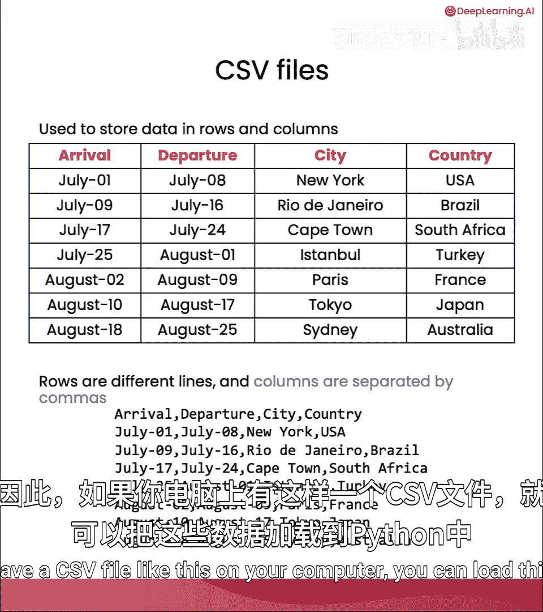
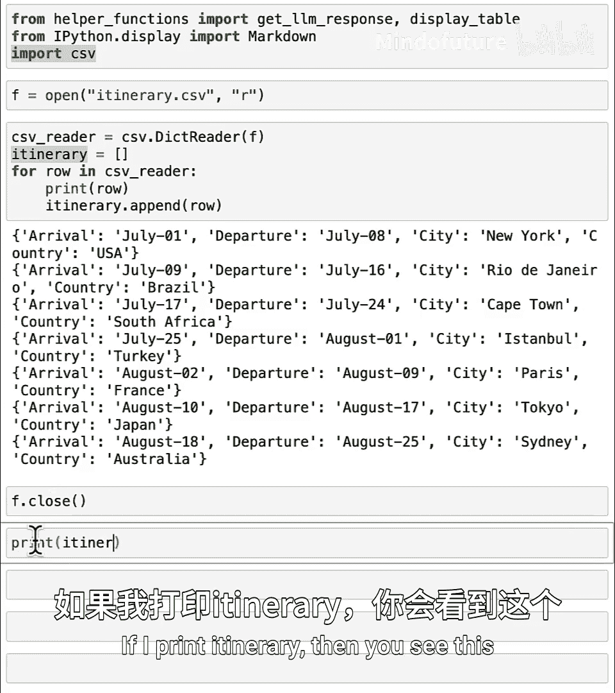
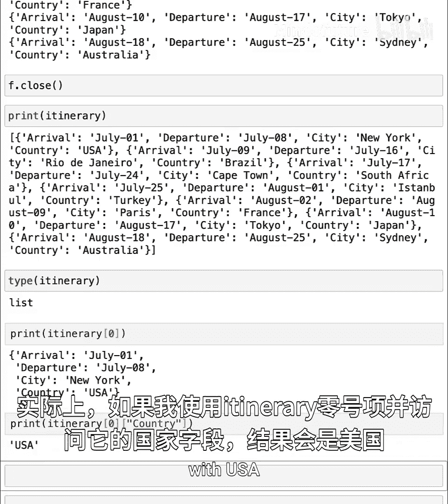
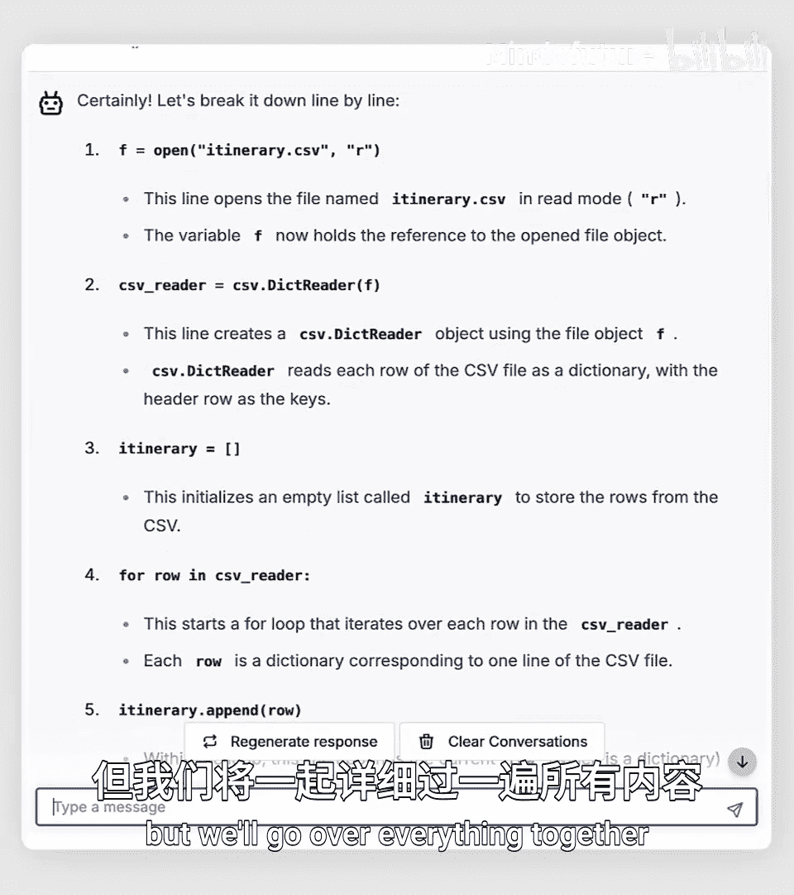
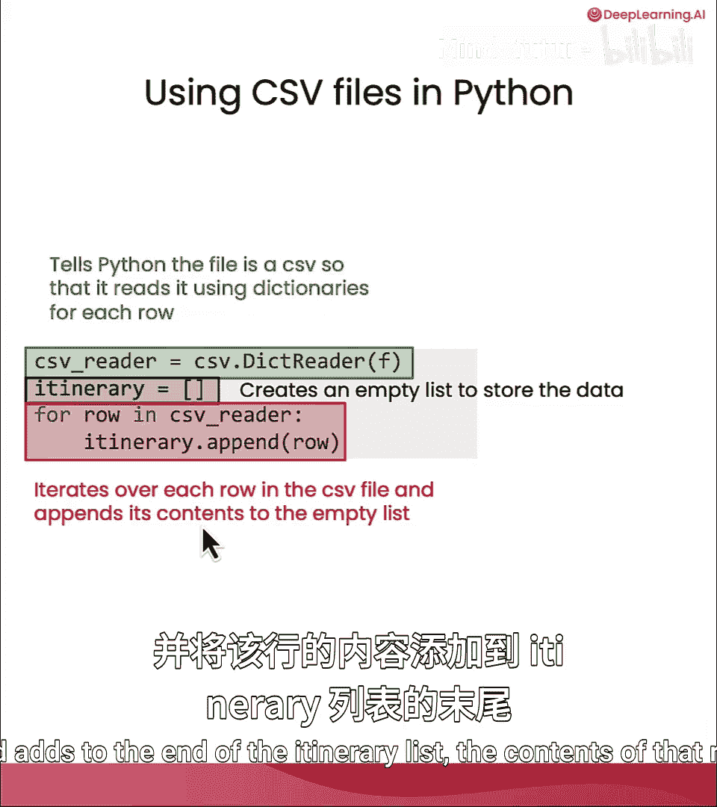
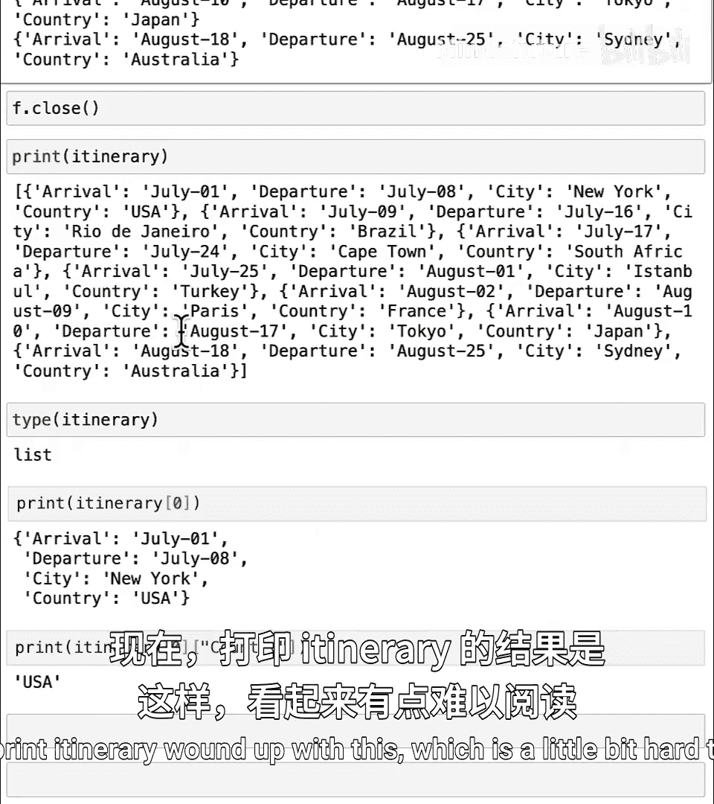
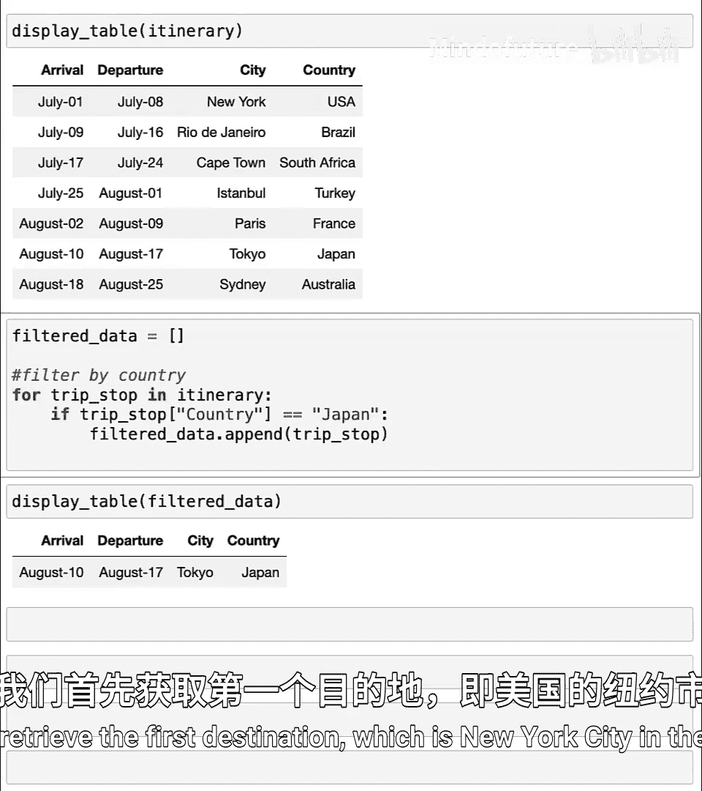
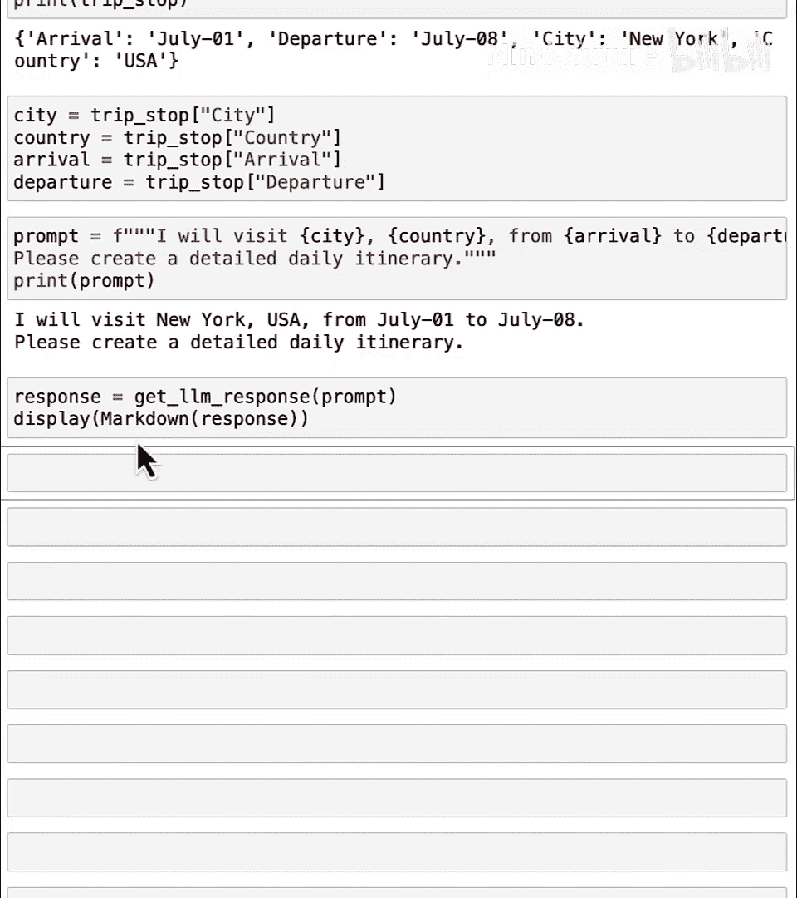
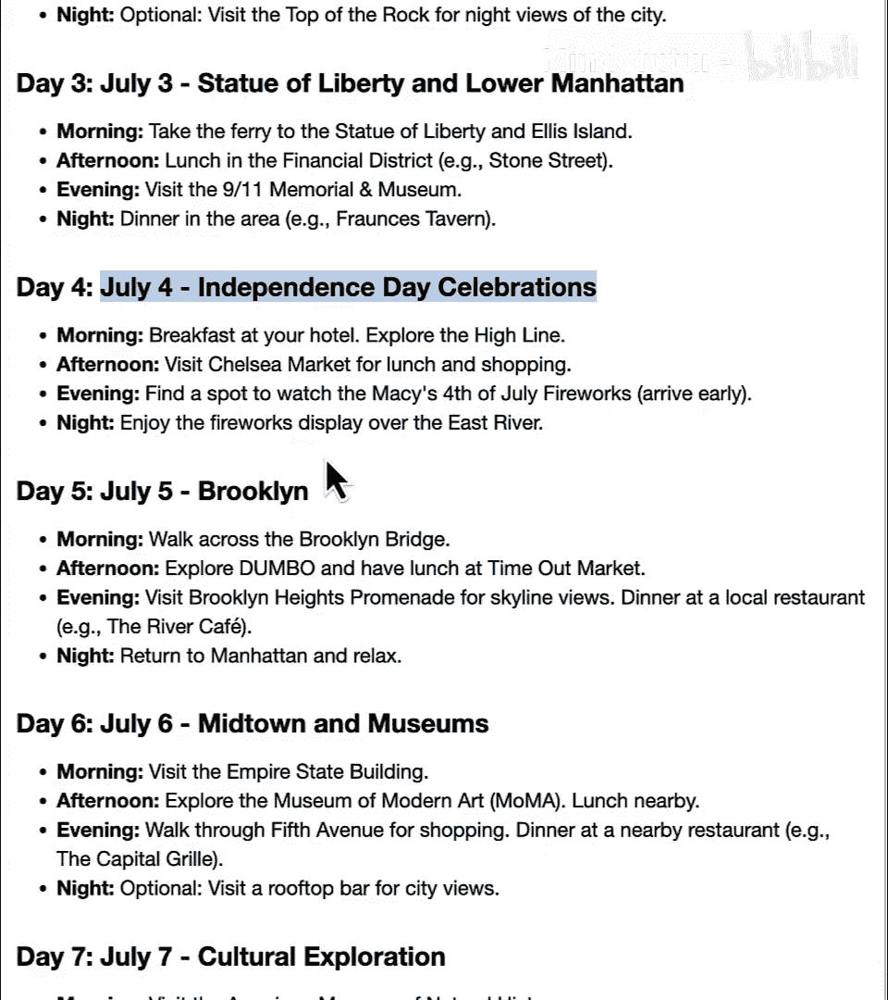
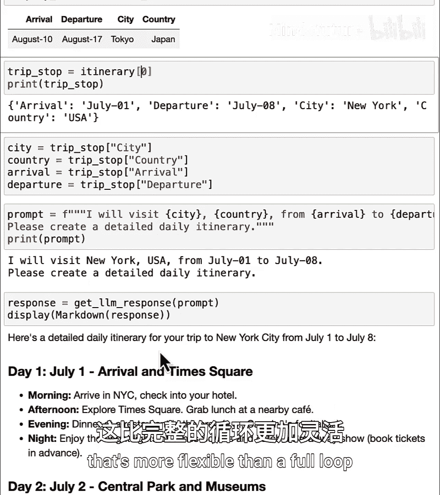

# 025：使用CSV文件进行假期规划 📅

在本节课中，我们将要学习如何处理结构化的数据，特别是CSV文件。我们将了解如何读取CSV文件中的数据，如何筛选特定信息，以及如何结合AI语言模型来生成个性化的假期行程规划。

---

文本文件非常通用，可以用多种不同方式格式化。因此，我们有时称它们为**非结构化数据**，因为文本文件几乎没有预定义的结构。

相比之下，电子表格具有明确定义的格式或结构，数据整齐地排列在行和列中。这种看起来像带有行和列的表格的数据被称为**结构化数据**。

在Python中，处理像电子表格这样的结构化数据与处理非结构化数据（如文本）的方式略有不同。通常，你甚至可以不使用AI语言模型，而直接用Python代码来处理它。

例如，如果你一直在电子表格中为梦想假期的每个目的地保存信息，其中一列指定了国家，那么你可以使用Python来帮助你按位置筛选，并查看特定国家（如日本）的所有停留点。

让我们来看看如何完成所有这些操作。

---



## 读取CSV文件

在本节中，我们将学习如何将CSV文件中的数据加载到Python程序中。

我们将使用一个行程表示例，该行程表在表格中看起来像这样。每一行对应一个目的地，包含到达和离开时间。如果你将这个表格表示为CSV文件，它可能看起来像这样，其中每一行用逗号分隔四个值，对应表格的四个列。

如果你在计算机上有这样一个CSV文件，你可以将这些数据加载到Python中。



以下是加载数据的代码：

```python
import csv



itinerary = []
with open('itinerary.csv', mode='r') as file:
    csv_reader = csv.DictReader(file)
    for row in csv_reader:
        itinerary.append(row)
```

让我们详细解释每一行代码的作用：
*   `import csv`：导入Python内置的`csv`模块，它提供了处理CSV文件的功能。
*   `itinerary = []`：创建一个空列表，用于存储从CSV文件中读取的数据。
*   `with open('itinerary.csv', mode='r') as file:`：以读取模式打开名为`itinerary.csv`的文件。`with`语句确保文件在使用后会被正确关闭。
*   `csv_reader = csv.DictReader(file)`：创建一个`DictReader`对象。它会将CSV文件的每一行读取为一个字典，其中键是CSV文件第一行的列标题（如“arrival”, “departure”），值是对应单元格的内容。
*   `for row in csv_reader:`：遍历`csv_reader`对象中的每一行。
*   `itinerary.append(row)`：将每一行（一个字典）添加到`itinerary`列表中。

运行这段代码后，`itinerary`变量将包含一个字典列表。例如，要访问第一个目的地的国家信息，可以使用`itinerary[0][‘country’]`，这将返回`’USA’`。

为了更清晰地查看数据，我们可以使用一个辅助函数来美观地打印表格。运行`display_table(itinerary)`会以更易读的表格形式显示数据。



---

## 筛选结构化数据





上一节我们介绍了如何将CSV数据加载到Python中。本节中我们来看看如何基于特定条件筛选这些结构化数据。

对于像表格这样的结构化数据，即使不使用AI语言模型，筛选信息也通常更加可行。例如，如果你想获取所有位于日本的目的地，可以这样做：

```python
filtered_data = []
for trip_stop in itinerary:
    if trip_stop[‘country’] == ‘Japan’:
        filtered_data.append(trip_stop)
display_table(filtered_data)
```

这段代码会遍历`itinerary`列表中的每个目的地（每个目的地是一个字典）。如果某个目的地的`’country’`键的值等于`’Japan’`，就将这个目的地字典添加到`filtered_data`列表中。最后，使用`display_table`函数显示筛选后的结果。

---

## 结合AI生成行程建议

在能够读取和筛选数据之后，现在让我们利用这些数据来生成个性化的行程建议。



我们将从行程中检索第一个目的地（例如，美国纽约市），然后使用AI语言模型为其生成详细的每日活动安排。

```python
# 获取第一个目的地
trip_stop = itinerary[0]
city = trip_stop[‘city’]
country = trip_stop[‘country’]
arrival = trip_stop[‘arrival’]
departure = trip_stop[‘departure’]

# 构建提示词
prompt = f”I’ll visit {city}, {country} from {arrival} to {departure}. Please create a detailed daily itinerary.”



# 调用AI模型并获取响应
response = get_completion(prompt)
print(response)
```

这段代码首先从`itinerary`列表的第一个元素（索引0）中提取出城市、国家、到达和离开日期等信息。然后，它将这些信息填充到一个提示词模板中，该模板请求AI为这段停留时间创建详细的每日行程。最后，调用AI模型并打印出生成的行程建议。

例如，如果恰逢美国独立日（7月4日），AI可能会建议观看独立日烟花表演。我鼓励你在课后尝试自己的变体，修改目的地或日期，看看能生成哪些有趣的行程。

---

## 总结

本节课中我们一起学习了如何使用Python处理CSV格式的结构化数据。我们掌握了三个核心技能：
1.  **读取CSV文件**：使用`csv.DictReader`将表格数据加载为字典列表。
2.  **筛选数据**：通过循环和条件判断，从数据集中提取出符合特定条件（如国家等于“日本”）的子集。
3.  **结合AI生成内容**：利用从CSV中提取的具体信息（如地点、日期），构建精准的提示词，从而获得个性化的AI生成内容（如旅行行程）。





希望你享受规划潜在假期的过程。完成本课练习后，我们下节课将学习如何定义自己的函数。你已经看到，有些代码行我们需要反复编写（例如，打开文件、读取内容、关闭文件）。下节课你将看到，定义自己的函数如何让你能够更灵活地重复运行这些命令集，而无需反复编写它们，这比完整的循环更加灵活。期待在下节课与你相见。