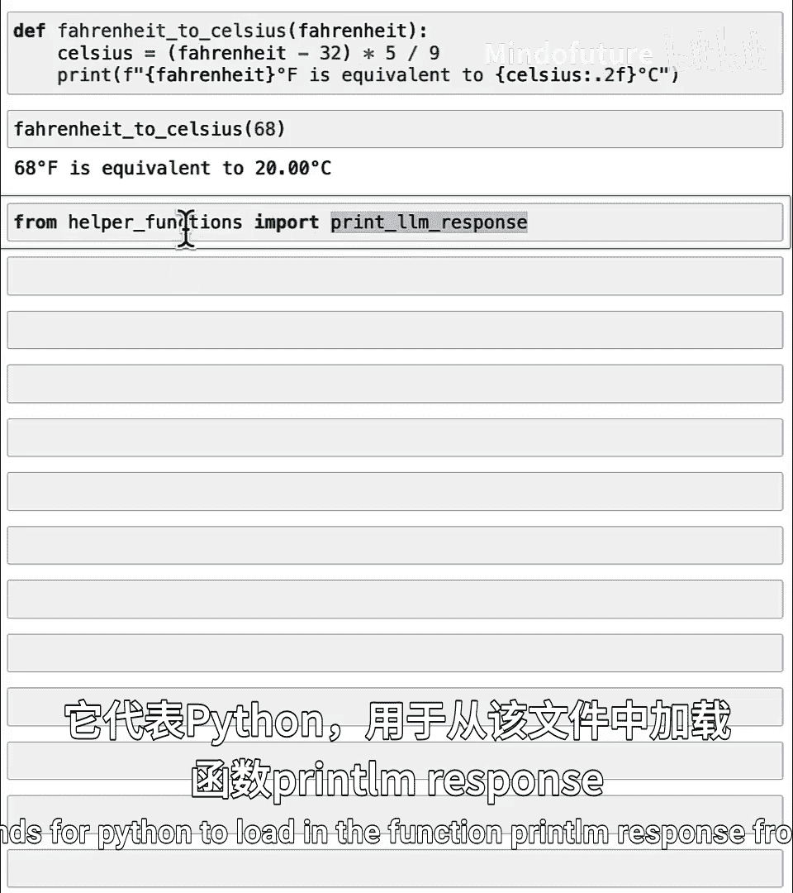
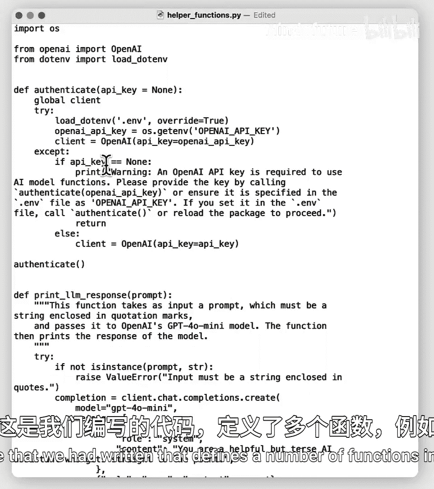
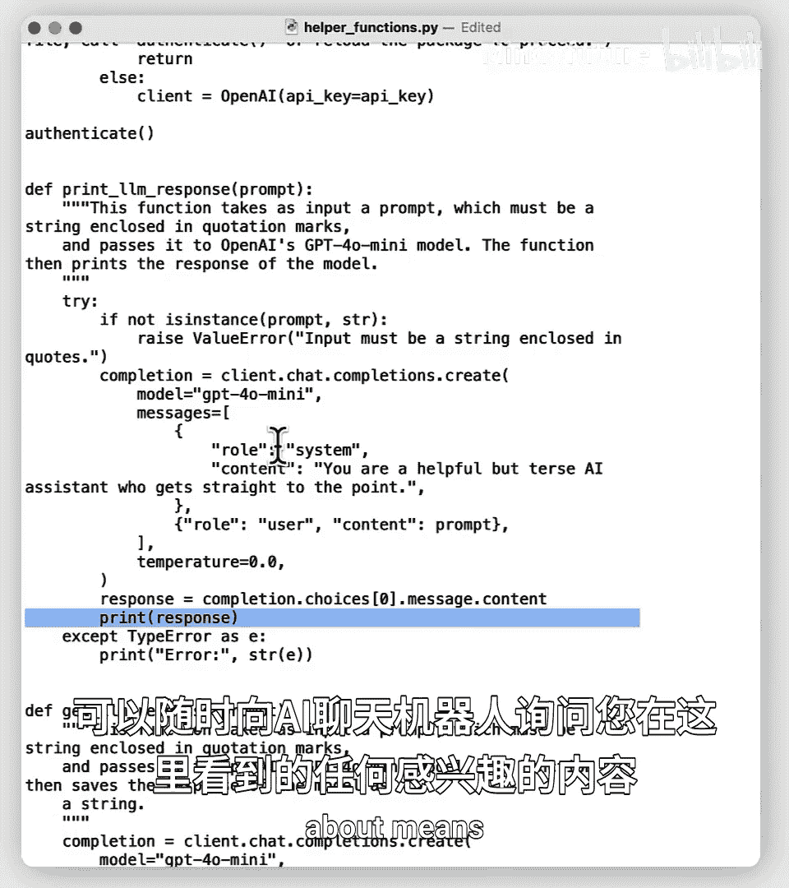
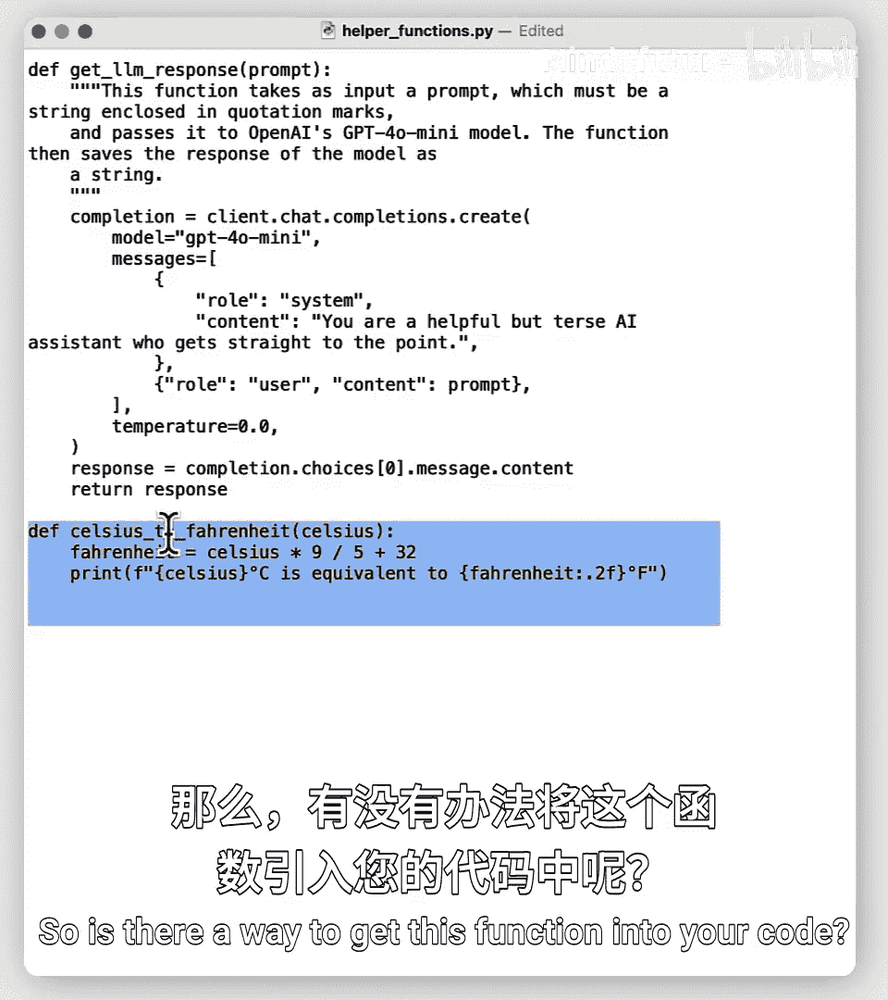
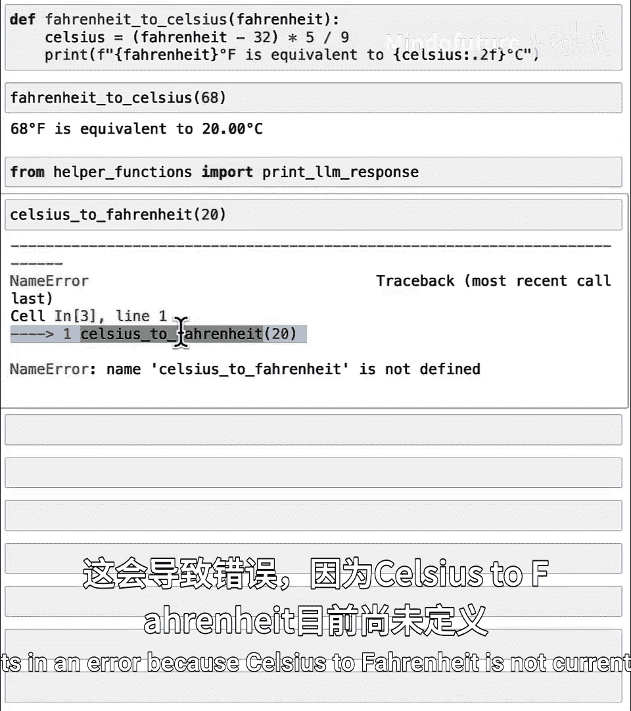
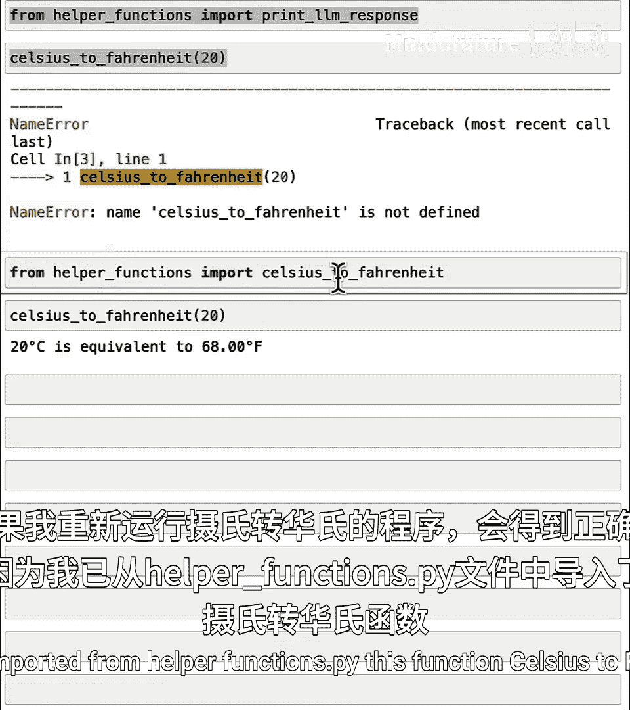
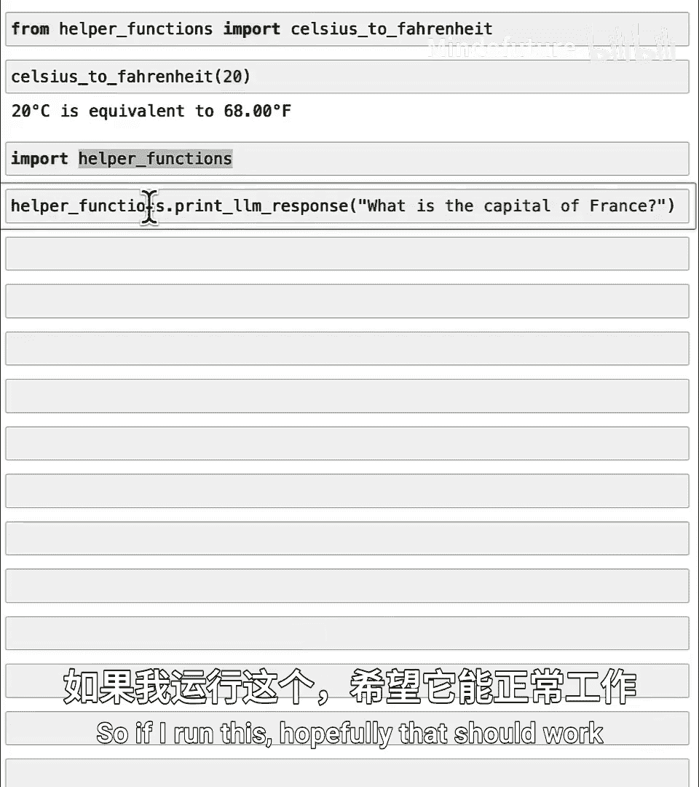
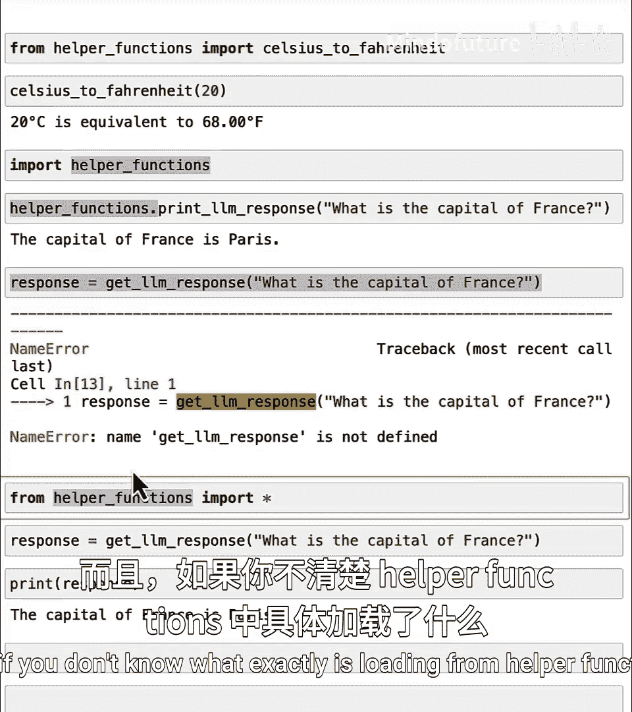

# 029：使用本地文件中的函数 📂

在本节课中，我们将要学习如何从本地文件中导入函数。这是组织代码、复用功能以及使用他人编写代码的关键技能。

## 概述

在前面的课程中，你已经学会了如何使用 `def` 命令来定义函数。然而，获取函数的另一种重要方式是通过 `import` 命令。本节课将深入探讨 `import` 命令的工作原理，并展示如何从本地 `.py` 文件中加载和使用函数。

## 导入函数的基本原理

在Python中，函数允许你将一段执行特定操作并可能返回值的代码打包在一起。例如，我们之前定义的华氏度转摄氏度函数：

```python
def fahrenheit_to_celsius(temp_f):
    temp_c = (temp_f - 32) * 5 / 9
    print(f"{temp_f} degrees Fahrenheit is {temp_c} degrees Celsius.")
```





除了自己定义，我们还可以通过 `import` 命令从其他地方获取函数。例如，在课程中你经常看到这样的代码：

```python
from helper_functions import print_llm_response
```



当Python执行这行代码时，它会在你的计算机上寻找一个名为 `helper_functions.py` 的文件，并从中加载 `print_llm_response` 函数。

## 查看本地文件





让我们看看 `helper_functions.py` 文件里可能有什么。这个文件包含了许多预先定义好的函数，例如：


```python
def celsius_to_fahrenheit(temp_c):
    temp_f = temp_c * 9 / 5 + 32
    print(f"{temp_c} degrees Celsius is {temp_f} degrees Fahrenheit.")
```


这个文件定义了 `celsius_to_fahrenheit` 函数。那么，如何将这个函数导入到你的代码中使用呢？



## 导入函数的几种方法

以下是导入函数的几种常见方式：

### 1. 导入特定函数

这是最精确的方式，只导入你需要的函数。



```python
from helper_functions import celsius_to_fahrenheit
# 现在可以直接使用该函数
celsius_to_fahrenheit(20)
```

### 2. 导入整个模块

这种方式会导入文件中的所有函数，但在使用时需要加上模块名前缀。

```python
import helper_functions
# 使用函数时需要指定模块名
helper_functions.celsius_to_fahrenheit(20)
```

### 3. 导入所有函数（不推荐）


使用 `*` 可以导入模块中的所有函数，使其可以直接使用，无需前缀。




```python
from helper_functions import *
# 可以直接使用所有函数
celsius_to_fahrenheit(20)
```


**注意**：通常不推荐使用 `import *`，因为它会导入所有内容，可能导致命名冲突或意外覆盖现有函数。最佳实践是只导入你明确需要的函数。


## 实践示例

假设 `helper_functions.py` 中还有一个 `get_llm_response` 函数。

*   如果你使用 `import helper_functions`，调用方式为：
    ```python
    response = helper_functions.get_llm_response("What is the capital of France?")
    ```
*   如果你使用 `from helper_functions import get_llm_response`，调用方式则更简洁：
    ```python
    response = get_llm_response("What is the capital of France?")
    ```

选择哪种方式取决于你的具体需求和代码的清晰度。

## 总结

本节课中，我们一起学习了如何从本地 `.py` 文件中导入函数：
1.  使用 `from file_name import function_name` 来导入特定函数。
2.  使用 `import file_name` 来导入整个模块，并通过 `file_name.function_name()` 调用。
3.  了解了为何应谨慎使用 `from file_name import *`。


掌握导入功能是构建模块化、可维护Python程序的基础。下一节课，我们将探索如何导入Python内置或第三方包中的函数，这将极大地扩展你代码的能力。