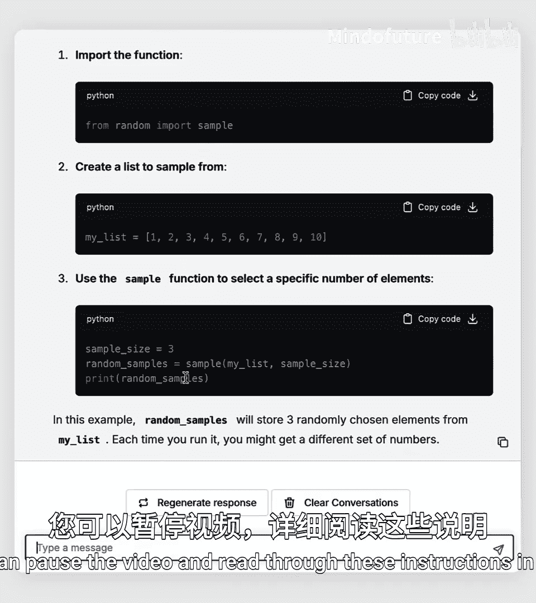
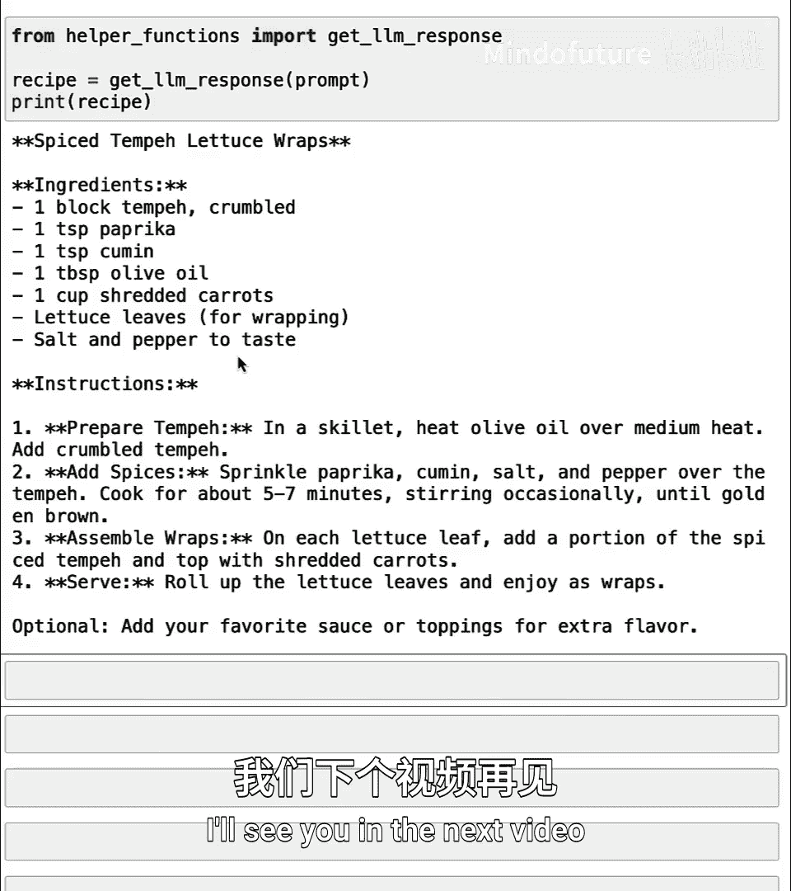

# 030：内置包 📦

在本节课中，我们将学习如何使用 Python 内置的包。Python 自带了许多功能强大的工具和函数，例如处理数学运算、统计计算以及生成随机数等。我们将了解如何导入并使用这些内置工具，为后续学习第三方包打下基础。

## 什么是内置包？📚

Python 本身提供了许多不同的工具和函数。例如，你已经见过一些用于读取 CSV 文件的函数。Python 还包含许多数学工具。此外，Python 也有用于执行统计或绘制简单图形等功能的函数。

这些内置包由支持 Python 编程语言的团队维护。在大多数你编写的程序中，你不需要一次性使用所有这些包。因此，你可以根据特定代码片段的需求，选择导入哪些工具。

上一节我们介绍了 Python 的基本功能，本节中我们来看看如何具体使用其内置的包。

## 使用数学包 🔢

Python 内置了许多包，你可以直接使用。你可以将 Python 中的每个包想象成一本书，Python 自带了许多关于不同主题的“书”。就像在图书馆做研究时，你不需要为每一项研究使用每一本书一样，编写特定代码时，你可能只需要使用可用包中的一个子集。

让我们从一个使用 Python 进行数学运算的例子开始。

以下是导入和使用 `math` 包的步骤：

1.  从 `math` 包中导入所需的函数和常量。
2.  使用这些函数进行计算。

```python
from math import cos, sin, pi

print(pi)
```

运行这行代码会导入余弦、正弦函数以及常数 pi。打印 `pi`，你会发现它是一个浮点数，是圆周率相当精确的近似值。

```python
angles = [0, pi/2, pi, 3*pi/2]
cosine_values = [cos(angle) for angle in angles]
print(cosine_values)
```

现在，你可以使用我们刚刚导入的 `cos` 函数来计算不同角度的余弦值。同样，你也可以使用导入的 `sin` 函数来打印这些角度的正弦值。

`math` 包还包含其他函数，例如向下取整函数 `floor`。

```python
from math import floor
print(floor(5.7))
```

## 使用统计包 📊

除了数学包，Python 还有一个内置的统计包。

以下是导入和使用 `statistics` 包的步骤：

1.  从 `statistics` 包中导入所需的函数。
2.  将函数应用于你的数据列表。

```python
from statistics import mean, stdev


heights = [175, 168, 182, 165, 190]
print(mean(heights))
print(stdev(heights))
```

Python 的统计包还有其他一些函数，用于计算数据的中位数、分位数等，如果你需要对数据进行简单的统计分析，这些函数可能会很有用。

## 引入随机性 🎲

最后，这里有一个有趣的功能：Python 还有一个用于在代码中引入随机性的包。

以下是使用 `random` 包中的 `sample` 函数的步骤：

1.  从 `random` 包中导入 `sample` 函数。
2.  使用该函数从列表中随机抽取样本。



```python
from random import sample

spices = ['paprika', 'oregano', 'cumin', 'cinnamon']
vegetables = ['broccoli', 'carrot', 'spinach', 'potato']
proteins = ['chicken', 'beef', 'tofu', 'fish']

random_spices = sample(spices, 2)
random_vegetables = sample(vegetables, 2)
random_protein = sample(proteins, 1)

print(random_spices)
print(random_vegetables)
print(random_protein)
```

从 `random` 包中导入 `sample` 函数，可以让你编写每次运行时都能生成不同随机结果的代码。这是一种很好的方式，可以为你的代码注入随机性，从而每次都能产生新的结果。

## 综合应用示例 🍳

我们可以利用随机生成的食材，让大语言模型为我们创建食谱。

```python
# 假设已从工具函数中导入了 get_llm_response
from my_functions import get_llm_response

ingredients = f"Spices: {random_spices}. Vegetables: {random_vegetables}. Protein: {random_protein}."
prompt = f"Suggest a recipe using these ingredients: {ingredients}"
recipe = get_llm_response(prompt)
print(recipe)
```

这样，我们就利用随机选择的食材，让大语言模型生成一个使用这些香料、蔬菜和蛋白质的食谱建议。每次运行，由于食材是随机选择的，你可能会得到完全不同的食谱。

## 总结 📝



本节课中我们一起学习了如何使用 Python 的内置包。我们了解了如何导入和使用 `math` 包进行数学计算，使用 `statistics` 包进行基本的统计分析，以及使用 `random` 包为程序引入随机性。这些内置工具是 Python 强大功能的基础组成部分。在下一课中，我们将超越 Python 的内置包，学习如何下载和安装来自互联网的第三方包，这将极大地扩展 Python 为你所能做的事情。