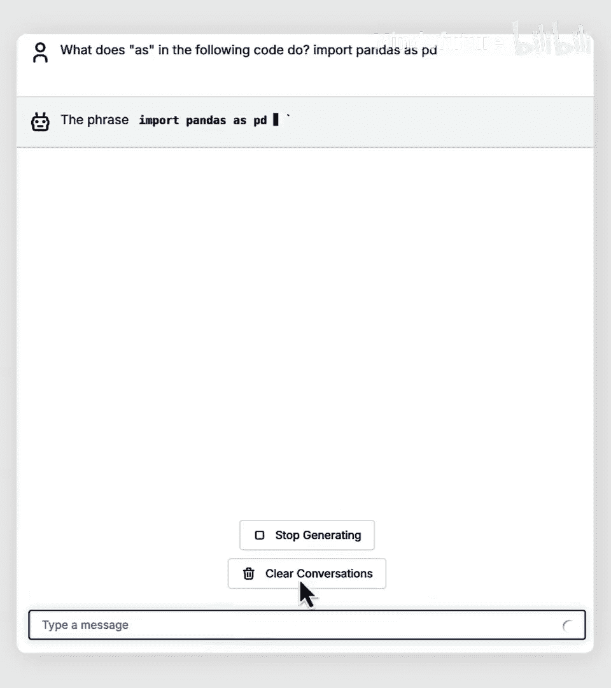
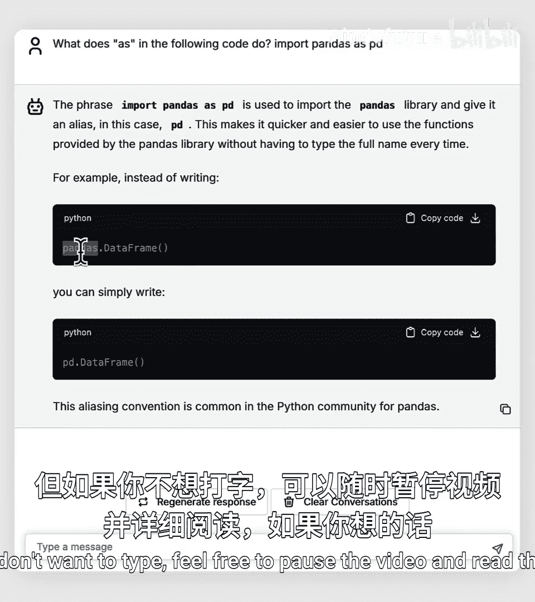
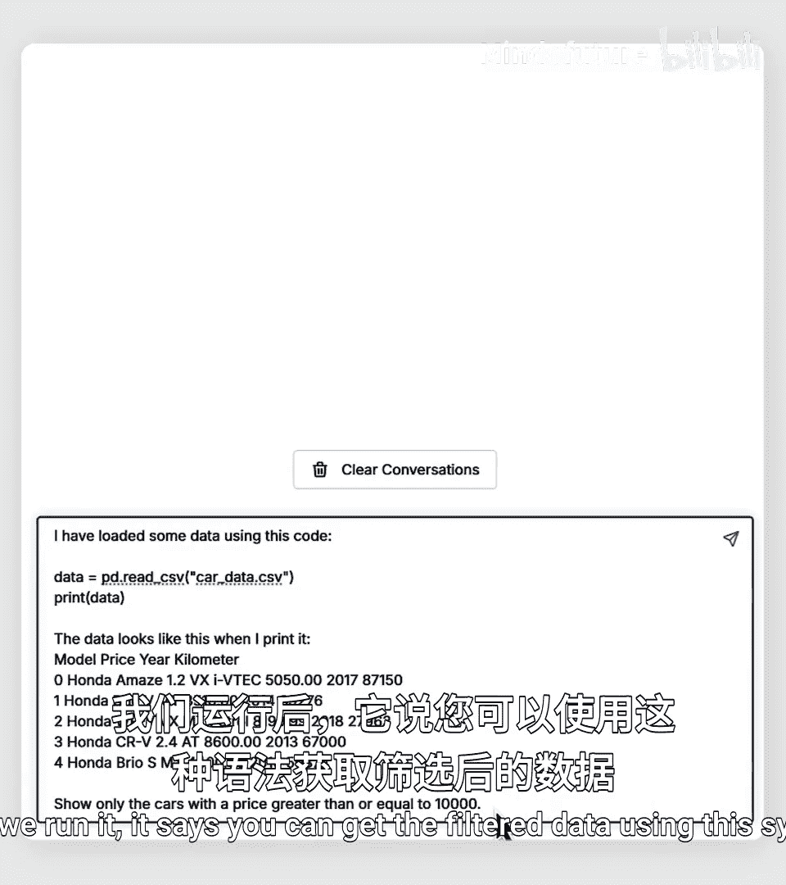
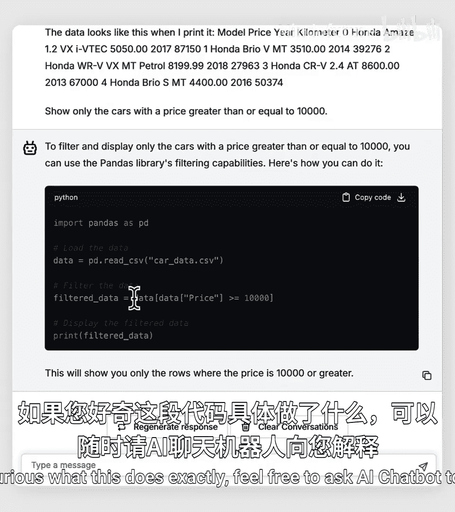
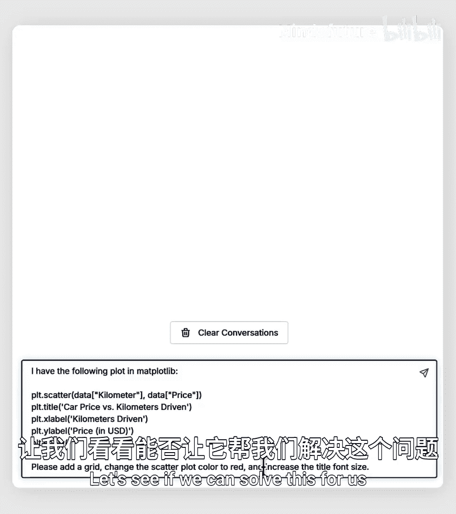
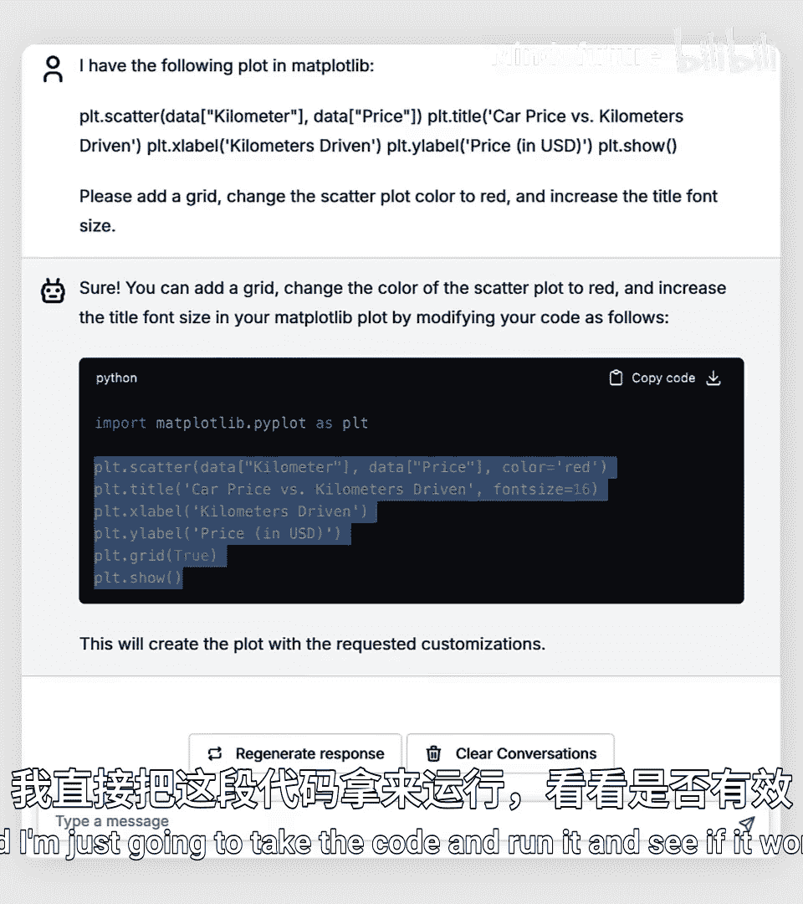
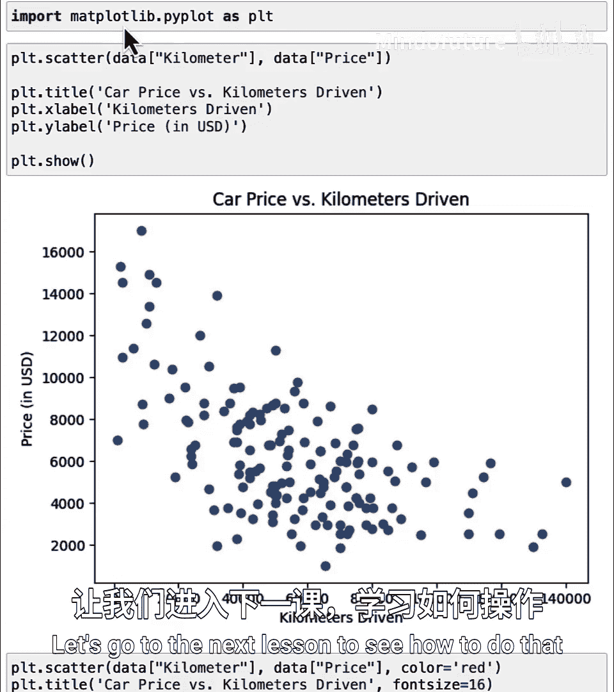

# 031：使用第三方包 📦

在本节课中，我们将学习如何使用由他人编写并分享的Python代码包，这些被称为“第三方包”。我们将重点介绍两个在数据处理和图表绘制中极为流行的包：`pandas`和`matplotlib`。通过它们，你可以更高效地处理数据和创建可视化图表。

---

## 第三方包的魅力 ✨

许多人编写了Python代码并在网上免费分享，供任何人使用。也许有一天你也会这样做。编写代码、在线分享并看到他人使用你的成果，这会是一件非常酷且令人满足的事情。

得益于许多人的分享，你可以通过下载和安装他们的包来利用他们的工作成果。我将其称为“第三方包”，因为它们是由你或Python官方维护者之外的其他人编写的。如今，至少有数十万个这样的第三方包存在。

上一节我们介绍了导入代码的基本概念，本节中我们来看看如何利用社区中现成的强大工具。



---

## 数据处理利器：Pandas 🐼

最流行的Python第三方包之一是`pandas`，它常用于处理结构化数据，例如存储在电子表格和CSV文件中的数据。



> **注意**：这里的“pandas”与可爱的动物无关。它来源于经济学术语“面板数据”的缩写。如果你想知道更多，可以询问AI聊天机器人或搜索。当然，如果你想象一群可爱的熊猫在做数据科学能带来快乐，也完全可以保留这个画面。

最常见的导入方式是使用以下命令：
```python
import pandas as pd
```
这里的`as pd`是新的用法。它让我们在后续代码中可以用`pd.函数名`来代替`pandas.函数名`，从而节省打字时间。许多AI聊天机器人生成的代码也倾向于使用这种简写。

在本例中，我们将使用一个关于二手车售价的数据集（数据由Nehal Burer等人整理）。以下是使用pandas读取和查看数据的基本操作：

```python
import pandas as pd



# 读取CSV文件中的数据
data = pd.read_csv(‘used_car_data.csv‘)
# 打印出数据
print(data)
```



pandas功能强大，可以进行数据筛选。例如，以下是获取售价高于10000美元的车辆的方法：

```python
# 筛选出售价大于等于10000的数据
expensive_cars = data[data[‘price‘] >= 10000]
print(expensive_cars)
```

你还可以进行更复杂的查询，例如找出所有2015年款的车辆并计算其中位价格：

```python
# 筛选出2015年款的车辆
cars_2015 = data[data[‘year‘] == 2015]
print(cars_2015)

# 计算2015年款车辆价格的中位数
median_price_2015 = cars_2015[‘price‘].median()
print(f“2015年款车辆价格中位数: ${median_price_2015}“)
```

pandas的命令非常多，难以全部记住。但好消息是，AI聊天机器人非常了解pandas。当你需要实现特定功能时，可以向它描述你的数据和目标，它通常能提供正确的代码片段。

---

## 数据可视化：Matplotlib 📊

除了处理数据，另一个非常流行的包是用于绘制图表的`matplotlib`。导入其绘图功能的常见代码如下：

```python
import matplotlib.pyplot as plt
```

这个包名中间有一个点，但就使用而言，你无需担心其具体含义。导入后，我们可以创建散点图来可视化价格与里程数的关系：



```python
import matplotlib.pyplot as plt



# 创建散点图：x轴为里程，y轴为价格
plt.scatter(data[‘mileage‘], data[‘price‘])
plt.xlabel(‘Mileage (km)‘)  # 为x轴添加标签
plt.ylabel(‘Price (USD)‘)   # 为y轴添加标签
plt.title(‘Car Price vs. Mileage‘)  # 添加图表标题
plt.grid(True)  # 显示网格
plt.show()      # 显示图表
```

有时你可能想修改图表样式，例如将散点颜色改为红色并增大标题字体。同样，你可以求助AI聊天机器人。例如，你可以提出请求：“请为以下绘图命令添加网格，将散点图颜色改为红色，并增大标题字体大小。”AI通常会给出可行的代码，你可以检查并运行它。

```python
# 假设这是AI生成的优化代码示例
plt.scatter(data[‘mileage‘], data[‘price‘], color=‘red‘)
plt.xlabel(‘Mileage (km)‘)
plt.ylabel(‘Price (USD)‘)
plt.title(‘Car Price vs. Mileage‘, fontsize=16)  # 增大了字体大小
plt.grid(True)
plt.show()
```

AI生成的代码并非总是完美，但通常效果不错。许多开发者会快速浏览AI给出的代码，确保它看起来合理，然后运行测试。如果第一次不成功，你可以向AI反馈问题，它往往能在第二次尝试时给出更好的答案。

---

## 总结 🎯

本节课中，我们一起学习了两个重要的第三方Python包：`pandas`和`matplotlib`。你看到了在使用前需要先通过`import`语句导入它们，这与导入内置包（如`math`）或本地文件中的函数类似。



目前，我们在Jupyter Notebook环境中使用的`pandas`和`matplotlib`是预先安装好的。然而，还有成千上万的其他第三方包并未预装在您的电脑或环境中。那么，如何从互联网上下载并安装一个全新的Python包呢？让我们在下一课中探索这个问题。